---
tags:
  - system-design
  - glossary
  - glosario
  - networking
  - distributed-systems
  - protocols
  - security
  - computer-science
aliases:
  - Glosario
  - Glosario de Ingeniería
  - Glosario de Términos
  - Diccionario Técnico
fecha_creacion: 2026-09-01
autor: Parzival
---

# 📚 Glosario Maestro de Términos y Conceptos de Ingeniería

> *"Dominar la precisión del vocabulario técnico es el primer paso para pensar y comunicar como un Principal / Staff Engineer."*

Bienvenido al **Glosario Central de Arquitectura de Software, Redes y Sistemas Distribuidos**. En esta hoja se consolidan los conceptos clave, definiciones rigurosas, analogías intuitivas, ejemplos prácticos e hipervínculos cruzados a las notas de la bóveda donde cada término fue introducido por primera vez.

---

<a id="indice"></a>
## 🗂️ Índice Alfabético Rápido

> 💡 **Guía de navegación:** Haz clic en las letras o términos directos para saltar a su definición. Las letras atenuadas no tienen términos aún.

| **[[#A\|A]]** | <span style="opacity:0.3">B</span> | <span style="opacity:0.3">C</span> | <span style="opacity:0.3">D</span> | <span style="opacity:0.3">E</span> | <span style="opacity:0.3">F</span> | <span style="opacity:0.3">G</span> | <span style="opacity:0.3">H</span> | <span style="opacity:0.3">I</span> | <span style="opacity:0.3">J</span> |
| :---: | :---: | :---: | :---: | :---: | :---: | :---: | :---: | :---: | :---: |
| <span style="opacity:0.3">K</span> | **[[#L\|L]]** | **[[#M\|M]]** | **[[#N\|N]]** | <span style="opacity:0.3">O</span> | **[[#P\|P]]** | <span style="opacity:0.3">Q</span> | **[[#R\|R]]** | **[[#S\|S]]** | **[[#T\|T]]** |
| <span style="opacity:0.3">U</span> | <span style="opacity:0.3">V</span> | <span style="opacity:0.3">W</span> | <span style="opacity:0.3">X</span> | <span style="opacity:0.3">Y</span> | <span style="opacity:0.3">Z</span> | | | | |

#### 📑 Acceso Rápido por Término:
* **A:** [[#Acknowledgment (ACK)|Acknowledgment (ACK)]]
* **L:** [[#Load Balancer (LB) / Balanceador de Carga|Load Balancer (LB)]]
* **M:** [[#MAC Address (Media Access Control) / Dirección MAC|MAC Address (Media Access Control)]]
* **N:** [[#Network Address Translation (NAT)|Network Address Translation (NAT)]]
* **P:** [[#Point of Presence (PoP)|Point of Presence (PoP)]]
* **R:** [[#Round-Trip Time (RTT)|Round-Trip Time (RTT)]]
* **S:** [[#SYN (Synchronize Flag / Paquete de Sincronización)|SYN (Synchronize Flag)]]
* **T:** [[#TCP (Transmission Control Protocol)|TCP]] · [[#Time-To-Live (TTL)|Time-To-Live (TTL)]] · [[#TLS (Transport Layer Security)|TLS]]

---

<a id="A"></a><a id="a"></a>
## A

### Acknowledgment (ACK)

> **Definición Formal:**  
> **ACK** (abreviatura de *Acknowledgment* / Acuse de Recibo o Confirmación) es una bandera de control de **1 bit** (`ACK flag`) y un campo numérico de **32 bits** (`Acknowledgment Number`) en el protocolo **TCP** (Capa 4 - Capa de Transporte del modelo OSI).  
>
> Su función principal es **confirmar la recepción exitosa de datos** o paquetes de control (`SYN`, `FIN`), indicando al emisor cuál es el **siguiente número de secuencia de byte que el receptor espera recibir** ($\text{Ack} = \text{Seq} + 1$).

📍 **Primera mención en el Cerebro:**  
- [[01.0_El_Viaje_Completo_de_una_Peticion_HTTP#Etapa 2: Establecimiento de Conexión (TCP + TLS Handshakes)|01.0 El Viaje Completo de una Petición HTTP (Request Lifecycle)]]  
- *(Ruta física: [01_Fundamentos_y_Trafico/01.0_El_Viaje_Completo_de_una_Peticion_HTTP.md](01_Fundamentos_y_Trafico/01.0_El_Viaje_Completo_de_una_Peticion_HTTP.md#L170-L225))*

---

#### 📦 La Analogía del Paquete Postal y la Firma
Imagina que recibes un paquete por correo:
* El cartero te entrega la caja número **100** (`Seq=100`).
* Tú firmas la planilla de entrega escribiendo: *"Recibido conforme paquete 100. Quedo a la espera del paquete 101"* (`ACK=1, Ack=101`).
* Si el cartero no regresa a la central con tu firma (tu **ACK**) antes de cierto tiempo límite (*Retransmission Timeout* - RTO), la central asume que el paquete se perdió y **vuelve a enviar otro paquete idéntico** (*Retransmisión TCP*).

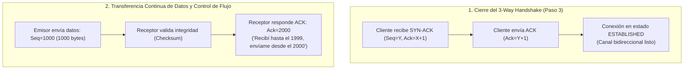

---

#### 🧠 Detalles de Nivel *Staff Engineer* sobre ACK

1. **¿Por qué el paso 3 (ACK) no añade otro RTT de bloqueo al cliente?**  
   - En el paso 1 (`SYN`), el cliente debe **esperar** la respuesta del servidor (**0.5 RTT**).
   - En el paso 2 (`SYN-ACK`), el servidor responde (**0.5 RTT** acumulando $1\text{ RTT}$).
   - En el paso 3 (`ACK`), el cliente **no se queda esperando confirmación**. El cliente despacha el `ACK` e inmediatamente adjunta en el mismo paquete los datos de la siguiente capa (el *ClientHello* de TLS 1.3 o la petición HTTP). Esta técnica se denomina ***Piggybacking***. Por tanto, el costo de bloqueo para abrir la conexión es de **exactamente $1\text{ RTT}$**.
2. **ACKs Acumulativos vs SACK (Selective Acknowledgment):**  
   - **ACK Acumulativo estándar:** Si el receptor recibe los paquetes 1, 2 y 4, solo puede enviar `Ack=3` (pidiendo el 3). Esto obligaba históricamente al emisor a retransmitir el 3 y también el 4 innecesariamente.
   - **SACK (TCP Moderno):** El receptor confirma `Ack=3`, pero añade en las cabeceras TCP una opción SACK diciendo *"también tengo el bloque 4 guardado"*, evitando retransmisiones duplicadas.
3. **ACK en Sistemas Distribuidos y Mensajería:**  
   - **RabbitMQ / SQS:** Los consumidores reciben tareas y envían un `ACK` explícito al broker al terminar el procesamiento de negocio; si el worker colapsa antes del ACK, el broker reencola el mensaje para otro worker.
   - **Replicación de Bases de Datos:** En replicación síncrona (Postgres/MySQL), el nodo maestro solo responde `HTTP 200` al cliente tras recibir el `ACK` de la réplica confirmando que guardó el registro en disco (WAL).

---

#### 🛠️ ¿Cómo inspeccionar paquetes ACK en Linux?

```bash
# Capturar paquetes TCP con la bandera ACK activa
sudo tcpdump -i any "tcp[tcpflags] & tcp-ack != 0" -nn -c 4
```
*Salida representativa:*
```text
17:04:15.891234 IP 192.168.1.15.54321 > 142.250.190.46.443: Flags [.], ack 891234113, win 65535, length 0
```
> **Nota de tcpdump:** El símbolo `[.]` representa un paquete puramente de confirmación **ACK**.

---

#### 🔗 Menciones y Temas Relacionados en el Cerebro
- [[01.0_El_Viaje_Completo_de_una_Peticion_HTTP|01.0 El Viaje Completo de una Petición HTTP]] — Paso 3 del TCP Handshake y técnica de Piggybacking con TLS 1.3.
- [[01.6_TCP_vs_UDP_Protocolos_de_Transporte|01.6 Capa de Transporte: TCP vs UDP]] — Ventana deslizante (*Sliding Window*), Control de Flujo y SACK.
- [[02.2_Replicacion_Master-Slave_vs_Multi-Master_y_Failover|02.2 Replicación de Bases de Datos]] — ACKs de persistencia WAL en réplicas síncronas.
- [[03.1_Teorema_PACELC_Extension_del_CAP|03.1 Teorema PACELC]] — Latencia generada al esperar ACKs de quórum en sistemas distribuidos.
- [[05.1_Apache_Kafka_vs_RabbitMQ_vs_AWS_SQS|05.1 Brokers de Mensajería]] — ACKs de consumidores (Message Acknowledgments) en colas RabbitMQ vs Kafka Offsets.

[⬆️ Volver al Índice](#indice)

---

<a id="L"></a><a id="l"></a>
## L

### Load Balancer (LB) / Balanceador de Carga

> **Definición Formal:**  
> Un **Load Balancer (LB)** —o *Balanceador de Carga*— es un componente de red y software ubicado estratégicamente entre los clientes externos e Internet y un grupo de servidores backend (**Target Group / Pool**).  
>
> Su función principal es **recibir el flujo masivo de peticiones y distribuirlo equitativamente** entre los nodos disponibles utilizando algoritmos de planificación (Round Robin, Least Connections, Power of Two Choices), realizando **inspección continua de salud (*Health Checks*)** para aislar automáticamente nodos caídos y proveer **escalabilidad horizontal, tolerancia a fallos y alta disponibilidad**.

📍 **Primera mención en el Cerebro:**  
- [[01.0_El_Viaje_Completo_de_una_Peticion_HTTP#Etapa 3: Enrutamiento Perimetral y Balanceo de Carga|01.0 El Viaje Completo de una Petición HTTP (Request Lifecycle)]]  
- [[01.3_Balanceadores_de_Carga_L4_vs_L7_Active-Active_vs_Active-Passive#1. Fundamentos y Topología de Balanceo|01.3 Balanceadores de Carga: L4 vs L7]]  
- *(Ruta física: [01_Fundamentos_y_Trafico/01.3_Balanceadores_de_Carga_L4_vs_L7_Active-Active_vs_Active-Passive.md](01_Fundamentos_y_Trafico/01.3_Balanceadores_de_Carga_L4_vs_L7_Active-Active_vs_Active-Passive.md#L21-L53))*

---

#### 🍽️ La Analogía del Anfitrión en la Entrada de un Restaurante
Imagina un restaurante gigante con 4 cocineros idénticos en la cocina:
* **Sin Balanceador:** 200 clientes entran a empujones por la misma puerta y se abalanzan sobre el Cocinero 1. El Cocinero 1 colapsa de inmediato bajo estrés (**Error 503 Service Unavailable / Timeout**), mientras los otros 3 cocineros están de brazos cruzados sin hacer nada.
* **Con Balanceador (El Anfitrión en la Puerta):** El anfitrión recibe amablemente a cada comensal en la entrada. Revisa el estado de la cocina y dice: *"Cliente A, pase con el Cocinero 1; Cliente B, pase con el Cocinero 2..."*. Si el Cocinero 3 se resbala y cae (**Health Check Fallido**), el anfitrión deja de mandarle clientes de inmediato hasta que se recupere.

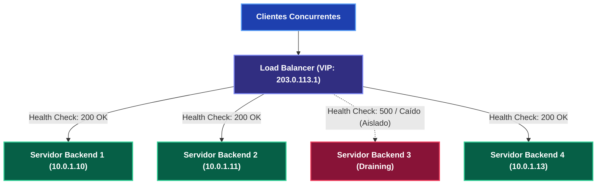

---

#### ⚙️ L4 vs L7: La Gran Disyuntiva de Arquitectura

1. **L4 (Capa de Transporte - TCP/UDP):**  
   - Opera a nivel de paquetes brutos sin inspeccionar el payload de la aplicación. Solo examina la tupla de 5 elementos: `IP Origen, Puerto Origen, IP Destino, Puerto Destino, Protocolo`.
   - Modifica cabeceras en nanosegundos mediante **NAT** o **reescritura de MAC (DSR)**.
   - Existe **1 sola conexión TCP conceptual** de extremo a extremo.
   - Rendimiento brutal: Millones de paquetes por segundo (**PPS**) a velocidad de cable con mínimo uso de CPU/RAM (AWS NLB, Linux IPVS, Meta Katran, Google Maglev).
2. **L7 (Capa de Aplicación - HTTP/HTTPS/gRPC):**  
   - Termina la conexión TCP del cliente, descifra TLS y examina las cabeceras HTTP, la ruta URL (`/v1/auth` vs `/v1/checkout`), cookies de sesión y tokens JWT.
   - Abre una **segunda conexión TCP independiente** hacia el backend elegido.
   - Permite enrutamiento inteligente por ruta, despliegues Canary (90% v1, 10% v2) y WAF perimetral, pero consume **entre 5x y 10x más CPU y memoria RAM** (Envoy, NGINX, HAProxy, AWS ALB).

---

#### 🛠️ ¿Cómo inspeccionar balanceadores en Linux?
```bash
# Listar tabla de balanceo L4 del kernel Linux (IPVS)
sudo ipvsadm -ln

# Monitorear resumen de sockets TCP activos en el sistema
ss -s
```

---

#### 🔗 Menciones y Temas Relacionados en el Cerebro
- [[01.0_El_Viaje_Completo_de_una_Peticion_HTTP|01.0 El Viaje Completo de una Petición HTTP]] — Etapa 3: Ruteo y balanceo perimetral.
- [[01.3_Balanceadores_de_Carga_L4_vs_L7_Active-Active_vs_Active-Passive|01.3 Balanceadores de Carga L4 vs L7]] — Arquitectura completa, algoritmos P2C, DSR y VRRP Split-Brain.
- [[01.4_Reverse_Proxy_vs_Forward_Proxy_vs_API_Gateway|01.4 Reverse Proxy vs API Gateway]] — Diferencias entre proxy inverso, gateway y balanceador.

[⬆️ Volver al Índice](#indice)

---

<a id="M"></a><a id="m"></a>
## M

### MAC Address (Media Access Control / Dirección MAC)

> **Definición Formal:**  
> Una **dirección MAC (Media Access Control)** —o *Dirección de Control de Acceso al Medio*— es un identificador físico universal de **48 bits** (representado como 6 pares de dígitos hexadecimales: `00:1A:2B:3C:4D:5E`) grabado de fábrica en el chip de cada tarjeta de red (**NIC** - *Network Interface Card*).  
>
> Opera en la **Capa 2 (Enlace de Datos / Data Link)** del modelo OSI y es la responsable exclusiva de permitir que dos dispositivos conectados al **mismo cable, switch Ethernet o red local (LAN/VLAN)** intercambien tramas de datos físicas (*frames*).

📍 **Primera mención en el Cerebro:**  
- [[01.0_El_Viaje_Completo_de_una_Peticion_HTTP#Etapa 0: El Contexto Físico|01.0 El Viaje Completo de una Petición HTTP (Request Lifecycle)]]  
- [[01.3_Balanceadores_de_Carga_L4_vs_L7_Active-Active_vs_Active-Passive#3. Direct Server Return (DSR)|01.3 Balanceadores de Carga: Direct Server Return (DSR)]]  
- *(Ruta física: [01_Fundamentos_y_Trafico/01.3_Balanceadores_de_Carga_L4_vs_L7_Active-Active_vs_Active-Passive.md](01_Fundamentos_y_Trafico/01.3_Balanceadores_de_Carga_L4_vs_L7_Active-Active_vs_Active-Passive.md#L104-L140))*

---

#### 🏷️ La Analogía de la Dirección Postal vs el Documento de Identidad
* **La Dirección IP (Capa 3 - Lógica Global):** Es como la dirección de tu casa: *"Avenida Libertador 456, Depto 302, Santiago"*. Dice **dónde estás ubicado lógicamente** en el mundo. Si te mudas de casa o te conectas a otra red Wi-Fi, tu IP cambia de inmediato.
* **La Dirección MAC (Capa 2 - Física Local):** Es como tu **Documento de Identidad / Cédula / DNI**: *"18.432.109-K"*. Es un número grabado a fuego en tu hardware que **jamás cambia**, sin importar a qué red te conectes. Los carteros (routers) usan la IP para llevar el paquete hasta tu ciudad, pero el portero del edificio (el switch Ethernet local) usa la MAC para entregarle la carta físicamente a la persona correcta en el pasillo.

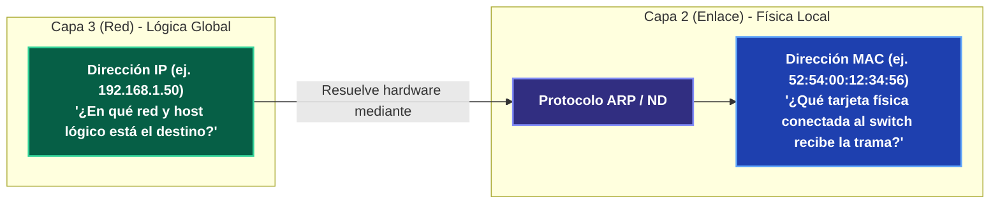

---

#### ⚡ El Rol Magistral de la MAC en Balanceo L4: Direct Server Return (DSR)
En arquitecturas de streaming de video masivo (Netflix, YouTube), una petición HTTP pesa apenas **$500\text{ bytes}$**, pero la respuesta de video pesa **$500\text{ MB}$**. Si la respuesta tiene que regresar a través del balanceador, el ancho de banda de salida (*egress*) del balanceador colapsa.

En **DSR (Direct Server Return)**:
1. El cliente envía la petición a la **IP Virtual (VIP: 203.0.113.1)** del balanceador.
2. El balanceador L4 **NO modifica las direcciones IP de Capa 3** (la IP Destino sigue siendo la VIP).
3. El balanceador solo reescribe la **dirección MAC de destino** en la cabecera Ethernet de Capa 2, colocando la MAC física del servidor backend elegido en la misma LAN.
4. El switch Ethernet local entrega la trama al backend porque la MAC le pertenece.
5. El servidor backend procesa la petición y **responde directamente al cliente por su propio enlace de Internet** con IP Origen = VIP. ¡El balanceador jamás procesa la respuesta pesada!

---

#### 🛠️ ¿Cómo inspeccionar direcciones MAC y tablas ARP en Linux?
```bash
# Ver las direcciones MAC de todas las interfaces de red locales
ip link show

# Ver la tabla ARP (asociación entre IPs de vecinos locales y sus direcciones MAC)
ip neigh show
# O la versión clásica:
arp -n
```

---

#### 🔗 Menciones y Temas Relacionados en el Cerebro
- [[01.0_El_Viaje_Completo_de_una_Peticion_HTTP|01.0 El Viaje Completo de una Petición HTTP]] — Encapsulamiento de paquetes IP dentro de tramas Ethernet de Capa 2.
- [[01.3_Balanceadores_de_Carga_L4_vs_L7_Active-Active_vs_Active-Passive|01.3 Balanceadores de Carga: DSR]] — Reescritura de MAC para Direct Server Return sin cuello de botella de salida.

[⬆️ Volver al Índice](#indice)

---

<a id="N"></a><a id="n"></a>
## N

### Network Address Translation (NAT)

> **Definición Formal:**  
> **NAT (Network Address Translation)** —o *Traducción de Direcciones de Red*— es un protocolo estándar de telecomunicaciones (RFC 1631 / RFC 3022, Capas 3 y 4 del modelo OSI) mediante el cual un dispositivo intermediario (router, firewall o balanceador de carga) **reescribe dinámicamente las direcciones IP y los números de puerto en las cabeceras de los paquetes** mientras atraviesan la frontera entre dos redes lógicas.  
>
> Fue creado para mitigar el agotamiento de direcciones IPv4 públicas permitiendo que miles de máquinas privadas compartan una única IP pública hacia Internet, y es la base operativa del **balanceo de carga L4 en modo proxy**.

📍 **Primera mención en el Cerebro:**  
- [[01.0_El_Viaje_Completo_de_una_Peticion_HTTP#Etapa 3: Enrutamiento Perimetral|01.0 El Viaje Completo de una Petición HTTP (Request Lifecycle)]]  
- [[01.3_Balanceadores_de_Carga_L4_vs_L7_Active-Active_vs_Active-Passive#2. Capa 4 vs Capa 7|01.3 Balanceadores de Carga: L4 vs L7]]  
- *(Ruta física: [01_Fundamentos_y_Trafico/01.3_Balanceadores_de_Carga_L4_vs_L7_Active-Active_vs_Active-Passive.md](01_Fundamentos_y_Trafico/01.3_Balanceadores_de_Carga_L4_vs_L7_Active-Active_vs_Active-Passive.md#L80-L103))*

---

#### 🏢 La Analogía de la Central Telefónica Corporativa
Imagina una empresa con 500 trabajadores en un edificio:
* La empresa tiene un único número telefónico público conocido en la calle: `+1-800-EMPRESA`.
* Cada empleado tiene un anexo interno (`Ext. 101`, `Ext. 102`, `Ext. 340`) al que nadie desde la calle puede llamar directamente.
* **Cuando un cliente llama desde afuera (DNAT):** El cliente marca al número general. La operadora de la central (**el NAT / Load Balancer**) atiende, consulta su tabla y desvía la llamada a la extensión `102` del empleado disponible.
* **Cuando el empleado devuelve la llamada hacia afuera (SNAT):** El empleado marca al cliente. En el identificador de llamadas del cliente no aparece `Ext. 102`, sino el número público general `+1-800-EMPRESA`.

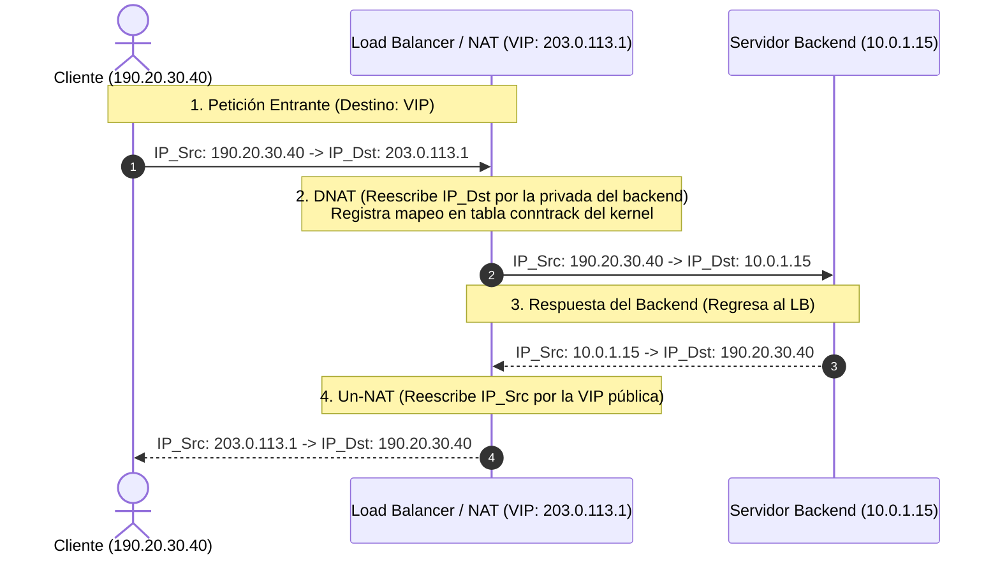

---

#### ⚖️ Los 3 Modos de NAT en Infraestructura y Balanceo

1. **DNAT (Destination NAT / Port Forwarding):**  
   Reescribe la dirección IP de destino (y opcionalmente el puerto). En un balanceador L4 tradicional, toma el paquete enviado a la IP Virtual pública (`VIP: 203.0.113.1`) y cambia el destino a la IP privada del servidor interno (`10.0.1.15`).
2. **SNAT (Source NAT / Masquerade):**  
   Reescribe la dirección IP de origen. Se utiliza para que servidores en subredes privadas sin IP pública salgan a Internet (mediante una *NAT Gateway* en AWS/GCP). También lo usan los balanceadores para forzar que el backend le devuelva la respuesta al LB y no intente rutearla directo al cliente.
3. **El Cuello de Botella Oculto de NAT en Linux (`conntrack`):**  
   Para que NAT funcione en conexiones de dos vías, el kernel de Linux debe mantener en memoria RAM una **tabla de seguimiento de estado (*Connection Tracking - conntrack*)**. Si un balanceador maneja 1,000,000 de conexiones concurrentes bajo ráfagas intensas, la tabla de `conntrack` puede llenarse (`nf_conntrack: table full, dropping packet`), provocando caídas masivas de paquetes si el límite máximo no se ajusta en el kernel.

---

#### 🛠️ ¿Cómo inspeccionar tablas NAT y estados conntrack en Linux?
```bash
# Ver las reglas de traducción NAT activas en el firewall iptables
sudo iptables -t nat -L -n -v

# Contar cuántas conexiones activas están siendo rastreadas por NAT en el kernel
cat /proc/sys/net/netfilter/nf_conntrack_count

# Ver el límite máximo de conexiones NAT soportadas por el kernel
cat /proc/sys/net/netfilter/nf_conntrack_max
```

---

#### 🔗 Menciones y Temas Relacionados en el Cerebro
- [[01.0_El_Viaje_Completo_de_una_Peticion_HTTP|01.0 El Viaje Completo de una Petición HTTP]] — Paso por el router residencial y NAT de salida hacia Internet.
- [[01.3_Balanceadores_de_Carga_L4_vs_L7_Active-Active_vs_Active-Passive|01.3 Balanceadores de Carga: L4 vs L7]] — Balanceo L4 en modo NAT vs modo DSR.

[⬆️ Volver al Índice](#indice)

---

<a id="P"></a><a id="p"></a>
## P

### Point of Presence (PoP)

> **Definición Formal:**  
> Un **Point of Presence (PoP)** —o *Punto de Presencia*— es una demarcación física o centro de datos perimetral ubicado estratégicamente en la periferia de Internet (el *Edge*), habitualmente dentro de un centro de intercambio de tráfico (**IXP** - *Internet Exchange Point*) o en instalaciones de colocación (*co-location*).  
>
> Alberga servidores de cómputo, almacenamiento ultrarrápido (RAM y NVMe SSDs) y equipamiento de telecomunicaciones (routers BGP Anycast, conmutadores) cuyo objetivo primordial es **acercar los servicios de red, almacenamiento en caché y seguridad perimetral a escasos milisegundos de distancia del usuario final**, reduciendo radicalmente el **RTT** (*Round-Trip Time*) hacia los servidores centrales de origen.

📍 **Primera mención en el Cerebro:**  
- [[01.0_El_Viaje_Completo_de_una_Peticion_HTTP#Etapa 0: El Contexto Físico (La Velocidad de la Luz y la Fibra Óptica)|01.0 El Viaje Completo de una Petición HTTP (Request Lifecycle)]]  
- [[01.2_CDNs_Push_vs_Pull_y_Edge_Caching#1. ¿Qué es una CDN y por qué es indispensable?|01.2 CDNs: Redes de Distribución de Contenido]]  
- *(Ruta física: [01_Fundamentos_y_Trafico/01.2_CDNs_Push_vs_Pull_y_Edge_Caching.md](01_Fundamentos_y_Trafico/01.2_CDNs_Push_vs_Pull_y_Edge_Caching.md#L22-L54))*

---

#### 🏬 La Analogía del Centro de Distribución y la Tienda de Barrio
Imagina que necesitas comprar un repuesto de computadora:
* **Sin PoP (Modelo Centralizado Tradicional):** Cada vez que pides un tornillo o un cable, el paquete debe viajar en avión desde la fábrica matriz en Shenzhen o Seattle. Tarda 5 días en llegar a tu puerta (**RTT de 140 ms**).
* **Con PoPs (Red Perimetral / CDN Moderna):** La empresa instala **tiendas de distribución exprés (PoPs)** en cada gran ciudad (Madrid, Santiago, Buenos Aires, Ciudad de México). Si el artículo está en la tienda local, lo recoges en **15 minutos** (**RTT de 5 ms**). Si no está en stock (*Cache Miss*), la tienda local lo encarga a la fábrica matriz y guarda copias adicionales para los siguientes vecinos.

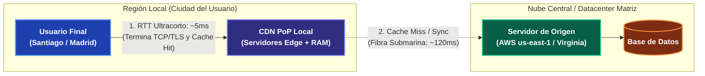

---

#### ⚙️ Los 5 Roles Críticos de un PoP en Arquitectura Moderna

1. **Edge Caching (Almacenamiento Perimetral):**  
   Sirve contenido estático (imágenes, CSS, JS, videos) y respuestas JSON cacheadas directamente desde memoria RAM o discos NVMe locales, absorbiendo más del **90% al 98% del tráfico total** antes de que alcance el origen.
2. **Terminación de Conexión en el Borde (Edge Termination):**  
   El *Handshake* TCP de 3 vías y la negociación criptográfica TLS 1.3 se completan directamente en el PoP a **5 ms de distancia**. El usuario experimenta una navegación fluida e instantánea incluso en peticiones no cacheadas.
3. **Aceleración de Tráfico Dinámico (DSA - Dynamic Site Acceleration):**  
   Para peticiones que jamás pueden ser cacheadas (ej. `POST /checkout`), el PoP utiliza **conexiones TCP persistentes pre-calentadas** (*pre-warmed TCP pools*) a través de cables de fibra oscura privada de la CDN hacia el origen, evitando renegociar handshakes por el internet público congestionado.
4. **Enrutamiento Inteligente con BGP Anycast:**  
   Cientos de PoPs en todo el mundo anuncian la misma dirección IP pública simultáneamente mediante BGP. Los routers del proveedor de Internet (ISP) del usuario enrutan el paquete de forma natural hacia el PoP topológicamente más próximo.
5. **Mitigación Perimetral de Ataques DDoS y WAF:**  
   Al distribuir el tráfico entre cientos de PoPs globales, un ataque volumétrico masivo (ej. 2 Terabits/segundo) se dispersa y absorbe a nivel local en los bordes de la red, impidiendo que sature los balanceadores del datacenter central.

---

#### 📊 Comparativa: Petición con PoP vs. Petición Directa al Origen

| Dimensión Técnica | Directo al Servidor de Origen (Sin PoP) | A través de un CDN PoP Perimetral |
| :--- | :--- | :--- |
| **Distancia Física del Paquete** | $8.000\text{ a }12.000\text{ km}$ (Cruces intercontinentales). | $5\text{ a }50\text{ km}$ (Misma área metropolitana / país). |
| **Latencia RTT de Red** | $120\text{ -- }200\text{ ms}$ por cada viaje de ida y vuelta. | **$2\text{ -- }10\text{ ms}$** hacia el borde de la red. |
| **Handshake TCP + TLS 1.3** | $2\text{ RTTs} \approx 240\text{ -- }400\text{ ms}$ antes del primer byte. | **$2\text{ RTTs} \approx 10\text{ -- }20\text{ ms}$** (Negociación instantánea). |
| **Carga en la Base de Datos** | 100% de las peticiones tocan los servidores centrales. | **$1\%\text{ a }10\%$** (El resto lo absorbe el PoP como *Cache Hit*). |
| **Exposición a Ataques DDoS** | La IP de tus servidores está expuesta a saturación directa. | La IP del origen queda oculta tras la red Anycast del PoP. |

---

#### 🛠️ ¿Cómo inspeccionar el PoP al que te estás conectando en Linux?

##### 1. Identificar el PoP de Cloudflare mediante su endpoint de telemetría:
```bash
curl -s https://cloudflare.com/cdn-cgi/trace | grep colo
```
*Salida representativa:*
```text
colo=SCL
```
> **Nota de ingeniería:** El campo `colo` devuelve el código IATA del aeropuerto internacional donde se aloja el PoP físico (ej. `SCL` = Santiago de Chile, `MAD` = Madrid, `BOG` = Bogotá, `EZE` = Buenos Aires, `MIA` = Miami).

##### 2. Inspeccionar la cabecera de depuración del PoP en AWS CloudFront:
```bash
curl -Iv https://aws.amazon.com 2>&1 | grep -i "x-amz-cf-pop"
```
*Salida representativa:*
```text
< x-amz-cf-pop: SCL50-C1
```
*(Indica que la petición fue procesada por el clúster C1 del PoP de Santiago de Chile).*

##### 3. Trazar los saltos de red hasta el PoP Anycast más cercano:
```bash
traceroute -m 8 1.1.1.1
```

---

#### 🔗 Menciones y Temas Relacionados en el Cerebro
- [[01.0_El_Viaje_Completo_de_una_Peticion_HTTP|01.0 El Viaje Completo de una Petición HTTP]] — Latencia de propagación y aceleración por proximidad geográfica.
- [[01.1_DNS_Resolucion_de_Nombres_y_Anycast|01.1 DNS: Resolución Jerárquica y Anycast]] — Distribución de servidores autoritativos y Anycast BGP en PoPs.
- [[01.2_CDNs_Push_vs_Pull_y_Edge_Caching|01.2 CDNs: Push vs Pull y Edge Caching]] — Almacenamiento perimetral, Cache Hit Ratio (CHR), Origin Shield y Request Collapsing.
- [[01.3_Balanceadores_de_Carga_L4_vs_L7_Active-Active_vs_Active-Passive|01.3 Balanceadores de Carga L4 vs L7]] — Terminación de tráfico y capas de balanceo en el borde.
- [[08.0_Latencias_que_Todo_Programador_Debe_Saber|08.0 Latencias que Todo Programador Debe Saber]] — Comparativa de velocidad entre memoria local en el Edge vs travesía transatlántica.

[⬆️ Volver al Índice](#indice)

---

<a id="R"></a><a id="r"></a>
## R

### Round-Trip Time (RTT)

> **Definición Formal:**  
> El **Round-Trip Time (RTT)** —o *Tiempo de Ida y Vuelta*— es el tiempo total transcurrido (medido en milisegundos, $\text{ms}$, o nanosegundos, $\text{ns}$) que tarda un paquete de datos en viajar desde un nodo origen (cliente) hasta un destino (servidor) y regresar con una respuesta o confirmación ($\text{ACK}$).
>
> En el lenguaje cotidiano de redes e infraestructura, es el componente fundamental de lo que comúnmente llamamos **latencia de red** o **"ping"**.

📍 **Primera mención en el Cerebro:**  
- [[01.0_El_Viaje_Completo_de_una_Peticion_HTTP#Etapa 2: Establecimiento de Conexión (TCP + TLS Handshakes)|01.0 El Viaje Completo de una Petición HTTP (Request Lifecycle)]]  
- *(Ruta física: [01_Fundamentos_y_Trafico/01.0_El_Viaje_Completo_de_una_Peticion_HTTP.md](01_Fundamentos_y_Trafico/01.0_El_Viaje_Completo_de_una_Peticion_HTTP.md#L170-L206))*

---

#### 📬 La Analogía del Correo Postal
Imagina que envías una carta preguntando *"¿Recibiste el paquete?"*:

1. **Ida:** La carta viaja en transporte terrestre hasta la casa de tu amigo.
2. **Procesamiento:** Tu amigo abre la carta, la lee y escribe *"Sí, lo recibí"*.
3. **Vuelta:** La carta de respuesta viaja de regreso y aterriza en tu buzón.

El tiempo total desde que echaste la carta al buzón hasta que sostuviste la confirmación física en tus manos es el **RTT**.

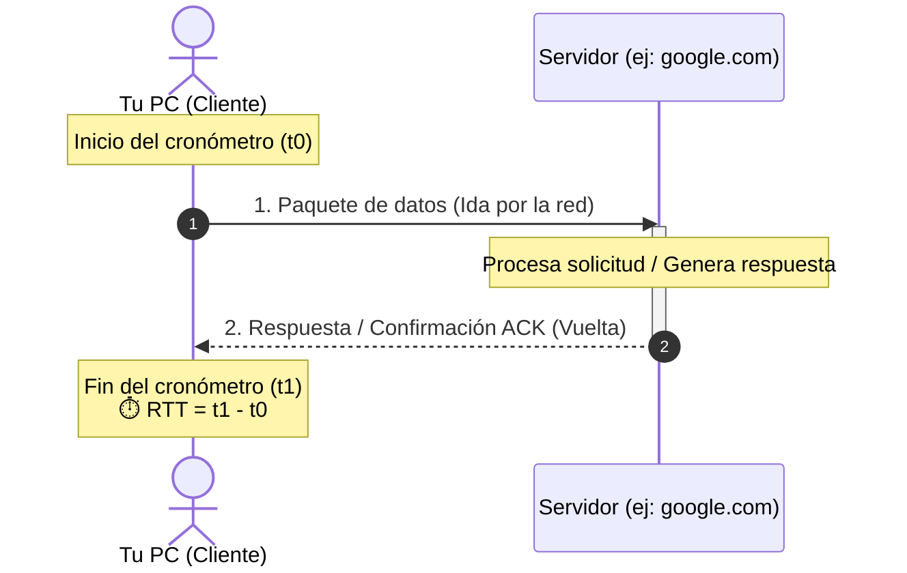

```text
  Tu PC (Cliente)                         Servidor (ej: google.com)
        │                                            │
        │ ─── 1. Paquete de datos (Ida) ───────────► │
        │                                            │ (Procesa la solicitud)
        │ ◄── 2. Respuesta/Confirmación (Vuelta) ─── │
        ▼                                            ▼
     [ ⏱️ RTT = Tiempo transcurrido entre 1 y 2 ]
```

---

#### 🌐 ¿Qué factores determinan el RTT?

El RTT no depende directamente del ancho de banda contratado (megas de descarga), sino de cuatro variables físicas y topológicas:

1. **Distancia física y velocidad de la luz:**  
   La luz en cables de fibra óptica viaja aproximadamente a $\sim 200.000\text{ km/s}$ (dos tercios de $c$ en el vacío). Conectarte a un servidor en tu misma ciudad toma $\sim 5\text{ ms}$; cruzar el océano Atlántico desde América hasta Europa tomará $\sim 70\text{--}120\text{ ms}$ simplemente por distancia física.
2. **Número de saltos (Routers intermedios):**  
   Cada router por el que pasa el paquete debe leer la cabecera IP, verificar la tabla de rutas y reenviarlo al siguiente salto (*hop*).
3. **Medio de transmisión físico:**  
   Fibra óptica monomodo es más rápida y fiable que el cable de cobre coaxial, Wi-Fi o satélite.
4. **Congestión y colas de espera (Bufferbloat):**  
   Si hay mucho tráfico en los nodos intermedios, los paquetes esperan en colas dentro de los buffers de los routers, incrementando el tiempo de espera y el *jitter*.

---

#### ⚡ ¿Por qué es tan importante en la informática y arquitectura distribuida?

El RTT introduce un factor multiplicativo en cada interacción:

* **Conexiones Web (TCP y HTTPS):**  
  Antes de transferir datos, el navegador y el servidor deben "saludarse" (*Handshake TCP/TLS*). Esto requiere entre 1 y 3 viajes de ida y vuelta (RTTs) antes de que la página comience a cargar:
  - **TCP 3-Way Handshake:** $1\text{ RTT}$
  - **TLS 1.2:** $2\text{ RTTs}$ (Total: $3\text{ RTTs} = 3 \times 120\text{ ms} = 360\text{ ms}$)
  - **TLS 1.3:** $1\text{ RTT}$ (Total: $2\text{ RTTs} = 2 \times 120\text{ ms} = 240\text{ ms}$)
  - **HTTP/3 (QUIC):** $0\text{--}1\text{ RTT}$ (Optimización máxima de arranque).
* **Cascada en Microservicios (*Chatty Services*):**  
  Si un endpoint ejecuta 10 consultas secuenciales a otros microservicios con $2\text{ ms}$ de RTT de red cada una, acumulas $20\text{ ms}$ de latencia pura de cable antes de procesar lógica.
* **Videojuegos en línea:**  
  Un RTT alto se traduce directamente en *lag* (acciones con retraso y desincronización de estado).
* **Llamadas y videollamadas (Zoom, Meet, WebRTC):**  
  Un RTT mayor a $150\text{--}200\text{ ms}$ causa interrupciones y la molesta sensación de que las personas se pisan al hablar.

---

#### 📊 Valores de Referencia Típicos

| RTT (ms) | Calidad de la Conexión | Ejemplo de Uso y Contexto |
| :--- | :--- | :--- |
| **$< 10\text{ ms}$** | 🟢 Excelente / Red Local | Conexión con tu router, red LAN o servidores/CDN en tu misma ciudad. |
| **$20\text{ -- }60\text{ ms}$** | 🔵 Muy buena | Servidores en tu mismo país o región (ideal para gaming y videollamadas). |
| **$100\text{ -- }200\text{ ms}$** | 🟡 Aceptable | Servidores en otros continentes (ej. América a Europa). |
| **$> 300\text{ ms}$** | 🔴 Lenta / Mala | Conexiones satelitales antiguas (GEO) o redes celulares muy congestionadas. |

---

#### 🛠️ ¿Cómo medir tu RTT en Linux?

##### 1. Medición por ICMP Ping:
```bash
ping -c 4 google.com
```
Al final del resultado verás estadísticas detalladas:
```text
rtt min/avg/max/mdev = 18.234/19.102/21.450/1.120 ms
```
- **`min`:** RTT mínimo (el paquete más rápido).
- **`avg` (average):** Es tu RTT promedio en milisegundos hacia ese servidor.
- **`max`:** RTT máximo registrado.
- **`mdev` (mean deviation):** Varianza o fluctuación de la latencia (*jitter*).

##### 2. Diagnóstico detallado por etapas con `curl`:
```bash
curl -w "\nDNS: %{time_namelookup}s | TCP: %{time_connect}s | TLS: %{time_appconnect}s | TTFB: %{time_starttransfer}s | Total: %{time_total}s\n" -o /dev/null -s https://google.com
```

---

#### 🔗 Menciones y Temas Relacionados en el Cerebro
- [[01.0_El_Viaje_Completo_de_una_Peticion_HTTP|01.0 El Viaje Completo de una Petición HTTP]] — Handshakes TCP/TLS y desglose de TTFB.
- [[01.6_TCP_vs_UDP_Protocolos_de_Transporte|01.6 Capa de Transporte: TCP vs UDP]] — Slow Start, Ventana de Congestión y Algoritmo BBR.
- [[01.7_HTTP1_HTTP2_HTTP3_y_QUIC|01.7 Evolución HTTP]] — Zero-RTT Resumption y Connection Migration en HTTP/3.
- [[03.1_Teorema_PACELC_Extension_del_CAP|03.1 Teorema PACELC]] — Costo del RTT inter-datacenter en quórums síncronos de datos.
- [[06.3_API_Gateway_y_Patron_BFF_Backend-For-Frontend|06.3 API Gateway y Patrón BFF]] — Agrupación de llamadas para reducir múltiples RTTs móviles.
- [[08.0_Latencias_que_Todo_Programador_Debe_Saber|08.0 Números de Latencia de Jeff Dean]] — Costos comparativos de RTT en escala humana (4 años Costa a Costa, 8 años Transatlántico).

[⬆️ Volver al Índice](#indice)

---

<a id="S"></a><a id="s"></a>
## S

### SYN (Synchronize Flag / Paquete de Sincronización)

> **Definición Formal:**  
> **SYN** (abreviatura de *Synchronize* / Sincronización) es una bandera de control de **1 bit** (*control flag*) ubicada en la cabecera de los segmentos del protocolo **TCP** (Capa 4 - Capa de Transporte del modelo OSI).  
>
> Su función principal es **iniciar el establecimiento de una conexión fiable** entre dos extremos, indicando que el emisor desea sincronizar sus **Números de Secuencia Iniciales** (*Initial Sequence Number* - ISN) para ordenar, rastrear y reconstruir el flujo de datos sin pérdidas ni duplicados.

📍 **Primera mención en el Cerebro:**  
- [[01.0_El_Viaje_Completo_de_una_Peticion_HTTP#Etapa 2: Establecimiento de Conexión (TCP + TLS Handshakes)|01.0 El Viaje Completo de una Petición HTTP (Request Lifecycle)]]  
- *(Ruta física: [01_Fundamentos_y_Trafico/01.0_El_Viaje_Completo_de_una_Peticion_HTTP.md](01_Fundamentos_y_Trafico/01.0_El_Viaje_Completo_de_una_Peticion_HTTP.md#L170-L206))*

---

#### 📞 La Analogía de la Radio y Walkie-Talkie
Imagina a dos operadores militares estableciendo comunicación por radio:

1. **Cliente envía SYN:**  
   *"Central, aquí Móvil 1. Deseo enlazarme contigo; numeraré mis mensajes comenzando en el 100."* (`SYN=1`, `Seq=100`)
2. **Servidor responde SYN-ACK:**  
   *"Recibido Móvil 1, espero tu paquete 101. Yo también me enlazo y numeraré mis respuestas comenzando en el 500."* (`SYN=1`, `ACK=1`, `Ack=101`, `Seq=500`)
3. **Cliente confirma ACK:**  
   *"Entendido Central, espero tu paquete 501. Canal asegurado, procedo a transmitir la carga útil."* (`ACK=1`, `Ack=501`)

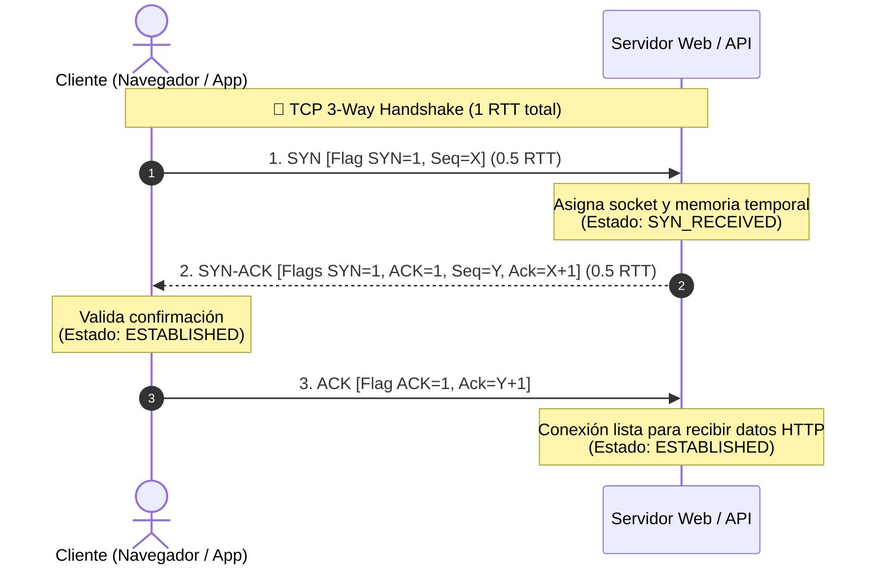

---

#### ⚙️ Conceptos Clave de Arquitectura y Rendimiento

1. **Generación del ISN (Initial Sequence Number):**  
   El número inicial no es $0$ por motivos de seguridad. Si fuera predecible, atacantes intermedios podrían inyectar paquetes maliciosos en la sesión (*TCP Spoofing / Session Hijacking*). Los kernels modernos (Linux/BSD) generan un ISN pseudo-aleatorio basado en un hash criptográfico y temporizadores de alta resolución.
2. **Impacto en Latencia ($0.5\text{ RTT}$):**  
   El envío del paquete `SYN` consume medio viaje de ida hacia el servidor. Hasta que el servidor no responde con `SYN-ACK`, no existe canal de transporte disponible.
3. **Ataques de Denegación de Servicio (SYN Flood):**  
   - **Mecanismo del ataque:** El atacante envía una ráfaga masiva de paquetes `SYN` con direcciones IP de origen falsificadas (*spoofed*) y nunca envía el `ACK` final.
   - **Consecuencia:** El servidor mantiene miles de conexiones semi-abiertas en su tabla de memoria (*SYN backlog queue*), agotando los recursos y rechazando a usuarios legítimos.
4. **Mitigación mediante SYN Cookies:**  
   Para defenderse de un SYN Flood, los servidores Linux activan `syncookies`: el kernel **no reserva memoria en RAM** al recibir el `SYN`, sino que codifica la información del socket dentro del propio número de secuencia inicial $Y$ del `SYN-ACK`. Solo cuando el cliente responde con el `ACK` legítimo del paso 3, el servidor decodifica el hash y reserva la estructura de socket.

---

#### 🛠️ ¿Cómo inspeccionar paquetes SYN en Linux?

##### Capturar paquetes SYN en tiempo real con `tcpdump`:
```bash
sudo tcpdump -i any "tcp[tcpflags] & tcp-syn != 0" -nn -c 4
```
*Salida representativa:*
```text
17:02:10.123456 IP 192.168.1.15.54321 > 142.250.190.46.443: Flags [S], seq 3421598210, win 65535, length 0
17:02:10.142010 IP 142.250.190.46.443 > 192.168.1.15.54321: Flags [S.], seq 891234112, ack 3421598211, win 65535, length 0
```
> **Explicación de banderas:**
> - `Flags [S]`: Paquete puro de inicio **SYN** (`SYN=1`).
> - `Flags [S.]`: Paquete de respuesta **SYN-ACK** (`SYN=1, ACK=1`).

---

#### 🔗 Menciones y Temas Relacionados en el Cerebro
- [[01.0_El_Viaje_Completo_de_una_Peticion_HTTP|01.0 El Viaje Completo de una Petición HTTP]] — Paso 1 del TCP Handshake en la fase de transporte.
- [[01.3_Balanceadores_de_Carga_L4_vs_L7_Active-Active_vs_Active-Passive|01.3 Balanceadores de Carga L4 vs L7]] — Enrutamiento L4 basado puramente en la inspección de paquetes SYN e IP:Puerto.
- [[01.6_TCP_vs_UDP_Protocolos_de_Transporte|01.6 Capa de Transporte: TCP vs UDP]] — Anatomía completa de la cabecera TCP (Flags SYN, ACK, FIN, RST) y comparación con UDP (sin handshakes).
- [[01.7_HTTP1_HTTP2_HTTP3_y_QUIC|01.7 Evolución HTTP y QUIC]] — Sustitución de handshakes TCP SYN por datagramas QUIC sobre UDP.

[⬆️ Volver al Índice](#indice)

---

<a id="T"></a><a id="t"></a>
## T

### TCP (Transmission Control Protocol)

> **Definición Formal:**  
> **TCP (Transmission Control Protocol)** —o *Protocolo de Control de Transmisión*— es el protocolo troncal de la **Capa 4 (Transporte)** en la pila de Internet (TCP/IP).  
>
> Su función primordial es convertir un medio de red subyacente inherentemente caótico y no confiable (el protocolo IP) en un **canal virtual bidireccional punto a punto, 100% fiable, con retransmisión automática de pérdidas, control de congestión y entrega estrictamente ordenada**.

📍 **Primera mención en el Cerebro:**  
- [[01.0_El_Viaje_Completo_de_una_Peticion_HTTP#Etapa 2: Establecimiento de Conexión (TCP + TLS Handshakes)|01.0 El Viaje Completo de una Petición HTTP (Request Lifecycle)]]  
- *(Ruta física: [01_Fundamentos_y_Trafico/01.0_El_Viaje_Completo_de_una_Peticion_HTTP.md](01_Fundamentos_y_Trafico/01.0_El_Viaje_Completo_de_una_Peticion_HTTP.md#L170-L206))*

---

#### 📖 La Analogía del Libro Desarmado por Correo

Imagina que deseas enviar un libro de **500 páginas** a un colega al otro lado del mundo:

* **El Problema (La Red IP):** No puedes mandar el libro de un solo golpe. Debes arrancar las 500 hojas y enviarlas en sobres postales separados que tomarán diferentes camiones, aviones y rutas. Algunos sobres llegarán rápido, otros se retrasarán y otros se extraviarán en aduanas.
* **La Solución de TCP:**
  1. **Numeración (*Sequence Numbers*):** Escribes a mano el número de página en cada hoja ($1, 2, 3 \dots 500$).
  2. **Acuse de Recibo (*ACKs*):** Tu colega te avisa por telegrama: *"Recibí correctamente hasta la página 44"*.
  3. **Retransmisión:** Si tras 5 días no llega acuse de la página 45, envías una copia de la página 45 de inmediato.
  4. **Control de Flujo:** Tu colega te indica *"solo puedo procesar 10 páginas por hora; no me envíes 100 de golpe que saturas mi bandeja"*.
  5. **Reconstrucción:** Tu colega reordena todas las páginas y encuaderna el libro idéntico al original.

*(En contraste, **UDP** sería narrar el libro por altavoz: quien no escuchó una palabra se la perdió, pero la narración nunca se detiene).*

---

#### 🛡️ Las 4 Garantías de Ingeniería de TCP

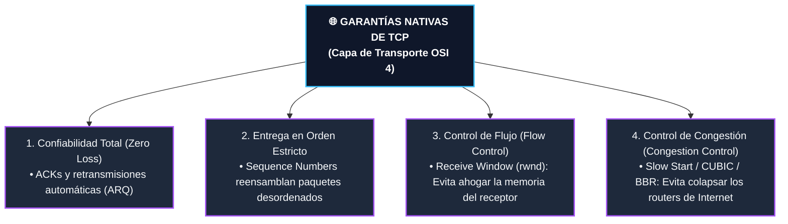

---

#### 🔄 Ciclo de Vida: Handshake, Datos y Cierre Limpio

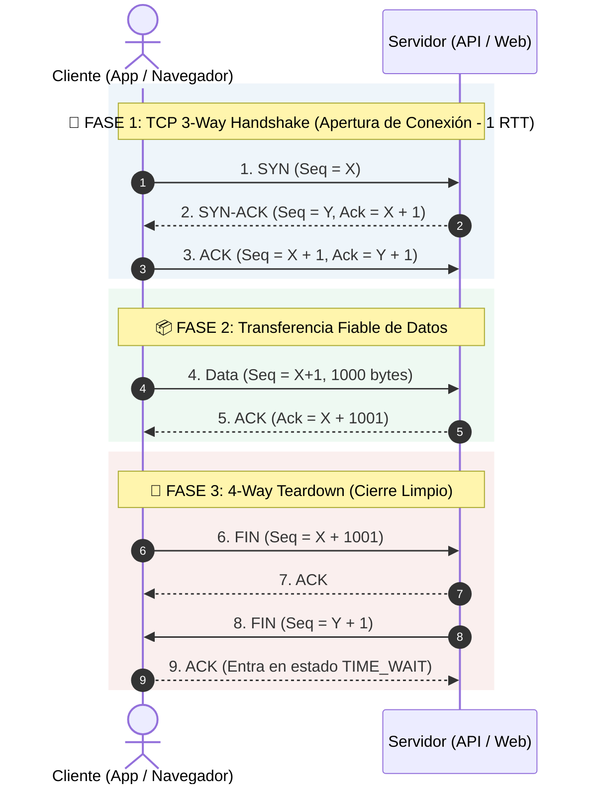

```text
  1. Apertura:    Cliente  ─── SYN ──────────►  Servidor  (Paso 1)
                  Cliente  ◄── SYN-ACK ───────  Servidor  (Paso 2)  [ 1 RTT Total ]
                  Cliente  ─── ACK ──────────►  Servidor  (Paso 3)
  ────────────────────────────────────────────────────────────────────────
  2. Datos:       Cliente  ─── Data (1KB) ───►  Servidor
                  Cliente  ◄── ACK (1KB) ─────  Servidor
  ────────────────────────────────────────────────────────────────────────
  3. Cierre:      Cliente  ─── FIN ──────────►  Servidor
                  Cliente  ◄── ACK ───────────  Servidor
                  Cliente  ◄── FIN ───────────  Servidor
                  Cliente  ─── ACK ──────────►  Servidor  [ TIME_WAIT ]
```

---

#### ⚖️ Comparativa de Trade-offs: TCP vs. UDP

| Dimensión | TCP (*Transmission Control Protocol*) | UDP (*User Datagram Protocol*) |
| :--- | :--- | :--- |
| **Garantía de Datos** | **100% libre de pérdidas** (Retransmisión automática). | **Sin garantías** (Dispara y olvida / Best-effort). |
| **Orden de Entrega** | **Estrictamente ordenado** por números de secuencia. | **Sin orden** (Llegan según los rutee la red). |
| **Head-of-Line Blocking** | **Sí:** Si el paquete #2 se pierde, el buffer se congela hasta recuperarlo. | **No:** Cada datagrama es independiente. |
| **Sobrecarga de Cabecera** | $20 \text{ a } 60\text{ bytes}$ por segmento. | $8\text{ bytes}$ fijos (ultra liviano). |
| **Casos Ideales** | APIs REST, HTTP/1.1, HTTP/2, Bases de Datos (PostgreSQL, Redis), SSH, transferencias de archivos. | Streaming en vivo, Videojuegos multijugador, Videollamadas (WebRTC/Zoom), Consultas DNS, HTTP/3 (QUIC). |

---

#### 🛠️ ¿Cómo inspeccionar sockets TCP en Linux?

```bash
# Listar todos los sockets TCP activos y en escucha (LISTEN)
ss -ta --numeric

# Ver el algoritmo de control de congestión activo en tu kernel (ej. bbr o cubic)
sysctl net.ipv4.tcp_congestion_control
```

---

#### 🔗 Menciones y Temas Relacionados en el Cerebro
- [[01.0_El_Viaje_Completo_de_una_Peticion_HTTP|01.0 El Viaje Completo de una Petición HTTP]] — Paso 2 del ciclo de vida HTTP: Establecimiento de transporte TCP.
- [[01.3_Balanceadores_de_Carga_L4_vs_L7_Active-Active_vs_Active-Passive|01.3 Balanceadores de Carga L4 vs L7]] — Balanceo a nivel de capa de transporte (NLB/IPVS).
- [[01.6_TCP_vs_UDP_Protocolos_de_Transporte|01.6 Capa de Transporte: TCP vs UDP]] — Anatomía de la cabecera, algoritmos de congestión (BBR vs CUBIC) y estado `TIME_WAIT`.
- [[01.7_HTTP1_HTTP2_HTTP3_y_QUIC|01.7 Evolución HTTP y QUIC]] — Superación del Head-of-Line Blocking de TCP mediante HTTP/3 sobre UDP.

---

### Time-To-Live (TTL)

> **Definición Formal:**  
> El **Time-To-Live (TTL)** —o *Tiempo de Vida Útil*— es un mecanismo de expiración y control que establece un límite temporal (medido en segundos, minutos u horas) o un contador de saltos (*hops*) durante el cual un dato, paquete de red o registro es considerado **válido y utilizable** antes de ser descartado, invalidado o renovado automáticamente.

📍 **Primera mención en el Cerebro:**  
- [[01.0_El_Viaje_Completo_de_una_Peticion_HTTP#Etapa 1: Resolución de Nombres (DNS Lookup)|01.0 El Viaje Completo de una Petición HTTP (Request Lifecycle)]]  
- *(Ruta física: [01_Fundamentos_y_Trafico/01.0_El_Viaje_Completo_de_una_Peticion_HTTP.md](01_Fundamentos_y_Trafico/01.0_El_Viaje_Completo_de_una_Peticion_HTTP.md#L115-L160))*

---

#### 🥛 La Analogía Cotidiana: La Fecha de Caducidad y el Visado

* **Como la leche en el refrigerador (Caché y DNS):**  
  Cuando compras leche, tiene una fecha de caducidad impresa (su **TTL**). Durante esos 7 días, no necesitas llamar a la granja cada mañana para preguntar *"¿sigue buena?"* (ahorras consultar a la base de datos). Una vez que expira el TTL, tiras ese cartón y compras uno fresco.
* **Como un pasaporte con sellos en cada aduana (Paquetes IP en Redes):**  
  Imagina que una carta solo tiene permiso de pasar por **64 oficinas postales** (saltos). Cada oficina le resta un sello. Si llega a cero sellos y aún no encuentra al destinatario, la oficina postal destruye la carta para evitar que quede dando vueltas por el planeta en un ciclo infinito.

---

#### 🌐 Los 4 Escenarios de TTL en Ingeniería de Sistemas

```text
┌────────────────────────┬───────────────────────────────┬────────────────────────────────────────────────────────┐
│ Contexto               │ ¿Qué mide el TTL?             │ ¿Qué sucede cuando expira?                            │
├────────────────────────┼───────────────────────────────┼────────────────────────────────────────────────────────┤
│ 1. Redes (Cabecera IP) │ Número de saltos (Hops: 64)   │ El router descarta el paquete y emite ICMP Error.      │
│ 2. Registros DNS       │ Segundos en caché (ej. 300s)  │ El cliente vuelve a preguntar la IP al servidor DNS.   │
│ 3. Caché (Redis / CDN) │ Segundos de validez (ej. 60s) │ Ocurre un Cache Miss; se repuebla desde la BD.         │
│ 4. Seguridad (JWT)     │ Minutos de validez (ej. 15m)  │ El usuario debe refrescar el token o reautenticarse.  │
└────────────────────────┴───────────────────────────────┴────────────────────────────────────────────────────────┘
```

1. **Redes (Capa 3 OSI - Cabecera IPv4/IPv6):**  
   Campo de 8 bits en la cabecera del paquete (máximo 255, típicamente inicializado en 64 o 128). Cada router resta 1 al reenviarlo:
   $$\text{TTL}_{\text{nuevo}} = \text{TTL}_{\text{actual}} - 1$$
   Si llega a 0, el router descarta el paquete y envía un mensaje `ICMP Type 11 (Time Exceeded)` al emisor, previniendo bucles infinitos de enrutamiento (*routing loops*).
2. **Sistema DNS (Domain Name System):**  
   Tiempo en segundos durante el cual los servidores DNS recursivos de los ISPs pueden responder con la IP guardada en su caché sin volver a consultar a los servidores autoritativos.
3. **Capa de Caché (Redis / Memcached / HTTP Cache-Control):**  
   Tiempo tras el cual una clave en memoria se autodestruye o es elegible para evicción (`volatile-lru`), forzando al backend a traer datos frescos de la base de datos persistente.
4. **Seguridad y Tokens de Autenticación (JWT / Sesiones OAuth2):**  
   Periodo de vida útil del token criptográfico (`exp claim`). Limita la ventana de vulnerabilidad en caso de robo o interceptación de credenciales efímeras.

---

#### ⚖️ El Gran Dilema Arquitectónico: TTL Alto vs. TTL Bajo

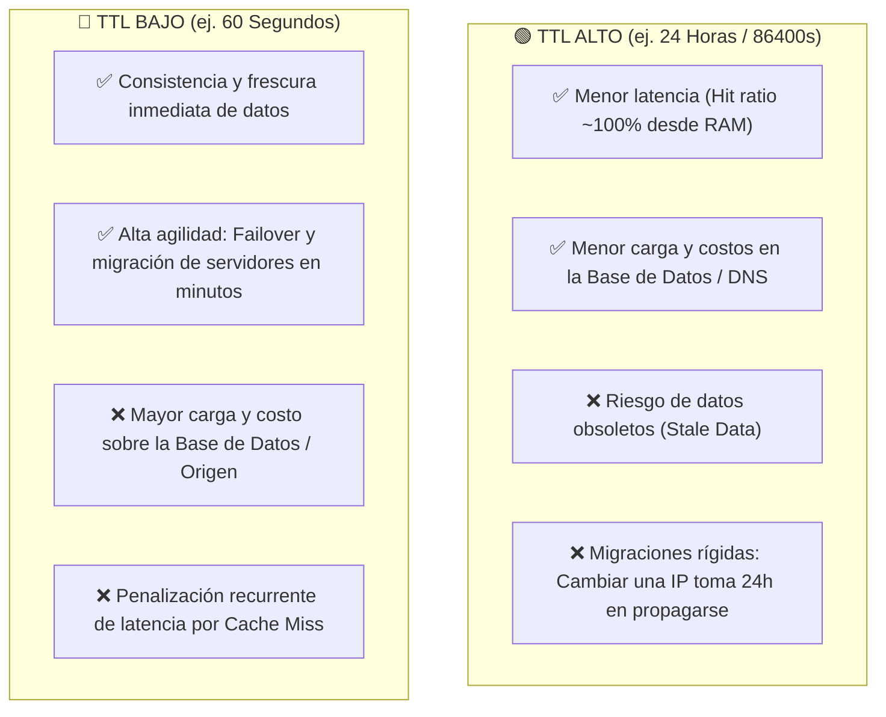

---

#### 🛠️ ¿Cómo inspeccionar el TTL en tu terminal?

##### 1. Ver el TTL de un paquete de red con `ping`:
```bash
ping -c 1 google.com
# Salida representativa: 64 bytes from ...: icmp_seq=1 ttl=116 time=18.2 ms
# (Indica que salió con TTL=128 y atravesó 12 routers: 128 - 12 = 116)
```

##### 2. Ver el TTL de un registro DNS con `dig`:
```bash
dig api.github.com
# Salida en la sección ANSWER:
# api.github.com.    60    IN    A    140.82.112.5
# (El número '60' indica que expira en 60 segundos de la caché DNS)
```

##### 3. Ver el TTL restante de una clave en Redis:
```bash
redis-cli TTL session:user_9821
# Retorna: 1420 (tiempo restante en segundos antes de autoeliminarse)
```

---

#### 🔗 Menciones y Temas Relacionados en el Cerebro
- [[01.0_El_Viaje_Completo_de_una_Peticion_HTTP|01.0 El Viaje Completo de una Petición HTTP]] — Resolución DNS, cacheo de IP y mitigación de Cache Stampede con Jitter.
- [[01.1_DNS_Resolucion_de_Nombres_y_Anycast|01.1 DNS: Resolución de Nombres]] — Estrategia de reducción previa de TTL para migraciones sin downtime.
- [[01.2_CDNs_Push_vs_Pull_y_Edge_Caching|01.2 CDNs y Edge Caching]] — Políticas de retención temporal en puntos de presencia (PoPs).
- [[04.0_Estrategias_de_Cache_Write-Through_Write-Back_Refresh-Ahead|04.0 Estrategias de Caché]] — Prevención del colapso por expiración simultánea de claves calientes (*Cache Stampede*).
- [[04.1_Algoritmos_de_Eviccion_LRU_LFU_FIFO|04.1 Algoritmos de Evicción]] — Política `volatile-lru` de Redis sobre claves con expiración.
- [[09.6_Arquitectura_Aplicada_Proyecto_Petfhans|09.6 Arquitectura de Petfhans]] — Tokens JWT efímeros con TTL de 15 minutos para videollamadas WebRTC.

---

### TLS (Transport Layer Security)

> **Definición Formal:**  
> **TLS (Transport Layer Security)** —o *Seguridad en la Capa de Transporte*— es el protocolo criptográfico estándar de la industria diseñado para proporcionar **comunicaciones seguras, privadas y autenticadas** a través de una red informática (Capa 6/7 del modelo OSI).  
>
> Es el sucesor moderno y seguro del extinto **SSL** (*Secure Sockets Layer*), y es la tecnología responsable de transformar `http://` en `https://` (proveyendo el candado de seguridad en navegadores y APIs).

📍 **Primera mención en el Cerebro:**  
- [[01.0_El_Viaje_Completo_de_una_Peticion_HTTP#Etapa 2: Establecimiento de Conexión (TCP + TLS Handshakes)|01.0 El Viaje Completo de una Petición HTTP (Request Lifecycle)]]  
- *(Ruta física: [01_Fundamentos_y_Trafico/01.0_El_Viaje_Completo_de_una_Peticion_HTTP.md](01_Fundamentos_y_Trafico/01.0_El_Viaje_Completo_de_una_Peticion_HTTP.md#L180-L206))*

---

#### 🛡️ Los 3 Pilares Fundamentales de TLS

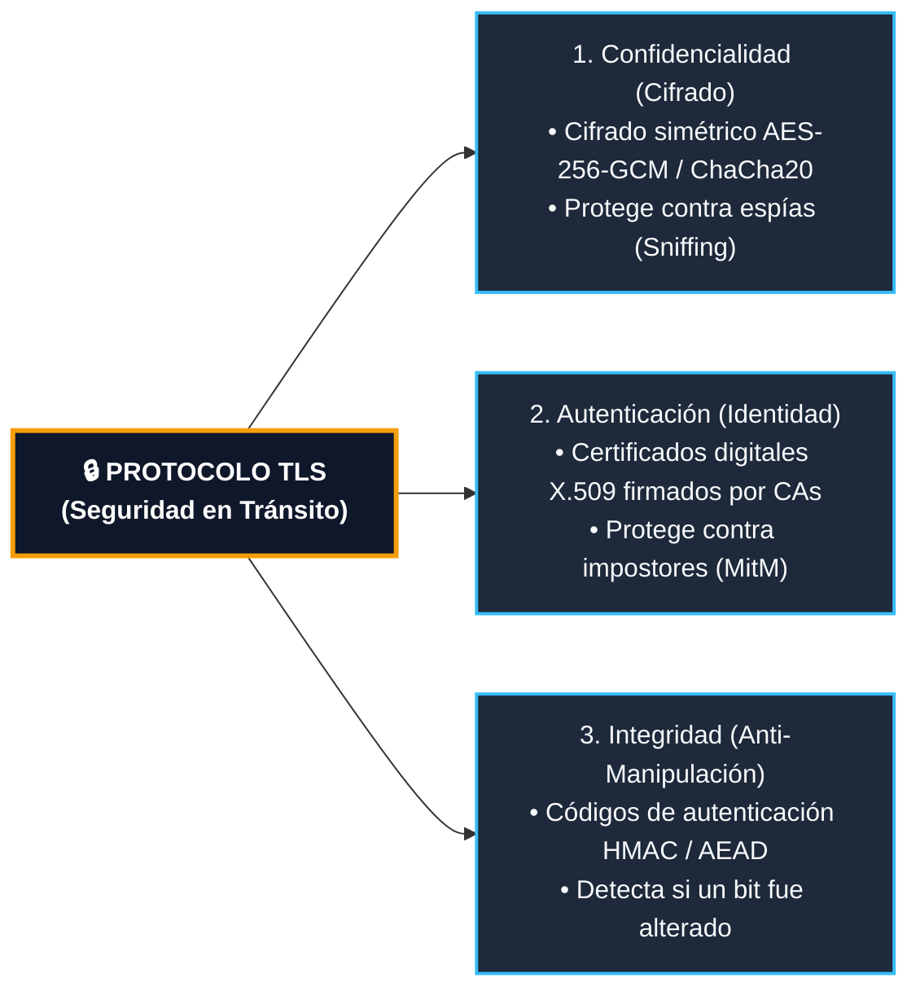

---

#### 📬 La Analogía del Notario y la Caja Fuerte

Imagina que deseas enviar un contrato financiero clasificado a una entidad al otro lado del mundo:

1. **Autenticación (El Certificado del Notario):**  
   Antes de abrir cualquier canal, el servidor te muestra un documento oficial sellado por una entidad de máxima confianza (una **Autoridad Certificadora** como Let's Encrypt o DigiCert). Esto valida matemáticamente que no estás hablando con un atacante intermediario (*Man-In-The-Middle*).
2. **Negociación Segura de Claves (Criptografía Asimétrica):**  
   Utilizan el algoritmo de intercambio de claves **Diffie-Hellman (ECDHE)** para calcular conjuntamente una clave secreta sin transmitirla jamás por el cable.
3. **Transferencia Ultrarrápida (Criptografía Simétrica):**  
   Una vez acordada la clave efímera, todo el tráfico HTTP posterior viaja dentro de una "caja fuerte blindada" cifrada con **AES-256-GCM**, descifrable únicamente por ambos extremos a velocidades de gigabits por segundo.

---

#### ⚡ Diagrama de Secuencia: TLS 1.3 Handshake (1 RTT)

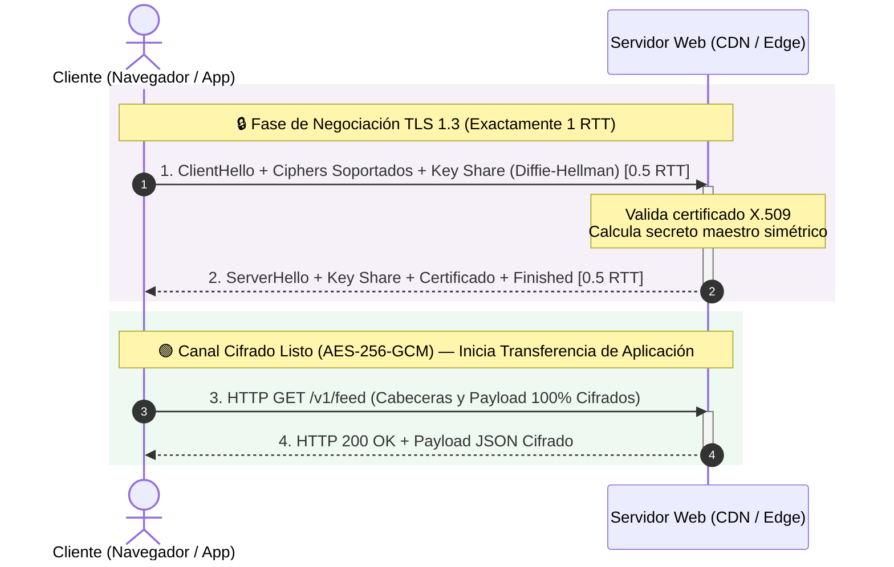

```text
  Cliente (Navegador)                             Servidor (Edge / CDN)
         │                                                  │
         │ ─── 1. ClientHello + Key Share (ECDHE) ────────► │ (0.5 RTT)
         │                                                  │ (Valida Certificado X.509)
         │ ◄── 2. ServerHello + Certificado + Finished ──── │ (0.5 RTT)
         ▼                                                  ▼
      [ ⏱️ Handshake TLS 1.3 Completado = 1 RTT Total ]
         │                                                  │
         │ ═══ 3. HTTP GET /api (Cifrado con AES-GCM) ════► │
         │ ◄══ 4. HTTP 200 OK (Cifrado con AES-GCM) ═══════ │
```

---

#### 📊 Comparativa Total: TLS 1.2 vs. TLS 1.3

| Dimensión Técnica | TLS 1.2 (Estándar 2008) | TLS 1.3 (Estándar Moderno 2018) |
| :--- | :--- | :--- |
| **Latencia de Handshake** | **2 RTTs** (Negociación lenta en 4 pasos separados). | **1 RTT** (Envía la propuesta criptográfica en el primer vuelo). |
| **Reconexión (*0-RTT Resumption*)** | ❌ No disponible (siempre pagaba handshakes completos). | ✅ Envía datos cifrados en el **paquete 0** si hubo conexión previa. |
| **Higiene Criptográfica** | Permitía suites débiles/obsoletas (RSA estático, SHA-1, RC4, CBC). | 🚫 **Eliminó todas las primitivas inseguras** (Solo curvas elípticas y AEAD). |
| ***Perfect Forward Secrecy* (PFS)** | Opcional (si se configuraba RSA estático, robar la clave privada descifraba tráfico grabado del pasado). | 🔒 **Obligatorio por diseño** (Cada sesión genera claves efímeras independientes). |

---

#### 🛠️ ¿Cómo inspeccionar TLS en tu terminal?

##### 1. Inspeccionar certificado y handshake con `openssl`:
```bash
openssl s_client -connect google.com:443 -tls1_3
```
*Salida representativa:*
```text
CONNECTED(00000003)
SSL handshake has read 4120 bytes and written 398 bytes
Protocol  : TLSv1.3
Cipher    : TLS_AES_256_GCM_SHA384
Peer signing digest: SHA256
Server certificate: CN = *.google.com
```

##### 2. Diagnóstico detallado con `curl`:
```bash
curl -Iv https://api.github.com
```
*Líneas clave:*
- `* ALPN, server accepted to use h2`
- `* SSL connection using TLSv1.3 / TLS_AES_128_GCM_SHA256`
- `* Server certificate: subject: CN=*.github.com`

---

#### 🔗 Menciones y Temas Relacionados en el Cerebro
- [[01.0_El_Viaje_Completo_de_una_Peticion_HTTP|01.0 El Viaje Completo de una Petición HTTP]] — Paso 2 del ciclo de vida HTTP: Handshake TLS 1.3 y cálculo de TTFB.
- [[01.6_TCP_vs_UDP_Protocolos_de_Transporte|01.6 Capa de Transporte: TCP vs UDP]] — Comparativa de encapsulamiento y seguridad.
- [[01.7_HTTP1_HTTP2_HTTP3_y_QUIC|01.7 Evolución HTTP y QUIC]] — Fusión de transporte y TLS 1.3 dentro de HTTP/3 (QUIC sobre UDP).
- [[06.0_REST_vs_GraphQL_vs_gRPC_vs_RPC_Comparativa_Total|06.0 Protocolos de Comunicación]] — Transporte seguro mTLS (*Mutual TLS*) en gRPC.
- [[06.2_Microservicios_Service_Discovery_y_Service_Mesh|06.2 Service Mesh (Istio / Envoy)]] — Encriptación mTLS automática entre microservicios (Zero-Trust).

[⬆️ Volver al Índice](#indice)

---

