---
tags:
  - system-design
  - architecture
  - distributed-systems
  - moc
  - computer-science
aliases:
  - System Design Mastery MOC
  - Mapa de Contenidos de Diseño de Sistemas
fecha_creacion: 2026-09-01
autor: Parzival
---

# MOC: System Design Mastery (Mapa Maestro de Conocimiento)

> *"No se trata de saber qué tecnología usar, sino de entender qué compromisos (trade-offs) estás dispuesto a aceptar."*

Bienvenido al centro de comando de tu **Segundo Cerebro para Diseño de Sistemas y Sistemas Distribuidos**. Esta base de conocimiento está diseñada bajo el estándar de **cero pérdida de información**, diagramas visuales, matrices de equilibrio (**lo que SÍ vs lo que NO hacer**) y **microtareas intelectuales de memoria activa** para transformar teoría compleja en intuición de nivel *Staff/Principal Engineer*.

> 📖 **Recurso transversal:** Consulta el [[00_Glosario_de_Terminos|📚 Glosario Maestro de Términos y Conceptos]] para definiciones formales, analogías y primeras menciones.

---

## Índice General por Módulos

```mermaid
flowchart TD
    Root["SYSTEM DESIGN MASTERY<br/>Arquitectura de Sistemas Distribuidos"]:::highlight
    
    M1["01. Fundamentos y Tráfico<br/>DNS, CDN, L4/L7, Proxies, TCP/UDP, HTTP/3"]:::proxy
    M2["02. Capa de Datos<br/>SQL vs NoSQL, B-Tree/LSM, Replicación, Sharding"]:::database
    M3["03. Consistencia y Distribución<br/>CAP, PACELC, Consistencia Fuerte/Eventual, SLAs"]:::warning
    M4["04. Rendimiento y Caché<br/>Cache-Aside, LRU/LFU, Consistent Hashing, Rate Limit"]:::cache
    M5["05. Asincronía y Mensajería<br/>Message Queues, Kafka vs RabbitMQ, EDA, CQRS"]:::queue
    M6["06. Comunicación entre Servicios<br/>REST, GraphQL, gRPC, WebSockets, Service Mesh, BFF"]:::service
    M7["07. Resiliencia y Fallos<br/>Circuit Breaker, Patrón Saga, Bulkhead, Load Shedding"]:::warning
    M8["08. Matemáticas y Capacidad<br/>Latencias Jeff Dean, Potencias de 2, QPS/Storage, FinOps"]:::highlight
    M9["09. Casos de Estudio Reales<br/>TinyURL, Twitter, Netflix, Figma 100x, Petfhans, SSEMMA"]:::service

    Root --> M1 & M2 & M3
    Root --> M4 & M5 & M6
    Root --> M7 & M8 & M9

    classDef highlight fill:#854d0e,stroke:#facc15,stroke-width:2px,color:#ffffff,font-weight:bold;
    classDef proxy fill:#312e81,stroke:#818cf8,stroke-width:2px,color:#ffffff,font-weight:bold;
    classDef database fill:#7c2d12,stroke:#fb923c,stroke-width:2px,color:#ffffff,font-weight:bold;
    classDef cache fill:#581c87,stroke:#c084fc,stroke-width:2px,color:#ffffff,font-weight:bold;
    classDef queue fill:#155e75,stroke:#22d3ee,stroke-width:2px,color:#ffffff,font-weight:bold;
    classDef service fill:#064e3b,stroke:#34d399,stroke-width:2px,color:#ffffff,font-weight:bold;
    classDef warning fill:#881337,stroke:#f43f5e,stroke-width:2px,color:#ffffff,font-weight:bold;
```

---

## Línea de Tiempo y Roadmap de Erudición

---

## Metodología de Retención Intelectual (Microtareas)

Cada nota de esta bóveda contiene **4 tipos de microtareas mentales** diseñadas con callouts colapsables (`[!TIPO]-`). No necesitas escribir nada; debes pausar tu lectura y **resolverlas en tu mente** antes de desplegar el callout:

1. `> [!QUESTION]- Active Recall`: Recuperación forzada de conceptos clave de la memoria sin pistas.
2. `> [!TIP]- Micro-Cálculo Mental`: Entrena la intuición rápida de órdenes de magnitud ($QPS$, gigabytes, latencias).
3. `> [!WARNING]- Dilema de Decisión Arquitectónica`: Elección justificada ante dos opciones con trade-offs opuestos.
4. `> [!NOTE]- Desafío Feynman`: Explicación sintética con una analogía simple en menos de 60 segundos.

---

## Módulo 01: Fundamentos y Tráfico de Red (Fase 1)

Estado: **Completado**

- [ ] [[01.0_El_Viaje_Completo_de_una_Peticion_HTTP|01.0 El Viaje Completo de una Petición HTTP]]
- [ ] [[01.1_DNS_Resolucion_de_Nombres_y_Anycast|01.1 DNS: Resolución Jerárquica y Enrutamiento Anycast]]
- [ ] [[01.2_CDNs_Push_vs_Pull_y_Edge_Caching|01.2 CDNs: Redes de Distribución de Contenido (Push vs Pull)]]
- [ ] [[01.3_Balanceadores_de_Carga_L4_vs_L7_Active-Active_vs_Active-Passive|01.3 Balanceadores de Carga: L4 vs L7, Algoritmos y Alta Disponibilidad]]
- [ ] [[01.4_Reverse_Proxy_vs_Forward_Proxy_vs_API_Gateway|01.4 Proxies y Gateways: Reverse Proxy vs Forward Proxy vs API Gateway]]
- [ ] [[01.5_Escalado_Vertical_vs_Horizontal|01.5 Escalabilidad: Escalado Vertical vs Horizontal y Ley de Amdahl]]
- [ ] [[01.6_TCP_vs_UDP_Protocolos_de_Transporte|01.6 Capa de Transporte: TCP (3-Way Handshake) vs UDP]]
- [ ] [[01.7_HTTP1_HTTP2_HTTP3_y_QUIC|01.7 Evolución HTTP: De HTTP/1.1 a HTTP/2 (Multiplexación) y HTTP/3 (QUIC/UDP)]]

---

## Módulo 02: Capa de Datos y Almacenamiento (Fase 2)

Estado: **Completado**

- [ ] [[02.0_SQL_vs_NoSQL_Taxonomia_Completa|02.0 Taxonomía de Bases de Datos: SQL Relacional vs NoSQL y Paradigmas ACID / BASE]]
- [ ] [[02.1_Motores_de_Indices_B-Tree_vs_LSM-Tree|02.1 Motores de Índices: B-Tree / B+Tree vs Log-Structured Merge-Tree (LSM-Tree)]]
- [ ] [[02.2_Replicacion_Master-Slave_vs_Multi-Master_y_Failover|02.2 Replicación de Bases de Datos: Leader-Follower, Multi-Leader, Modelos sin Líder y Failover]]
- [ ] [[02.3_Particionamiento_y_Sharding_de_BBDD|02.3 Particionamiento y Sharding: Estrategias, Selección de Claves y Desafíos Distribuidos]]
- [ ] [[02.4_Key-Value_y_Document_Stores_Redis_DynamoDB_MongoDB|02.4 Motores Key-Value y Documentales: Redis, MongoDB y AWS DynamoDB]]
- [ ] [[02.5_Wide-Column_y_Graph_Databases_Cassandra_Neo4j|02.5 Almacenes Especializados: Wide-Column (Cassandra / ScyllaDB) y Bases de Datos de Grafos (Neo4j)]]
- [ ] [[02.6_Optimizacion_SQL_y_Query_Tuning|02.6 Optimización SQL y Query Tuning: Planes de Ejecución, Índices Compuestos y Antipatrones]]

---

## Módulo 03: Consistencia, Disponibilidad y Distribución (Fase 2)

Estado: **Completado**

- [ ] [[03.0_Teorema_CAP_Analisis_Riguroso|03.0 Teorema CAP: Análisis Riguroso, Particiones de Red y el Mito de los Sistemas CA]]
- [ ] [[03.1_Teorema_PACELC_Extension_del_CAP|03.1 Teorema PACELC: La Extensión de Daniel Abadi para Sistemas en Estado Normal]]
- [ ] [[03.2_Patrones_de_Consistencia_Fuerte_Eventual_y_Linealizable|03.2 Modelos de Consistencia en Sistemas Distribuidos: De Linearizabilidad a Consistencia Eventual y CRDTs]]
- [ ] [[03.3_Disponibilidad_y_SLA_Calculo_de_los_Nueves|03.3 Disponibilidad y Confiabilidad: SLAs, SLOs, SLIs y el Cálculo Matemático de los Nueves]]

---

## Módulo 04: Rendimiento, Escalabilidad y Caché (Fase 3)

Estado: **Completado**

- [ ] [[04.0_Estrategias_de_Cache_Write-Through_Write-Back_Refresh-Ahead|04.0 Estrategias de Caché: Cache-Aside, Write-Through, Write-Back y Refresh-Ahead]]
- [ ] [[04.1_Algoritmos_de_Eviccion_LRU_LFU_FIFO|04.1 Algoritmos de Evicción de Caché: LRU, LFU, FIFO, 2Q y W-TinyLFU]]
- [ ] [[04.2_Consistent_Hashing_con_Nodos_Virtuales|04.2 Consistent Hashing: El Algoritmo del Anillo y Nodos Virtuales (Vnodes)]]
- [ ] [[04.3_Rate_Limiting_Token_Bucket_Leaky_Bucket_Sliding_Window|04.3 Limitación de Tasa (Rate Limiting): Algoritmos, Redis Distribuido y Control de Tráfico]]
- [ ] [[04.4_Rendimiento_vs_Escalabilidad_Latencia_vs_Throughput|04.4 Métricas de Rendimiento: Performance vs Escalabilidad, Latencia vs Throughput y Percentiles]]

---

## Módulo 05: Asincronía, Eventos y Mensajería (Fase 3)

Estado: **Completado**

- [ ] [[05.0_Colas_de_Mensajes_Message_Queues_y_Back_Pressure|05.0 Colas de Mensajes: Desacoplamiento Asíncrono, Buffering y Control de Back Pressure]]
- [ ] [[05.1_Apache_Kafka_vs_RabbitMQ_vs_AWS_SQS|05.1 Brokers de Mensajería: Apache Kafka vs RabbitMQ vs AWS SQS]]
- [ ] [[05.2_Patrones_Pub-Sub_y_Event-Driven_Architecture|05.2 Arquitecturas Guiadas por Eventos (EDA) y Patrones Publish-Subscribe]]
- [ ] [[05.3_CQRS_y_Event_Sourcing|05.3 CQRS (Command Query Responsibility Segregation) y Event Sourcing]]

---

## Módulo 06: Comunicación entre Servicios y Protocolos (Fase 3)

Estado: **Completado**

- [ ] [[06.0_REST_vs_GraphQL_vs_gRPC_vs_RPC_Comparativa_Total|06.0 Protocolos de Comunicación: REST vs GraphQL vs gRPC vs RPC]]
- [ ] [[06.1_WebSockets_SSE_Long_Polling_y_Webhooks|06.1 Comunicación en Tiempo Real: WebSockets, Server-Sent Events (SSE), Long Polling y Webhooks]]
- [ ] [[06.2_Microservicios_Service_Discovery_y_Service_Mesh|06.2 Arquitectura de Microservicios: Service Discovery, Patrón Sidecar y Service Mesh (Istio / Envoy)]]
- [ ] [[06.3_API_Gateway_y_Patron_BFF_Backend-For-Frontend|06.3 Patrones de Entrada: API Gateway Centralizado vs Backend-For-Frontend (BFF)]]

---

## Módulo 07: Resiliencia y Patrones de Fallo (Fase 4)

Estado: **Completado**

- [ ] [[07.0_Circuit_Breaker_Retry_y_Exponential_Backoff|07.0 Tolerancia a Fallos: Circuit Breaker, Exponential Backoff y Jitter]]
- [ ] [[07.1_Patron_Saga_Coreografia_vs_Orquestacion|07.1 Transacciones Distribuidas: El Patrón Saga (Coreografía vs Orquestación y Transacciones Compensatorias)]]
- [ ] [[07.2_Patrones_de_Aislamiento_Bulkhead_y_Graceful_Degradation|07.2 Aislamiento y Resiliencia: Patrón Bulkhead, Graceful Degradation y Load Shedding]]

---

## Módulo 08: Matemáticas e Ingeniería de Capacidad (Fase 4)

Estado: **Completado**

- [ ] [[08.0_Latencias_que_Todo_Programador_Debe_Saber|08.0 Números de Latencia que Todo Ingeniero Debe Conocer (Tabla de Jeff Dean y Escala Humana)]]
- [ ] [[08.1_Potencias_de_2_y_Escalas_de_Datos|08.1 Potencias de 2: Tabla de Conversión, Escalas de Memoria y Límites de Arquitectura]]
- [ ] [[08.2_Formula_de_Estimacion_QPS_IOPS_Almacenamiento_y_Ancho_de_Banda|08.2 Matemáticas de Capacidad: Fórmulas de QPS, Almacenamiento, Ancho de Banda y Caché (Back-of-the-Envelope)]]
- [ ] [[08.3_Calculo_de_Costos_en_la_Nube_y_Dimensionamiento|08.3 Ingeniería de Costos (FinOps): Dimensionamiento Cloud, Ancho de Banda (Egress) y Reglas de Utilización de CPU]]

---

## Módulo 09: Casos de Estudio y Sistemas Reales (Fase 5)

Estado: **Completado**

- [ ] [[09.0_Metodologia_de_Entrevistas_de_System_Design|09.0 El Framework Universal de 4 Pasos para Diseño de Sistemas]]
- [ ] [[09.1_Diseno_de_TinyURL_Acortador_de_URLs|09.1 Caso de Estudio: Diseño de un Acortador de URLs a Gran Escala (TinyURL / Bitly)]]
- [ ] [[09.2_Diseno_de_Twitter_Timeline_y_Fanout|09.2 Caso de Estudio: Diseño del Timeline de Twitter (Fanout on Write vs Fanout on Read)]]
- [ ] [[09.3_Diseno_de_un_Web_Crawler_Distribuido|09.3 Caso de Estudio: Diseño de un Web Crawler Distribuido a Escala de Internet (Googlebot)]]
- [ ] [[09.4_Diseno_de_Netflix_Streaming_y_CDN_Open_Connect|09.4 Caso de Estudio: Arquitectura de Streaming de Video a Gran Escala (Netflix y Open Connect)]]
- [ ] [[09.5_Estudio_de_Caso_Escalabilidad_Postgres_100x_en_Figma|09.5 Caso de Estudio: Cómo Figma Escaló su Base de Datos PostgreSQL 100x sin Migrar a NoSQL]]
- [ ] [[09.6_Arquitectura_Aplicada_Proyecto_Petfhans|09.6 Caso de Estudio Aplicado: Arquitectura de Alta Disponibilidad de Petfhans (Marketplace, Pasarelas de Pago y Videollamadas)]]
- [ ] [[09.7_Arquitectura_Aplicada_Proyecto_SSEMMA|09.7 Caso de Estudio Aplicado: Arquitectura Empresarial de SSEMMA (Gestión de Viviendas, Multi-Tenancy y Reportería)]]
