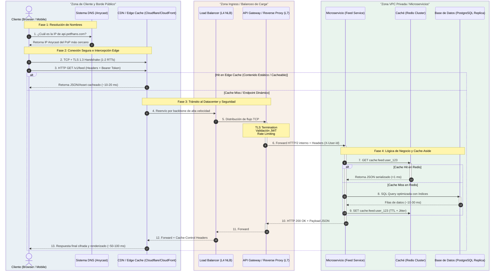
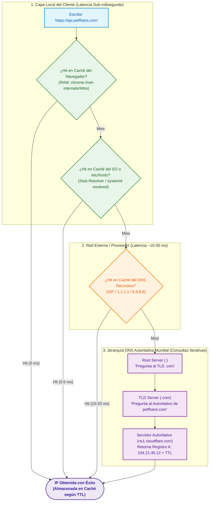
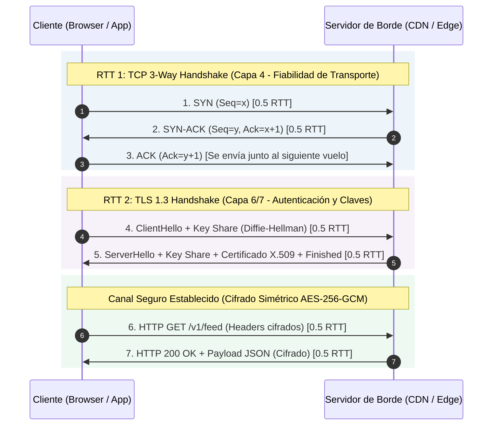
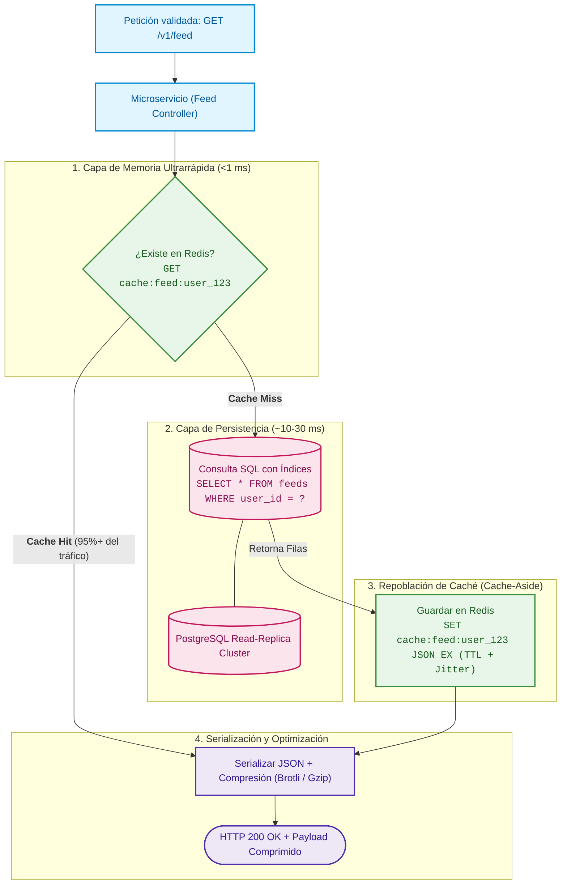

---
tags:
 - system-design
 - networking
 - http
 - web-architecture
 - fase-1
aliases:
 - El Viaje de una Petición
 - Ciclo de Vida HTTP
modulo: "01"
orden: 0
---

# 01.0 El Viaje Completo de una Petición HTTP (Request Lifecycle)

> *"Para optimizar un sistema distribuido, primero debes conocer cada milisegundo y cada capa que atraviesa un paquete desde el teclado del cliente hasta el disco del servidor."*

---

## Contexto y Panorama Global

Cuando un usuario escribe `https://api.petfhans.com/v1/feed` en su navegador y presiona **Enter**, se desencadena una coreografía a través de las 7 capas del modelo OSI, decenas de protocolos de red y múltiples subsistemas distribuidos.

Comprender esta secuencia completa es el prerrequisito para diagnosticar cuellos de botella de latencia (*Time to First Byte* - TTFB), diseñar arquitecturas tolerantes a fallos y colocar capas de caché en el punto exacto.



---

## Desglose Etapa por Etapa

### Etapa 1: Resolución de Nombres (DNS Lookup)

El navegador no puede enviar paquetes directamente a un texto como `"api.petfhans.com"`; necesita una dirección IP numérica de destino (ej. `104.21.45.12`). Para encontrarla con la mínima latencia posible, sigue una jerarquía de menor a mayor costo:



1. **Caché Local del Navegador:** 
   - El navegador revisa primero su propia memoria RAM para verificar si ya tradujo este dominio recientemente.
   - *Ejemplo práctico:* En navegadores Chromium se puede inspeccionar en `chrome://net-internals/#dns`.
2. **Caché del Sistema Operativo y `/etc/hosts`:**
   - Si no está en el navegador, consulta al *Stub Resolver* del SO. Este revisa archivos locales (`/etc/hosts` en Linux/macOS o `hosts` en Windows) y servicios locales de caché de nombres (ej. `systemd-resolved`).
3. **DNS Recursivo (Resolución en Internet):**
   - Si el equipo local no la conoce, envía una petición UDP (puerto 53) al **DNS Recursivo** (tu ISP, o resolvers públicos como Cloudflare `1.1.1.1` o Google `8.8.8.8`).
4. **Búsqueda Jerárquica e Iterativa (Si no está en caché recursiva):**
   - El resolver recursivo consulta la jerarquía mundial:
     - **Root Server (`.`)** $\rightarrow$ indica la IP del servidor de dominio superior (`.com`).
     - **TLD Server (`.com`)** $\rightarrow$ indica la IP del servidor autoritativo de `petfhans.com`.
     - **Servidor Autoritativo (`ns1.cloudflare.com`)** $\rightarrow$ entrega la IP pública final en el registro `A` (IPv4) o `AAAA` (IPv6).
5. **Retorno y Almacenamiento en Caché:**
   - El cliente recibe la IP y la almacena localmente según el tiempo definido por el **TTL**.

> [!QUESTION]- Active Recall #1: Estrategia de TTL en DNS
> **Pregunta de Entrevista:** ¿Qué trade-off implica configurar un TTL alto vs. un TTL bajo en tus registros DNS?
> **Respuesta:**
> - **TTL Alto (ej. 86400s / 24h):** Maximiza el *cache hit ratio*, reduce la latencia de resolución a ~0 ms para casi todos los usuarios y disminuye costos/carga DNS. **Desventaja:** Si tu servidor colapsa y requieres hacer un *failover* de emergencia cambiando la IP, los usuarios tardarán horas en enterarse.
> - **TTL Bajo (ej. 60s - 300s):** Permite migraciones rápidas y failover dinámico en minutos. **Desventaja:** Cada nueva sesión paga una penalización de latencia por consulta DNS y aumenta la carga en los servidores autoritativos.

---

### Etapa 2: Establecimiento de Transporte y Seguridad (TCP + TLS)

Una vez que el cliente tiene la IP de destino, no puede enviar datos HTTP de inmediato; primero debe garantizar una conexión confiable y un canal cifrado. En esta fase entra en juego el concepto más crítico de latencia de redes: el **RTT (Round-Trip Time)**.



---

#### 📐 Fundamentos Senior: ¿Qué es el RTT y cómo se calcula?

El **RTT (*Round-Trip Time* o Tiempo de Ida y Vuelta)** es el tiempo en milisegundos que tarda un paquete de datos en viajar desde el origen hasta el destino **más** el tiempo que tarda la respuesta/confirmación en regresar al origen.

$$\mathbf{\text{RTT}} = 2 \times \text{Retardo de Propagación} + \text{Retardo de Transmisión} + \text{Retardo de Procesamiento} + \text{Retardo de Cola}$$

En sistemas distribuidos a gran escala, el factor dominante es el **Retardo de Propagación**, limitado por la **velocidad de la luz en la fibra óptica** ($v \approx 200,000 \text{ km/s}$, es decir, $\approx 5\text{ µs por kilómetro}$ de ida):

$$\text{RTT}_{\text{teórico}} \approx \frac{2 \times \text{Distancia (km)}}{200,000\text{ km/s}} = \text{Distancia (km)} \times 0.01\text{ ms/km}$$

> [!NOTE]- Reglas de Oro de Latencias RTT para Entrevistas
> Memoriza estos órdenes de magnitud para estimaciones rápidas:
> - **Mismo Datacenter / Zona de Disponibilidad (AZ):** $\approx 0.5 - 2\text{ ms}$
> - **Misma región geográfica / Ciudad (CDN Edge local):** $\approx 5 - 20\text{ ms}$
> - **Costa a Costa (USA - New York a San Francisco ~4,000 km):** $\approx 40 - 70\text{ ms}$
> - **Transoceánico / Intercontinental (Sudamérica a USA / Europa a USA ~8,000 km):** $\approx 100 - 140\text{ ms}$
> - **Antípoda Global (América a Asia/Oceanía ~16,000 km):** $\approx 200 - 300\text{ ms}$

---

#### 🔍 El misterio de los 3 pasos de TCP: ¿Por qué son 3 paquetes pero solo cuesta 1 RTT de espera?

El **TCP 3-Way Handshake** coordina los números de secuencia y el tamaño de ventana entre cliente y servidor mediante 3 paquetes:

1. **Paso 1 (`SYN`):** El cliente envía `SYN (Seq=x)` $\rightarrow$ El paquete viaja hacia el servidor (**+0.5 RTT**).
2. **Paso 2 (`SYN-ACK`):** El servidor recibe el `SYN` y responde con `SYN-ACK (Seq=y, Ack=x+1)` $\rightarrow$ El paquete viaja de regreso al cliente (**+0.5 RTT**).
   - En este punto exacto, han pasado **$0.5 + 0.5 = 1.0\text{ RTT}$**. El cliente ya sabe con certeza que el servidor existe, lo escucha y aceptó la conexión.
3. **Paso 3 (`ACK`):** El cliente envía `ACK (Ack=y+1)`.
   - **¿Por qué este paso no suma otro RTT de espera?** Porque el cliente **no se queda bloqueado esperando** que el servidor le responda a este `ACK`. El cliente envía el `ACK` e inmediatamente adjunta en el mismo paquete el inicio de la negociación TLS (*piggybacking*). Por tanto, la latencia de bloqueo percibida por el cliente para abrir el socket TCP es de **exactamente $1\text{ RTT}$**.

---

#### 🔐 ¿Por qué TLS 1.2 requiere 2 RTTs y TLS 1.3 solo 1 RTT?

Una vez abierto el canal TCP, se debe acordar el cifrado simétrico:

- **TLS 1.2 (2 RTTs de espera):**
  - **Vuelo 1 (1 RTT):** Cliente envía `ClientHello` (lista de algoritmos compatibles) $\rightarrow$ Servidor responde con `ServerHello` (algoritmo elegido) + Certificado SSL/TLS público.
  - **Vuelo 2 (1 RTT):** Cliente valida el certificado con su CA, genera la clave secreta (*pre-master secret*), la cifra con la clave pública del servidor y envía `ClientKeyExchange + Finished` $\rightarrow$ Servidor descifra y confirma con `Finished`.
  - **Total de negociación TLS 1.2:** $2\text{ RTTs}$.
- **TLS 1.3 (1 RTT de espera - Estándar Moderno):**
  - *Optimizaciones clave:* Reduce los algoritmos obsoletos y asume de entrada el uso del protocolo **Diffie-Hellman de Curva Elíptica (ECDHE)**.
  - **Vuelo Único (1 RTT):** El cliente envía en el mismísimo primer mensaje su propuesta y su mitad de la clave pública efímera (`ClientHello + Key Share`). El servidor responde con su mitad de la clave, su certificado y confirmación (`ServerHello + Key Share + Certificado + Finished`).
  - Ambos extremos calculan la clave simétrica simultáneamente. **Total negociación TLS 1.3:** $\mathbf{1\text{ RTT}}$.

---

#### 🧮 La Fórmula Maestra de TTFB (Time to First Byte)

El **TTFB** es la métrica de oro para medir el rendimiento de red. Representa el tiempo que transcurre desde que el usuario envía la petición hasta que recibe el **primer byte de datos reales**:

$$\mathbf{\text{TTFB}} = T_{\text{DNS}} + \left( N_{\text{TCP}} + N_{\text{TLS}} + 1 \right) \times \text{RTT} + T_{\text{servidor}}$$

Donde:
- $T_{\text{DNS}}$: Tiempo de resolución DNS ($0\text{ ms}$ en hit local, $20-50\text{ ms}$ en consulta de red).
- $N_{\text{TCP}} = 1\text{ RTT}$ (Apertura de conexión).
- $N_{\text{TLS}} = 1\text{ RTT}$ (en TLS 1.3) o $2\text{ RTTs}$ (en TLS 1.2).
- $+ 1\text{ RTT}$ adicional: $0.5\text{ RTT}$ para que la petición HTTP `GET` viaje al servidor $+ 0.5\text{ RTT}$ para que el primer byte de respuesta regrese al cliente.
- $T_{\text{servidor}}$: Tiempo de cómputo interno (Redis + SQL + renderizado backend).

> [!TIP]- Micro-Cálculo de Entrevista: El impacto de una CDN en el TTFB
> **Problema:** Un usuario en Buenos Aires consulta un servidor origen en Virginia (USA). RTT geográfico = **120 ms**. El procesamiento en servidor tarda **30 ms**. Asume DNS cacheado ($T_{\text{DNS}} = 0\text{ ms}$).
>
> 1. **Escenario A: Sin CDN + TCP + TLS 1.2:**
>    $$\text{TTFB} = (1_{\text{TCP}} + 2_{\text{TLS 1.2}} + 1_{\text{HTTP}}) \times 120\text{ ms} + 30\text{ ms} = 4 \times 120 + 30 = \mathbf{510\text{ ms}}$$
>    *(¡Más de medio segundo solo para recibir el primer byte!)*
>
> 2. **Escenario B: Con CDN Edge en Buenos Aires (RTT local = 10 ms) + TLS 1.3:**
>    - La conexión TCP y TLS 1.3 terminan en el Edge de Buenos Aires:
>    $$\text{TTFB}_{\text{Edge}} = (1_{\text{TCP}} + 1_{\text{TLS 1.3}} + 1_{\text{HTTP}}) \times 10\text{ ms} + 30\text{ ms} = 3 \times 10 + 30 = \mathbf{60\text{ ms}}$$
>    - **Ganancia de Rendimiento:** Reducción de latencia del **88.2%** ($\frac{510 - 60}{510}$).

---

### Etapa 3: Borde de Red y Distribución (CDN / Edge Caching)

Antes de que la petición viaje miles de kilómetros hasta el centro de datos principal, es interceptada en el borde de Internet:

- **Anycast BGP Routing:** Múltiples servidores de la CDN alrededor del mundo comparten la **misma dirección IP**. Los routers de Internet enrutan automáticamente al usuario hacia el Punto de Presencia (**PoP**) físicamente más cercano.
- **Evaluación de Caché en el Edge:**
  - **Recursos Estáticos:** Si la petición es por una imagen, archivo JS/CSS o un JSON con cabeceras `Cache-Control: public, max-age=3600`, la CDN responde desde su memoria RAM/NVMe en menos de **15 ms**.
  - **Peticiones Dinámicas o Mutaciones (POST/PUT/DELETE):** La CDN actúa como un proxy inverso acelerador, manteniendo conexiones TCP/TLS ya calientes (*Connection Pooling*) con el Datacenter de origen para transferir la petición sin demoras de handshake.

---

### Etapa 4: Entrada al Datacenter (Load Balancer & API Gateway)

Cuando la petición llega a la infraestructura interna, pasa por dos niveles complementarios de balanceo y seguridad:

```mermaid
flowchart LR
    classDef l4 fill:#e3f2fd,stroke:#1565c0,stroke-width:2px,color:#0d47a1;
    classDef l7 fill:#f3e5f5,stroke:#6a1b9a,stroke-width:2px,color:#4a148c;
    classDef srv fill:#e8f5e9,stroke:#2e7d32,stroke-width:2px,color:#1b5e20;
    classDef client fill:#fff3e0,stroke:#e65100,stroke-width:2px,color:#bf360c;

    Client["Tráfico Externo Masivo<br/>(Paquetes TCP / UDP)"]:::client

    subgraph Layer4["Capa de Transporte (OSI 4) - Rendimiento y Conexiones"]
        NLB["L4 Network Load Balancer (AWS NLB / IPVS)<br/>• Enrutamiento a nivel IP:Puerto<br/>• Zero Decryption (Sin inspección HTTP)<br/>• Throughput: Millones de QPS"]:::l4
    end

    subgraph Layer7["Capa de Aplicación (OSI 7) - Seguridad e Inteligencia"]
        Gateway["L7 API Gateway / Reverse Proxy (Kong / Envoy / ALB)<br/>• <b>TLS Termination</b> (Descifrado SSL)<br/>• <b>Auth</b>: Validación Tokens JWT<br/>• <b>Políticas</b>: Rate Limiting & WAF<br/>• <b>Routing</b>: /v1/feed vs /v1/auth"]:::l7
    end

    subgraph InternalServices["VPC Privada - Clúster de Microservicios"]
        S1["Feed Service<br/>(Pods escalados)"]:::srv
        S2["Auth Service<br/>(Servicio Identidad)"]:::srv
        S3["Billing Service<br/>(Servicio Pagos)"]:::srv
    end

    Client --> NLB
    NLB -->|Flujo TCP Balanceado| Gateway
    Gateway -->|'/v1/feed' (gRPC/HTTP2)| S1
    Gateway -->|'/v1/auth'| S2
    Gateway -->|'/v1/billing'| S3
```

1. **L4 Load Balancer (Nivel de Transporte - TCP/UDP):**
   - *Ejemplos:* AWS NLB, IPVS, HAProxy en modo TCP.
   - Opera a nivel de paquetes de red puros. No lee ni descifra el contenido HTTP.
   - Su rol es soportar millones de conexiones concurrentes y repartir los flujos TCP entre los servidores de la capa 7 con costo de CPU mínimo.
2. **L7 Reverse Proxy / API Gateway (Nivel de Aplicación - HTTP):**
   - *Ejemplos:* Kong, Envoy, NGINX, AWS ALB.
   - **TLS Termination:** Desencripta el tráfico HTTPS para que los microservicios internos no gasten ciclos de CPU en cifrado.
   - **Enrutamiento por Path:** Analiza la URI (`/v1/feed` $\rightarrow$ Servicio de Feeds; `/v1/auth` $\rightarrow$ Servicio de Usuarios).
   - **Seguridad y Políticas:** Aplica **Rate Limiting** (ej. Token Bucket para frenar abusos), validación de tokens JWT y filtrado WAF (contra inyecciones SQL o XSS).

---

### Etapa 5: Capa de Aplicación, Caché y Persistencia

El microservicio recibe la petición procesada y orquesta la respuesta:



1. **Estrategia Cache-Aside:**
   - La aplicación consulta primero la memoria ultrarrápida ([[04.0_Estrategias_de_Cache_Write-Through_Write-Back_Refresh-Ahead|Redis / Memcached]]). Si existe (*Cache Hit*), retorna el resultado en menos de $1\text{ ms}$.
2. **Acceso a Base de Datos (En caso de Cache Miss):**
   - Si no está en caché, ejecuta una consulta SQL indexada sobre una réplica de lectura ([[02.2_Replicacion_Master-Slave_vs_Multi-Master_y_Failover|PostgreSQL / MySQL]]) o base de datos NoSQL ([[02.4_Key-Value_y_Document_Stores_Redis_DynamoDB_MongoDB|DynamoDB]]).
   - Antes de responder, almacena el resultado en Redis asignando un **TTL con Jitter** (variación aleatoria para evitar que miles de llaves expiren al mismo segundo y provoquen un *Cache Stampede*).
3. **Serialización y Compresión:**
   - El servicio arma la respuesta (JSON o Protobuf), aplica compresión `brotli` o `gzip` para reducir el tamaño del payload un 70-80% y envía el paquete de vuelta a través del API Gateway, Load Balancer y CDN hacia el cliente.

---

## 🎯 Guion de Entrevista: Cómo explicar este flujo en 2 minutos

Si un entrevistador te pide: *"Explícame qué pasa desde que escribo una URL en el navegador hasta que veo la página"*, estructúralo en **5 hitos clave**:

> 🗣️ **Pitch Profesional de 5 Pasos:**
> 1. **Resolución DNS:** *"El cliente busca la IP primero en la caché del navegador y del SO; si falla, consulta al DNS recursivo para resolver la jerarquía (. $\rightarrow$ .com $\rightarrow$ autoritativo), obteniendo la IP Anycast con su respectivo TTL."*
> 2. **Transporte y Seguridad:** *"Se establece un TCP 3-Way Handshake para garantizar fiabilidad y de inmediato un TLS 1.3 Handshake (1 RTT) para autenticar el certificado y acordar claves de cifrado simétrico."*
> 3. **Borde de Red (CDN):** *"La petición llega al PoP más cercano por Anycast. Si el recurso es estático o cacheable, la CDN responde de inmediato; si es dinámico, reenvía el tráfico por la red interna hacia el Datacenter."*
> 4. **Entrada y Gateway:** *"Un Load Balancer L4 distribuye el tráfico masivo hacia un API Gateway L7, donde se realiza TLS Termination, autenticación JWT, Rate Limiting y enrutamiento hacia el microservicio correspondiente."*
> 5. **Lógica y Almacenamiento:** *"El microservicio aplica el patrón Cache-Aside contra Redis. En caso de cache miss, consulta la base de datos mediante réplicas de lectura indexadas, repuebla el caché con TTL y devuelve la respuesta comprimida (Gzip/Brotli) al cliente."*

---

## Matriz de Trade-offs del Flujo

| Decisión Arquitectónica | Ventajas | Desventajas | Cuándo Usarlo |
| :--- | :--- | :--- | :--- |
| **TLS Termination en el Gateway** | Reduce uso de CPU en microservicios; centraliza certificados SSL. | Tráfico interno viaja sin cifrar (o requiere mTLS / Service Mesh interno). | Microservicios en red privada segura (VPC). |
| **Edge Dynamic Caching (CDN)** | Latencia global ultra-baja; protege servidores origen de picos de carga. | Riesgo de servir datos obsoletos (*Stale Data*); lógica de invalidación compleja. | Catálogos de productos, feeds públicos, noticias, assets estáticos. |
| **HTTP/3 (QUIC sobre UDP)** | 0-RTT en reconexiones; elimina el bloqueo de cabeza de línea (*Head-of-Line Blocking*). | Mayor consumo de CPU en servidores; algunos firewalls corporativos bloquean UDP. | Apps móviles con cambios frecuentes de red (WiFi $\leftrightarrow$ 4G/5G). |

---

> [!WARNING]- Dilema de Decisión: Centralización de Autenticación JWT
> **Escenario:** Tienes 50 microservicios. ¿Debes validar la firma criptográfica del JWT en el API Gateway central o en cada microservicio individual?
> **Respuesta:** **En el API Gateway central.** Valida la firma del token una sola vez en el borde, extrae el `user_id` y los `roles`, y los inyecta en cabeceras internas sanitizadas (ej. `X-User-Id: 4892`, `X-User-Role: admin`) hacia la red privada. Esto evita recalcular operaciones criptográficas RSA/ECDSA 50 veces y desacopla la lógica de seguridad del código de negocio.

---

> [!NOTE]- Desafío Feynman: Explica el flujo en 1 minuto (Analogía del Restaurante)
> Imagina hacer un pedido a domicilio:
> 1. **DNS:** Buscar el número oficial del restaurante en la guía telefónica.
> 2. **TCP/TLS:** Marcar, verificar que contestaron y comprobar que estás hablando con el restaurante auténtico y no un impostor.
> 3. **CDN:** La sucursal exprés de barrio que ya tiene productos populares listos para entregar de inmediato.
> 4. **API Gateway:** El recepcionista que valida si eres cliente registrado y pasa el pedido a la cocina adecuada.
> 5. **Base de Datos:** La despensa central donde se almacenan y consultan los ingredientes principales.

---

## Conceptos Relacionados
- [[01.1_DNS_Resolucion_de_Nombres_y_Anycast|01.1 DNS: Resolución Jerárquica y Anycast]]
- [[01.2_CDNs_Push_vs_Pull_y_Edge_Caching|01.2 CDNs: Push vs Pull y Edge Caching]]
- [[01.3_Balanceadores_de_Carga_L4_vs_L7_Active-Active_vs_Active-Passive|01.3 Balanceadores de Carga L4 vs L7]]
- [[01.4_Reverse_Proxy_vs_Forward_Proxy_vs_API_Gateway|01.4 Reverse Proxy vs API Gateway]]
- [[04.0_Estrategias_de_Cache_Write-Through_Write-Back_Refresh-Ahead|04.0 Estrategias de Caché]]
- [[00_MOC_System_Design_Mastery|Volver al Índice Maestro (MOC)]]
