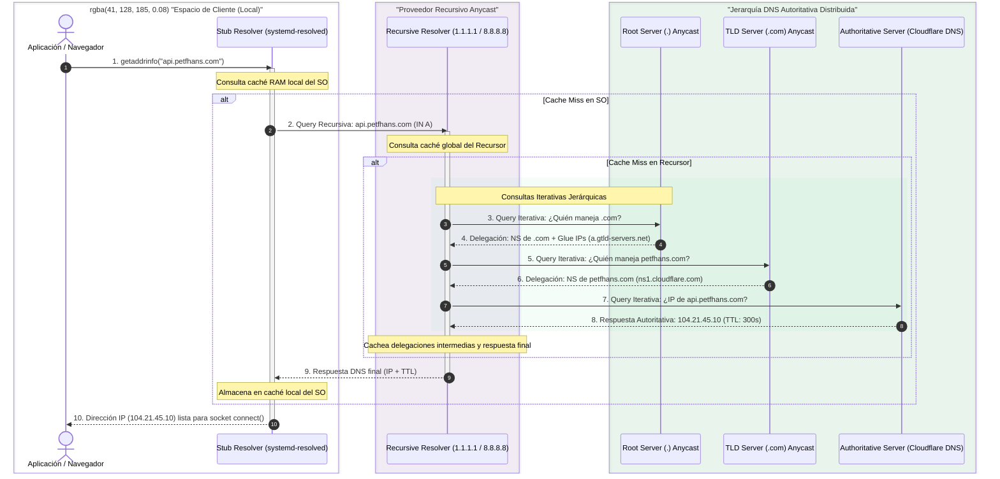
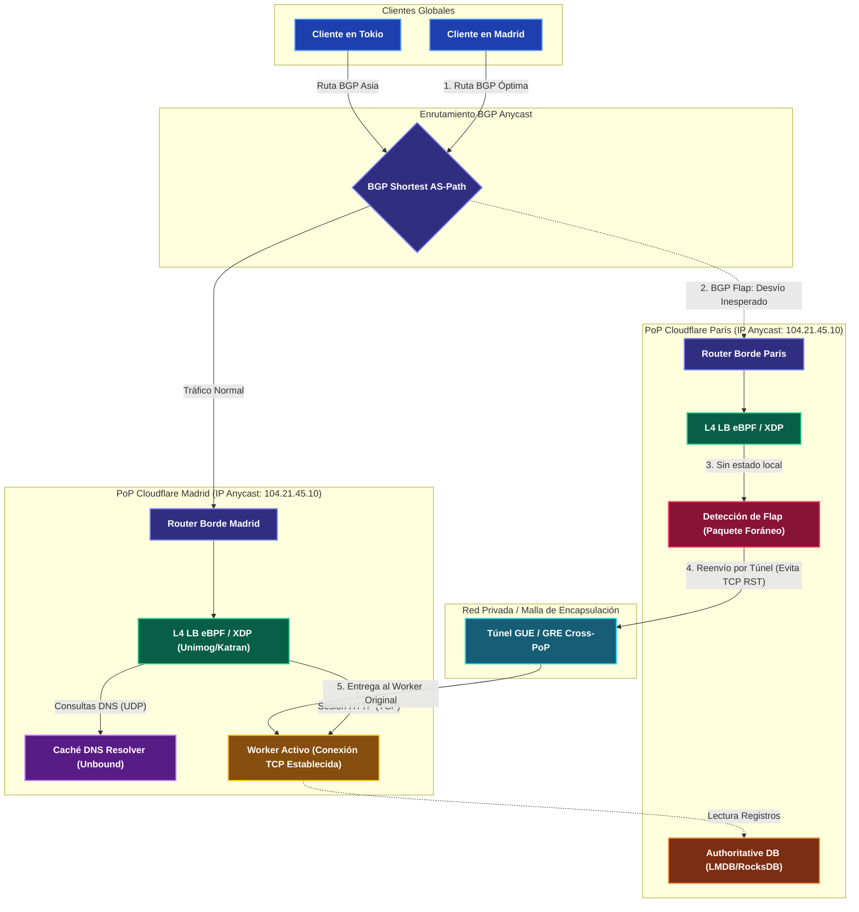

---
tags:
 - system-design
 - networking
 - dns
 - anycast
 - fase-1
aliases:
 - DNS y Anycast
 - Sistema de Nombres de Dominio
modulo: "01"
orden: 1
---

# 01.1 DNS: Resolución Jerárquica, Registros y Enrutamiento Anycast

> *"El DNS es la base de datos distribuida más grande y resiliente del planeta: traduce identidades semánticas humanas en coordenadas de enrutamiento binario a través de una jerarquía de delegación global optimizada por Anycast BGP."*

---

## 1. Jerarquía y Mecánica Interna de Resolución

Cuando un proceso invoca una resolución de nombres (mediante la llamada `getaddrinfo()` de la biblioteca estándar `libc`), el sistema no emite inmediatamente una consulta a la infraestructura mundial. En su lugar, atraviesa un pipeline jerárquico de resolución y capas de caché diseñado para amortiguar el tráfico:

1. **Caché Local del Cliente y Stub Resolver del Sistema Operativo:**
   - **Caché de Aplicación/Navegador:** Clientes web como Chrome mantienen su propia tabla en memoria RAM (`chrome://net-internals/#dns`) con TTLs de 60 segundos para evitar llamadas a nivel de kernel e IPC.
   - **Stub Resolver del SO:** El archivo `/etc/resolv.conf` suele apuntar a un servicio local de resolución como `systemd-resolved` (enlazado en `127.0.0.53:53`) o `nscd`. Si la tupla dominio-registro reside en caché, la respuesta es sub-milisegundo ($<1\text{ ms}$).

2. **Resolución Recursiva (DNS Recursor):**
   - Ante un *cache miss* local, la petición viaja hacia el **DNS Resolver Recursivo** configurado (servidor del ISP o resolutores Anycast públicos como Cloudflare `1.1.1.1` o Google `8.8.8.8`).
   - El recursor asume la carga computacional de ejecutar las consultas **iterativas** jerarquía abajo hasta componer la respuesta autoritativa final.

3. **Jerarquía Autoritativa Global:**
   - **Root Name Servers (`.`):** Existen 13 direcciones IP lógicas (`a.root-servers.net` a `m.root-servers.net`), administradas por 12 entidades independientes (ICANN, NASA, Verisign, WIDE, RIPE NCC). Físicamente operan sobre más de 1,700 instancias Anycast mundiales. Devuelven las delegaciones (`NS` y glue records) al TLD respectivo.
   - **TLD Name Servers (Top-Level Domain):** Gestionan extensiones genéricas (`.com`, `.net`, `.org`) o territoriales (`.es`, `.co`). Administrados por registros como Verisign (`.com`). Responden con los servidores autoritativos del dominio solicitado.
   - **Authoritative Name Server:** Servidor que custodia los registros reales configurados por el dueño de la zona (ej. Route 53 o Cloudflare DNS). Es la única fuente con autoridad para emitir la IP definitiva y el TTL vinculante.

---

## 2. Transporte y Extensiones Modernas (EDNS0, ECS)

El DNS fue concebido originariamente en 1983 bajo el **RFC 1035** para operar primariamente sobre **UDP en el puerto 53**, optimizando la latencia mediante transacciones sin estado de 1 solo paquete de ida y vuelta. Sin embargo, los requerimientos modernos de seguridad y enrutamiento forzaron su evolución.

### Fallback de UDP a TCP 53 (RFC 1035 vs RFC 7766)
- **Límite Clásico de 512 Bytes:** Para evitar fragmentación en routers con el estándar mínimo de MTU de IPv4 (576 bytes), el RFC 1035 fijó el tamaño máximo de un mensaje DNS sobre UDP en **512 bytes**.
- **El Bit Truncated (`TC=1`):** Cuando la respuesta DNS excede los 512 bytes (debido a múltiples registros, claves públicas o firmas criptográficas), el servidor retorna el paquete con el bit `TC` (*Truncated*) activo en la cabecera.
- **Transición a TCP 53:** Al recibir `TC=1`, el cliente descarta el payload incompleto y reintenta inmediatamente la consulta sobre **TCP puerto 53** (estandarizado y exigido por el RFC 7766). Esto introduce una penalización de latencia severa al requerir el handshake de 3 vías de TCP (`SYN` $\rightarrow$ `SYN-ACK` $\rightarrow$ `ACK`) antes de emitir la consulta.

### EDNS0: Extension Mechanisms for DNS (RFC 6891)
Para mitigar el costo del fallback a TCP, **EDNS0** introduce el pseudo-registro **OPT** (Resource Record tipo 41) en la sección adicional del paquete:
- **Buffers UDP Extendidos:** Permite al cliente anunciar el tamaño máximo de buffer UDP que puede procesar sin fragmentar (históricamente 4096 bytes).
- **DNS Flag Day 2020 y la MTU de 1232 Bytes:** La fragmentación IP en paquetes UDP de 4096 bytes provocaba que firewalls y middleboxes descartaran fragmentos por seguridad, causando pérdidas silenciosas de paquetes (*DNS resolution blackholes*). En 2020, los operadores globales estandarizaron el buffer EDNS0 en **1232 bytes**, garantizando que el paquete DNS (1232 B) + cabecera UDP (8 B) + cabecera IPv6 (40 B) quepa perfectamente dentro del límite de **1280 bytes** (MTU mínima de IPv6) sin fragmentación IP.

### EDNS Client Subnet (ECS, RFC 7871)
Tradicionalmente, un servidor autoritativo solo ve la dirección IP del resolver recursivo que emite la consulta. Si un usuario en Bogotá usa un resolver público en Miami (`8.8.8.8`), el autoritativo entrega la IP de un servidor en Miami, degradando la latencia.
- **Mecanismo:** ECS permite al resolver incluir la subred del cliente truncada (ej. `/24` para IPv4 o `/56` para IPv6) dentro del pseudo-registro OPT.
- **GeoDNS de Alta Precisión:** El autoritativo utiliza este prefijo para responder con la IP del Point of Presence (PoP) más cercano al usuario final.
- **Trade-offs Críticos:**
  - *Privacidad:* Revela la ubicación geográfica aproximada de la IP del usuario a terceros. Proveedores como Cloudflare (`1.1.1.1`) desactivan ECS por defecto para preservar la privacidad.
  - *Fragmentación de Caché:* En el resolver recursivo, la caché ya no se almacena por nombre de dominio único, sino multiplicada por cada subred de cliente, reduciendo drásticamente el **Cache Hit Ratio (CHR)**.

---

## 3. Tipos de Registros DNS Críticos

| Registro | Tipo | RFC | Propósito y Comportamiento en Producción |
| :--- | :--- | :--- | :--- |
| **A** | Dirección IPv4 | RFC 1035 | Mapea un FQDN a una dirección IPv4 de 32 bits (ej. `192.0.2.1`). |
| **AAAA** | Dirección IPv6 | RFC 3596 | Mapea un FQDN a una dirección IPv6 de 128 bits (ej. `2001:db8::1`). |
| **CNAME** | Canonical Name | RFC 1034 | Alias canónico de un host a otro host. **Prohibido en la raíz de la zona (@)**. |
| **ALIAS / ANAME** | Pseudo-registro | N/A (Prop.) | Resuelto sintéticamente por el autoritativo para permitir mapeos tipo CNAME en el apex. |
| **NS** | Name Server | RFC 1035 | Delega la autoridad de una zona DNS a un servidor de nombres específico. |
| **MX** | Mail Exchange | RFC 5321 | Define los servidores receptores de correo SMTP junto con su prioridad numérica. |
| **TXT** | Texto libre | RFC 1464 | Metadatos y seguridad: registros SPF (`v=spf1`), claves DKIM, políticas DMARC y verificación de dominios. |
| **PTR** | Pointer | RFC 1035 | Resolución inversa (IP $\rightarrow$ Dominio) en las zonas `in-addr.arpa` e `ip6.arpa`. |
| **SOA** | Start of Authority | RFC 1035/2308 | Metadatos maestros de la zona: servidor primario, email del admin, timers y TTL negativo. |
| **CAA** | Certification Authority Auth | RFC 8659 | Especifica qué Autoridades de Certificación (CAs) están autorizadas a emitir certificados TLS para el dominio. |

### El Problema de CNAME en Zone Apex y CNAME Flattening
El **RFC 1034 §3.6.2** impone una restricción terminante: *si un nodo contiene un registro CNAME, no puede coexistir ningún otro tipo de registro en ese mismo nodo*. 
- **La Incompatibilidad:** La raíz de un dominio o *Zone Apex* (ej. `petfhans.com` o `@`) **requiere obligatoriamente** la presencia de registros `SOA` (autoridad de zona) y `NS` (delegación de nombres), además de posibles registros `MX`. Por lo tanto, crear un `CNAME` en el apex violaría el estándar y provocaría que los servidores no retornen los registros `SOA` ni `NS`.
- **La Solución (ALIAS / CNAME Flattening):** Proveedores modernos (AWS Route 53, Cloudflare) implementaron una técnica a nivel de servidor de nombres: el usuario configura un registro `ALIAS`, pero el servidor autoritativo resuelve el destino aguas abajo en tiempo real y sintetiza una respuesta con registros `A` y `AAAA` nativos hacia el cliente. El cliente nunca ve el CNAME y los registros `SOA`/`NS` permanecen intactos.

### SOA MINIMUM y Caché Negativo (RFC 2308)
Cuando un cliente solicita un registro que no existe, el servidor autoritativo retorna un código de error **`NXDOMAIN`** (Non-Existent Domain) o **`NODATA`** (el nombre existe pero no el tipo de registro solicitado).
- El **RFC 2308** especifica que el último campo de la cabecera SOA (**`MINIMUM`**) dicta el tiempo de vida (TTL) del caché negativo.
- **Impacto en Sistemas Distribuidos:** Si una aplicación intenta consultar `config.servicio.com` antes de que el despliegue del DNS esté propagado, los resolvers de los ISPs cachearán el `NXDOMAIN` durante el tiempo configurado en el `SOA MINIMUM` (ej. 3600 segundos). Cualquier intento posterior fallará inmediatamente durante 1 hora completa aunque el registro ya se haya creado.

---

## 4. Enrutamiento Anycast BGP y la Problemática de Conexiones Stateful

En el modelo tradicional **Unicast**, una dirección IP está vinculada a una única interfaz física en un único datacenter. En **Anycast**, una **misma dirección IP es anunciada simultáneamente por múltiples routers de borde en decenas o cientos de datacenters distribuidos globalmente** mediante el protocolo de enrutamiento exterior **BGP (Border Gateway Protocol)**.

### Topología BGP y Selección de Ruta
- **Sistemas Autónomos (ASNs):** Cada proveedor opera un ASN (ej. AS13335 para Cloudflare, AS15169 para Google) y anuncia sus prefijos (mínimo `/24` en IPv4 o `/48` en IPv6 para ser aceptados en la tabla de rutas global de Internet).
- **Interconexión (Transit vs Peering en IXPs):** A través de acuerdos de *settlement-free peering* en Internet Exchange Points (IXPs), el tráfico viaja directamente entre ISPs y la red Anycast sin saltos intermedios de tránsito comercial, minimizando la latencia física.
- **AS-Path Prepending:** Técnica para desviar tráfico de un PoP congestionado insertando artificialmente copias repetidas del propio ASN en los anuncios BGP para que los routers externos consideren la ruta más larga y prefieran otro nodo.

### El Desafío Crítico: Anycast con Protocolos Stateful (TCP / TLS)
Anycast es conceptualmente perfecto para **UDP (DNS)**: cada consulta y respuesta es un datagrama atómico sin estado (*stateless*). Si la consulta 1 llega a Madrid y la consulta 2 llega a París, la resolución funciona sin anomalías.

Sin embargo, **TCP es intrínsecamente stateful**:
1. Requiere sincronización de números de secuencia y mantenimiento de un bloque de control de transmisión (**TCB** - *Transmission Control Block*) en el kernel del servidor.
2. **BGP Route Flapping:** Si ocurre congestión en la fibra submarina, caída de un enlace BGP o reconvergencia ECMP (*Equal-Cost Multi-Path*) en un router de tránsito, la ruta de Internet puede conmutar a mitad de una conexión TCP activa.
3. **El Escenario de TCP RST:** Si un paquete `DATA` o `ACK` de una conexión originada en Madrid es redirigido repentinamente al PoP de París, el kernel de París no posee el TCB correspondiente en su socket table y responde con un paquete **`TCP RST`**, abortando la sesión del usuario.

### Arquitectura de Solución en Hyper-scalers (Maglev, Katran, Unimog)
Para permitir que Anycast soporte conexiones TCP de larga duración sin cortes ante flaps, compañías como Google (**Maglev**), Meta (**Katran**) y Cloudflare (**Unimog**) desarrollaron arquitecturas de Balanceo L4 perimetral:
1. **Hashing Consistente Estable:** Los balanceadores L4 implementan algoritmos de hashing consistente (tablas Maglev) que asignan flujos (tupla 5-tuple) al mismo servidor de backend de manera idéntica e independiente en todos los nodos.
2. **Redirección eBPF / XDP a Nivel de Kernel:** Utilizan programas en **XDP** (*eXpress Data Path*) acoplados a la tarjeta de red (NIC) que procesan paquetes en microsegundos antes de que el kernel de Linux asigne estructuras de socket.
3. **Reenvío y Encapsulación Cross-PoP (GUE/GRE):** Si un paquete correspondiente a una conexión en curso aterriza en el PoP de París debido a un flap de BGP, el balanceador L4 detecta mediante cabeceras o tablas de conexión distribuidas que el flujo pertenece a Madrid y lo encapsula dentro de un túnel **GUE** (*Generic UDP Encapsulation*) a través del backbone interno directo al worker de Madrid, preservando la conexión sin emitir `TCP RST`.

---

## 5. Seguridad y Protocolos Cifrados

El diseño original de DNS en texto plano sobre UDP 53 carece de cifrado y autenticación, haciéndolo vulnerable a espionaje, manipulación en tránsito (*Man-in-the-Middle*) y ataques de suplantación.

### DoH vs DoT vs DoQ: Cifrado en el Último Tramo
Para proteger la privacidad del usuario frente a ISPs y atacantes locales, surgieron tres protocolos estandarizados:

| Protocolo | RFC | Transporte y Puerto | Ventajas de Diseño | Desventajas / Trade-offs |
| :--- | :--- | :--- | :--- | :--- |
| **DNS over TLS (DoT)** | RFC 7858 | TCP 853 | Túnel TLS estricto dedicado exclusivamente a DNS; menor sobrecarga de cabeceras que HTTP. | Fácilmente bloqueable e identificable por firewalls corporativos y censura al usar un puerto exclusivo. |
| **DNS over HTTPS (DoH)** | RFC 8484 | TCP 443 (HTTP/2 o HTTP/3) | Indistinguible del tráfico HTTPS estándar; atraviesa proxies y firewalls; soporta multiplexación. | Mayor sobrecarga de serialización HTTP; fragmenta el control de resolución a nivel de aplicación (navegador). |
| **DNS over QUIC (DoQ)** | RFC 9250 | UDP 853 | Elimina el Head-of-Line Blocking a nivel de transporte; 0-RTT en reconexión de clientes móviles. | Sobrecarga de CPU en el servidor al manejar cifrado QUIC en espacio de usuario; bloqueo de UDP en redes restrictivas. |

### Cadena de Confianza DNSSEC (RFC 4033, 4034, 4035)
**DNSSEC** no cifra el contenido (las consultas siguen siendo públicas), sino que garantiza la **autenticidad del origen y la integridad de los datos** mediante firmas criptográficas asimétricas.

1. **Jerarquía Criptográfica:**
   - **KSK (Key Signing Key) y ZSK (Zone Signing Key):** Cada zona genera un par de claves. La ZSK firma los registros reales (`A`, `AAAA`), mientras que la KSK firma únicamente a la ZSK.
   - **Registro DS (Delegation Signer):** El hash criptográfico de la KSK de la zona hija se almacena en la zona padre (ej. el TLD `.com` aloja el registro `DS` de `petfhans.com`).
   - **Root Anchor:** La cadena ancla en la raíz global (`.`), cuya KSK es verificada mediante ceremonias públicas de firma organizadas por la ICANN.
2. **Mitigación del Ataque Kaminsky:** En 2008, Dan Kaminsky descubrió cómo envenenar la caché de resolvers recursivos inundándolos con respuestas falsas y adivinando el ID de transacción de 16 bits junto con el puerto de origen. DNSSEC vuelve inviable este ataque, ya que cualquier respuesta inyectada que carezca de una firma criptográfica válida (**RRSIG**) verificable mediante la clave pública (**DNSKEY**) es descartada inmediatamente con un estado `SERVFAIL`.
3. **Negación Autenticada de Existencia (NSEC vs NSEC3):**
   - `NSEC`: Devuelve el siguiente nombre registrado en orden alfabético para probar que el solicitado no existe. *Falla de seguridad:* Permite el mapeo completo de la zona (*Zone Walking*).
   - `NSEC3` (RFC 5155): Resuelve la vulnerabilidad reemplazando los nombres en claro con hashes criptográficos salados e iterados.

### Vectores de Amplificación y Reflexión DDoS
Dado que UDP permite la suplantación de la dirección IP de origen (*IP Spoofing*), los servidores DNS son el vector predilecto para ataques de amplificación volumétrica:
- Un atacante envía una consulta minúscula (ej. 64 bytes) con la IP origen falsificada apuntando a la víctima, solicitando registros de gran tamaño (ej. `ANY` o claves `DNSKEY` firmadas con DNSSEC).
- El servidor DNS autoritativo o resolver abierto responde con un payload de 3,000 bytes hacia la víctima, logrando un factor de amplificación de **$\approx 50\text{x}$**.
- **Defensa:** Implementación de **RRL** (*Response Rate Limiting*) en servidores autoritativos, mitigación mediante redes Anycast que absorben el tráfico localmente, y adopción global de **BCP 38** (filtrado anti-spoofing en routers de acceso).

---

## 6. Casos de Estudio Reales en la Industria

### 1. Cloudflare 1.1.1.1 (Resolver Recursivo Anycast)
- **Topología Perimetral:** Cloudflare opera su resolver `1.1.1.1` anunciando el mismo prefijo BGP desde más de 300 ciudades a nivel global. Cualquier usuario en el mundo resuelve sus consultas en un PoP local con latencias inferiores a $15\text{ ms}$.
- **Arquitectura de Software:** Implementado sobre una arquitectura sin hilos de alto rendimiento escrita en Rust, acoplada al balanceador L4 **Unimog** mediante eBPF/XDP.
- **Optimización de Caché:** Implementa técnicas de *Negative Caching* agresivo y *Prefetching* proactivo de dominios populares antes de que su TTL expire, asegurando un Cache Hit Ratio superior al 95%.
- **Privacidad Estricta:** Purga de registros de IPs de usuarios cada 24 horas y no reenvío de prefijos mediante ECS (EDNS Client Subnet), priorizando la confidencialidad del usuario frente al GeoDNS.

### 2. AWS Route 53 (DNS Autoritativo Global)
- **Garantía de SLA 100%:** Route 53 es uno de los pocos servicios de AWS con un acuerdo de nivel de servicio del 100%, logrado mediante 4 delegaciones de servidores de nombres Anycast independientes alojados en infraestructuras y TLDs distintos (`.com`, `.net`, `.org`, `.co.uk`).
- **Enrutamiento por Latencia (LBR) y Geoproximidad:** AWS recopila mediciones continuas de latencia entre sus regiones y los resolvers de todo el mundo, dirigiendo a los usuarios al datacenter que garantiza el menor RTT.
- **Health Checking y Failover Automatizado:** Evalúa la disponibilidad de endpoints mediante health checkers globales. Si un servidor o región de AWS deja de responder, Route 53 retira automáticamente sus registros A/AAAA de las respuestas DNS en cuestión de segundos, desviando el tráfico a regiones secundarias.

---

## 7. Estimaciones Cuantitativas y Micro-Cálculo Mental

### 1. Latencia Efectiva de Resolución DNS
La latencia media que experimenta un cliente antes de poder iniciar una conexión TCP depende de la tasa de acierto en caché (**Cache Hit Ratio - CHR**) del resolver y de las latencias de la jerarquía:

$$L_{\text{eff}} = \text{CHR} \cdot L_{\text{cache}} + (1 - \text{CHR}) \cdot (L_{\text{root}} + L_{\text{TLD}} + L_{\text{auth}})$$

Donde:
- $L_{\text{cache}}$: Latencia de respuesta de la caché del resolver recursivo local (~2 ms).
- $L_{\text{root}}, L_{\text{TLD}}, L_{\text{auth}}$: Tiempos de ida y vuelta (RTT) a cada nivel jerárquico autoritativo en caso de resolución iterativa completa.

### 2. Factor de Amplificación en Ataques DDoS
El factor de multiplicación volumétrica obtenido por un atacante mediante spoofing UDP se define como:

$$A_{\text{factor}} = \frac{\text{Bytes}_{\text{Respuesta}}}{\text{Bytes}_{\text{Consulta}}}$$

---

> [!TIP]- Micro-Cálculo Mental: Latencia Efectiva de Resolución DNS y Factor de Amplificación
> **Escenario de Entrevista:** Tu plataforma procesa **100,000 peticiones de resolución por segundo**.
> 
> **Parte A: Impacto del Cache Hit Ratio en la Latencia**
> - Latencia en Caché ($L_{\text{cache}}$): **$2\text{ ms}$**.
> - Latencia en Cold Miss ($L_{\text{root}} + L_{\text{TLD}} + L_{\text{auth}}$): $15\text{ ms} + 25\text{ ms} + 40\text{ ms} = \mathbf{80\text{ ms}}$.
> 
> *Comparativa de Rendimiento:*
> 1. **Con CHR del 90% (0.90):**
>    $$L_{\text{eff}} = (0.90 \times 2\text{ ms}) + (0.10 \times 80\text{ ms}) = 1.8\text{ ms} + 8.0\text{ ms} = \mathbf{9.8\text{ ms}}$$
>    - Peticiones iterativas salientes a internet: $100,000 \times 0.10 = \mathbf{10,000\text{ queries/s}}$.
> 2. **Con CHR del 99% (0.99):**
>    $$L_{\text{eff}} = (0.99 \times 2\text{ ms}) + (0.01 \times 80\text{ ms}) = 1.98\text{ ms} + 0.8\text{ ms} = \mathbf{2.78\text{ ms}}$$
>    - Peticiones iterativas salientes a internet: $100,000 \times 0.01 = \mathbf{1,000\text{ queries/s}}$.
> 
> *Lección Senior:* Elevar el CHR del 90% al 99% **reduce la latencia media percibida en un 71%** y **disminuye la carga de red hacia servidores autoritativos externos en un 90% (10x menos tráfico)**.
> 
> ---
> 
> **Parte B: Factor de Amplificación de Ataque DDoS**
> - Consulta UDP con EDNS0 solicitando `ANY`: **$64\text{ bytes}$**.
> - Respuesta autoritativa firmada con DNSSEC: **$3,200\text{ bytes}$**.
> 
> *Cálculo:*
> $$A_{\text{factor}} = \frac{3,200\text{ bytes}}{64\text{ bytes}} = \mathbf{50\text{x}}$$
> - Si una botnet genera **$100\text{ Mbps}$** de consultas spoofeadas hacia servidores DNS abiertos, la víctima recibe un diluvio concentrado de:
>   $$100\text{ Mbps} \times 50 = \mathbf{5\text{ Gbps}}$$
> - *Diseño Defensivo:* Los servidores autoritativos deben aplicar **Response Rate Limiting (RRL)** para limitar respuestas idénticas a un mismo destino a no más de 5 peticiones por segundo.

---

## 🎯 Guion de Entrevista: Cómo defender este tema en 2 minutos

Si un entrevistador te pide: *"Explícame cómo funciona el DNS a escala de infraestructura global, el rol de Anycast BGP y cómo se resuelven los problemas de estado y seguridad"*, estructúralo en **5 pilares senior**:

> 🗣️ **Pitch Profesional de 5 Pasos:**
> 1. **Jerarquía y Caché Multinivel:** *"El DNS opera como una base de datos distribuida en árbol invertido. El cliente consulta en cascada: caché del navegador, stub resolver del SO (`systemd-resolved`), resolver recursivo del ISP/Anycast, y si hay un cache miss, navega iterativamente la jerarquía autoritativa (Root $\rightarrow$ TLD $\rightarrow$ Servidor Autoritativo) cacheando cada registro según su TTL."*
> 2. **Transporte, EDNS0 y Degradación TCP:** *"Tradicionalmente opera sobre UDP puerto 53 con datagramas de 512 bytes. Respuestas mayores activan el bit `TC=1`, obligando al cliente a degradar a TCP puerto 53 con una penalización de 1 RTT adicional. Para evitarlo en la era moderna, usamos EDNS0 estandarizado a 1232 bytes, garantizando que el paquete DNS quepa dentro de la MTU de IPv6 sin fragmentación IP."*
> 3. **Enrutamiento Anycast BGP:** *"Tanto los 13 Root servers como las CDNs anuncian una misma dirección IP simultáneamente desde cientos de PoPs globales mediante eBGP. Los routers de Internet eligen el PoP topológicamente más cercano mediante AS-Path más corto, garantizando latencia mínima y absorbiendo ataques DDoS de forma perimetral."*
> 4. **El Desafío Stateful en Anycast:** *"Anycast es nativo para UDP, pero en TCP el BGP flapping puede redirigir paquetes a otro PoP a mitad de sesión, provocando `TCP RST` al no existir el socket state. Hyper-scalers como Cloudflare (Unimog) o Google (Maglev) lo resuelven con hashing consistente en capas L4, redirección en eBPF/XDP y encapsulación GUE/GRE entre datacenters para enrutar el paquete foráneo al servidor original."*
> 5. **Apex Flattening, Seguridad y DNSSEC:** *"Para resolver el impedimento del RFC 1034 que prohíbe CNAMEs en la raíz del dominio (`@`), usamos registros ALIAS que resuelven el target en el servidor autoritativo entregando IPs A/AAAA directas. Finalmente, protegemos la integridad con DNSSEC mediante firmas criptográficas (RRSIG) validadas por una cadena de confianza jerárquica (Root KSK $\rightarrow$ DS $\rightarrow$ DNSKEY), neutralizando ataques de envenenamiento de caché."*

---

## Preguntas Clave de Active Recall

> [!QUESTION]- Active Recall #1: ¿Por qué BGP Anycast es transparente para DNS (UDP) pero potencialmente destructivo para conexiones TCP de larga duración, y cómo lo resuelven Unimog o Maglev?
> **Respuesta:** UDP es *stateless*: cada consulta es un datagrama autónomo. Si dos consultas consecutivas van a PoPs distintos por fluctuaciones de BGP, ambas se resuelven independientemente. En cambio, TCP es *stateful*: el kernel almacena el TCB (Transmission Control Block) con números de secuencia y estado del socket. Si ocurre un BGP flap a mitad de sesión, los paquetes viajan a un PoP alternativo donde el kernel no tiene registrado el flujo y emite un paquete `TCP RST` destruyendo la conexión. Solución: balanceadores de Capa 4 basados en eBPF/XDP (Cloudflare Unimog, Meta Katran, Google Maglev) que utilizan hashing consistente y túneles de encapsulación (GUE o GRE) a través de su red privada para reenviar paquetes foráneos al PoP donde se originó la sesión TCP.

---

> [!QUESTION]- Active Recall #2: ¿Por qué el estándar RFC 1034 prohíbe un registro CNAME en el apex de una zona (@) y qué mecanismo emplean Cloudflare y Route 53 para resolverlo?
> **Respuesta:** El RFC 1034 (§3.6.2) estipula que si existe un registro `CNAME` en un nodo, ningún otro tipo de registro puede coexistir bajo ese mismo nombre. La raíz de cualquier zona (@) requiere obligatoriamente registros `SOA` (Start of Authority) y `NS` (Name Server) para que la delegación DNS funcione, además de registros `MX` si recibe correo. Poner un CNAME en el apex anularía o corrompería estos registros vitales. Proveedores modernos lo solucionan mediante **ALIAS / CNAME Flattening**: pseudo-registros que el servidor autoritativo intercepta internamente, resuelve la IP del destino aguas abajo y responde al cliente final directamente con registros nativos `A` o `AAAA`, manteniendo intactos los registros `SOA` y `NS`.

---

> [!NOTE]- Desafío Feynman: La Red Mundial de Oficinas Postales Idénticas
> Imagina una cadena global de oficinas postales que comparten el mismo código postal (la IP Anycast). Cuando envías una postal con una pregunta rápida (un paquete UDP de DNS), la oficina de tu ciudad la recibe, lee la respuesta en su manual y te la devuelve en segundos. Si la oficina de tu ciudad cierra por obras, el cartero lleva automáticamente la postal a la oficina vecina sin que tengas que cambiar el código de destino. Sin embargo, si quisieras establecer una conversación continua por teléfono (una conexión TCP) usando esa misma centralita y la llamada se transfiere repentinamente a otra ciudad, el nuevo operador no sabrá quién eres ni de qué hablabas y colgará la llamada (el `TCP RST`), a menos que ambas oficinas cuenten con un intercomunicador privado directo (los túneles eBPF/GUE) para transferir la conversación sin cortes.

---

## Conceptos Relacionados
- [[01.0_El_Viaje_Completo_de_una_Peticion_HTTP|01.0 El Viaje Completo de una Petición HTTP (Request Lifecycle)]]
- [[01.2_CDNs_Push_vs_Pull_y_Edge_Caching|01.2 CDNs: Redes de Distribución de Contenido y Edge Caching]]
- [[01.3_Balanceadores_de_Carga_L4_vs_L7_Active-Active_vs_Active-Passive|01.3 Balanceadores de Carga L4 vs L7]]
- [[01.6_TCP_vs_UDP_Protocolos_de_Transporte|01.6 TCP vs UDP: Protocolos de Transporte]]
- [[01.7_HTTP1_HTTP2_HTTP3_y_QUIC|01.7 HTTP/1, HTTP/2, HTTP/3 y QUIC]]
- [[08.0_Latencias_que_Todo_Programador_Debe_Saber|08.0 Latencias que Todo Programador Debe Saber]]
- [[00_MOC_System_Design_Mastery|Volver al Índice Maestro (MOC)]]

