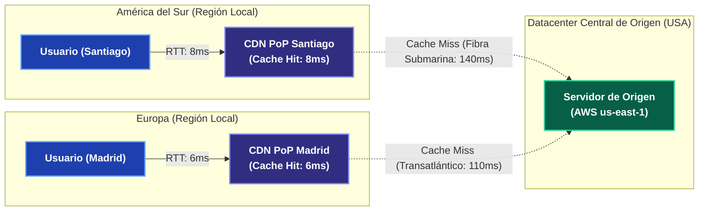
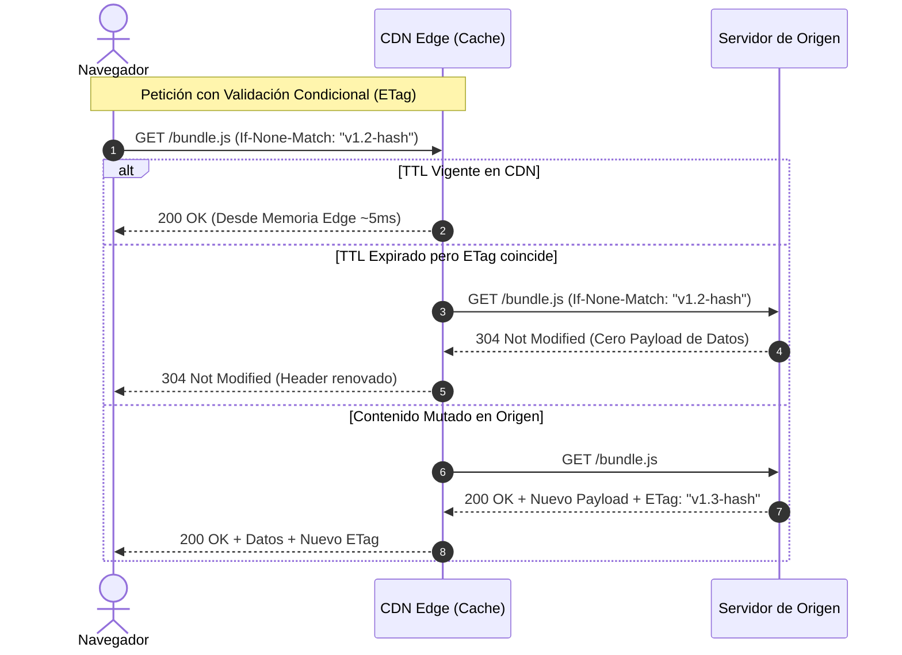

---
tags:
  - system-design
  - cdn
  - caching
  - performance
  - edge
  - fase-1
aliases:
  - CDNs y Edge Caching
  - Redes de Distribución de Contenido
modulo: "01"
orden: 2
---

# 01.2 CDNs: Redes de Distribución de Contenido (Push vs Pull, Edge Caching y Resiliencia)

> *"La forma más rápida de responder una petición no es optimizar el backend, sino responderla desde un servidor ubicado a 5 kilómetros del usuario antes de que el paquete siquiera viaje a tu datacenter."*

---

## 1. ¿Qué es una CDN y por qué es indispensable?

Una **CDN (Content Delivery Network)** es una red geográfica global de servidores proxy (**[[00_Glosario_de_Terminos#Point of Presence (PoP)|Points of Presence o PoPs]]**) distribuidos estratégicamente. Su objetivo principal es resolver la limitación física impuesta por la velocidad de la luz en la fibra óptica ($200,000 \text{ km/s}$): **a mayor distancia geográfica, mayor es el RTT (*Round-Trip Time*) y peor es el TTFB (*Time to First Byte*)**.

Una CDN moderna opera en dos dimensiones complementarias:
1. **Edge Caching (Contenido Estático y Semi-dinámico):** Almacena copias locales de assets (HTML, CSS, JS, imágenes, videos y JSONs cacheados) en la memoria RAM y discos NVMe del PoP más cercano.
2. **Edge Termination & DSA (Aceleración de Tráfico Dinámico):** Aunque una petición a una API sea 100% dinámica y no se pueda cachear (ej. `POST /v1/checkout`), el usuario negocia TCP y TLS con el PoP local (a 5-15 ms). Luego, el PoP transmite la petición al origen mediante conexiones persistentes pre-calentadas a través del *backbone* de fibra privada de la CDN.



---

## 2. Modelos de CDN: Push vs Pull (Origin Pull)

Para dominar este concepto en System Design, primero debemos responder a la pregunta fundamental: **¿Quién mueve los archivos, hacia dónde y en qué momento?**

Los términos **Push (Empujar)** y **Pull (Jalar / Extraer)** describen **el sentido del flujo y el momento en que los archivos viajan entre tu infraestructura central (el "Origen") y los servidores de la CDN (los "Edge PoPs")**.

---

### ¿Qué es exactamente cada modelo?

#### 1. Modelo Pull (Origin Pull) — *Reactivo / "Bajo Demanda"*
En el modelo **Pull**, tú **no subes nada a la CDN de antemano**. Tu servidor de origen (ej. un bucket S3, un servidor Nginx o una API) contiene todos los archivos, mientras que la CDN al inicio está completamente vacía respecto a tu contenido.

* **¿Quién hace la acción?:** La **CDN** (actuando como un proxy inteligente intermedio).
* **¿Qué acción hace?:** La CDN **"jala" (*pull*)** una copia del archivo desde tu servidor de origen **únicamente cuando un usuario final se lo pide**.
* **Mecánica paso a paso:**
  1. **Inicio en frío (*Cold Start*):** Un usuario en Tokio solicita `GET /imagenes/banner.jpg` al servidor perimetral (Edge PoP) de la CDN más cercano a él.
  2. **Cache Miss:** El PoP de Tokio busca en su memoria RAM y discos locales: ¡No lo tiene!
  3. **Origin Pull:** En ese instante, el PoP de Tokio contacta a tu servidor de origen (por ejemplo, alojado en Virginia, EE.UU.) y **jala (*pull*)** una copia del archivo a través de la red.
  4. **Entrega y Almacenamiento Local:** El PoP le entrega el archivo al usuario de Tokio y, simultáneamente, **guarda una copia local** en su caché asignándole un tiempo de vida (**TTL**, ej. 24 horas vía `Cache-Control`).
  5. **Cache Hit subsiguiente:** Si un segundo usuario en Tokio pide el mismo banner 5 minutos después, el PoP se lo entrega en 5 ms desde su memoria. Tu servidor en Virginia no recibe ninguna petición.
  6. **Desalojo:** Si pasan días y nadie más en Tokio pide ese banner, la CDN lo borra de Tokio mediante su política **LRU** (*Least Recently Used*) para liberar espacio para contenido más popular.

> 💡 **Regla Mnemotécnica Pull:** *"Si ningún usuario me lo pide, el archivo jamás viaja a la CDN. Si alguien me lo pide, voy a tu servidor, lo jalo, te lo entrego y guardo una copia por si alguien más lo quiere."*

---

#### 2. Modelo Push — *Proactivo / "Por Adelantado"*
En el modelo **Push**, tú **no esperas a que ningún usuario solicite el recurso**. Eres tú (el desarrollador, un script automatizado o un pipeline de CI/CD) quien sube activamente los archivos hacia la infraestructura de la CDN antes de que los usuarios comiencen a interactuar.

* **¿Quién hace la acción?:** **Tú o tu servidor / CI/CD** (el origen del contenido).
* **¿Qué acción hace?:** **"Empujas" (*push*)** / subes los archivos directamente al almacenamiento distribuido de la CDN (vía API, FTP, SFTP o herramientas como `rsync`).
* **Mecánica paso a paso:**
  1. **Subida proactiva:** Tu pipeline de CI/CD compila un nuevo paquete de código frontend, un video promocional pesado o un parche de videojuego de 20 GB.
  2. **Push al Edge:** El pipeline ejecuta un script que sube el archivo al storage global de la CDN, y la red de la CDN replica el archivo hacia todos sus centros de datos (PoPs) alrededor del mundo.
  3. **Zero Cold Start:** Cuando el primer usuario del planeta solicita el archivo, **el archivo ya está en el Edge local esperándolo**. El resultado es un *Cache Hit* instantáneo desde el milisegundo cero.
  4. **Aislamiento del Origen:** Tu servidor de compilación o base de datos jamás recibe peticiones de descarga de los usuarios finales; la CDN opera como el almacén primario del contenido.

> 💡 **Regla Mnemotécnica Push:** *"Tomo mis archivos y los reparto por adelantado en todos los rincones del mundo para que estén listos antes de que el primer usuario abra la aplicación."*

---

### Analogía Cotidiana Intuitiva

* **CDN Pull = Cocina de Restaurante a la Carta:**
  El chef no tiene platos cocinados enfriándose sobre la mesa. Cuando un cliente pide *"Paella marinera"*, el chef va a la despensa (origen), saca los ingredientes, cocina el plato, se lo sirve al comensal y guarda una porción extra caliente en la barra (caché) por si la mesa contigua pide paella en los siguientes 20 minutos. Si nadie más la pide, se limpia la bandeja.
* **CDN Push = Imprenta de Periódicos Matutinos:**
  La imprenta imprime 10,000 ejemplares a las 3:00 AM y los envía en camiones (*push*) a todos los quioscos de la ciudad antes de que amanezca. Cuando el primer lector llega a las 7:00 AM, el periódico ya está ahí esperándolo. ¿La desventaja? Si en un quiosco del barrio nadie compra el periódico, la imprenta pagó el papel, la tinta y el transporte inútilmente.

---

### Arquitectura Visual: Flujo de Peticiones Push vs Pull

```mermaid
flowchart TD
    subgraph PushModel["1. Modelo Push (Pre-carga Activa)"]
        Dev["CI/CD / Transcoder"]:::service -->|"Upload masivo (S3 API / rsync)"| PushStore["Almacenamiento Central CDN"]:::proxy
        PushStore -->|"Distribución proactiva"| PushEdge["Edge PoPs Globales"]:::proxy
        UserA["Usuario"]:::client -->|"Descarga inmediata (100% Hit)"| PushEdge
    end

    subgraph PullModel["2. Modelo Pull (Origin Pull Reactivo)"]
        UserB["Usuario"]:::client -->|"1. Solicita /foto.jpg"| PullEdge["Edge Server PoP"]:::proxy
        PullEdge -- "¿Existe en RAM/NVMe?" --> Decision{"¿Hit?"}:::cache
        Decision -- "Hit (90%+)" --> PullEdge
        Decision -- "Miss" --> Origin["2. Consulta Servidor Origen"]:::service
        Origin -->|"3. Devuelve Payload"| PullEdge
        PullEdge -->|"4. Guarda con TTL y entrega"| UserB
    end

    classDef client fill:#1e40af,stroke:#60a5fa,stroke-width:2px,color:#ffffff,font-weight:bold;
    classDef proxy fill:#312e81,stroke:#818cf8,stroke-width:2px,color:#ffffff,font-weight:bold;
    classDef service fill:#065f46,stroke:#34d399,stroke-width:2px,color:#ffffff,font-weight:bold;
    classDef database fill:#7c2d12,stroke:#fb923c,stroke-width:2px,color:#ffffff,font-weight:bold;
    classDef cache fill:#581c87,stroke:#c084fc,stroke-width:2px,color:#ffffff,font-weight:bold;
    classDef queue fill:#155e75,stroke:#22d3ee,stroke-width:2px,color:#ffffff,font-weight:bold;
    classDef warning fill:#881337,stroke:#f43f5e,stroke-width:2px,color:#ffffff,font-weight:bold;
    classDef highlight fill:#854d0e,stroke:#facc15,stroke-width:2px,color:#ffffff,font-weight:bold;
```



### Comparativa Exhaustiva para Entrevistas

| Dimensión Técnica | Push CDN | Pull CDN (Origin Pull) |
| :--- | :--- | :--- |
| **Flujo de Datos** | El servidor de origen "empuja" (*uploads*) proactivamente los archivos hacia la CDN antes de que alguien los pida. | La CDN descarga ("jala") el archivo desde el origen únicamente cuando un usuario local lo solicita por primera vez. |
| **Latencia del Primer Usuario** | **Óptima (0 ms penalización):** El primer usuario obtiene un *Cache Hit* garantizado. | **Penalizada (*Cold Miss*):** El primer usuario paga el RTT completo hasta el servidor origen mientras el PoP descarga y cachea el asset. |
| **Costo y Espacio de Almacenamiento** | **Alto:** Pagas por almacenar gigabytes/terabytes en la CDN que quizás nadie consulte en regiones remotas. | **Mínimo:** Solo almacena en el Edge lo que tiene demanda real; aplica políticas de desalojo (**LRU** - *Least Recently Used*) automáticamente. |
| **Invalidación / Actualizaciones** | Manual o por script: Debes subir una nueva versión o enviar órdenes de purga a la CDN. | Gobernado por cabeceras HTTP (`Cache-Control`, `TTL`, `ETag`). Se revalida automáticamente al expirar. |
| **Caso de Uso Real en la Industria** | **Netflix Open Connect (Blockbusters):** Nuevas temporadas de series masivas (ej. *Stranger Things*) se pre-cargan durante la madrugada (off-peak) en los appliances locales de los ISPs. | **E-commerce y Redes Sociales:** Catálogos de millones de productos (Amazon), avatares de usuarios, feeds públicos, APIs REST con respuestas cacheadas. |

---

## 3. Dominio de Cabeceras HTTP de Control de Caché

El Edge Caching no es magia; se rige estrictamente por cabeceras del protocolo HTTP/1.1 y HTTP/2 enviadas por el origen:

```http
HTTP/1.1 200 OK
Content-Type: application/javascript; charset=UTF-8
Cache-Control: public, max-age=31536000, s-maxage=31536000, immutable
ETag: W/"d41d8cd98f00b204e9800998ecf8427e"
Vary: Accept-Encoding
```

### 1. Directivas de Ciclo de Vida y Alcance
* **`public`:** El recurso no contiene datos personales ni sesiones; puede ser almacenado tanto por navegadores como por proxies intermediarios y CDNs.
* **`private`:** **Prohibido para la CDN.** Solo el navegador del usuario final puede guardarlo. Es obligatorio para paneles de usuario, carritos de compra o payloads con información confidencial (PII).
* **`max-age=N`:** Tiempo en segundos que el **navegador del cliente** puede reutilizar el recurso sin consultar a la red.
* **`s-maxage=N` (*Shared Max Age*):** Sobrescribe el `max-age` exclusivamente para **proxies compartidos y CDNs**. 
  - *Ejemplo Senior:* `Cache-Control: public, max-age=60, s-maxage=86400`. El navegador revalida cada minuto, pero la CDN retiene el contenido durante 24 horas, protegiendo al origen de millones de visitas.
* **`immutable`:** Le indica al navegador que el archivo **jamás cambiará** durante su TTL. Evita que el navegador envíe peticiones condicionales de validación incluso si el usuario presiona F5 (*Refresh*).

### 2. Directivas de Validación y Seguridad
* **`no-cache` (Nombre engañoso):** **Sí se almacena en caché**, pero el cliente/CDN está obligado a revalidar con el origen (`ETag` o `If-Modified-Since`) antes de servirlo. Si no cambió, el origen responde `304 Not Modified` sin payload.
* **`no-store`:** **Prohibición absoluta.** Ningún byte puede escribirse en memoria RAM ni disco. Debe solicitarse completo cada vez (ej. endpoints de pagos, tokens bancarios).
* **`stale-while-revalidate=N`:** Permite a la CDN responder de inmediato con una copia expirada (*stale*), mientras en segundo plano (*background*) lanza una petición asíncrona al origen para refrescar la caché. Elimina la latencia del *cache miss* para el usuario.
* **`stale-if-error=N`:** Si el servidor de origen colapsa (retorna 500, 502, 503), la CDN continuará sirviendo la copia obsoleta durante $N$ segundos en lugar de mostrar una pantalla de error al usuario (**Graceful Degradation**).



> [!CAUTION]- La Trampa de la Cabecera `Vary` (Cache Partitioning)
> La cabecera `Vary: Accept-Encoding, User-Agent` le indica a la CDN que debe mantener una copia de caché independiente para cada valor posible de esas cabeceras.
> - Si incluyes `User-Agent`, como existen miles de combinaciones de versiones de navegadores y dispositivos, la CDN creará miles de particiones vacías. **El Cache Hit Ratio se desplomará a menos del 10%**.
> - **Regla Senior:** En CDNs, usa `Vary: Accept-Encoding` únicamente (para diferenciar `gzip`, `brotli` o sin comprimir). Nunca hagas *Vary* por cabeceras con alta cardinalidad.

---

## 4. Patrones Avanzados de Resiliencia: Thundering Herd y Origin Shield

En sistemas con millones de usuarios concurrentes, el mayor peligro de una CDN es la caída sincronizada de la caché:

### El Problema del *Cache Stampede* (Thundering Herd)
Imagina que un asset crítico (ej. el JSON del Home feed con 50,000 QPS) expira su TTL a las `12:00:00`. A las `12:00:01`, entran 50,000 peticiones simultáneas a 100 PoPs de la CDN en todo el mundo. Si cada PoP reenvía el *miss* al origen, **50,000 consultas pesadas golpean la base de datos al mismo milisegundo**, tirando abajo los servidores de origen.

```mermaid
flowchart TD
    subgraph SinMecanismo["Peligro: Sin Request Collapsing (Colapso del Origen)"]
        U1["50,000 Usuarios"]:::client --> PoP_A["CDN PoPs"]:::proxy
        PoP_A -->|"50,000 Requests Simultáneas"| DB_Down["Servidor Origen / DB (Colapso 503)"]:::warning
    end

    subgraph ConMecanismo["Solución: Request Collapsing + Origin Shield"]
        U2["50,000 Usuarios"]:::client --> PoP_B["Edge PoPs (Santiago, Madrid, Tokio)"]:::proxy
        PoP_B -->|"Peticiones Consolidadas"| Shield["Origin Shield (PoP Centralizado en Virginia)"]:::highlight
        Shield -->|"1 ÚNICA Petición al Origen"| Origin_OK["Servidor Origen (Estable y Protegido)"]:::service
        Origin_OK -->|"Devuelve 1 vez"| Shield
        Shield -->|"Multiplica respuesta"| PoP_B
    end

    classDef client fill:#1e40af,stroke:#60a5fa,stroke-width:2px,color:#ffffff,font-weight:bold;
    classDef proxy fill:#312e81,stroke:#818cf8,stroke-width:2px,color:#ffffff,font-weight:bold;
    classDef service fill:#065f46,stroke:#34d399,stroke-width:2px,color:#ffffff,font-weight:bold;
    classDef database fill:#7c2d12,stroke:#fb923c,stroke-width:2px,color:#ffffff,font-weight:bold;
    classDef cache fill:#581c87,stroke:#c084fc,stroke-width:2px,color:#ffffff,font-weight:bold;
    classDef queue fill:#155e75,stroke:#22d3ee,stroke-width:2px,color:#ffffff,font-weight:bold;
    classDef warning fill:#881337,stroke:#f43f5e,stroke-width:2px,color:#ffffff,font-weight:bold;
    classDef highlight fill:#854d0e,stroke:#facc15,stroke-width:2px,color:#ffffff,font-weight:bold;
```



### Soluciones Arquitectónicas:
1. **Request Collapsing (Coalescing):**
   - Cuando el Edge PoP detecta que un recurso expiró y recibe 2,000 peticiones en el mismo milisegundo, **retiene 1,999 peticiones en cola** y envía **solo 1 petición** hacia el origen. Cuando el origen responde, el PoP clona la respuesta y se la entrega a las 2,000 peticiones en espera.
2. **Origin Shield (Tiered Caching):**
   - En lugar de que 300 PoPs de borde consulten directamente a tu datacenter, se coloca un PoP centralizado de gran tamaño (**Shield**) en la misma región de tu nube (ej. `us-east-1`).
   - Los 300 PoPs consultan primero al Shield. Si 20 PoPs tienen un *miss*, solo el Shield consulta 1 vez al origen. Reduce la carga del servidor de origen en un **95% adicional**.

---

## 5. Matemáticas de Capacidad, Rendimiento y ROI de una CDN

En entrevistas de arquitectura para niveles Senior/Staff, no basta con decir *"la CDN hace que la app vaya más rápido"*; debes cuantificar el impacto matemático exacto en latencia y costos.

### 1. La Curva No-Lineal del Cache Hit Ratio (CHR)
El **Cache Hit Ratio (CHR)** es el porcentaje de peticiones servidas desde el Edge sin tocar tu infraestructura:

$$\text{CHR} = \frac{\text{Hits}}{\text{Hits} + \text{Misses}}$$

La latencia media efectiva experimentada por el usuario es:

$$\text{Latencia}_{\text{Efectiva}} = (\text{CHR} \times \text{Latencia}_{\text{Edge}}) + ((1 - \text{CHR}) \times \text{Latencia}_{\text{Origen}})$$

> [!TIP]- Deducción Matemática Senior: Por qué la diferencia entre 90% y 99% es brutal
> Supón que tu aplicación recibe **1,000,000 de peticiones/minuto**.
> - **Con CHR del 90%:**
>   - Peticiones que tocan el origen: $1,000,000 \times (1 - 0.90) = \mathbf{100,000 \text{ req/min}}$.
> - **Con CHR del 99%:**
>   - Peticiones que tocan el origen: $1,000,000 \times (1 - 0.99) = \mathbf{10,000 \text{ req/min}}$.
> - *Lección Senior:* Incrementar el CHR de 90% a 99% **no reduce la carga en un 9%**, ¡**reduce el tráfico al servidor origen en un 90% (10x menos servidores necesarios)**!

---

### 2. Micro-Cálculo Mental: ROI de Egress de Datos y Ancho de Banda

> **Escenario de Entrevista:** Tu servicio de streaming/imágenes sirve **100 TB de datos al mes**.
> - Costo de salida de datos directa desde AWS S3 (*Data Transfer Out*): **$0.085 USD por GB** ($85 \text{ USD / TB}$).
> - Costo de CDN (Cloudflare / CloudFront Enterprise): **$0.02 USD por GB** ($20 \text{ USD / TB}$).
> - La CDN logra un **Cache Hit Ratio (CHR) del 95%**.
> - *Cálculo:*
>   - **Costo Sin CDN:** $100 \text{ TB} \times \$85/\text{TB} = \mathbf{\$8,500 \text{ USD/mes}}$.
>   - **Costo Con CDN:**
>     - Tráfico servido por CDN: $100 \text{ TB} \times \$20/\text{TB} = \$2,000 \text{ USD}$.
>     - Tráfico que sale del Origen hacia la CDN (5% Misses): $5 \text{ TB} \times \$85/\text{TB} = \$425 \text{ USD}$ *(nota: con acuerdos CDN-Cloud como Cloudflare Bandwidth Alliance esto suele ser $0)*.
>     - Total con CDN: $\$2,000 + \$425 = \mathbf{\$2,425 \text{ USD/mes}}$.
>   - **Ahorro Neto Directo:** $\$8,500 - \$2,425 = \mathbf{\$6,075 \text{ USD/mes}}$ (Ahorro del **71.5%** en factura de nube, además de reducir la latencia global en más del 80%).

---

## 🎯 Guion de Entrevista: Cómo defender una estrategia de CDN en 2 minutos

Si te preguntan: *"¿Cómo diseñarías la capa de entrega de contenido y CDN para nuestra plataforma global?"*, estructura tu pitch en **5 pilares senior**:

> 🗣️ **Pitch Profesional de 5 Pasos:**
> 1. **Topología de Caching (Origin Pull + Origin Shield):** *"Implementaremos un modelo Origin Pull con políticas de desalojo LRU en los PoPs perimetrales, reforzado con un **Origin Shield** en la región de nuestra VPC para que cientos de PoPs no saturen el origen ante misses simultáneos."*
> 2. **Estrategia de Invalidation (Cache Busting):** *"Para assets de frontend (JS/CSS/imágenes), usaremos **Content Hashing** en el nombre del archivo (ej. `bundle.a8f9c.js`) con `Cache-Control: public, max-age=31536000, immutable`. Esto garantiza caché de 1 año y actualizaciones instantáneas sin purgas manuales."*
> 3. **Endpoints Dinámicos y APIs:** *"Para rutas de API no cacheables, aprovechamos la CDN como **DSA (Dynamic Site Acceleration)**, logrando terminación de TLS 1.3 en el borde y multiplexación TCP sobre túneles persistentes hacia el backend."*
> 4. **Resiliencia ante Picos (Thundering Herd):** *"Habilitamos **Request Collapsing** en los PoPs y cabeceras `stale-while-revalidate` y `stale-if-error` para que, ante caídas o picos de tráfico, la CDN sirva contenido del caché mientras revalida en background."*
> 5. **Monitoreo de Métricas:** *"Mediremos continuamente el **Cache Hit Ratio (CHR)** y el **TTFB por percentil (P95/P99)** regional, vigilando que ninguna cabecera `Vary` desmedida fragmente el caché."*

---

## Preguntas Clave de Active Recall

> [!QUESTION]- Active Recall #1: En términos de arquitectura de datos y costos, ¿cuándo es estrictamente superior un modelo Push sobre un modelo Pull (Origin Pull)?
> **Respuesta:** **Push** es superior cuando: (1) Se distribuyen archivos pesados e inmutables con una demanda simultánea brutal e inmediata desde el minuto cero (ej. parches de videojuegos de 30 GB en Steam, estrenos masivos en Netflix o actualizaciones de firmware IoT), donde un modelo Pull causaría una avalancha de *Cold Misses* que destruiría el origen; y (2) El catálogo de archivos es acotado y predecible, haciendo rentable pagar almacenamiento por adelantado en todos los PoPs globales. Por el contrario, para el 95% de la web (e-commerce, redes sociales, catálogos extensos, APIs), **Pull** es el estándar indiscutible porque solo almacena lo que la gente realmente pide y desaloja lo inactivo mediante LRU.

---

> [!QUESTION]- Active Recall #2: ¿Por qué `Cache-Control: no-cache` no significa "no almacenar"?
> **Respuesta:** Porque el nombre es engañoso por motivos históricos. `no-cache` **sí almacena el recurso en disco/RAM**, pero exige que el cliente revalide condicionalmente con el servidor (`ETag` $\rightarrow$ `304 Not Modified`) antes de usarlo. Si realmente deseas prohibir almacenar un archivo, la directiva correcta es **`no-store`**.

---

> [!QUESTION]- Active Recall #3: ¿Cómo resuelves el problema de invalidación en despliegues sin purgar la CDN?
> **Respuesta:** Mediante **Cache Busting / Content Hashing**. Nombra tus assets estáticos con el hash criptográfico de su contenido (ej. `main.5f8a2b.js`). Sirve el archivo `index.html` con `Cache-Control: no-cache` (siempre revalida si hay nuevo HTML), mientras que los assets hasheados se sirven con `max-age=31536000, immutable`. Cuando compilas un nuevo deploy, los nombres de archivo cambian, eliminando por completo el riesgo de servir código viejo.

---

> [!NOTE]- Desafío Feynman: La Analogía de la Distribución de Prensa
> - **Push CDN:** Es la imprenta central enviando 1,000 ejemplares de periódicos a cada quiosco de cada pueblo a las 5:00 AM, aunque en algunos pueblos solo vivan 2 personas y sobren 998 diarios.
> - **Pull CDN:** Es un quiosco moderno con impresora digital: no tiene periódicos amontonados; cuando un cliente pide un diario extranjero, lo descarga de la central, lo imprime, se lo entrega y guarda una copia por si otro vecino pide el mismo diario esa tarde.

---

## Conceptos Relacionados
- [[01.0_El_Viaje_Completo_de_una_Peticion_HTTP|01.0 El Viaje Completo de una Petición HTTP (Request Lifecycle)]]
- [[01.1_DNS_Resolucion_de_Nombres_y_Anycast|01.1 DNS: Resolución Jerárquica y Anycast]]
- [[01.3_Balanceadores_de_Carga_L4_vs_L7_Active-Active_vs_Active-Passive|01.3 Balanceadores de Carga L4 vs L7]]
- [[04.0_Estrategias_de_Cache_Write-Through_Write-Back_Refresh-Ahead|04.0 Estrategias de Caché: Write-Through, Write-Back, Refresh-Ahead]]
- [[08.0_Latencias_que_Todo_Programador_Debe_Saber|08.0 Latencias que Todo Programador Debe Saber]]
- [[00_MOC_System_Design_Mastery|Volver al Índice Maestro (MOC)]]

