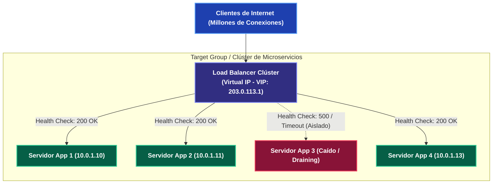
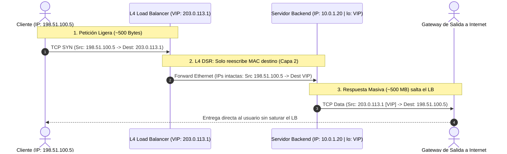
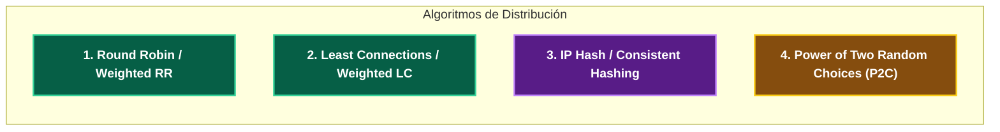
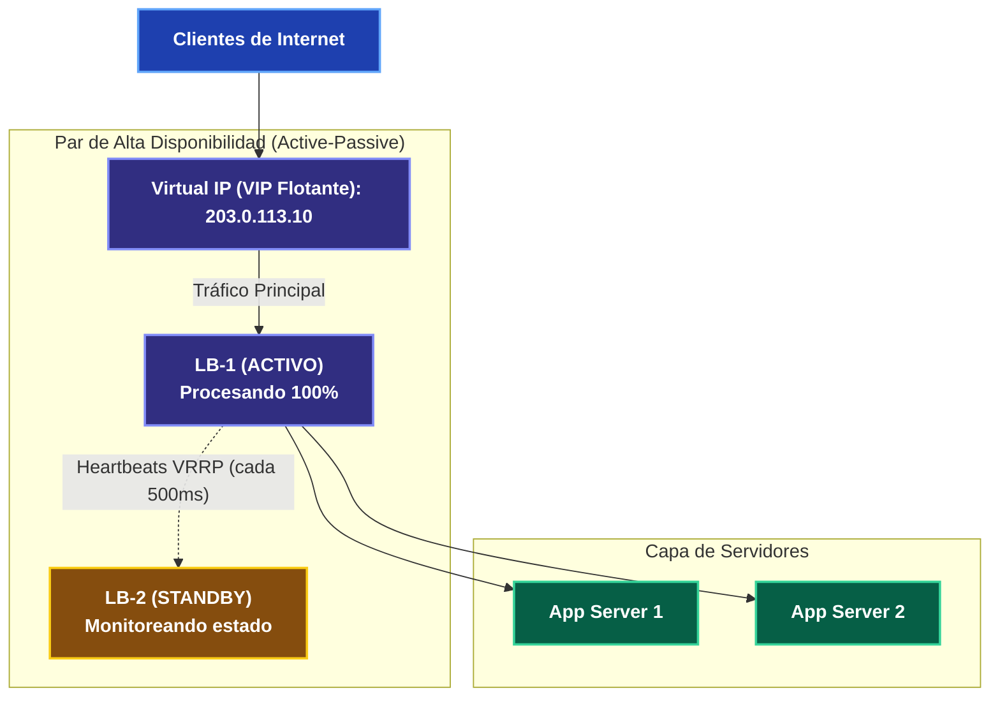
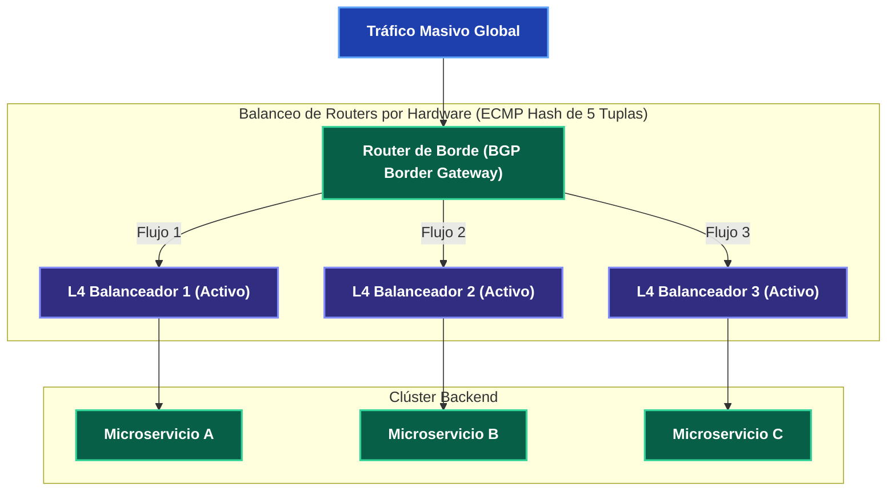

---
tags:
  - system-design
  - networking
  - load-balancing
  - high-availability
  - fase-1
aliases:
  - Balanceadores de Carga L4 vs L7
  - Load Balancers y Alta Disponibilidad
modulo: "01"
orden: 3
---

# 01.3 Balanceadores de Carga: L4 vs L7, Algoritmos, DSR y Alta Disponibilidad

> *"Un balanceador de carga no solo reparte conexiones: es el guardián de la disponibilidad, el árbitro del aislamiento de fallos y el componente que traduce el caos de millones de clientes concurrentes en flujos predecibles hacia tus servicios."*

---

## 1. Fundamentos y Topología de Balanceo

Un **[[00_Glosario_de_Terminos#Load Balancer (LB) / Balanceador de Carga|Load Balancer (LB)]]** actúa como la puerta de entrada (*reverse proxy*) que recibe el tráfico de los clientes y lo distribuye entre un conjunto dinámico de servidores backend (**Target Group / Backend Pool**). 

Su propósito arquitectónico abarca cuatro responsabilidades críticas:
1. **Escalabilidad Horizontal:** Añadir o remover instancias de servidores sin cambiar la IP pública expuesta a los usuarios.
2. **Aislamiento de Fallos (Health Checking):** Desviar automáticamente el tráfico lejos de nodos caídos o degradados antes de que los clientes experimenten errores 5xx.
3. **Optimización de Recursos:** Evitar que peticiones complejas saturen un nodo mientras otros servidores permanecen ociosos.
4. **Seguridad y Abstracción:** Ocultar las direcciones IP privadas internas de los servidores de backend ante Internet.

---

## 2. Capa 4 (Transporte) vs Capa 7 (Aplicación): La Disyuntiva Fundamental

La distinción entre L4 y L7 se basa en **en qué capa del modelo OSI el balanceador toma la decisión de enrutamiento**:

```mermaid
flowchart TD
    subgraph L4_Flow["1. Balanceo Capa 4 (Transporte - TCP/UDP)"]
        P4["Paquete TCP (IP:Puerto)"]:::client -->|"Solo inspecciona headers TCP (SYN)"| LB4["L4 Load Balancer (AWS NLB / IPVS)"]:::proxy
        LB4 -->|"Modifica IP/MAC (Zero Payload Inspection)"| S4["Servidor Backend (Termina TLS y HTTP)"]:::service
    end

    subgraph L7_Flow["2. Balanceo Capa 7 (Aplicación - HTTP/HTTPS/gRPC)"]
        P7["Petición HTTPS Completa"]:::client -->|"Termina TLS + Lee URI, Cookies, Headers"| LB7["L7 Load Balancer (Envoy / Kong / ALB)"]:::proxy
        LB7 -->|"/v1/auth"| S_Auth["Auth Microservice"]:::service
        LB7 -->|"/v1/stream"| S_Stream["Streaming Service"]:::queue
        LB7 -->|"/v1/checkout"| S_Pay["Payment Service"]:::highlight
    end

    classDef client fill:#1e40af,stroke:#60a5fa,stroke-width:2px,color:#ffffff,font-weight:bold;
    classDef proxy fill:#312e81,stroke:#818cf8,stroke-width:2px,color:#ffffff,font-weight:bold;
    classDef service fill:#065f46,stroke:#34d399,stroke-width:2px,color:#ffffff,font-weight:bold;
    classDef database fill:#7c2d12,stroke:#fb923c,stroke-width:2px,color:#ffffff,font-weight:bold;
    classDef cache fill:#581c87,stroke:#c084fc,stroke-width:2px,color:#ffffff,font-weight:bold;
    classDef queue fill:#155e75,stroke:#22d3ee,stroke-width:2px,color:#ffffff,font-weight:bold;
    classDef warning fill:#881337,stroke:#f43f5e,stroke-width:2px,color:#ffffff,font-weight:bold;
    classDef highlight fill:#854d0e,stroke:#facc15,stroke-width:2px,color:#ffffff,font-weight:bold;
```

### El Detalle Crítico: ¿Una o Dos Conexiones TCP?
- **En L4:** Existe una **única conexión [[00_Glosario_de_Terminos#TCP (Transmission Control Protocol)|TCP]] conceptual** entre el cliente y el backend (el LB simplemente altera direcciones mediante [[00_Glosario_de_Terminos#Network Address Translation (NAT)|NAT]] o reescribe la dirección [[00_Glosario_de_Terminos#MAC Address (Media Access Control / Dirección MAC)|MAC]] de destino). El LB no sabe si el paquete transporta un video, un HTML o un binario.
- **En L7:** Hay **dos conexiones TCP completamente independientes**:
  1. Conexión 1: `Cliente <---> L7 LB` (se establece TCP, se negocia [[00_Glosario_de_Terminos#TLS (Transport Layer Security)|TLS]] y se recibe la petición HTTP).
  2. Conexión 2: `L7 LB <---> Servidor Backend` (el LB abre una nueva conexión interna o reutiliza una de su *Connection Pool* para enviar el HTTP parseado).
  - *Impacto:* Esta duplicación de sockets y descifrado criptográfico explica por qué L7 consume entre **5x y 10x más CPU y memoria RAM** que un balanceador L4.

---

### Comparativa Exhaustiva para Entrevistas de Arquitectura

| Dimensión Técnica | Capa 4 (L4 - NLB / IPVS / Katran) | Capa 7 (L7 - ALB / Envoy / NGINX / HAProxy) |
| :--- | :--- | :--- |
| **Criterio de Decisión** | Tupla de 5 valores: `IP Origen`, `Puerto Origen`, `IP Destino`, `Puerto Destino`, `Protocolo`. | Cabeceras HTTP, Cookies, Path de la URL (`/v1/users`), Headers de Auth, contenido JSON/gRPC. |
| **Terminación TLS** | Opcional / Passthrough (el backend descifra) o terminación ligera en hardware. | **Obligatoria** en el LB si se requiere inspeccionar cookies, paths o aplicar WAF. |
| **Throughput / Rendimiento** | **Masivo:** Millones de paquetes/segundo (PPS) a velocidad de cable con latencia sub-milisegundo (<1 ms). | **Moderado/Alto:** Decenas de miles de req/s por núcleo de CPU (penalizado por descifrado y parsing). |
| **Capacidades de Ruteo** | Ruteo estático de puertos (ej. puerto 443 al clúster web, puerto 5432 al clúster DB). | Ruteo por ruta, despliegues Canary (90% v1, 10% v2), A/B Testing, Rate Limiting granular. |
| **Soporte de Direct Server Return (DSR)** | **Sí (Nativo):** La respuesta vuelve directo del backend al cliente. | **No:** Toda la respuesta debe atravesar de vuelta el proxy L7. |
| **Tecnologías Representativas** | AWS NLB, Linux IPVS, Katran (Meta), Maglev (Google). | AWS ALB, Envoy Proxy, Kong Gateway, Traefik, NGINX. |

---

## 3. Direct Server Return (DSR): La Joya de la Optimización L4

En arquitecturas de ultra-alto rendimiento (Netflix, YouTube, plataformas de descarga masiva), el patrón estándar de balanceo proxy presenta una **asimetría brutal de tráfico**:

$$\text{Tamaño de la Petición HTTP (GET)} \approx 500 \text{ bytes} \quad \longleftrightarrow \quad \text{Tamaño de la Respuesta (Video/Blob)} \approx 500 \text{ MB} \quad (1 : 1,000,000)$$

Si todas las respuestas pasan a través del balanceador, el ancho de banda de salida (*Egress*) del LB se convierte en el cuello de botella absoluto del sistema.

### ¿Cómo funciona DSR?
1. El cliente envía la petición a la **Virtual IP (VIP)** del balanceador.
2. El balanceador L4 **NO modifica la IP de destino** en el paquete (la IP sigue siendo la VIP). Solo modifica la **dirección MAC de destino** a nivel de enlace de datos (Capa 2 Ethernet) para dirigir el paquete al servidor backend elegido.
3. Los servidores backend tienen configurada la VIP en una **interfaz virtual de loopback silenciosa (`lo:0`)** (no anuncian ARP para no competir con el LB).
4. El servidor procesa el paquete y **responde directamente al cliente a través de su propio gateway de Internet**, con IP Origen = VIP.
5. **El balanceador de carga jamás ve el payload de respuesta**, multiplicando la capacidad total de la red por 50x.

---

## 4. Algoritmos de Distribución de Carga: De Básico a Estado del Arte

No todos los algoritmos son aptos para cualquier carga de trabajo. La elección incorrecta puede provocar el temido efecto **"Convoy"** (un servidor recibe peticiones pesadas y colapsa):

1. **Round Robin (y Weighted Round Robin):**
   - Distribuye secuencialmente ($S_1 \rightarrow S_2 \rightarrow S_3 \rightarrow S_1$). En su variante con pesos (*weighted*), servidores con el doble de CPU/RAM reciben el doble de turnos.
   - *Cuándo usarlo:* Peticiones homogéneas y rápidas (ej. servir assets estáticos o endpoints CRUD idénticos).
   - *Fallo común:* Si una petición tarda 10 segundos en procesar (un reporte SQL) y otra 2 milisegundos, los servidores asignados a peticiones lentas se saturarán rápidamente.

2. **Least Connections (y Weighted Least Connections):**
   - Asigna la nueva conexión al nodo que actualmente tenga el **menor número de conexiones concurrentes activas**.
   - *Cuándo usarlo:* Conexiones de larga duración como **WebSockets**, streaming multimedia o consultas transaccionales con latencias impredecibles.

3. **Consistent Hashing (IP / Header Hash):**
   - Mapea un identificador (`Client-IP`, `User-ID` o cabecera `Authorization`) a un anillo de hashing consistente.
   - *Ventaja:* Maximiza el *cache hit ratio* en memoria del backend (las peticiones del mismo usuario siempre tocan el mismo nodo).
   - *Peligro de Entrevista:* Si 10,000 empleados de una empresa salen por un único proxy NAT corporativo con la misma IP pública, un solo servidor backend recibirá el 100% de ese tráfico.

4. **Power of Two Random Choices (P2C / "Pick Two"):**
   - *El estándar moderno en Envoy, Twitter y Netflix:* En lugar de revisar todos los servidores (lo que genera contención en sistemas con miles de nodos), el balanceador **elige 2 nodos al azar** y envía la petición al que tenga menos conexiones activas (o menor latencia reciente).
   - *Fundamento Matemático:* Elimina el comportamiento de estampida (*herd behavior*) del Least Connections puro, logrando una distribución exponencialmente más equilibrada con un costo computacional $O(1)$.

---

## 5. Alta Disponibilidad del Balanceador: ¿Quién balancea al balanceador?

Si tienes un único balanceador de carga, has creado el peor antipatrón de arquitectura: un **Punto Único de Fallo (SPOF - Single Point of Failure)**.

### A. Modelo Active-Passive (VRRP + Floating Virtual IP)
- Dos balanceadores comparten una **IP Virtual (VIP)** mediante protocolos de redundancia como **VRRP** (*Keepalived*).
- El nodo **Activo** procesa el 100% del tráfico y emite paquetes de latido (*heartbeats*) continuos hacia el **Pasivo**.
- Si el Activo no envía latido durante 1 segundo, el Pasivo toma la VIP mediante un **Gratuitous ARP** y asume el tráfico.

> [!WARNING]- El Peligro del Split-Brain en Active-Passive
> Si el enlace de red entre LB-1 y LB-2 se desconecta pero ambos siguen vivos e internet les llega, **ambos creerán que el otro murió y reclamarán la misma VIP simultáneamente**. El tráfico colisionará aleatoriamente en los switches.
> - **Solución Senior:** Usar un tercer nodo como *Quorum / Fencing Device* (STONITH - *Shoot The Other Node In The Head*) o migrar a una arquitectura Active-Active.

---

### B. Modelo Active-Active (BGP Anycast + ECMP)
El estándar de los gigantes tecnológicos (Google Maglev, Cloudflare, Meta Katran):

1. Múltiples balanceadores independientes tienen configurada la **misma dirección IP pública**.
2. Todos anuncian esta IP mediante el protocolo **BGP** al router de borde del Datacenter.
3. El router usa **ECMP (Equal-Cost Multi-Path)** para calcular un hash de 5 tuplas de cada conexión entrante y repartir el tráfico entre todos los balanceadores activos a la vez.
4. **Escalado Horizontal Ilimitado:** Si se saturan los balanceadores, simplemente se encienden 4 nodos más y BGP comienza a enviarles tráfico sin tiempo de inactividad.

---

## 6. Matemáticas de Capacidad e Ingeniería de Memoria para LBs

En entrevistas de diseño, la capacidad de un Load Balancer no se mide en "número de servidores", sino en **Conexiones Concurrentes**, **PPS (Packets Per Second)** y **Throughput de Red**.

### 1. Dimensionamiento de Memoria RAM para Conexiones L7
Cada conexión activa en un balanceador L7 (como Envoy, NGINX o HAProxy) mantiene sockets en el kernel Linux con buffers de recepción (`rmem`) y transmisión (`wmem`), más las estructuras de datos TLS y HTTP:

$$\text{Memoria por Conexión} \approx 64 \text{ KB a } 128 \text{ KB}$$

> [!TIP]- Micro-Cálculo Mental: Memoria para WebSockets Masivos
> **Problema de Entrevista:** Tienes que sostener **1,000,000 de conexiones WebSockets concurrentes** en una capa de balanceadores L7. ¿Cuánta memoria RAM requiere tu clúster de balanceadores solo para sostener los sockets abiertos?
> - **Cálculo:**
>   $$\text{RAM Total} = 1,000,000 \times 128 \text{ KB} = 128,000,000 \text{ KB} \approx \mathbf{128 \text{ GB de RAM}}$$
> - **Diseño Senior:** En lugar de poner 1 servidor gigante de 128 GB (SPOF), diseñamos un grupo de **4 instancias de 32 GB** o **8 instancias de 16 GB** detrás de un balanceador L4 Anycast.

---

### 2. Paquetes Por Segundo (PPS) vs Ancho de Banda (BPS) en L4
Un error de principiante es calcular solo los Gigabits por segundo. Los balanceadores de Capa 4 suelen colapsar primero por la **tasa de interrupciones de la CPU para procesar paquetes (PPS)** que por el ancho de banda total:

$$\text{PPS} = \frac{\text{Ancho de Banda Total (Bits/s)}}{\text{Tamaño Medio del Paquete (Bits)}}$$

Para paquetes pequeños de control TCP (64 bytes = 512 bits):
- $10 \text{ Gbps} = \frac{10 \times 10^9 \text{ bits/s}}{512 \text{ bits/paquete}} \approx \mathbf{19.5 \text{ Millones de PPS}}$.
- Manejar 19.5M de PPS en Linux estándar colapsa el stack de red por cambios de contexto (*Context Switches*).
- *Solución de Ingeniero Staff:* Se utiliza **Kernel Bypass** con **DPDK (Data Plane Development Kit)** o **eBPF (Extended Berkeley Packet Filter)** como hace Meta con *Katran*, procesando los paquetes directamente en el espacio de usuario sin interrupciones del kernel.

---

## 🎯 Guion de Entrevista: Cómo defender una arquitectura de Load Balancing en 2 minutos

Si un entrevistador te pide: *"Diseña la capa de balanceo de carga para un sistema que recibe 500,000 peticiones por segundo y millones de conexiones"*, estructura tu respuesta en **5 hitos técnicos**:

> 🗣️ **Pitch Profesional de 5 Pasos:**
> 1. **Arquitectura en Dos Capas (L4 + L7):** *"No usaremos un solo tipo de balanceador. En el borde colocaremos una capa **L4 (tipo AWS NLB / IPVS)** para absorber millones de PPS a velocidad de cable, y detrás una capa **L7 (Envoy / ALB)** para inspección HTTP, validación de tokens y ruteo por path."*
> 2. **Técnica de Optimización de Retorno (DSR):** *"Para tráfico con alta asimetría de descarga (como multimedia o payloads pesados), configuraremos **Direct Server Return (DSR)** en la capa L4 para que los servidores de backend respondan directo a internet sin saturar el balanceador."*
> 3. **Algoritmo de Enrutamiento Inteligente:** *"Evitaremos Round Robin simple. Para tráfico HTTP general usaremos **Power of Two Random Choices (P2C)** con menor latencia reciente para prevenir estampidas, y **Consistent Hashing** solo donde la afinidad de sesión en memoria sea estrictamente necesaria."*
> 4. **Alta Disponibilidad sin SPOF:** *"En lugar de un par Activo-Pasivo vulnerable a Split-Brain, desplegaremos la capa L4 en **Active-Active mediante BGP Anycast y routers con ECMP**, permitiendo escalado horizontal simplemente añadiendo nuevas instancias."*
> 5. **Health Checks Compuestos:** *"Implementaremos health checks pasivos (aislamiento ante 3 errores 5xx seguidos en tráfico real) combinados con un endpoint sintético `/healthz` activo que verifique dependencias críticas (Redis/DB) antes de considerar un nodo sano."*

---

## Preguntas Clave de Active Recall

> [!QUESTION]- Active Recall #1: ¿Por qué no debemos usar Sticky Sessions basadas en cookies en sistemas modernos?
> **Respuesta:** Porque rompen el principio de **Statelessness** (servidores sin estado). Si un servidor backend colapsa o se reinicia durante un despliegue, todos los usuarios asignados a él pierden su sesión. Además, generan sobrecarga asimétrica (*hotspots*). La solución correcta es guardar las sesiones en un almacén en memoria distribuido (**Redis Cluster**) o usar tokens criptográficos auto-contenidos (**JWTs**).

---

> [!QUESTION]- Active Recall #2: ¿Cuál es la diferencia entre Health Checks Activos y Pasivos?
> **Respuesta:**
> - **Activos:** El balanceador envía peticiones sintéticas periódicas (ej. `GET /healthz` cada 5 segundos) a los backends. Si fallan 3 seguidas, saca el nodo del pool.
> - **Pasivos (Outlier Detection):** El balanceador monitorea el tráfico real de los usuarios. Si un servidor backend responde con 5xx o timeout a 5 clientes consecutivos, lo aísla inmediatamente sin esperar al ciclo del health check sintético.

---

> [!NOTE]- Desafío Feynman: La Analogía del Aeropuerto
> - **L4 Load Balancer:** Es el controlador de tráfico de la torre de control que ve el avión en el radar (número de vuelo y aerolínea) y le asigna una pista de aterrizaje libre en 2 segundos sin saber qué llevan los pasajeros adentro.
> - **L7 Load Balancer:** Es el agente de aduanas que abre cada maleta, revisa pasaportes, verifica visas, y según el tipo de equipaje, envía al pasajero a la fila de conexión, a revisión especial o al área de salida.

---

## Conceptos Relacionados
- [[01.0_El_Viaje_Completo_de_una_Peticion_HTTP|01.0 El Viaje Completo de una Petición HTTP (Request Lifecycle)]]
- [[01.2_CDNs_Push_vs_Pull_y_Edge_Caching|01.2 CDNs: Push vs Pull y Edge Caching]]
- [[01.4_Reverse_Proxy_vs_Forward_Proxy_vs_API_Gateway|01.4 Reverse Proxy vs Forward Proxy vs API Gateway]]
- [[01.5_Escalado_Vertical_vs_Horizontal|01.5 Escalado Vertical vs Horizontal]]
- [[04.2_Consistent_Hashing_con_Nodos_Virtuales|04.2 Consistent Hashing con Nodos Virtuales]]
- [[08.0_Latencias_que_Todo_Programador_Debe_Saber|08.0 Latencias que Todo Programador Debe Saber]]
- [[00_MOC_System_Design_Mastery|Volver al Índice Maestro (MOC)]]

