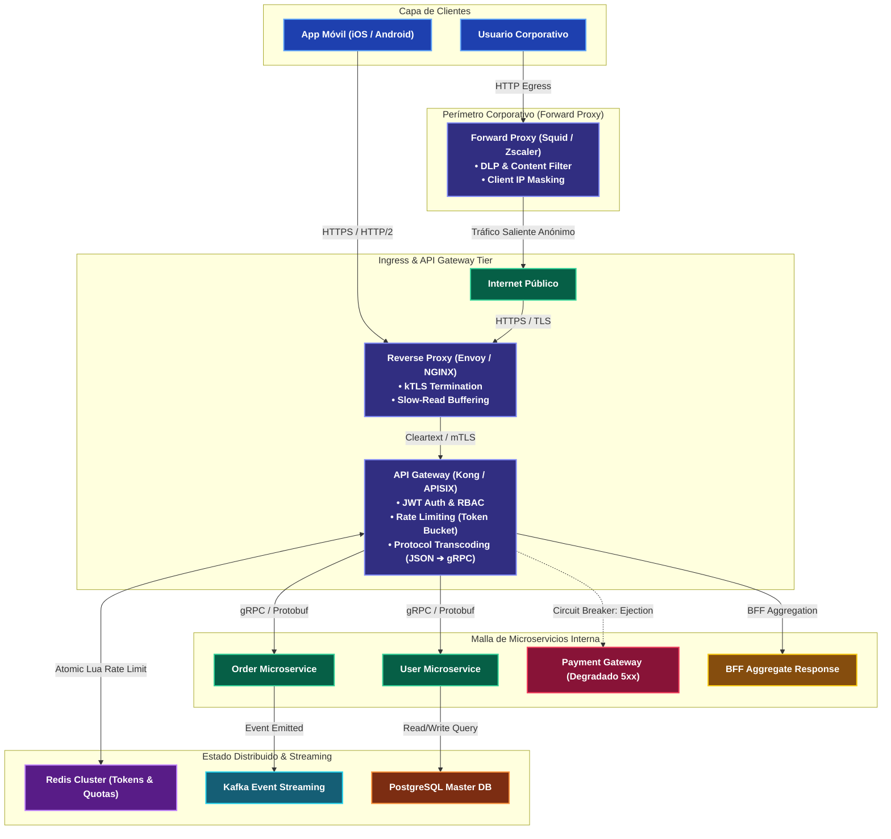
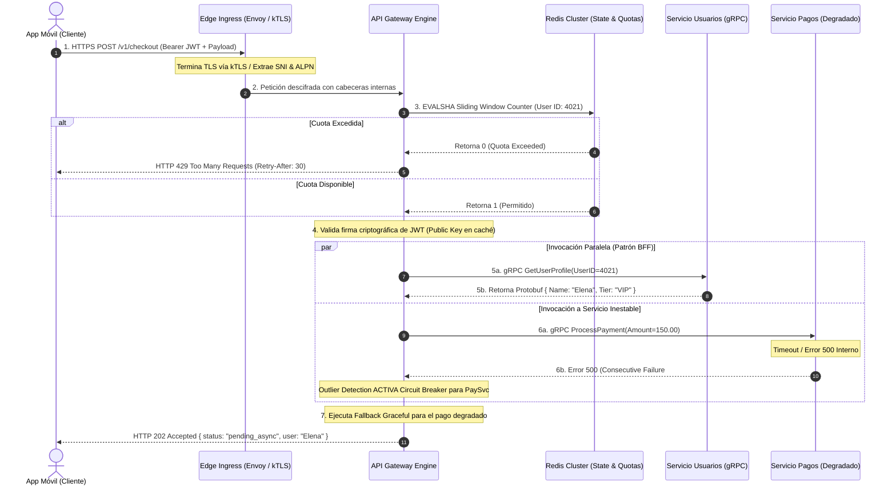

---
tags:
  - system-design
  - networking
  - proxy
  - api-gateway
  - architecture
  - fase-1
aliases:
  - Reverse Proxy vs Forward Proxy vs API Gateway
  - Proxies y Gateways
modulo: "01"
orden: 4
---

# 01.4 Reverse Proxy vs Forward Proxy vs API Gateway: Arquitectura, Enrutamiento y Control de Tráfico

> *"Un proxy actúa como intermediario delegado: un Forward Proxy enmascara y gobierna a los clientes; un Reverse Proxy blinda y optimiza a los servidores; y un API Gateway actúa como el director de orquesta que traduce protocolos, gobierna cuotas y desacopla la topología interna de microservicios ante el mundo exterior."*

---

## 1. Taxonomía y Arquitectura Comparativa

En sistemas distribuidos de alta escala, los intermediarios gestionan el flujo de tráfico como puntos de control, aislamiento y aceleración. La distinción entre un **Forward Proxy**, un **Reverse Proxy** y un **API Gateway** radica en a qué entidad representan, su posición topológica y su grado de conocimiento de la semántica de negocio:

1. **Forward Proxy (Proxy de Reenvío / Egress):**
   - **Representación:** Actúa exclusivamente en nombre del **cliente** (origen).
   - **Ubicación:** Perímetro de salida de la red del cliente (red corporativa, VPN, campus).
   - **Propósito:** Filtrado de tráfico saliente (*egress inspection*), prevención de fuga de datos (DLP), cumplimiento normativo, evasión de restricciones geográficas y caché perimetral de navegación.
   - **Visibilidad IP:** Oculta las IPs y la topología interna de los clientes ante los servidores de destino en Internet público.

2. **Reverse Proxy (Proxy Inverso / Ingress):**
   - **Representación:** Actúa en nombre del **servidor** (destino).
   - **Ubicación:** Borde perimetral de la infraestructura de backend (*Edge / Ingress*).
   - **Propósito:** Terminación TLS/SSL, compresión de payloads (`gzip`, `brotli`), balanceo de carga L7, absorción de clientes lentos mediante buffers de kernel y protección perimetral anti-DDoS.
   - **Visibilidad IP:** Oculta las direcciones IP privadas, puertos y topología de servidores backend ante los clientes externos.

3. **API Gateway (Pasarela de Aplicación y Orquestación):**
   - **Representación:** Actúa como la fachada unificada (*Unified Façade*) del **ecosistema de microservicios**.
   - **Ubicación:** Entre los clientes externos (móviles, SPAs, terceros) y los microservicios internos.
   - **Propósito:** Centraliza preocupaciones transversales (*cross-cutting concerns*): autenticación/autorización criptográfica (JWT/OAuth2), rate limiting distribuido con Redis, traducción de protocolos (REST a gRPC), agregación de respuestas (patrón BFF), circuit breaking y telemetría distribuida (W3C TraceContext).
   - **Conocimiento de Negocio:** Posee conocimiento profundo de contratos de API, schemas JSON/Protobuf, cuotas por tenant y modelos de dominio.



---

### Matriz Comparativa de Capacidades

| Dimensión Técnica | Forward Proxy | Reverse Proxy | API Gateway |
| :--- | :--- | :--- | :--- |
| **Entidad Protegida** | **Cliente** (privacidad, auditoría). | **Servidores Backend** (topología). | **Microservicios** (gobernanza y contratos). |
| **Punto de Inserción** | Borde de salida de red cliente (Egress). | Perímetro de infraestructura (Ingress). | Borde de aplicación frente a la malla interna. |
| **Capa OSI** | Capa 4 (TCP `CONNECT`) y Capa 7. | Capa 7 (HTTP/HTTPS, HTTP/2, WebSocket). | Capa 7 rica (HTTP, gRPC, GraphQL, WebSockets). |
| **Terminación TLS** | Opcional (SSL Intercept con CA local). | **Crítica** (TLS Offloading perimetral). | **Crítica** (Edge TLS + inyección de mTLS interno). |
| **Semántica de Negocio** | Nula (flujos de bytes y dominios). | Mínima (reglas de path, extensiones). | **Total** (Schemas JSON/Protobuf, Claims JWT, RBAC). |
| **Manejo de Protocolos** | Reenvío transparente o HTTP proxying. | Reenvío HTTP/1.1 y HTTP/2 hacia backends. | Transcodificación profunda (gRPC-JSON transcoder). |
| **Tecnologías Típicas** | Squid, Zscaler, Blue Coat, Charles. | NGINX, HAProxy, Caddy, Apache HTTP. | Kong, Apache APISIX, Envoy, KrakenD, AWS API GW. |

---

## 2. Multiplexación de I/O a Bajo Nivel y la Arquitectura C10K a C10M

La capacidad de un Reverse Proxy o API Gateway para sostener cientos de miles de conexiones concurrentes depende del modelo de I/O implementado en su arquitectura:

### El Colapso del Modelo Thread-per-Connection (Apache Prefork)
En arquitecturas basadas en procesos o hilos dedicados (como Apache HTTP Server con el MPM `prefork`), cada conexión TCP entrante es asignada a un hilo del sistema operativo:
- **Sobrecarga de Memoria:** Cada hilo requiere su propio *stack space* en el kernel (entre 2 MB y 8 MB en Linux). Gestionar 50,000 conexiones concurrentes requeriría entre $100\text{ GB}$ y $400\text{ GB}$ de RAM únicamente para mantener las pilas de ejecución.
- **Degradación por Context Switching:** Cuando decenas de miles de hilos compiten por los núcleos de CPU, el despachador del kernel (*kernel scheduler*) dedica la mayoría de ciclos a conmutar el contexto (`sched_switch`), invalidando las cachés L1/L2/L3 y desplomando el throughput útil.

### La Revolución No Bloqueante: Event-Driven Asynchronous I/O (`epoll` / `kqueue`)
Servidores modernos como **NGINX** y **Envoy** resuelven el problema del C10K implementando bucles de eventos no bloqueantes (*event loops*) sobre primitivas de multiplexación escalable del kernel: `epoll` en Linux y `kqueue` en FreeBSD/macOS:
1. **Primitivas de Kernel:** Con `epoll_create1`, `epoll_ctl` (registrando sockets en modo `O_NONBLOCK` para lectura `EPOLLIN` o escritura `EPOLLOUT`) y `epoll_wait`, el hilo del worker duerme hasta que uno o más descriptores señalan actividad de red, ejecutando la notificación en complejidad $\mathcal{O}(1)$ en lugar de la búsqueda lineal $\mathcal{O}(N)$ de `select`.
2. **Edge-Triggered (`EPOLLET`) vs Level-Triggered:** NGINX y Envoy operan con notificaciones de flanco (*edge-triggered*), donde el kernel notifica al proceso solo cuando ocurre un cambio de estado en el socket, requiriendo que la aplicación drene completamente el búfer hasta recibir `EAGAIN` o `EWOULDBLOCK`.
3. **Alineación de Hilos a Hardware:** NGINX adopta una arquitectura *Master-Worker* donde cada worker es mono-hilo y se fija a un núcleo de CPU (`worker_cpu_affinity`), eliminando *context switches* entre cores. Envoy implementa un modelo multi-hilo con un bucle de eventos independiente por núcleo mediante `libevent`.

### La Frontera C10M: Kernel Bypass con DPDK y eBPF/XDP
Para alcanzar decenas de millones de conexiones por segundo (C10M), la propia pila TCP/IP del kernel se convierte en cuello de botella (asignación de `sk_buff` e interrupciones de hardware). Tecnologías perimetrales de vanguardia utilizan **Kernel Bypass**:
- **DPDK (Data Plane Development Kit):** Asigna controladores de red en espacio de usuario, leyendo directamente los descriptores DMA de la NIC mediante *polling* sin interrupciones de kernel.
- **eBPF y XDP (eXpress Data Path):** Ejecutan bytecode verificado directamente en el driver de la NIC, descartando o enrutando paquetes L4 antes de que el kernel asigne memoria de red.

---

## 3. Kernel Buffering, Streaming y Propagación de Backpressure

El manejo de buffers en un Reverse Proxy determina la protección contra clientes lentos y la capacidad de transferir flujos de datos masivos en tiempo real:

### Disyuntiva Crítica: `proxy_buffering on` vs `proxy_buffering off`

1. **`proxy_buffering on` (Protección contra Slow Clients):**
   - **Mecánica:** El Reverse Proxy lee la respuesta del backend tan rápido como la red interna lo permita, acumulándola en buffers en memoria (`proxy_buffers 16 64k`). Una vez recibida la respuesta completa, el worker del backend se libera inmediatamente para atender nuevas peticiones.
   - **Desbordamiento a Disco (*Disk Temp Spill*):** Si el payload excede la memoria RAM asignada (`proxy_buffer_size` + `proxy_buffers`), NGINX escribe el excedente en archivos temporales en disco (`proxy_temp_path`). En discos lentos (ej. EBS con IOPS bajas), esto genera picos de I/O wait.
   - **Caso de Uso:** APIs REST tradicionales, generación de reportes y descarga de archivos estáticos.

2. **`proxy_buffering off` (Streaming en Tiempo Real):**
   - **Mecánica:** El proxy transmite cada fragmento de datos al cliente de forma síncrona según se recibe del backend.
   - **Riesgo:** Si el cliente final se encuentra en una red celular lenta (ej. 3G a 50 KB/s), el socket downstream se satura. El servidor backend queda bloqueado esperando que el cliente consuma datos, reteniendo conexiones de base de datos y memoria de aplicación abierta.
   - **Caso de Uso Indispensable:** Server-Sent Events (SSE), streaming de tokens en LLMs (OpenAI/Anthropic APIs), WebSockets y telemetría en vivo.

### Propagación de Contrapresión (Backpressure) en Sockets TCP
Cuando un cliente downstream deja de leer del socket, su búfer de recepción TCP (`SO_RCVBUF`) se llena. La pila TCP del cliente envía un ACK con un **Receive Window (`WIN=0`)** (*Zero Window Advertisement*). El proxy detecta que su socket de salida (`SO_SNDBUF`) está lleno y suspende las lecturas del socket upstream enlazado al backend. Esto colapsa la ventana TCP del backend, pausando la generación de datos en la aplicación origen sin pérdida de paquetes ni desbordamiento de RAM.

---

## 4. Terminación de TLS, Aceleración Criptográfica y kTLS

Descargar el cómputo criptográfico de TLS en la capa perimetral es uno de los mayores beneficios del Reverse Proxy y API Gateway:

1. **Reanudación de Sesión: Session IDs vs TLS 1.3 Session Tickets:**
   - **Session IDs (RFC 5246):** El servidor almacena el estado criptográfico en memoria RAM y entrega un identificador de 32 bytes al cliente. En clústeres multi-servidor requiere caché distribuida o persistencia de sesión (*sticky sessions*).
   - **TLS 1.3 Session Tickets (RFC 8446):** El servidor cifra el estado de la sesión utilizando una clave secreta interna (**KEK** - *Key Encryption Key*) y lo envía como ticket al cliente. El cliente lo reenvía en el siguiente `ClientHello`, permitiendo reanudación sin estado (*0-RTT / 1-RTT*) en cualquier nodo del clúster que comparta la misma KEK rotativa.

2. **Negociación ALPN (Application-Layer Protocol Negotiation):**
   - Durante el `TLS ClientHello`, el cliente y el proxy acuerdan el protocolo (`h2` para HTTP/2, `http/1.1` o `h3` para HTTP/3) sin incurrir en RTTs adicionales antes de iniciar el tráfico HTTP.

3. **kTLS (Kernel TLS) y Zero-Copy:**
   - En implementaciones clásicas (OpenSSL), los datos cifrados leídos de la NIC viajan al kernel, se copian al espacio de usuario para descifrarse, se procesan y se vuelven a copiar al kernel para enviarse.
   - **Arquitectura kTLS (Linux 4.13+):** Tras completar el handshake en espacio de usuario, las claves simétricas (AES-GCM / ChaCha20-Poly1305) se descargan al kernel vía `setsockopt(fd, SOL_TLS, ...)`. Esto habilita la llamada `sendfile()`, transfiriendo datos en **Zero-Copy** directamente desde la *page cache* del kernel hacia la NIC sin atravesar espacio de usuario.
   - *Caso Netflix:* Netflix adoptó kTLS en sus servidores perimetrales de CDN (Open Connect), elevando el rendimiento de entrega de video cifrado de $100\text{ Gbps}$ a más de **$800\text{ Gbps}$ por servidor**.

4. **mTLS (Mutual TLS) en la Malla de Microservicios:**
   - El API Gateway actúa como el límite de confianza (*Trust Boundary*): termina la conexión TLS pública del cliente y establece túneles **mTLS** automáticos hacia los microservicios internos, validando certificados X.509 efímeros gestionados por planos de control como SPIFFE/SPIRE o Istio, garantizando una arquitectura Zero-Trust de extremo a extremo.

---

## 5. Algoritmos de Rate Limiting Distribuido y Control de Concurrencia

El control de tasa es la primera línea de defensa del API Gateway para garantizar equidad (*fairness*), prevenir saturación en cascada y mitigar abusos a nivel de aplicación (L7):

### Análisis Comparativo de Algoritmos

1. **Token Bucket:**
   - Un depósito acumula tokens hasta una capacidad máxima $B$ a una tasa de llenado constante $r$ tokens/s. Cada petición consume 1 token.
   - **Fórmula de reposición de tokens:**
     $$T(t) = \min\left(B, \; T(t_{\text{last}}) + r \cdot (t - t_{\text{last}})\right)$$
   - *Ventaja:* Absorbe ráfagas repentinas (*bursts*) hasta el límite $B$ mientras mantiene la tasa promedio acotada a $r$. Estándar en AWS API Gateway y Kong.

2. **Leaky Bucket:**
   - Las peticiones entran a una cola de capacidad finita y salen procesadas a una tasa estrictamente constante. Si la cola se llena, las nuevas peticiones se descartan (`HTTP 429`).
   - *Ventaja:* Suaviza el flujo de salida eliminando picos, protegiendo backends con bases de datos relacionales lentas.

3. **Sliding Window Log:**
   - Almacena las marcas de tiempo exactas de cada petición en un conjunto ordenado (ej. Redis `ZSET`). Ante una nueva petición, purga registros anteriores a $(t_{\text{actual}} - W)$ mediante `ZREMRANGEBYSCORE` y cuenta los elementos restantes con `ZCARD`.
   - *Desventaja:* Complejidad espacial $\mathcal{O}(M)$ por usuario, donde $M$ es el número de peticiones en la ventana. A gran escala, el consumo de memoria en Redis es prohibitivo.

4. **Sliding Window Counter (Aproximación Ponderada):**
   - Divide el tiempo en ventanas fijas (ej. 1 minuto). Para estimar el volumen en una ventana deslizante entre la ventana previa y la actual, calcula una interpolación lineal ponderada:
     $$\text{Count} = C_{\text{current}} + C_{\text{previous}} \times \left(1 - \frac{t_{\text{elapsed}}}{W}\right)$$
   - Donde $C_{\text{current}}$ es el contador actual, $C_{\text{previous}}$ el contador previo, $t_{\text{elapsed}}$ el tiempo transcurrido en la ventana actual y $W$ el ancho de la ventana.
   - *Ventaja:* Requiere solo 2 contadores por clave en Redis ($\mathcal{O}(1)$ en memoria), con una tasa de error inferior al $0.05\%$ bajo tráfico uniforme.

### Concurrencia Atómica en Redis con Scripts Lua
Una secuencia ingenua de comandos `GET` $\rightarrow$ evaluación condicional $\rightarrow$ `INCR` en Redis sufre de condiciones de carrera (*race conditions*) bajo alta concurrencia. El API Gateway ejecuta un script **Lua atómico** en Redis mediante `EVALSHA`:

```lua
-- Lua script para Sliding Window Counter atómico en Redis
local key_curr = KEYS[1] .. ":" .. ARGV[1]
local key_prev = KEYS[1] .. ":" .. (ARGV[1] - 1)
local limit, weight = tonumber(ARGV[2]), tonumber(ARGV[3])
local count_prev = tonumber(redis.call('GET', key_prev) or "0")
local count_curr = tonumber(redis.call('GET', key_curr) or "0")
local estimated_reqs = count_curr + (count_prev * weight)

if estimated_reqs < limit then
    redis.call('INCR', key_curr)
    if count_curr == 0 then redis.call('EXPIRE', key_curr, 120) end
    return 1 -- Permitido
else
    return 0 -- Excedido (HTTP 429)
end
```

---

## 6. Circuit Breaking y Detección de Outliers (Envoy Pattern)

El patrón **Circuit Breaker** (Martin Fowler / Envoy Outlier Detection) aísla fallos en microservicios degradados antes de que provoquen el colapso en cascada de la infraestructura:

- **Closed (Cerrado):** Operación normal. Todas las peticiones van al backend mientras se monitoriza la tasa de errores.
- **Open (Abierto):** Umbral de fallos alcanzado. Las peticiones rebotan de inmediato con `HTTP 503 Service Unavailable` (*Fail Fast*), protegiendo al servicio caído de sobrecarga.
- **Half-Open (Semi-Abierto):** Transcurrido el tiempo base de expulsión, el proxy permite pasar un flujo experimental limitado para verificar si el backend se ha recuperado.

### Mecánica de Outlier Detection en Envoy Proxy
Envoy implementa este patrón a nivel de red sin requerir librerías intrusivas en el código de aplicación:
1. **Consecutive 5xx Errors:** Si un host específico dentro de un clúster retorna $N$ respuestas de error 5xx consecutivas (`consecutive_5xx: 5`), Envoy expulsa (*ejects*) automáticamente el host del pool de balanceo.
2. **Base Ejection Time y Backoff Exponencial:** La primera expulsión aísla el nodo durante un tiempo base (ej. 30 segundos). Si al reincorporarse vuelve a fallar, el tiempo de aislamiento se multiplica exponencialmente ($30\text{s} \rightarrow 60\text{s} \rightarrow 120\text{s}$) sumando un factor de fluctuación aleatoria (*jitter*) para evitar el fenómeno de estampida (*thundering herd*) cuando el servicio se reinicia.
3. **Max Ejection Percent:** Impide que más de un porcentaje máximo (típicamente 50%) de los hosts del clúster sean expulsados simultáneamente, evitando que un fallo transitorio vacíe el clúster por completo.

---

## 7. Diagrama de Secuencia E2E: Ciclo Completo en el API Gateway

El siguiente flujo ilustra el procesamiento integral de una petición autenticada atravesando el API Gateway con validación de rate limit, autorización, llamada paralela BFF y activación de circuit breaker:



---

## 8. Casos de Estudio Reales en la Industria

### 1. Netflix: Migración de Zuul 1 (Síncrono) a Zuul 2 y Malla Envoy
- **El Desafío:** Netflix operaba Zuul 1 basado en la API Servlet 2.5 de Java con un modelo síncrono *thread-per-connection*. Durante picos de tráfico masivos o cuando los servicios de backend se ralentizaban, los pools de hilos de Zuul se saturaban en segundos, provocando caídas completas del gateway de entrada por agotamiento de threads.
- **La Solución (Zuul 2):** Reescribieron el núcleo de Zuul sobre **Netty**, adoptando canales de I/O no bloqueantes basados en `epoll`. Esto redujo el conteo de hilos en un **90%**, permitió sostener millones de conexiones TCP concurrentes abiertas de Smart TVs sin consumir memoria de stack excesiva, y redujo el uso de CPU en un **20%**.
- **Evolución a Envoy:** Posteriormente, Netflix migró su capa de ingress e interconexión a **Envoy Proxy**, unificando la observabilidad y el control de tráfico en C++ nativo de altísimo rendimiento.

### 2. Stripe y Shopify: Rate Limiting Distribuido en Ventas Masivas (BFCM)
- **Escala de Tráfico:** Durante el *Black Friday Cyber Monday* (BFCM), Shopify procesa decenas de miles de millones de dólares en transacciones con picos superiores a un millón de peticiones por segundo en su capa perimetral.
- **Arquitectura de Estratificación:**
  - **Tier 1 (Edge Ingress):** Rate limiting volumétrico a nivel de IP y subnet en Envoy / Cloudflare para repeler ataques de fuerza bruta y scrapers.
  - **Tier 2 (Gateway Tenant):** Rate limiting en API Gateway basado en API Keys y Sliding Window Counters en clústeres de Redis con sharding consistente, respondiendo en $<1\text{ ms}$.
  - **Tier 3 (Concurrencia de Inventario):** Limitadores de concurrencia semafórica en los servicios de checkout para evitar condiciones de carrera en bases de datos relacionales al descontar stock.

### 3. AWS API Gateway: Arquitectura Multi-Tenant y Throttling Multinivel
- **Arquitectura:** AWS implementa su API Gateway como un servicio multi-inquilino masivo gestionado sobre clústeres globales de proxies optimizados.
- **Throttling Tiers:** Utiliza el algoritmo **Token Bucket** aplicado en tres dimensiones jerárquicas:
  1. *Per-Client/API Key Limits:* Cuotas negociadas en planes de uso (*Usage Plans*).
  2. *Per-Method / Route Limits:* Límites individuales para rutas críticas (ej. `/checkout` restringido vs `/search` permisivo).
  3. *Account-Level Regional Limits:* Techo de seguridad por cuenta de AWS (por defecto 10,000 RPS con burst de 5,000) para salvaguardar la infraestructura compartida.

---

## 9. Estimaciones Cuantitativas y Micro-Cálculo Mental

### 1. Ecuación de Reducción de Sockets mediante Connection Pooling
Cuando un Reverse Proxy mantiene un conjunto de conexiones TCP persistentes (*Keep-Alive connection pool*) hacia los servicios de backend, el ahorro de descriptores de archivos de sockets en los servidores internos se rige por:

$$\text{Savings} = 1 - \frac{N_{\text{persistent}}}{N_{\text{clients}}}$$

Donde:
- $N_{\text{clients}}$: Número total de clientes concurrentes conectados al proxy perimetral.
- $N_{\text{persistent}}$: Número de conexiones TCP Keep-Alive reutilizables entre el proxy y el backend.

### 2. Ecuación del Sliding Window Counter
La estimación del volumen de peticiones concurrentes en una ventana deslizante de ancho $W$ viene dada por:

$$\text{Count} = C_{\text{current}} + C_{\text{previous}} \times \left(1 - \frac{t_{\text{elapsed}}}{W}\right)$$

---

> [!TIP]- Micro-Cálculo Mental: Dimensionamiento de Rate Limiting y Conexiones en API Gateway
> **Escenario de Entrevista:** Una plataforma de comercio electrónico recibe **50,000 clientes móviles concurrentes** generando un total de **20,000 peticiones por segundo (RPS)** repartidas entre 1,000,000 de usuarios activos.
> 
> **Parte A: Consumo de Memoria en Redis (Sliding Window Log vs Sliding Window Counter)**
> - **Opción 1: Sliding Window Log (Redis ZSET)**
>   - Cada registro en un ZSET (timestamp de 64 bits + ID) consume $\approx 64\text{ bytes}$ de overhead en memoria.
>   - Peticiones por minuto: $20,000\text{ RPS} \times 60\text{ s} = \mathbf{1,200,000\text{ peticiones/min}}$.
>   - Memoria requerida en RAM de Redis:
>     $$1,200,000 \times 64\text{ bytes} \approx 76.8\text{ MB de logs continuos}$$
>   - Si se analiza por usuario en una ventana de 1 hora: $76.8\text{ MB} \times 60 = \mathbf{4.6\text{ GB}}$ solo en llaves de rate limiting.
> - **Opción 2: Sliding Window Counter (Redis Hashes / String Counters)**
>   - Cada usuario activo almacena solo 2 contadores enteros por ventana: clave de 32 bytes + dos valores de 8 bytes $\approx \mathbf{48\text{ bytes}}$ en total.
>   - Para 1,000,000 de usuarios:
>     $$1,000,000 \times 48\text{ bytes} \approx \mathbf{48\text{ MB de RAM fija}}$$
>   - *Conclusión:* El Sliding Window Counter reduce el consumo de memoria en un **$99\%$** frente al registro de logs, haciéndolo escalable a coste mínimo.
> 
> ---
> 
> **Parte B: Descriptores de Sockets y Overhead de Conexión en Backend**
> - Sin Reverse Proxy: Cada servidor de aplicación debe mantener abiertas las **50,000 conexiones TCP/TLS** directas con los clientes móviles lentos.
>   - Si cada socket consume $8\text{ KB}$ de buffer de kernel: $50,000 \times 8\text{ KB} = \mathbf{400\text{ MB}}$ en buffers de red por servidor, más el costo del handshake TLS por cada cliente.
> - Con Reverse Proxy + Connection Pooling: El proxy termina las 50,000 conexiones en el perímetro y mantiene un pool de únicamente **200 conexiones TCP Keep-Alive** internas multiplexadas hacia el backend.
>   - Ahorro de sockets en el backend:
>     $$\text{Savings} = 1 - \frac{200}{50,000} = 1 - 0.004 = \mathbf{99.6\%}$$
> 
> *Lección Senior:* El Reverse Proxy actúa como un "amortiguador de impedancia" (*impedance matcher*): absorbe millones de conexiones externas lentas y volátiles en el borde, entregando al backend un flujo compacto, predecible y multiplexado sobre sockets persistentes reutilizables.

---

## 🎯 Guion de Entrevista: Cómo defender este tema en 2 minutos

Si un entrevistador te plantea: *"Compara Forward Proxy, Reverse Proxy y API Gateway, y profundiza en cómo gestionarías control de tráfico y resiliencia a gran escala"*, responde con estos **5 pilares estructurados**:

> 🗣️ **Pitch Profesional de 5 Pasos:**
> 1. **Definición y Punto de Vista Arquitectónico:** *"Un proxy actúa en representación de una parte: el **Forward Proxy** se ubica en la red de los clientes para anonimizar su identidad, filtrar tráfico saliente e inspeccionar cumplimiento corporativo. El **Reverse Proxy** se ubica en el borde de los servidores para proteger la topología privada, balancear carga, comprimir datos y terminar TLS. El **API Gateway** es una evolución especializada del reverse proxy orientada a microservicios que centraliza autenticación con JWT, gobernanza de cuotas, traducción de protocolos (como REST a gRPC) y agregación de respuestas bajo el patrón BFF."*
> 2. **Mecánica de I/O y el Problema C10K/C10M:** *"Los proxies modernos como NGINX o Envoy no usan un hilo por conexión como el clásico Apache prefork, porque 50,000 hilos saturarían la memoria y colapsarían la CPU en context switches. Operan con bucles de eventos no bloqueantes sobre `epoll` en Linux, asociando un worker por núcleo de CPU para gestionar cientos de miles de descriptores de sockets con complejidad $\mathcal{O}(1)$. En el ultra-alto rendimiento (C10M), tecnologías como eBPF/XDP y kTLS permiten procesar paquetes y cifrado simétrico directamente en el kernel sin copias a espacio de usuario."*
> 3. **Gestión de Buffering y Protección contra Clientes Lentos:** *"Un aspecto crítico del reverse proxy es `proxy_buffering`. Activado, drena las respuestas de los backends a velocidad de red interna y las acumula en RAM o disco temporal, liberando inmediatamente los hilos de los servidores de aplicación mientras transmite lentamente al cliente móvil. Desactivado, permite streaming en tiempo real (vital para Server-Sent Events o LLMs), pero expone al backend a la lentitud de la red del cliente, propagando contrapresión TCP mediante Zero Window ACKs."*
> 4. **Algoritmos de Rate Limiting Distribuido:** *"Para mitigar abusos a nivel de aplicación, descarto el Sliding Window Log por su alto coste de memoria ($\mathcal{O}(M)$) y prefiero **Token Bucket** para soportar ráfagas controladas o **Sliding Window Counter** para una precisión del 99.9% con memoria constante $\mathcal{O}(1)$. Implemento estos algoritmos ejecutando scripts atómicos en Lua dentro de clústeres de Redis, eliminando condiciones de carrera bajo concurrencia extrema sin necesidad de bloqueos distribuidos."*
> 5. **Resiliencia con Circuit Breaking:** *"Finalmente, protejo los microservicios aguas abajo implementando Circuit Breaking y Outlier Detection estilo Envoy. Si un servicio acumula 5 errores 5xx consecutivos, el gateway lo expulsa del pool temporalmente durante 30 segundos con backoff exponencial y jitter, respondiendo 'fail-fast' con 503 o activando respuestas degradadas de fallback, evitando el colapso en cascada de toda la plataforma."*

---

## Preguntas Clave de Active Recall

> [!QUESTION]- Active Recall #1: ¿Por qué desactivar `proxy_buffering` en un Reverse Proxy puede provocar una degradación catastrófica en tus servidores de aplicación internos ante clientes con conexiones móviles deficientes?
> **Respuesta:** Cuando `proxy_buffering` está activado (`on`), el proxy lee la respuesta completa del backend a velocidad de red local (Gbps) en cuestión de milisegundos y la almacena en sus propios buffers de memoria RAM (o disco temporal), liberando inmediatamente el worker o hilo de la aplicación backend para procesar nuevas solicitudes. Si se desactiva (`proxy_buffering off`), el proxy transmite cada byte al cliente de forma síncrona. Si el cliente final está en una red 3G lenta (ej. 50 KB/s) descargando una respuesta de 5 MB, la conexión entre el proxy y el backend debe permanecer abierta durante 100 segundos. Esto agota el pool de hilos o workers del servidor de aplicación (Node.js, Tomcat, Gunicorn), retiene conexiones de bases de datos abiertas y colapsa la capacidad de atención del backend.

---

> [!QUESTION]- Active Recall #2: ¿Qué problema de concurrencia surge al implementar Rate Limiting en Redis con operaciones `GET` e `INCR` separadas, y cuáles son las dos formas estándar de resolverlo a nivel de producción?
> **Respuesta:** Surge una condición de carrera de tipo **Check-Then-Act**: si dos o más peticiones concurrentes leen el contador del usuario simultáneamente mediante `GET`, ambas obtienen el mismo valor previo (ej. 99 de un límite de 100). Ambas evalúan que están dentro de la cuota y ejecutan `INCR`, provocando que el contador suba a 101 y permitiendo que se procesen peticiones en exceso sobre el límite contractual. Se resuelve mediante:
> 1. **Scripts Lua en Redis (`EVALSHA`):** Redis ejecuta los scripts Lua de forma atómica y mono-hilo en el servidor, garantizando que la lectura, comparación e incremento ocurran sin interferencias ni viajes de red adicionales.
> 2. **Módulos Nativos de Redis (como RedisBloom / Redis Cell):** Implementan internamente el algoritmo Generic Cell Rate Algorithm (GCRA) con operaciones de un solo comando atómico (`CL.THROTTLE`).

---

> [!NOTE]- Desafío Feynman: El Aeropuerto Internacional (Control Perimetral, Facturación y Aduanas)
> - **Forward Proxy:** Es como el servicio de **guardaespaldas y pasaporte diplomático** que contratas al salir de viaje: viaja contigo, oculta tu identidad personal ante los hoteles y tiendas extranjeras, y bloquea tu acceso a zonas peligrosas o restringidas de la ciudad.
> - **Reverse Proxy:** Es el **mostrador central de facturación y recogida de equipajes** del aeropuerto: los pasajeros no entran directamente a las pistas ni a los hangares de mantenimiento. El personal del mostrador recibe a miles de viajeros desordenados, verifica sus billetes, absorbe las colas lentamente y coordina internamente con los aviones sin que los pasajeros sepan qué pista exacta se usará.
> - **API Gateway:** Es el **control de seguridad y aduanas integral con escáner biométrico**: inspecciona el contenido de cada maleta (validación de payloads), revisa los visados y antecedentes penales en una base de datos central (autenticación JWT/OAuth2), limita cuántas botellas puedes pasar por persona (rate limiting) y, si viajas con un grupo, recoge los documentos de todos y los entrega en un único sobre ordenado al jefe de aduanas (agregación BFF).

---

## Conceptos Relacionados
- [[01.0_El_Viaje_Completo_de_una_Peticion_HTTP|01.0 El Viaje Completo de una Petición HTTP (Request Lifecycle)]]
- [[01.1_DNS_Resolucion_de_Nombres_y_Anycast|01.1 DNS: Resolución Jerárquica y Anycast BGP]]
- [[01.2_CDNs_Push_vs_Pull_y_Edge_Caching|01.2 CDNs: Redes de Distribución de Contenido y Edge Caching]]
- [[01.3_Balanceadores_de_Carga_L4_vs_L7_Active-Active_vs_Active-Passive|01.3 Balanceadores de Carga L4 vs L7]]
- [[01.6_TCP_vs_UDP_Protocolos_de_Transporte|01.6 TCP vs UDP: Protocolos de Transporte]]
- [[01.7_HTTP1_HTTP2_HTTP3_y_QUIC|01.7 HTTP/1, HTTP/2, HTTP/3 y QUIC]]
- [[06.3_API_Gateway_y_Patron_BFF_Backend-For-Frontend|06.3 Patrón API Gateway y BFF Avanzado]]
- [[00_MOC_System_Design_Mastery|Volver al Índice Maestro (MOC)]]
