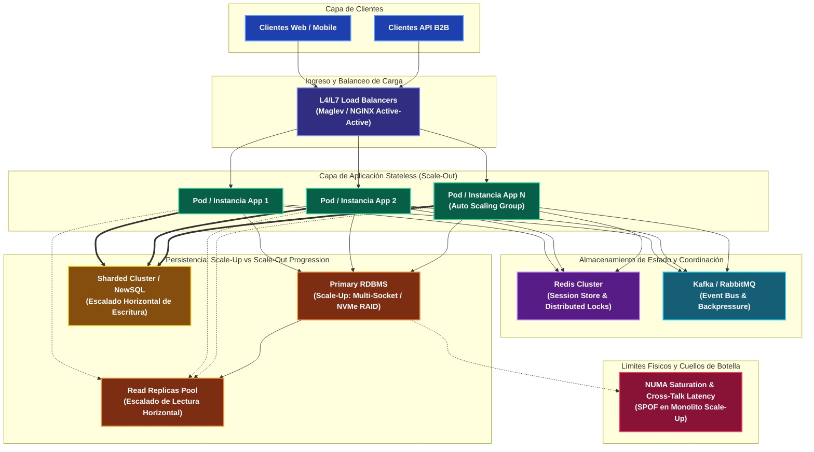

---
tags:
  - system-design
  - scaling
  - architecture
  - high-availability
  - fase-1
aliases:
  - Escalado Vertical vs Horizontal
  - Scale Up vs Scale Out
modulo: "01"
orden: 5
---

# 01.5 Escalado Vertical vs Horizontal: Límites Físicos, Leyes Formales de Escalabilidad y Arquitectura Distribuida

> *"Escalar un sistema no consiste simplemente en aprovisionar más capacidad computacional, sino en modelar matemáticamente la contención de recursos y la coherencia de estado para evitar que el crosstalk destruya el throughput del clúster."*

---

## 1. Fundamentos Arquitectónicos: Scale-Up vs. Scale-Out

En el diseño de sistemas distribuidos de alta concurrencia, la decisión entre **Escalado Vertical** (*Scale-Up*) y **Escalado Horizontal** (*Scale-Out*) no es un dilema de preferencias operativas, sino una compensación termodinámica y arquitectónica entre latencia interna, coherencia de memoria y tolerancia a fallos.

| Dimensión | Escalado Vertical (*Scale-Up*) | Escalado Horizontal (*Scale-Out*) |
| :--- | :--- | :--- |
| **Mecánica Física** | Adición/reemplazo de CPU, RAM, NVMe en socket/chasis único. | Adición de nodos independientes comunicados por red L2/L3. |
| **Complejidad de Software** | $\mathcal{O}(1)$ en código; monolitismo directo, sin coordinación de red. | Alta; requiere arquitectura *Shared-Nothing*, idempotencia y consenso. |
| **Punto Único de Fallo (SPOF)** | Crítico; el MTBF de los componentes del chasis fija la disponibilidad. | Resiliente; redundancia $N+1$ o $N+2$, *blast radius* acotado por nodo. |
| **Curva de Costo** | Convexa y exponencial ($\mathcal{O}(e^k)$ en hardware multi-socket enterprise). | Casi lineal y cóncava inicial (*commodity hardware*, instancias spot). |
| **Límites Físicos** | Techo de silicio: saltos NUMA, bus de memoria y líneas PCIe. | Techo de red: retraso de coherencia, ley USL y latencia transversal. |
| **Impacto Operativo** | Requiere parada programada para reemplazo de silicio (salvo hot-plug). | Despliegues *rolling* con cero downtime y elasticidad dinámica (ASG/HPA). |

### Límites Físicos del Escalado Vertical
Un error común de diseño es asumir que se puede escalar verticalmente de manera indefinida adquiriendo servidores de mayor densidad. A nivel de silicio, el hardware moderno choca contra cuatro barreras físicas infranqueables:

1. **Latencia y Saltos NUMA (Non-Uniform Memory Access):**
   - En arquitecturas multi-socket (2 a 8 sockets Intel Xeon o AMD EPYC), la memoria RAM está físicamente particionada y asignada a sockets específicos.
   - El acceso a memoria conectada al socket local toma típicamente **$\sim 60\text{--}80\text{ ns}$**.
   - Si un hilo ejecutado en el Socket 0 necesita acceder a páginas mapeadas en el Socket 1, el tráfico debe cruzar buses de interconexión punto a punto (Intel UPI o AMD Infinity Fabric). Este salto remoto eleva la latencia a **$\sim 150\text{--}220\text{ ns}$** (penalización de $2.5\text{x}$ a $3\text{x}$), degradando brutalmente los algoritmos sensibles a la caché L3 (*cache thrashing* y *false sharing*).
2. **Saturación del Bus de Memoria DDR5:** A medida que se incrementa el número de cores en un único procesador (ej. 128 cores por socket), el ancho de banda del controlador de memoria integrado se convierte en el cuello de botella. Múltiples hilos compiten por los canales de memoria (8 a 12 canales DDR5), provocando encolamiento a nivel de hardware y estancamiento de pipeline (*CPU memory stalls*).
3. **Contención en Líneas PCIe:** Las tarjetas de red de alta velocidad (NICs de 100GbE / 200GbE) y las controladoras NVMe compiten por las líneas PCIe disponibles del procesador, saturando los switches PCIe de la placa base ante ráfagas extremas de I/O.
4. **Curva de Costo Asintótica:** Un servidor enterprise con 4 sockets, 448 cores y 4 TB de RAM puede costar **$15\text{x}$ a $20\text{x}$ más** que un conjunto equivalente de cuatro servidores commodity de 1 socket con 112 cores y 1 TB de RAM cada uno, debido a la complejidad de las placas madre de interconexión coherente y la baja escala de fabricación.

---

## 2. Diagramas Arquitectónicos y Topologías de Escalabilidad

El siguiente diagrama ilustra la coexistencia en producción del escalado horizontal en la capa de cómputo *stateless* y la progresión híbrida en la capa de persistencia:

---

## 3. Leyes Formales de Escalabilidad Computacional

El escalado horizontal presupone erróneamente que duplicar el número de nodos multiplica linealmente la capacidad del clúster ($2\times \text{hardware} = 2\times \text{capacidad}$). Tres leyes fundamentales demuestran matemáticamente por qué este supuesto es falso:

### A. Ley de Amdahl (1967): Límite por Código Secuencial
Modela la aceleración teórica (*Speedup* $S$) al ejecutar un programa con carga fija sobre $N$ unidades de procesamiento en paralelo, cuando una fracción $P$ del trabajo es paralelizable y $(1 - P)$ es estrictamente secuencial:

$$S(N) = \frac{1}{(1 - P) + \frac{P}{N}}$$

A medida que el número de procesadores o nodos tiende a infinito ($N \to \infty$), el tiempo de ejecución de la porción paralela tiende a cero, revelando la asíntota máxima insuperable del sistema:

$$S(\infty) = \lim_{N \to \infty} \frac{1}{(1 - P) + \frac{P}{N}} = \frac{1}{1 - P}$$

```mermaid
gantt
    title Ley de Amdahl: El Cuello de Botella Secuencial
    dateFormat X
    axisFormat %s
    section Tarea Original (1 Servidor)
    Secuencial (5%) :active, 0, 5
    Paralelo (95%) :crit, 5, 100
    section Con 100 Servidores
    Secuencial (5%) :active, 0, 5
    Paralelo (0.95%) :crit, 5, 6
```

* **Implicación en Sistemas Distribuidos:** La porción secuencial $(1 - P)$ incluye bloqueos de exclusión mutua (*mutex*), serialización de mensajes (JSON/Protobuf), escrituras sincronizadas en WAL (*Write-Ahead Logging* con `fsync`) y asignación de identificadores secuenciales. Si el **$5\%$** de tu pipeline es secuencial ($1 - P = 0.05$), **ningún clúster en la Tierra superará un speedup de $20\text{x}$**, independientemente de si cuenta con 1,000 o 1,000,000 de instancias.

### B. Ley de Gustafson-Barsis (1988): Escalabilidad Elástica (Weak Scaling)
A diferencia de Amdahl (que asume un tamaño de problema fijo), Gustafson modela escenarios donde el tamaño de la carga de trabajo crece proporcionalmente con el hardware disponible (*Weak Scaling*, típico en procesamiento por lotes como Apache Spark o MapReduce):

$$S(N) = N - \alpha(N - 1)$$

Donde $\alpha = 1 - P$ representa la fracción secuencial fija por unidad de trabajo. Demuestra que si el volumen de datos aumenta al agregar nodos, la aceleración puede aproximarse a la linealidad, siempre que la porción secuencial no crezca con el tamaño del clúster.

### C. Ley Universal de Escalabilidad (USL - Dr. Neil J. Gunther)
La Ley de Amdahl es optimista porque asume que los nodos adicionales no se comunican entre sí. En sistemas distribuidos reales, los nodos deben coordinar bloqueos e invalidar cachés. La **Ley Universal de Escalabilidad (USL)** cuantifica esta penalización mediante dos coeficientes empíricos:

$$C(N) = \frac{N}{1 + \sigma(N - 1) + \kappa N(N - 1)}$$

* $\sigma \ge 0$ (**Contención**): Retraso por encolamiento y espera de recursos compartidos (bloqueos de filas en RDBMS, buffers de red). Crecimiento lineal $\mathcal{O}(N)$.
* $\kappa \ge 0$ (**Coherencia / Crosstalk**): Retraso por sincronización de estado entre nodos (consenso Raft/Paxos, invalidación distribuida de caché, replicación de quórums). Crecimiento cuadrático $\mathcal{O}(N^2)$ derivado del número de pares de comunicación inter-nodo $\frac{N(N - 1)}{2}$.

#### Derivación del Fenómeno de Colapso Retrógrado ($N^*$)
Cuando $\kappa > 0$, existe un punto crítico a partir del cual **añadir nodos degrada el throughput total del clúster**. Para encontrar el número óptimo de nodos $N^*$, derivamos $C(N)$ respecto a $N$ e igualamos a cero:

$$\frac{dC}{dN} = \frac{\left[1 + \sigma(N - 1) + \kappa N(N - 1)\right] - N\left[\sigma + \kappa(2N - 1)\right]}{\left[1 + \sigma(N - 1) + \kappa N(N - 1)\right]^2} = 0$$

Simplificando el numerador:
$$(1 - \sigma + \kappa N) + \sigma N + \kappa N^2 - \sigma N - 2\kappa N^2 + \kappa N = 0 \implies (1 - \sigma) - \kappa N^2 = 0$$

Despejando $N^*$:
$$N^* = \sqrt{\frac{1 - \sigma}{\kappa}}$$

La capacidad máxima del sistema en dicho punto es:
$$C(N^*) = \frac{N^*}{1 + \sigma(N^* - 1) + \kappa N^*(N^* - 1)}$$

### D. Ley de Little (1961): Dimensionamiento de Concurrencia
Relaciona el número medio de peticiones concurrentes en vuelo ($L$) con la tasa de llegada o throughput ($\lambda$) y el tiempo de respuesta o latencia media ($W$):

$$L = \lambda W$$

Esta ley es el pilar de dimensionamiento operativo: permite calcular exactamente el número de hilos requeridos en servidores de aplicación (Tomcat, Netty, Go goroutines) y el tamaño de pools de conexiones de base de datos (`HikariCP`, `pgbouncer`) para evitar saturaciones por *queueing delay*.

---

## 4. Habilitadores Arquitectónicos del Escalado Horizontal

Para que un clúster pueda escalar horizontalmente sin disparar los coeficientes $\sigma$ y $\kappa$ de USL, la arquitectura de software debe implementar las siguientes restricciones estructurales:

### 1. Capa de Aplicación Estrictamente Stateless
- **Shared-Nothing Architecture:** Los servidores de cómputo no comparten memoria RAM ni almacenamiento de bloques local.
- **Externalización de Sesiones:** El estado del usuario se almacena en almacenes de memoria distribuida con particionamiento de hash ([[04.0_Estrategias_de_Cache_Write-Through_Write-Back_Refresh-Ahead|Redis Cluster]]) o se codifica en tokens criptográficamente firmados y autocontenidos (JWT con rotación de claves públicas vía JWKS).
- **Prohibición de Sticky Sessions:** El uso de afinidad de sesión en el balanceador de carga rompe la distribución uniforme del tráfico, genera *hotspots* en nodos individuales e imposibilita el vaciado suave de conexiones (*connection draining*) durante eventos de auto-scaling.
- **Graceful Shutdown:** Las instancias deben interceptar señales `SIGTERM`, dejar de admitir tráfico nuevo en los *health checks*, completar las peticiones en vuelo dentro de un periodo de gracia (típicamente 30s en Kubernetes `preStop`) y cerrar los pools de conexiones limpiamente.

### 2. Sobrecarga del Consenso Distribuido
Cuando el estado se comparte horizontalmente, el costo de coordinar réplicas crece geométricamente:
- En algoritmos de consenso como **Raft** o **Multi-Paxos**, una escritura requiere la confirmación de un quórum de mayoría simple $\lfloor N/2 \rfloor + 1$.
- Un clúster de 9 nodos requiere 5 confirmaciones de red, mientras que uno de 3 nodos solo requiere 2. Escalar el número de réplicas de consenso **aumenta la latencia p99 de escritura y disminuye el throughput**, porque incrementa directamente el factor de coherencia $\kappa$.

### 3. La Escalera de Escalabilidad en Persistencia (Database Progression)
El escalado de almacenamiento debe progresar de menor a mayor complejidad operacional:
1. **Scale-Up Vertical del Primario:** Maximizar la memoria RAM (garantizando que el *working set* de índices quepa completamente en el buffer pool de InnoDB o PostgreSQL) y desplegar almacenamiento NVMe en RAID 10.
2. **Read Replicas (Separación de Lectura/Escritura):** Enrutamiento de consultas `SELECT` a réplicas asíncronas de solo lectura mediante réplica física o lógica. Requiere gestionar el *Replication Lag* para mitigar lecturas inconsistentes (*Read-Your-Own-Writes consistency*).
3. **Caché Distribuida (Look-Aside / Cache-Aside):** Integrar clústeres de Redis/Memcached para absorber entre el $80\%$ y el $95\%$ del tráfico de lectura repetitiva, blindando el motor relacional.
4. **Particionamiento Funcional y Sharding Horizontal:** División horizontal de tablas gigantescas en shards independientes guiados por una clave de partición (*Sharding Key* como `user_id` o `tenant_id`) mediante algoritmos de hashing consistente. Sacrifica transacciones multi-tabla y *JOINs* atómicos nativos.
5. **NewSQL Distribuido:** Migración a motores como Google Cloud Spanner, CockroachDB o TiDB, que implementan consenso Multi-Raft por rangos de partición (*ranges/tablets*) y transacciones distribuidas con Two-Phase Commit (2PC) coordinadas por relojes lógicos híbridos (HLC) o TrueTime.

---

## 5. Casos de Estudio Reales en la Industria

### Stack Overflow: La Cúspide del Escalado Vertical Pragmático
- **Arquitectura:** Para servir cientos de millones de visitas mensuales y más de 6,000 peticiones por segundo en horas pico, Stack Overflow operó durante más de una década con **solo 2 servidores de base de datos Microsoft SQL Server** (uno activo y otro en réplica síncrona AlwaysOn).
- **Especificaciones:** Servidores con múltiples sockets, **1.5 TB de RAM** y almacenamiento enterprise en arrays PCIe SSD.
- **Racionalidad:** Al mantener todo el dataset relacional en la memoria RAM de una única máquina, las consultas complejas con múltiples `JOIN` se ejecutan en microsegundos, eliminando por completo la latencia de red, la necesidad de transacciones distribuidas y la sobrecarga operacional de mantener decenas de shards.

### Meta: Escalado Horizontal Masivo de MySQL vía TAO
- **Arquitectura:** Meta procesa miles de millones de operaciones por segundo sobre el grafo social utilizando miles de instancias **MySQL particionadas** (*sharded*).
- **Solución TAO:** Para evitar el colapso de MySQL ante la ley de Amdahl y la contención de cerraduras, Meta diseñó **TAO** (*The Associative Object store*), una capa geodistribuida de caché de lectura en memoria que absorbe el **$99.8\%$** de las consultas del grafo social.
- **Lección:** Ningún clúster relacional puede escalar horizontalmente en escrituras sin desacoplar radicalmente la lectura y delegar el enrutamiento de shards a proxies inteligentes.

### Netflix: Microservicios Stateless y Auto-Scaling en AWS
- **Arquitectura:** Cientos de microservicios sin estado ejecutándose sobre decenas de miles de instancias Amazon EC2 y contenedores administrados por Titus.
- **Resiliencia:** Aplicación estricta de *Chaos Engineering* (Chaos Monkey): cualquier servidor puede ser terminado abruptamente sin degradar el servicio de streaming, ya que todo el estado transaccional reside en almacenes sin maestro como Apache Cassandra (con replicación tunable) y clústeres elásticos de EVCache.

---

## 6. Estimaciones Cuantitativas y Micro-Cálculo Mental

### Fórmulas Clave de Estimación
1. **Concurrencia en Vuelo (Little):**
   $$L = \lambda W$$
2. **Capacidad Relativa Efectiva (USL):**
   $$C(N) = \frac{N}{1 + \sigma(N - 1) + \kappa N(N - 1)}$$
3. **Punto Óptimo de Escalado (Retrograde Peak):**
   $$N^* = \sqrt{\frac{1 - \sigma}{\kappa}}$$

---

> [!TIP]- Micro-Cálculo Mental: Punto Óptimo de Capacidad USL y Dimensionamiento de Clúster
> **Escenario de Entrevista Staff:** Diseñas la capa de procesamiento de pagos para un evento global de comercio electrónico.
> 
> **Parte A: Dimensionamiento de Concurrencia con Ley de Little**
> - **Tráfico Pico Proyectado ($\lambda$):** **$25,000\text{ RPS}$**.
> - **Latencia Media de Respuesta del Backend ($W$):** **$40\text{ ms} = 0.04\text{ s}$**.
> 
> *Cálculo de Concurrencia en Vuelo:*
> $$L = \lambda \times W = 25,000 \times 0.04 = \mathbf{1,000\text{ peticiones concurrentes}}$$
> - Si pruebas de carga indican que cada pod de aplicación gestiona de forma segura **$50\text{ hilos/conexiones concurrentes}$** sin incrementar la latencia p99:
>   $$N_{\text{pods}} = \frac{1,000}{50} = \mathbf{20\text{ pods}}$$
> - Añadiendo un margen de resiliencia del $25\%$ para absorber picos y rotaciones de pods:
>   $$20 \times 1.25 = \mathbf{25\text{ pods mínimos requeridos}}$$
> 
> ---
> 
> **Parte B: Cálculo del Límite de Colapso Retrógrado con USL**
> - El clúster de base de datos distribuida presenta un coeficiente de contención de bloqueos **$\sigma = 0.02$** ($2\%$) y un coeficiente de coherencia/crosstalk de replicación **$\kappa = 0.0005$** ($0.05\%$).
> 
> *1. Cálculo del Punto de Inflexión Máximo ($N^*$):*
> $$N^* = \sqrt{\frac{1 - \sigma}{\kappa}} = \sqrt{\frac{1 - 0.02}{0.0005}} = \sqrt{\frac{0.98}{0.0005}} = \sqrt{1,960} \approx \mathbf{44\text{ nodos}}$$
> 
> *2. Capacidad Efectiva Máxima en $N^* = 44$:*
> $$C(44) = \frac{44}{1 + 0.02(43) + 0.0005(44)(43)} = \frac{44}{1 + 0.86 + 0.946} = \frac{44}{2.806} \approx \mathbf{15.68\text{x}}$$
> 
> *3. El Error del Operador Novato: Escalar a $N = 100$ nodos:*
> $$C(100) = \frac{100}{1 + 0.02(99) + 0.0005(100)(99)} = \frac{100}{1 + 1.98 + 4.95} = \frac{100}{7.93} \approx \mathbf{12.61\text{x}}$$
> 
> *Lección Senior:* Escalar de 44 a 100 nodos **redujo la capacidad del sistema en un $20\%$** (de $15.68\text{x}$ a $12.61\text{x}$) pagando un $127\%$ más en factura de infraestructura. Añadir más nodos cuando la coherencia domina ($\kappa N^2$) destruye el rendimiento del clúster.

---

## 🎯 Guion de Entrevista: Cómo defender este tema en 2 minutos

Si un entrevistador te plantea: *"¿Cómo decides entre escalado vertical y horizontal en una arquitectura distribuida y qué límites teóricos gobiernan tu decisión?"*, estructúralo en **5 pilares senior**:

> 🗣️ **Pitch Profesional de 5 Pasos:**
> 1. **Taxonomía y Límites Físicos del Scale-Up:** *"El escalado vertical expande cómputo en una sola máquina, pero choca contra cuatro barreras físicas: la penalización de latencia NUMA inter-socket (hasta 3x más lenta que la local), saturación de canales DDR5, contención de buses PCIe y la introducción de un SPOF total con costos asintóticos. El escalado horizontal elimina el SPOF mediante hardware commodity bajo el modelo Shared-Nothing, pero traslada la complejidad al transporte de red."*
> 2. **Modelado Teórico con Amdahl y Gustafson:** *"El escalado no es lineal. La Ley de Amdahl demuestra que si tan solo el 5% de un flujo de checkout es estrictamente secuencial —como bloqueos de inventario o llamadas atómicas a pasarelas—, el speedup teórico jamás superará 20x aunque usemos un millón de servidores. La Ley de Gustafson matiza esto en Weak Scaling para analítica por lotes, pero en APIs online Amdahl establece el techo duro de escalabilidad."*
> 3. **Colapso Retrógrado de Gunther (USL):** *"Para clústeres reales aplico la Ley Universal de Escalabilidad de Neil Gunther, que incorpora contención de recursos ($\sigma$) y coherencia de estado ($\kappa$). Dado que el crosstalk entre nodos crece de forma cuadrática $\mathcal{O}(N^2)$, si $\kappa > 0$, el clúster sufre un colapso retrógrado en $N^* = \sqrt{(1-\sigma)/\kappa}$. A partir de ese punto, añadir servidores no solo es inútil, sino que degrada activamente el throughput global."*
> 4. **Dimensionamiento Operativo con Ley de Little:** *"Para dimensionar clústeres y thread pools utilizo la Ley de Little: $L = \lambda W$. Si la plataforma recibe 25,000 QPS con latencia media de 40 ms, mantengo 1,000 conexiones en vuelo simultáneas. Conociendo la capacidad de procesamiento concurrente segura de cada contenedor sin disparar el context switching, calculo con precisión el número base de réplicas y el headroom de auto-scaling."*
> 5. **Estrategia Pragmática de Datos vs Cómputo:** *"En producción aplico una estrategia desacoplada: la capa de aplicación debe ser 100% stateless desde el día uno —descargando sesiones en Redis Cluster y emitiendo eventos asíncronos en Kafka— para escalar horizontalmente sin fricción. Para la base de datos relacional, agoto primero el Scale-Up vertical y réplicas de lectura antes de recurrir a Sharding o NewSQL, evitando la sobreingeniería de transacciones distribuidas mientras el working set quepa en silicio."*

---

## Preguntas Clave de Active Recall

> [!QUESTION]- Active Recall #1: ¿Por qué en un sistema con coherencia distribuida ($\kappa > 0$) añadir más servidores puede provocar una caída catastrófica del throughput global (fenómeno retrógrado de USL)?
> **Respuesta:** En la Ley Universal de Escalabilidad de Gunther, el término $\kappa N(N - 1)$ modela el costo de mantener la coherencia de estado entre todos los nodos del clúster (mediante protocolos de gossip, quórums de replicación Raft/Paxos o invalidación de cachés). Dado que el número de canales de comunicación punto a punto crece cuadráticamente con $\mathcal{O}(N^2)$, llega un punto crítico $N^* = \sqrt{\frac{1 - \sigma}{\kappa}}$ donde el tiempo computacional que cada nodo gasta sincronizando estado y esperando confirmaciones remotas supera el tiempo dedicado a procesar trabajo útil. A partir de $N^*$, cada nodo añadido satura aún más los enlaces de red e incrementa el bloqueo mutuo, provocando un desplome neto del throughput global del sistema.

---

> [!QUESTION]- Active Recall #2: ¿En qué circunstancias técnicas un Staff Engineer recomendaría hacer Scale-Up vertical masivo en una base de datos relacional antes de implementar Sharding horizontal?
> **Respuesta:** Se debe priorizar el Scale-Up vertical cuando el *working set* de índices y datos calientes puede caber en la memoria RAM de un servidor enterprise moderno (ej. hasta 4–12 TB de RAM) y el cuello de botella es de I/O de lectura o transacciones complejas con múltiples `JOIN` atómicos. El Sharding horizontal impone una penalización arquitectónica severa: elimina la integridad referencial declarativa, destruye los `JOIN` nativos eficientes en disco, complica las migraciones de esquema e introduce la sobrecarga de transacciones distribuidas con Two-Phase Commit (2PC). Si el presupuesto permite un servidor más grande que otorgue 18 a 24 meses de margen operativo, el Scale-Up es la decisión pragmática superior, posponiendo el Sharding hasta que el volumen de datos o escrituras supere físicamente los límites de ancho de banda del bus de memoria y almacenamiento local.

---

> [!NOTE]- Desafío Feynman: El Restaurante Monolítico vs La Franquicia de Food Trucks
> * **Escalado Vertical (Scale-Up):** Es como tener una cocina central con un único chef superestrella. Si hay más comensales, compras sartenes más grandes y hornos industriales más potentes. El chef cocina extraordinariamente rápido porque no tiene que coordinarse con nadie. Pero llega un punto físico donde el calor en la cocina es insoportable, el chef no puede dar más pasos por segundo y, si se corta un dedo (falla de hardware), todo el restaurante se detiene al $100\%$.
> * **Escalado Horizontal (Scale-Out):** Es como abrir una cadena de 20 puestos de comida idénticos (*food trucks*). Si la clientela se duplica, abres 20 puestos más. Si un camión sufre una avería de gas, los otros 39 siguen sirviendo al $97.5\%$ de capacidad. Sin embargo, para que funcione, todos los camiones deben recibir los ingredientes ya preparados desde un almacén común (la capa *stateless* con Redis/S3) y no pueden compartir ingredientes entre sí a mitad de servicio, porque coordinar quién tiene la última lechuga mediante llamadas de radio (el *crosstalk* $\kappa$) haría que los clientes esperasen horas por su comida.

---

## Conceptos Relacionados
- [[01.0_El_Viaje_Completo_de_una_Peticion_HTTP|01.0 El Viaje Completo de una Petición HTTP (Request Lifecycle)]]
- [[01.3_Balanceadores_de_Carga_L4_vs_L7_Active-Active_vs_Active-Passive|01.3 Balanceadores de Carga L4 vs L7]]
- [[02.3_Particionamiento_y_Sharding_de_BBDD|02.3 Particionamiento y Sharding de BBDD]]
- [[03.1_Consistencia_Fuerte_vs_Eventual_y_Linealizabilidad|03.1 Consistencia Fuerte vs Eventual y Linealizabilidad]]
- [[04.0_Estrategias_de_Cache_Write-Through_Write-Back_Refresh-Ahead|04.0 Estrategias de Caché: Look-Aside, Write-Through y Write-Back]]
- [[08.0_Latencias_que_Todo_Programador_Debe_Saber|08.0 Latencias que Todo Programador Debe Saber]]
- [[08.2_Formula_de_Estimacion_QPS_IOPS_Almacenamiento_y_Ancho_de_Banda|08.2 Fórmulas de Estimación de Capacidad]]
- [[00_MOC_System_Design_Mastery|Volver al Índice Maestro (MOC)]]
