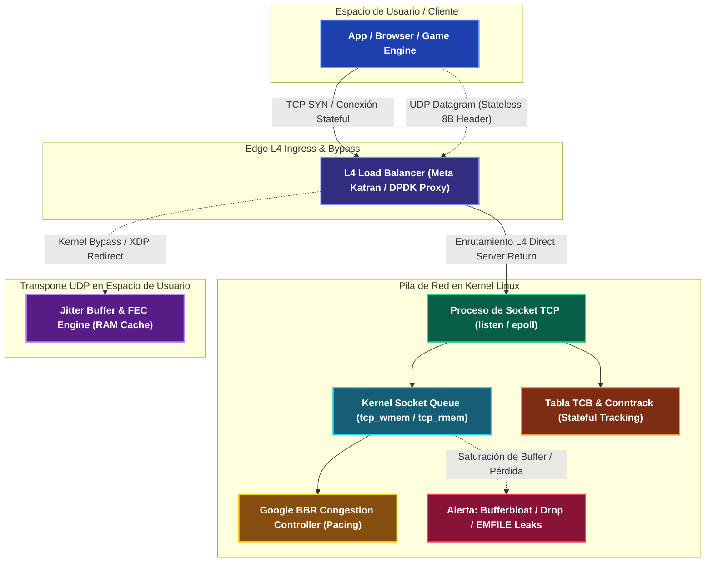

---
tags:
  - system-design
  - networking
  - tcp
  - udp
  - transport-layer
  - fase-1
aliases:
  - "TCP vs UDP: Protocolos de Transporte"
  - Protocolos de Capa 4
modulo: "01"
orden: 6
---

# 01.6 TCP vs UDP: Mecánica de Sockets, Algoritmos de Congestión y Transporte de Alto Rendimiento

> *"TCP es la ilusión de un canal confiable, secuencial y libre de errores sobre una red de conmutación de paquetes inherentemente caótica y con pérdidas; UDP es la exposición honesta de la capa física, entregando datagramas a la velocidad de la luz y delegando la inteligencia del flujo al espacio de usuario."*

---

## 1. Comparativa de Arquitectura, Cabeceras y Filosofía de Diseño

En la Capa 4 del modelo OSI (Capa de Transporte), la bifurcación arquitectónica entre TCP (*Transmission Control Protocol*, RFC 793 / RFC 9293) y UDP (*User Datagram Protocol*, RFC 768) representa el dilema clásico de ingeniería de sistemas distribuidos: **garantías fuertes gestionadas por el sistema operativo** frente a **latencia mínima y control granular en espacio de usuario**.

### Anatomía de Cabeceras a Nivel de Bit

1. **Cabecera TCP (20 a 60 Bytes):**
   - **Source Port (16 bits) / Destination Port (16 bits):** Multiplexación y demultiplexación de procesos locales.
   - **Sequence Number (32 bits):** Coordenada ordinal del primer byte de datos en el segmento actual dentro del flujo global.
   - **Acknowledgment Number (32 bits):** Siguiente byte secuencial esperado por el receptor (confirmación acumulativa).
   - **Data Offset (4 bits):** Longitud de la cabecera en palabras de 32 bits (mínimo 5 palabras = 20 bytes).
   - **Flags de Control (9 bits):** `URG` (urgente), `ACK` (campo de acuse válido), `PSH` (empuje a la aplicación sin esperar buffer), `RST` (reinicio inmediato del circuito), `SYN` (sincronización de números de secuencia iniciales), `FIN` (cierre ordenado), `CWR` y `ECE` (mecanismos de notificación explícita de congestión ECN, RFC 3168).
   - **Window Size (16 bits):** Anuncio explícito del buffer de recepción disponible (`rwnd`) para control de flujo (máximo 65,535 bytes sin opciones).
   - **Checksum (16 bits):** Verificación de integridad matemática sobre cabecera, payload y pseudo-cabecera IP.
   - **Urgent Pointer (16 bits):** Desplazamiento respecto al Seq Num si el flag `URG` está activo.
   - **Options (0 a 40 Bytes):** Extensiones críticas para redes modernas: Maximum Segment Size (`MSS`), Window Scale (`WSCALE`, RFC 1323), Selective Acknowledgments (`SACK-Permitted`, RFC 2018), Timestamps (RFC 7323) y TCP Fast Open (`TFO`, RFC 7413).

2. **Cabecera UDP (Exactamente 8 Bytes):**
   - **Source Port (16 bits) / Destination Port (16 bits):** Identificadores de puertos de transporte.
   - **Length (16 bits):** Tamaño total del datagrama (cabecera + payload) en bytes (mínimo 8, teórico máximo 65,535).
   - **Checksum (16 bits):** Opcional en IPv4 (relleno con ceros si se omite), obligatorio en IPv6.



| Dimensión Arquitectónica | TCP (*Transmission Control Protocol*) | UDP (*User Datagram Protocol*) |
| :--- | :--- | :--- |
| **Modelo de Estado** | **Orientado a conexión (Stateful).** Mantiene un TCB (*Transmission Control Block*) en kernel por conexión. | **Sin conexión (Stateless).** Cada datagrama es una entidad física independiente sin memoria previa. |
| **Garantía de Entrega** | **100% Confiable.** Mecanismo ARQ con retransmisión automática y confirmación selectiva (SACK). | **Best-Effort.** Sin confirmación ni retransmisiones automáticas en capa de transporte. |
| **Orden de Flujo** | **Estrictamente Secuencial.** Los bytes se entregan a la aplicación en orden idéntico al de emisión. | **Sin orden.** Los datagramas pueden llegar desordenados, duplicados o perderse sin notificación. |
| **Control de Flujo** | **Sí (`rwnd`).** El receptor modula la tasa del emisor para no inundar sus buffers de socket. | **No.** El emisor inyecta paquetes a la velocidad máxima que su CPU y enlace permitan. |
| **Control de Congestión** | **Sí (`cwnd`).** Algoritmos adaptativos (CUBIC, BBR) previenen el colapso de la red intermedia. | **No.** Debe implementarse en espacio de usuario si la aplicación requiere estabilidad de red. |
| **Head-of-Line (HoL) Blocking** | **Severo a nivel de transporte.** Si un paquete intermedio se pierde, los posteriores se bloquean en el kernel. | **Inexistente.** La pérdida del paquete $N$ no impide que el paquete $N+1$ sea entregado a la aplicación. |
| **Sobrecarga de Cabecera** | 20 a 60 bytes por segmento (típicamente 32 a 40 bytes con opciones modernas activas). | 8 bytes fijos invariantes. |
| **Huella en Kernel (RAM)** | Alta (~4 KB a 100+ KB por socket en buffers `sk_buff` y estructuras TCB). | Mínima o nula (descriptores de socket sin buffers de reensamblado ni estado). |
| **Casos de Uso Dominantes** | Web transaccional (HTTP/1.1, HTTP/2), Bases de datos (PostgreSQL, MySQL), SSH, gRPC, Mensajería. | Streaming en vivo, WebRTC/VoIP, Videojuegos FPS, DNS (puerto 53), HTTP/3 (sobre QUIC). |

---

## 2. Ciclo de Vida y Máquina de Estados de Sockets en Linux

Una conexión TCP opera como una máquina de estados determinista gobernada en el espacio de kernel. Cada transición altera el consumo de recursos de memoria y la respuesta del stack de red.

```mermaid
sequenceDiagram
    autonumber
    participant C as Cliente (Active Endpoint)
    participant K as Linux Kernel Stack
    participant S as Servidor (Passive Endpoint)

    Note over S: 0. Socket en LISTEN (SYN Backlog)
    C->>S: 1. SYN (Seq=X, Options: MSS=1460, WScale=7, SACK)
    Note over C: Socket en SYN_SENT
    Note over S: Socket en SYN_RCVD
    S->>C: 2. SYN-ACK (Seq=Y, Ack=X+1)
    Note over C: Socket en ESTABLISHED
    C->>S: 3. ACK (Seq=X+1, Ack=Y+1)
    Note over S: Socket en ESTABLISHED (Pasa a Accept Queue)

    rect rgba(6, 95, 70, 0.08)
        Note over C,S: Fase de Transferencia Bidireccional de Datos (Full-Duplex)
        C->>S: DATA Segment (Seq=X+1..X+1461, Len=1460)
        S->>C: ACK acumulativo (Ack=X+1461, rwnd=131072)
    end

    Note over C,S: Cierre de Conexión (Active Close por Cliente)
    C->>S: 4. FIN (Seq=X+1461)
    Note over C: Entra en FIN_WAIT_1
    S->>C: 5. ACK (Ack=X+1462)
    Note over C: Entra en FIN_WAIT_2
    Note over S: Entra en CLOSE_WAIT (Espera close() en App)
    S->>C: 6. FIN (Seq=Y+1)
    Note over S: Entra en LAST_ACK
    C->>S: 7. ACK (Ack=Y+2)
    Note over S: CLOSED (FD liberado)
    Note over C: Entra en TIME_WAIT (Dura 2 x MSL = 60s)
    Note over C: CLOSED tras expirar temporizador
eriod
    rect rgba(21, 94, 117, 0.08)
        Note over C,S: Comparativa con UDP: Comunicación sin Estado
        C->>S: UDP Datagram (Puerto Origen / Destino, 8B Header, Payload)
        Note over S: Procesa inmediatamente en recvfrom() sin handshake ni teardown
    end
```

### Patología 1: El Estado `TIME_WAIT` y el Agotamiento de Puertos Efímeros

Cuando un endpoint ejecuta un cierre activo (*active close*), tras enviar el último `ACK` queda congelado en el estado `TIME_WAIT` durante un tiempo estandarizado de **$2 \times \text{MSL}$** (*Maximum Segment Lifetime*, típicamente 60 segundos en Linux):

1. **Propósito Físico:**
   - **Garantizar la entrega del último ACK:** Si el paquete 7 (`ACK`) se pierde, el servidor retransmite el `FIN`. Si el cliente hubiese destruido el socket inmediatamente, respondería con un `RST`, provocando una terminación errónea en el servidor.
   - **Drenaje de segmentos duplicados errantes:** Impide que paquetes retardados en los routers de Internet aparezcan tardíamente e invaliden una nueva conexión que reutilice la misma 4-tupla (`IP_origen, Port_origen, IP_destino, Port_destino`).

2. **Agotamiento de Puertos Efímeros (*Ephemeral Port Exhaustion*):**
   - El rango de puertos efímeros en Linux (`/proc/sys/net/ipv4/ip_local_port_range`) abarca por defecto de `32768` a `60999` (**28,232 puertos disponibles**).
   - Si un microservicio cliente o reverse proxy abre y cierra conexiones contra una misma IP:puerto de backend sin pooling de conexiones a una tasa de $5,000\text{ req/s}$, en menos de **6 segundos** consumirá todos los puertos efímeros disponibles. Las llamadas `connect()` fallarán con el error del sistema operativo:
     `EADDRNOTAVAIL: Cannot assign requested address`.

3. **Estrategias de Mitigación en Producción:**
   - **Connection Pooling L7:** Mantener conexiones HTTP persistentes (`Keep-Alive`) para amortizar el ciclo de vida del socket.
   - `SO_REUSEADDR` y `SO_REUSEPORT`: Permiten que múltiples hilos o procesos hagan `bind()` sobre el mismo puerto local escuchando concurrentemente mediante balanceo a nivel de kernel.
   - `net.ipv4.tcp_tw_reuse = 1`: Permite al kernel reutilizar sockets en `TIME_WAIT` para conexiones salientes seguras siempre que los timestamps de TCP (RFC 1323) demuestren que el nuevo segmento es estrictamente posterior.
   - *Precaución:* `net.ipv4.tcp_tw_recycle` fue retirado definitivamente en Linux kernel 4.12 porque violaba los estándares en presencia de clientes detrás de NAT pública, causando descartes silenciosos de paquetes `SYN`.

### Patología 2: La Fuga de Sockets en `CLOSE_WAIT` (*Leaked File Descriptors*)

El estado `CLOSE_WAIT` ocurre en el lado del receptor pasivo cuando recibe un `FIN`. El kernel responde automáticamente con un `ACK` y sitúa el socket en `CLOSE_WAIT`, a la espera de que el **código de la aplicación** invoque la llamada de sistema `close(fd)`.

- **Causa Raíz:** Si la aplicación tiene un bug en el manejo de excepciones, un pool de hilos saturado o una biblioteca que olvida cerrar el stream tras un error I/O, el socket permanece en `CLOSE_WAIT` de forma indefinida.
- **Consecuencia Crítica:** A diferencia de `TIME_WAIT`, **no existe un temporizador en el kernel** que limpie `CLOSE_WAIT`. Cada socket retiene un *file descriptor* en la tabla de procesos. Cuando el conteo alcanza el límite configurado (`ulimit -n`), cualquier llamada posterior a `accept()`, `socket()` o `open()` falla con:
  `EMFILE: Too many open files`.

---

## 3. Buffers del Kernel y Optimizaciones de Rendimiento TCP

El kernel Linux asigna buffers dinámicos para almacenar en cola los datos recibidos y transmitidos. El dimensionamiento de estos buffers dicta el ancho de banda efectivo alcanzable.

### Parámetros Sysctl de Memoria de Sockets

```bash
# Formato: [min] [default] [max] en bytes
sysctl net.ipv4.tcp_rmem="4096 87380 6291456"   # Buffer de Recepción (6 MB max)
sysctl net.ipv4.tcp_wmem="4096 16384 4194304"   # Buffer de Transmisión (4 MB max)
sysctl net.core.rmem_max=16777216                # Límite global absoluto de lectura (16 MB)
sysctl net.core.wmem_max=16777216                # Límite global absoluto de escritura (16 MB)
```

- **TCP Auto-Tuning (DRS - Dynamic Right-Sizing):** Linux ajusta dinámicamente el tamaño de la ventana de recepción (`rwnd`) entre `min` y `max` en base a la tasa de llegada de datos y el tiempo de vaciado por parte de la aplicación, adaptándose al Bandwidth-Delay Product (BDP) sin intervención manual.

### Extensiones de Alto Rendimiento

1. **TCP Window Scaling (RFC 1323 / RFC 7323):**
   - El campo original de *Window Size* en la cabecera TCP tiene solo 16 bits, limitando la ventana máxima a $65,535\text{ bytes}$ ($64\text{ KB}$).
   - En enlaces de 10 Gbps con 80 ms de RTT, una ventana de 64 KB restringe el throughput a solo $6.4\text{ Mbps}$.
   - **Mecanismo:** La opción *Window Scale* negocia un factor de desplazamiento de hasta 14 bits durante el handshake ($2^{14} = 16,384$). Esto multiplica el campo por 16,384, elevando la ventana máxima teórica a **$1\text{ Gigabyte}$**.

2. **Selective Acknowledgments (SACK, RFC 2018):**
   - Sin SACK, TCP utiliza acuses acumulativos: si se pierden los paquetes 3 y 7 de una ráfaga de 10, el receptor solo puede confirmar hasta el paquete 2, forzando al emisor a retransmitir innecesariamente los paquetes 3, 4, 5, 6, 7, 8, 9 y 10 (*Go-Back-N*).
   - Con SACK, el receptor inserta bloques no contiguos en las opciones de cabecera indicando exactamente qué segmentos aislados recibió (ej. recibió 4-6 y 8-10), permitiendo al emisor retransmitir exclusivamente los fragmentos 3 y 7.

3. **TCP Fast Open (TFO, RFC 7413):**
   - Elimina la penalización de 1 RTT en el handshake para conexiones recurrentes.
   - En la primera conexión, el cliente solicita un cookie criptográfico cifrado al servidor. En conexiones posteriores, el cliente envía el cookie y los **primeros datos de la petición (ej. HTTP GET o TLS ClientHello)** dentro del paquete `SYN` inicial, reduciendo la latencia de establecimiento a **0 RTT**.

---

## 4. Mecánica de Control de Congestión: De Pérdida a Modelado de Red

La tasa de inyección de datos de un emisor TCP está gobernada por la menor de dos ventanas:

$$\text{Inflight Data} \le \min(\text{rwnd}, \text{cwnd})$$

Mientras que `rwnd` representa la capacidad del receptor, `cwnd` (*Congestion Window*) representa la estimación que hace el emisor sobre la capacidad de la red física intermedia.

### Algoritmos Basados en Pérdida: Tahoe, Reno y CUBIC

1. **AIMD (Additive Increase / Multiplicative Decrease):**
   - Principio fundacional: ante ausencia de pérdidas, incrementa la ventana linealmente (+1 MSS por cada RTT); ante una pérdida de paquetes, divide la ventana a la mitad ($0.5 \times \text{cwnd}$).
2. **TCP CUBIC (Estándar por defecto en Linux):**
   - Reemplaza el crecimiento lineal de Reno por una función polinómica cúbica en función del tiempo transcurrido desde el último evento de congestión ($t$):
     $$W_{\text{cubic}}(t) = C(t - K)^3 + W_{\text{max}}$$
   - Donde $W_{\text{max}}$ es la ventana previa a la pérdida, $C$ es una constante de escala y $K$ es el tiempo requerido para alcanzar nuevamente $W_{\text{max}}$.
   - **Fases:** Crece rápidamente tras la reducción, se aplana cerca de $W_{\text{max}}$ para sondear estabilidad (*Plateau*), y se acelera convexamente hacia arriba si no detecta pérdidas.
3. **La Falla Fatal: Bufferbloat y Pérdida No Congestiva:**
   - CUBIC asume que **toda pérdida de paquetes equivale a congestión de la red**. En redes inalámbricas (5G, Wi-Fi) o enlaces satelitales, las interferencias causan pérdidas aleatorias transitorias que desploman la ventana sin que exista congestión real.
   - Además, CUBIC incrementa la ventana hasta desbordar los buffers de los routers intermedios, inflando la latencia de encolamiento de $10\text{ ms}$ a más de $500\text{ ms}$ (**Bufferbloat**).

### Algoritmos Basados en Modelo: Google BBR (v1 / v2 / v3)

**BBR** (*Bottleneck Bandwidth and Round-trip propagation time*, desarrollado por Google) rompe el paradigma basado en pérdidas, operando en el **punto óptimo de Kleinrock**:

1. **Principio de Operación:**
   - Mide de forma continua dos variables físicas independientes:
     - $\text{BtlBw}$ (*Bottleneck Bandwidth*): Ancho de banda máximo alcanzable en el enlace más lento de la ruta.
     - $\text{RTprop}$ (*Round-Trip Propagation Time*): Latencia mínima de ida y vuelta dictada por la velocidad de la luz en el medio físico (sin colas).
   - Fija el volumen óptimo de datos en vuelo en el producto exacto de ambos:
     $$\text{BDP} = \text{BtlBw} \times \text{RTprop}$$
2. **Máquina de Estados de BBR:**
   - `Startup`: Incrementa exponencialmente el envío hasta saturar el ancho de banda.
   - `Drain`: Reduce drásticamente la tasa para drenar las colas que se hayan creado en los routers.
   - `ProbeBW`: Alterna cíclicamente su factor de pacing entre $1.25\text{x}$ y $0.75\text{x}$ para descubrir nuevo ancho de banda disponible sin acumular colas persistentes.
   - `ProbeRTT`: Cada 10 segundos, reduce la ventana de envío a solo 4 paquetes durante $200\text{ ms}$ para medir el $\text{RTprop}$ real sin interferencia de colas.
3. **Packet Pacing con Fair Queuing (`fq` qdisc):**
   - En lugar de disparar una ráfaga (*burst*) completa de paquetes al recibir un ACK, el kernel utiliza la disciplina de colas `sch_fq` para espaciar uniformemente la emisión de cada paquete a lo largo del RTT, eliminando micro-congestiones en conmutadores intermedios.

---

## 5. Transporte UDP de Alto Rendimiento y Kernel Bypass

A tasas de transferencia extremas (40 a 100 Gbps o millones de paquetes por segundo), el propio kernel de Linux se convierte en el cuello de botella debido a:
- Sobrecarga de interrupciones de hardware (*hardirqs*) y software (*softirqs*).
- Cambios de contexto de CPU entre espacio de kernel y espacio de usuario en cada llamada `recvfrom()` o `sendto()`.
- Copias sucesivas de memoria entre la tarjeta de red (NIC), las estructuras `sk_buff` del kernel y los buffers de la aplicación.

### Mecanismos Zero-Copy y Kernel Bypass

1. **Zero-Copy en Espacio de Kernel:**
   - `sendfile()` y `splice()`: Transfieren descriptores de archivos directamente hacia el socket sin transitar por buffers intermedios de usuario, reduciendo el consumo de CPU y eliminando ciclos de copia.
   - `MSG_ZEROCOPY`: Bandera de socket que permite transferir páginas de memoria de usuario directamente a la cola DMA de la NIC mediante fijación de páginas (*page pinning*).

2. **DPDK (Data Plane Development Kit):**
   - **Filosofía:** Omite completamente el stack de red del sistema operativo (*Kernel Bypass*).
   - **Mecanismo:** Controladores en modo sondeo (*Poll Mode Drivers - PMD*) ejecutan bucles continuos dedicados en cores de CPU aislados, accediendo a los registros PCIe y colas DMA de la NIC directamente desde el espacio de usuario, procesando más de **100 millones de paquetes por segundo por core**.

3. **eBPF y XDP (eXpress Data Path):**
   - En lugar de eludir el kernel, XDP inyecta programas eBPF compilados a código máquina nativo dentro del controlador de la NIC antes de que el kernel asigne la estructura de memoria `sk_buff`.
   - Permite filtrar, modificar o redirigir paquetes UDP o TCP con latencias sub-microsegundo mediante directivas directas como `XDP_DROP`, `XDP_TX` o `XDP_REDIRECT`.

---

## 6. Casos de Estudio Reales en la Industria

### 1. Google: Despliegue Global de BBR en YouTube y Google Cloud
- **Contexto:** Enlaces intercontinentales de la WAN privada de Google (B4) y distribución masiva de video en YouTube.
- **Resultado en Producción:** La transición de CUBIC a BBR incrementó el throughput promedio de YouTube en un **4% a nivel global** y en más de un **14% en países en desarrollo** con redes móviles de alta pérdida aleatoria. Además, redujo la latencia de encolamiento RTT en un **33%**, eliminando cortes de reproducción de video en streaming.

### 2. Meta: Katran L4 Load Balancer con eBPF/XDP
- **Contexto:** Balanceador de carga de Capa 4 de borde que procesa todo el tráfico entrante de Facebook, Instagram y WhatsApp.
- **Implementación:** Katran sustituyó balanceadores dedicados por una arquitectura sobre servidores commodity con Linux ejecutando XDP en el driver de red.
- **Arquitectura:** Aplica hashing consistente sobre la 5-tupla (`IP_src, Port_src, IP_dst, Port_dst, Proto`) y reenvía los paquetes encapsulados hacia los backends mediante **Direct Server Return (DSR)**. El backend responde directamente al cliente, eludiendo al balanceador en el tráfico saliente masivo.

### 3. Discord y Zoom: UDP Personalizado con Jitter Buffer y Reed-Solomon FEC
- **Contexto:** Comunicación de voz y video en tiempo real con millones de usuarios concurrentes.
- **El Problema de TCP:** El Head-of-Line Blocking de TCP provoca que si un paquete de voz se pierde, el audio completo se congele durante $100\text{ a }300\text{ ms}$ esperando la retransmisión, destruyendo la inteligibilidad humana.
- **Solución sobre UDP:**
  - **Jitter Buffer Adaptativo:** Cola en espacio de usuario que absorbe la variabilidad de retardo entre paquetes.
  - **Forward Error Correction (FEC):** Emplean algoritmos matemáticos como Reed-Solomon para enviar paquetes de paridad junto a los paquetes de audio. Si se pierde 1 de cada 5 paquetes, el cliente reconstruye matemáticamente el paquete faltante en espacio de usuario **sin requerir retransmisiones por red**.

### 4. WhatsApp: 2.8 Millones de Conexiones TCP por Servidor
- **Contexto:** Plataforma de mensajería bidireccional basada en el runtime Erlang/OTP.
- **Optimización Extrema:** En servidores commodity con FreeBSD y Linux, WhatsApp redujo los buffers de memoria de socket asignando buffers mínimos (`tcp_rmem` y `tcp_wmem` en $8\text{ KB}$ para conexiones inactivas), optimizó el manejo de eventos con `epoll`/`kqueue`, y elevó los límites de descriptores del sistema a más de 3 millones, logrando sostener **2.8 millones de conexiones TCP concurrentes por servidor físico**.

---

## 7. Estimaciones Cuantitativas y Micro-Cálculo Mental

### 1. Bandwidth-Delay Product (BDP)
El volumen físico de datos que debe encontrarse en tránsito en la red para saturar la capacidad del enlace:

$$\text{BDP} = \text{Bandwidth} \times \text{RTT}$$

### 2. Ecuación de Mathis para Throughput Máximo de TCP
En algoritmos basados en pérdida (como Reno o CUBIC), el límite superior de transferencia en presencia de pérdidas aleatorias de paquetes viene modelado formalmente por la fórmula de Mathis:

$$\text{Throughput} \le \frac{\text{MSS}}{\text{RTT} \cdot \sqrt{p}} \cdot C$$

Donde $\text{MSS}$ es el tamaño máximo de segmento, $\text{RTT}$ es el tiempo de ida y vuelta en segundos, $p$ es la probabilidad de pérdida de paquetes ($0 \le p \le 1$), y $C$ es una constante empírica (típicamente $C \approx 1.22$ cuando se implementan acuses retrasados).

---

> [!TIP]- Micro-Cálculo Mental: Cálculo de BDP, Dimensionamiento de Sockets y Throughput TCP
> **Escenario de Entrevista:** Diseñas un túnel de sincronización de datos entre datacenters (Frankfurt $\leftrightarrow$ Virginia) a través de un enlace dedicado de **10 Gbps**.
> - **Datos:**
>   - Ancho de banda ($B$): $10\text{ Gbps} = 1,250\text{ MB/s} = 1.25\times 10^9\text{ B/s}$.
>   - Latencia RTT: $80\text{ ms} = 0.08\text{ segundos}$.
>   - Tasa de pérdida de paquetes por ruido físico ($p$): $0.01\% = 10^{-4} = 0.0001$.
>   - $\text{MSS}$: $1,460\text{ bytes} = 11,680\text{ bits}$.
> 
> ---
> 
> **Parte A: Cálculo de BDP y Dimensionamiento de Buffers de Socket**
> 1. *Cálculo del BDP:*
>    $$\text{BDP} = 10\text{ Gbps} \times 0.08\text{ s} = 0.8\text{ Gb} = 800\text{ Megabits} = \mathbf{100\text{ Megabytes}}$$
> 2. *Impacto si el buffer de socket del SO está desalineado:*
>    - Si el sistema operativo mantiene el límite legado sin Window Scaling ($64\text{ KB}$):
>      $$\text{Throughput}_{\max} = \frac{64\text{ KB}}{0.08\text{ s}} = 800\text{ KB/s} = \mathbf{6.4\text{ Mbps}} \quad (0.064\% \text{ de la capacidad del enlace})$$
>    - Si el buffer está configurado en el valor por defecto del kernel ($4\text{ MB}$):
>      $$\text{Throughput}_{\max} = \frac{4\text{ MB}}{0.08\text{ s}} = 50\text{ MB/s} = \mathbf{400\text{ Mbps}} \quad (4\% \text{ de la capacidad del enlace})$$
>    - *Conclusión Técnica:* Para saturar la tubería de 10 Gbps, `net.ipv4.tcp_rmem` y `tcp_wmem` deben configurarse en un máximo de **al menos $100\text{ MB}$** con Window Scaling activo (`net.ipv4.tcp_window_scaling = 1`).
> 
> ---
> 
> **Parte B: Colapso de Throughput con CUBIC bajo Pérdida (Fórmula de Mathis)**
> Supongamos que la fibra sufre una pérdida microscópica del **$0.01\%$** ($p = 0.0001 \implies \sqrt{p} = 0.01$):
> 
> $$\text{Throughput} \le \frac{11,680\text{ bits}}{0.08\text{ s} \times 0.01} \times 1.22 = \frac{11,680}{0.0008} \times 1.22 = 14,600,000\text{ bps} \times 1.22 \approx \mathbf{17.81\text{ Mbps}}$$
> 
> *Lección Senior:* En una tubería de 10 Gbps con una pérdida de apenas 1 paquete de cada 10,000, los algoritmos basados en pérdidas colapsan el rendimiento a **17.8 Mbps (una pérdida del 99.8% de capacidad)**. Esta demostración matemática fundamenta por qué en enlaces transcontinentales modernos se debe migrar a **Google BBR** (inmune a pérdidas aleatorias no congestivas) o a protocolos en espacio de usuario sobre UDP (**QUIC**).

---

## 🎯 Guion de Entrevista: Cómo defender este tema en 2 minutos

Si un entrevistador te plantea: *"Explícame cómo eliges entre TCP y UDP en un sistema de alta concurrencia, qué ocurre a bajo nivel en el kernel y cómo abordas sus patologías de producción"*, responde con este guion:

> 🗣️ **Pitch Profesional de 5 Pasos:**
> 1. **Fundamento y Modelo Mental:** *"A nivel de Capa 4, TCP ofrece la abstracción de un flujo de bytes ordenado, bidireccional y confiable sobre un medio no confiable, mientras que UDP expone directamente el transporte de datagramas sin conexión. La decisión arquitectónica no es 'cuál es más rápido', sino 'dónde reside la inteligencia': en el kernel (TCP) o en el espacio de usuario (UDP/QUIC)."*
> 2. **Mecánica del Kernel y Ciclo de Vida de Sockets:** *"En TCP, cada conexión mantiene un Transmission Control Block (TCB) en el kernel que transiciona desde el 3-way handshake (`SYN` $\rightarrow$ `SYN-ACK` $\rightarrow$ `ACK`) hasta el cierre formal. Comprender la máquina de estados es vital para diagnosticar fallos en producción: sockets en `TIME_WAIT` ($2\text{MSL}$) protegen contra paquetes demorados y se mitigan con `SO_REUSEADDR` y `tcp_tw_reuse`, mientras que acumulaciones en `CLOSE_WAIT` delatan fugas de descriptores en la aplicación que terminan en caídas por `EMFILE`."*
> 3. **Control de Flujo vs Control de Congestión:** *"El control de flujo (`rwnd`) protege al receptor de desbordar sus buffers de socket (`tcp_rmem`), mientras que el control de congestión (`cwnd`) protege a los routers intermedios. Históricamente usamos algoritmos basados en pérdidas como Reno y CUBIC (AIMD polinomial), pero sufren de bufferbloat y colapsan en enlaces de alto BDP. Hyper-scalers como Google migraron a BBR, un algoritmo basado en modelo que ajusta el pacing midiendo el ancho de banda del cuello de botella (`BtlBw`) y el RTT mínimo (`RTprop`), operando en el punto óptimo de Kleinrock."*
> 4. **Patologías de Rendimiento y Tuning del Sistema Operativo:** *"Para saturar tuberías de alta velocidad (ej. 10 a 100 Gbps en WAN), el límite físico lo dicta el Bandwidth-Delay Product (BDP). Si el buffer del socket no iguala el BDP, el throughput colapsa. Optimizamos el kernel activando TCP Window Scaling (RFC 1323) hasta 1 GB, Selective ACKs (SACK RFC 2018) para evitar retransmisiones acumulativas redundantes, y TCP Fast Open (RFC 7413) para eliminar el RTT del handshake en reconexiones."*
> 5. **Transporte Moderno y Kernel Bypass:** *"Cuando el propio stack de red del kernel se convierte en el cuello de botella por context switches y asignación de `sk_buff`, la industria recurre a UDP de alto rendimiento con kernel bypass. Tecnologías como DPDK mapean la NIC al espacio de usuario procesando cientos de millones de paquetes por segundo, y eBPF/XDP permite filtrar o balancear tráfico L4 en el driver de red con latencia sub-microsegundo (Meta Katran). Además, protocolos de voz/video como Discord o Zoom implementan sobre UDP buffers de jitter y corrección de errores hacia adelante (Reed-Solomon FEC), evitando el devastador Head-of-Line Blocking de TCP."*

---

## Preguntas Clave de Active Recall

> [!QUESTION]- Active Recall #1: La Fuga Silenciosa en CLOSE_WAIT y el Colapso de File Descriptors (EMFILE)
> **Pregunta de Entrevista:** Durante un incidente de producción, un microservicio deja de responder peticiones. Al ejecutar `netstat -an | grep CLOSE_WAIT` observas 40,000 sockets en ese estado. El ingeniero junior propone reducir el valor de `tcp_fin_timeout` en el kernel. ¿Por qué esa propuesta es inútil y cuál es la solución real?
> **Respuesta:** `tcp_fin_timeout` solo afecta a los sockets en estado `FIN_WAIT_2` (cierre activo local esperando el FIN remoto). En cambio, el estado `CLOSE_WAIT` es un estado del cierre pasivo: el kernel ya recibió el `FIN` del cliente remoto, envió su `ACK` correspondiente y colocó el socket a la espera de que el **proceso de la aplicación** invoque la llamada de sistema `close(fd)`. No existe ningún temporizador en el kernel de Linux que limpie sockets en `CLOSE_WAIT`. La presencia masiva de este estado delata un **bug de fuga de recursos en el código de la aplicación** (ej. hilos bloqueados, excepciones que abortan la función antes de invocar `stream.close()` o conexiones HTTP/gRPC sin liberar). Cada socket retiene un descriptor de archivo hasta agotar `ulimit -n`, provocando `EMFILE`. La solución exige auditar el ciclo de vida del socket en el código de aplicación (usando bloques `try-finally`, context managers o pool reap timers) o reiniciar el proceso infractor.

---

> [!QUESTION]- Active Recall #2: Por qué los Algoritmos de Pérdida (CUBIC) Colapsan en Enlaces con Alto BDP y cómo BBR Rompe la Ecuación de Mathis
> **Pregunta de Entrevista:** Dispones de una conexión intercontinental de 10 Gbps con 80 ms de RTT. El proveedor garantiza una tasa de pérdida ínfima del 0.01%. Sin embargo, tus transferencias con TCP estándar apenas alcanzan 18 Mbps. ¿Cuál es la causa matemática y cómo lo soluciona Google BBR?
> **Respuesta:** La causa matemática es la **Ecuación de Mathis** ($\text{Throughput} \le \frac{\text{MSS}}{\text{RTT} \cdot \sqrt{p}} \cdot C$). Algoritmos basados en pérdidas como CUBIC o Reno interpretan cualquier descarte de paquete como señal unívoca de congestión severa en los buffers de los routers, dividiendo su ventana de congestión a la mitad o reduciéndola drásticamente. En un enlace de alto BDP con RTT de 80 ms, recuperar la ventana requiere cientos de RTTs; una pérdida microscópica ($p = 0.0001$) frena el crecimiento antes de alcanzar la saturación, limitando el throughput a $\approx 17.8\text{ Mbps}$. **Google BBR** soluciona esto desacoplando la pérdida de la congestión: no utiliza la pérdida de paquetes como señal de reducción de ventana. En su lugar, BBR modela continuamente el ancho de banda del cuello de botella ($\text{BtlBw}$) y el tiempo de propagación ($\text{RTprop}$), inyectando datos al ritmo exacto de procesamiento del enlace mediante packet pacing en el kernel (`sch_fq`), ignorando pérdidas transitorias y alcanzando el 99% de la capacidad de la tubería (10 Gbps).

---

> [!NOTE]- Desafío Feynman: El Ferrocarril Certificado vs La Flotilla de Drones Autónomos
> Imagina que necesitas transportar 10,000 cajas de suministros de una ciudad a otra:
> * **TCP es una vía de tren con vagones encadenados:** Antes de enviar la primera caja, los jefes de estación deben llamarse por teléfono, confirmar que la vía está despejada y sincronizar sus relojes (el 3-way handshake). Cada vagón está numerado estrictamente en orden correlativo. Si el vagón #4 descarrila a mitad de camino, todo el tren se detiene en seco en la vía y los 9,996 vagones restantes quedan paralizados en el túnel (**Head-of-Line Blocking**), prohibiéndose descargar una sola caja en el almacén de destino hasta que una grúa reemplace el vagón #4 y restablezca la serie exacta.
> * **UDP es una flotilla de drones autónomos:** No hay llamadas previas ni vías compartidas; cada dron despega individualmente con una caja en cuanto está lista y vuela a máxima velocidad hacia el destino sin pedir permiso a nadie. Si 5 drones caen abatidos por ráfagas de viento o llegan en orden inverso, a la central de drones no le importa: los drones restantes aterrizan de inmediato y la aplicación entrega el paquete. Para sistemas donde la inmediatez supera al valor de un paquete perdido (como el streaming de video en vivo o la voz en una videollamada), esperar al vagón del tren destruiría la conversación; basta con procesar la caja que acaba de llegar en tiempo real.

---

## Conceptos Relacionados
- [[01.0_El_Viaje_Completo_de_una_Peticion_HTTP|01.0 El Viaje Completo de una Petición HTTP (Request Lifecycle)]]
- [[01.1_DNS_Resolucion_de_Nombres_y_Anycast|01.1 DNS: Resolución Jerárquica y Enrutamiento Anycast]]
- [[01.2_CDNs_Push_vs_Pull_y_Edge_Caching|01.2 CDNs: Redes de Distribución de Contenido y Edge Caching]]
- [[01.3_Balanceadores_de_Carga_L4_vs_L7_Active-Active_vs_Active-Passive|01.3 Balanceadores de Carga L4 vs L7]]
- [[01.4_Reverse_Proxy_vs_Forward_Proxy_vs_API_Gateway|01.4 Reverse Proxy vs Forward Proxy vs API Gateway]]
- [[01.5_Escalado_Vertical_vs_Horizontal|01.5 Escalado Vertical vs Horizontal: Leyes de Rendimiento]]
- [[01.7_HTTP1_HTTP2_HTTP3_y_QUIC|01.7 HTTP/1, HTTP/2, HTTP/3 y QUIC]]
- [[08.0_Latencias_que_Todo_Programador_Debe_Saber|08.0 Latencias que Todo Programador Debe Saber]]
- [[00_MOC_System_Design_Mastery|Volver al Índice Maestro (MOC)]]
