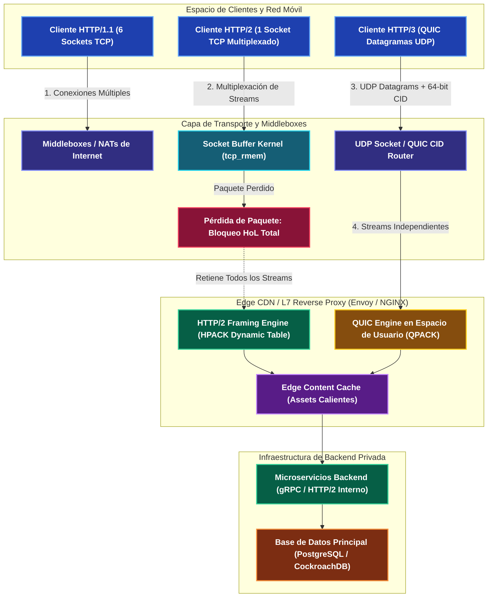
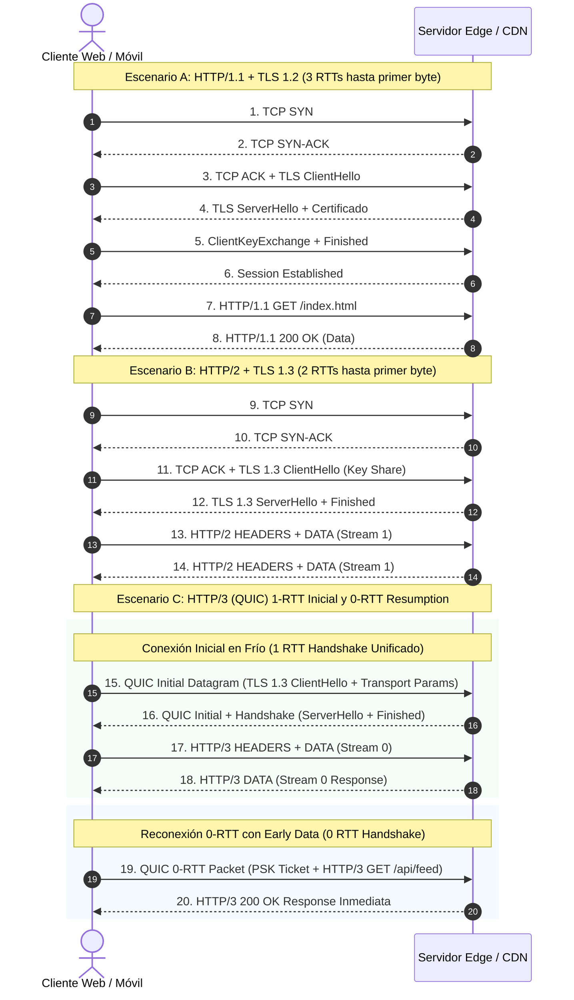

---
tags:
  - system-design
  - networking
  - http
  - quic
  - transport-layer
  - fase-1
aliases:
  - HTTP/1 vs HTTP/2 vs HTTP/3 y QUIC
  - Evolución del Protocolo HTTP
modulo: "01"
orden: 7
---

# 01.7 HTTP/1 vs HTTP/2 vs HTTP/3 y QUIC: Enmarcado Binario, Multiplexación y Transporte en Espacio de Usuario

> *"La evolución de los protocolos web es la historia de la lucha sistemática contra la latencia y el bloqueo de cabeza de línea (Head-of-Line Blocking): desde el texto plano secuencial de HTTP/1 hasta los streams binarios multiplexados sobre TCP en HTTP/2, culminando en la reimplementación completa de la capa de transporte en espacio de usuario sobre UDP con QUIC y HTTP/3."*

---

## 1. Evolución Arquitectónica: De HTTP/1.0 a HTTP/1.1

Para comprender el diseño de las arquitecturas de transporte modernas, es imprescindible analizar las limitaciones físicas que forzaron la transición generacional de los protocolos de la capa de aplicación.

### HTTP/1.0: Conexiones TCP Efímeras (RFC 1945)
Bajo la especificación de HTTP/1.0, cada transacción individual (petición/respuesta) requería la apertura y cierre de un socket TCP dedicado:
1. **Sobrecarga de Handshake:** Cada recurso exigía el handshake de 3 vías de TCP (`SYN` $\rightarrow$ `SYN-ACK` $\rightarrow$ `ACK`), duplicando el RTT antes de transmitir un solo byte de datos.
2. **Slow Start Perpetuo:** El algoritmo de control de congestión de TCP inicia cada conexión con una ventana de congestión mínima ($CWND \approx 10\text{ MSS}$). Al cerrar el socket inmediatamente después de entregar el payload, ningún recurso aprovechaba la capacidad real de ancho de banda del canal.

### HTTP/1.1: Conexiones Persistentes y Pipelining Fallido (RFC 2616 / RFC 7230 / RFC 9112)
HTTP/1.1 introdujo mejoras cruciales para mitigar el costo del ciclo de vida del socket:
- **Cabecera `Connection: keep-alive`:** Habilitada por defecto, permite reutilizar la misma conexión TCP subyacente para múltiples peticiones consecutivas, amortizando el costo del handshake y permitiendo que la ventana $CWND$ crezca.
- **Pipelining de Peticiones:** Diseñado conceptualmente para permitir que un cliente envíe múltiples peticiones HTTP consecutivas por el mismo socket sin esperar la respuesta de la anterior.

### El Talón de Aquiles: Head-of-Line (HoL) Blocking en Aplicación
Aunque el cliente podía enviar peticiones en pipeline, el estándar HTTP/1.1 **exigía que las respuestas fueran devueltas por el servidor en el orden cronológico estricto en que se recibieron**:
- Si la petición #1 corresponde a una consulta lenta a base de datos (ej. $1,500\text{ ms}$) y las peticiones #2 y #3 son assets estáticos en memoria ($5\text{ ms}$), el servidor está obligado a retener las respuestas #2 y #3 hasta concluir y transmitir la #1.
- **Vulnerabilidad de Middleboxes:** Muchos proxies e intermediarios en Internet implementaban el pipelining de manera defectuosa, provocando respuestas desincronizadas o corrupción de caché. Como consecuencia, todos los navegadores comerciales modernos desactivaron el pipelining por defecto.

### Parches de la Industria (Workarounds en la Era HTTP/1.1)
Para mitigar el bloqueo HoL a nivel de aplicación, la industria adoptó técnicas que incrementaron drásticamente la complejidad y el consumo de recursos en servidores:
- **Domain Sharding:** Los navegadores imponen un límite de 6 conexiones TCP simultáneas por dominio (`FQDN`). Los ingenieros crearon subdominios sintéticos (`cdn1.example.com`, `cdn2.example.com`, `cdn3.example.com`) para engañar al navegador y forzar la apertura de 18 a 24 sockets TCP en paralelo, multiplicando el consumo de memoria en servidores y la contención en el kernel.
- **Sprite Sheets y Bundling Masivo:** Agrupar cientos de iconos en un único PNG o concatenar decenas de módulos JavaScript en monolitos masivos (`bundle.js`) para reducir el número de peticiones HTTP, degradando la granularidad y la eficiencia de la memoria caché del cliente.
- **Resource Inlining:** Incrustar imágenes en formato Base64 directamente dentro del CSS o HTML, lo que infla el payload binario en un 33% debido a la codificación de 6 bits a 8 bits.

---

## 2. HTTP/2: Capa de Enmarcado Binario y Multiplexación

Estandarizado en 2015 bajo el **RFC 7540** (y actualizado en el **RFC 9113** a partir del trabajo experimental en SPDY de Google), HTTP/2 preservó la semántica original de HTTP (métodos `GET`, `POST`, códigos de estado, cabeceras) pero transformó radicalmente la capa de serialización física.

### La Capa de Enmarcado Binario (Binary Framing Layer)
A diferencia de HTTP/1.1, donde los mensajes se transmiten como secuencias de texto plano delimitadas por saltos de línea (`\r\n`), HTTP/2 introduce una capa intermedia que fragmenta cada mensaje HTTP en **frames binarios** estructurados.

```
+-------------------------------------------------------------------+
|                        Length (24 bits)                           |
+-----------------------------------+-------------------------------+
|            Type (8 bits)          |        Flags (8 bits)         |
+---+-------------------------------+-------------------------------+
| R |                     Stream Identifier (31 bits)               |
+---+---------------------------------------------------------------+
|                         Frame Payload (0...N bytes)               |
+-------------------------------------------------------------------+
```

#### Anatomía de la Cabecera de Frame de 9 Bytes (72 bits)
1. **Length (24 bits):** Define la longitud del payload en bytes (sin incluir la cabecera de 9 bytes). El límite estándar es $2^{14}$ (16,384 bytes), pero puede negociarse hasta $2^{24}-1$ (16,777,215 bytes) mediante el parámetro `SETTINGS_MAX_FRAME_SIZE`.
2. **Type (8 bits):** Determina el propósito y la estructura del payload del frame:
   - `DATA` (`0x0`): Transporta el cuerpo binario de la petición o respuesta.
   - `HEADERS` (`0x1`): Transporta metadatos y cabeceras HTTP comprimidas con HPACK; abre y define nuevos streams.
   - `PRIORITY` (`0x2`): Asigna o actualiza la prioridad y dependencia del stream dentro del árbol de renderizado.
   - `RST_STREAM` (`0x3`): Cancela abruptamente un stream específico sin cerrar la conexión TCP global.
   - `SETTINGS` (`0x4`): Negocia parámetros de configuración de la conexión (tamaño de tabla dinámica, concurrencia máxima).
   - `PUSH_PROMISE` (`0x5`): Notifica al cliente de un recurso que el servidor enviará proactivamente (*Server Push*).
   - `PING` (`0x6`): Mide el tiempo de ida y vuelta (RTT) y verifica la vitalidad del enlace (*keep-alive* activo).
   - `GOAWAY` (`0x7`): Inicia el apagado ordenado (*graceful shutdown*) de la conexión indicando el último Stream ID procesado.
   - `WINDOW_UPDATE` (`0x8`): Implementa control de flujo por crédito tanto a nivel de stream individual como de conexión global.
   - `CONTINUATION` (`0x9`): Continúa una secuencia de cabeceras que excede el tamaño máximo del frame `HEADERS`.
3. **Flags (8 bits):** Modificadores booleanos específicos del tipo de frame (ej. `END_STREAM` `0x1` indica el fin del mensaje; `END_HEADERS` `0x4` marca el término de un bloque de cabeceras).
4. **R (1 bit reservado):** Bit sin asignar, reservado para extensiones futuras (debe permanecer en `0`).
5. **Stream Identifier (31 bits):** Identificador numérico único del flujo al que pertenece el frame:
   - Streams iniciados por el cliente usan identificadores **impares** ($1, 3, 5, \dots$).
   - Streams iniciados por el servidor (mediante push) usan identificadores **pares** ($2, 4, 6, \dots$).
   - El identificador `0x0` está reservado exclusivamente para frames de control que aplican a la conexión global.

### Máquina de Estados de un Stream HTTP/2
Cada stream es un canal lógico bidireccional que atraviesa un ciclo de vida formal:
- **`idle`:** Estado inicial. Un frame `HEADERS` enviado o recibido transiciona el stream a `open`.
- **`open`:** Ambos extremos pueden enviar y recibir frames de datos (`DATA`).
- **`half-closed (local/remote)`:** Un extremo envió un frame con el flag `END_STREAM` activo; no puede transmitir más datos, pero sigue habilitado para recibir la respuesta.
- **`closed`:** El stream ha completado la transmisión en ambas direcciones o ha recibido un frame `RST_STREAM`.

```
                    +--------+
            send/recv |        | recv PP (remote)
           HEADERS   |  idle  |--------------------+
          +----------|        |                    |
          |          +--------+                    |
          v               |                        v
      +--------+          | send PP (local)    +--------+
      |        |          |                    |        |
      |  open  |          v                    |reserved|
      |        |      +--------+               | (rem)  |
      +--------+      |        |               +--------+
       |      |       |reserved|                    |
       |      |       | (local)|                    |
       |      |       +--------+                    |
       v      v            |                        v
  +---------------+        |                   +--------+
  |  half-closed  |<-------+                   | closed |
  +---------------+                            +--------+
          |
          v
      +--------+
      | closed |
      +--------+
```

### Priorización de Streams y Dependencias
HTTP/2 permite al cliente asignar prioridades declarando pesos (números entre 1 y 256) y dependencias jerárquicas en forma de árbol. Por ejemplo, el renderizado de CSS crítico puede declararse como padre del JavaScript secundario, garantizando que el scheduler del servidor dedique el ancho de banda TCP a los recursos bloqueantes de renderizado.

### El Nuevo Cuello de Botella: HoL Blocking a Nivel de Transporte (TCP)
Aunque HTTP/2 resolvió por completo el HoL Blocking de la capa de aplicación multiplexando múltiples streams lógicos sobre un único socket TCP, **trasladó la vulnerabilidad a la capa de transporte**:
- TCP garantiza la entrega secuencial y fiable de bytes (*in-order reliable byte stream*).
- Si un único paquete TCP que transporta un frame del Stream #3 se pierde o corrompe en la red, el socket buffer de recepción del kernel del SO (`tcp_rmem`) congela la entrega de datos.
- Aunque los frames de los Streams #1, #2 y #4 hayan llegado perfectamente al adaptador de red, la API de sockets POSIX de Linux no los expondrá a la aplicación hasta que el paquete perdido del Stream #3 sea retransmitido y confirmado vía ACK.
- En enlaces con alta tasa de pérdida de paquetes ($>2\%$), como redes inalámbricas o celulares, **HTTP/2 puede ofrecer un rendimiento significativamente inferior a HTTP/1.1 con múltiples sockets**.

---

## 3. Compresión de Cabeceras: HPACK (RFC 7541) vs QPACK (RFC 9204)

En la web moderna, una petición HTTP promedio transporta entre 500 y 2,000 bytes de cabeceras (`Cookie`, `User-Agent`, `Authorization`, `Sec-Ch-Ua`). En una página con 100 recursos, esto representa hasta 200 KB de sobrecarga de texto plano redundante.

### HPACK: Compresión Orientada a Conexión Secuencial (HTTP/2)
Para optimizar este tráfico sin incurrir en vulnerabilidades de canal lateral como **CRIME** o **BREACH** (las cuales atacan algoritmos de compresión basados en LZ77 como `gzip` mediante la correlación de payloads cifrados con secretos reflectados), el **RFC 7541** definió HPACK:
1. **Tabla Estática:** Tabla inmutable indexada del 1 al 61, que contiene las cabeceras y métodos más comunes de Internet (ej. índice `2` para `:method: GET`, índice `28` para `content-type: application/json`).
2. **Tabla Dinámica FIFO:** Tabla mutable gestionada en memoria por cliente y servidor durante la sesión. Cuando se envía una cabecera personalizada (ej. un token JWT de 800 bytes), esta se indexa en la tabla dinámica. Las siguientes 50 peticiones no retransmiten el token, sino únicamente su índice numérico (1 a 2 bytes).
3. **Codificación Huffman Estática:** Si un valor literal no está en la tabla, se comprime mediante un árbol Huffman predefinido optimizado para las frecuencias estadísticas del estándar ASCII en la web.

#### La Limitación Crítica de HPACK
HPACK asume que la capa de transporte entrega los frames de cabeceras en **orden estricto**. Si el cliente añade una entrada en la tabla dinámica en la Petición A y la referencia en la Petición B, el decodificador del servidor debe procesar A antes que B. Si un paquete se retrasa o llega desordenado, el decodificador se corrompe o debe bloquearse por completo.

### QPACK: Compresión Asíncrona para Streams No Ordenados (HTTP/3)
Dado que HTTP/3 opera sobre QUIC (donde los streams de datos son estrictamente independientes y se entregan fuera de orden), HPACK resultaría inviable. El **RFC 9204** introduce QPACK:
- **Desacoplamiento de Streams:** Las actualizaciones de la tabla dinámica ya no viajan mezcladas dentro de los streams de datos ordinarios.
- **Streams Unidireccionales de Control Dedicados:**
  - *Encoder Stream:* El emisor notifica la inserción de nuevas entradas en la tabla dinámica.
  - *Decoder Stream:* El receptor confirma mediante ACKs explícitos qué entradas de la tabla dinámica han sido procesadas satisfactoriamente.
- **Referencias Bloqueantes vs No Bloqueantes:** El emisor puede elegir entre emitir cabeceras literales sin estado (para evitar stalls) o referenciar la tabla dinámica asumiendo una espera acotada (*blocked streams*), resolviendo el compromiso entre compresión y latencia.

| Dimensión | HPACK (HTTP/2 - RFC 7541) | QPACK (HTTP/3 - RFC 9204) |
| :--- | :--- | :--- |
| **Capa de Transporte** | TCP (Flujo de bytes ordenado) | QUIC (Datagramas UDP desordenados) |
| **Sincronización de Tabla** | Implícita en el orden del socket TCP | Explícita vía Encoder/Decoder Streams dedicados |
| **Riesgo de HoL Blocking** | Inexistente en decodificación (garantizado por TCP) | Mitigado por diseño mediante control de streams bloqueados |
| **Manejo de Pérdida de Paquetes** | Si se pierde un paquete, toda la conexión se detiene | Si se pierde un stream, los demás streams decodifican sin pausa |

---

## 4. QUIC (RFC 9000) y HTTP/3 (RFC 9114): Transporte en Espacio de Usuario

Para resolver de manera definitiva las limitaciones intrínsecas de TCP, el IETF estandarizó **QUIC** (RFC 9000 para el protocolo de transporte, RFC 9001 para la integración criptográfica con TLS 1.3, RFC 9002 para el control de congestión) y **HTTP/3** (RFC 9114 para el mapeo semántico).

```
+------------------------------------+------------------------------------+
|            HTTP/2 Stack            |            HTTP/3 Stack            |
+------------------------------------+------------------------------------+
|               HTTP/2               |               HTTP/3               |
|            (RFC 7540)              |            (RFC 9114)              |
+------------------------------------+------------------------------------+
|              TLS 1.3               |                QUIC                |
|            (RFC 8446)              | (Streams, Congestión, TLS Embebido)|
+------------------------------------+            (RFC 9000)              |
|                TCP                 +------------------------------------+
|             (Kernel)               |                UDP                 |
+------------------------------------+------------------------------------+
|                                 IP                                      |
+-------------------------------------------------------------------------+
```

### ¿Por qué UDP y Espacio de Usuario?: Bypassing de la Osificación de la Red
Históricamente, diseñar un nuevo protocolo de transporte a nivel de kernel (como SCTP) fracasó debido a la **osificación de la red (*Middlebox Ossification*)**: millones de firewalls, balanceadores NAT y routers de tránsito descartan silenciosamente cualquier paquete que no sea TCP o UDP.
- Al encapsular el protocolo QUIC dentro de datagramas **UDP estándar en el puerto 443**, los paquetes atraviesan los middleboxes sin fricción.
- Toda la inteligencia del protocolo (control de congestión BBR/CUBIC, detección de pérdidas, ordenamiento de streams y cifrado) se ejecuta en **espacio de usuario (*user-space*)**, permitiendo a las empresas desplegar actualizaciones y mejoras de transporte en días sin esperar a que los proveedores de sistemas operativos actualicen sus kernels.

### Handshake Criptográfico Unificado (TLS 1.3 Embebido)
En arquitecturas TCP + TLS, el handshake de transporte y el de seguridad son fases secuenciales independientes:
1. TCP Handshake: 1 RTT (`SYN` $\rightarrow$ `SYN-ACK` $\rightarrow$ `ACK`).
2. TLS 1.3 Handshake: 1 RTT (`ClientHello` $\rightarrow$ `ServerHello`).
3. **Total:** 2 RTTs antes de que la aplicación envíe su primer byte de datos (3 RTTs si se usa TLS 1.2).

QUIC fusiona ambas capas en un protocolo monolítico:
- **1-RTT Initial Connection:** El paquete inicial de QUIC contiene los parámetros de transporte y el mensaje `ClientHello` de TLS 1.3. La sesión criptográfica y el enlace de transporte quedan plenamente establecidos en exactamente **1 RTT**.
- **0-RTT Early Data Resumption:** Si el cliente ya se conectó previamente al servidor y almacena una clave previamente compartida (*Pre-Shared Key - PSK* o Session Ticket), puede cifrar y transmitir la primera petición HTTP en el **paquete 0-RTT inicial**, logrando una latencia de establecimiento de conexión nula ($0\text{ ms}$).

#### Mitigación de Ataques de Replay en 0-RTT
El Early Data en 0-RTT es inherentemente vulnerable a **ataques de repetición (*Replay Attacks*)**: un atacante en la red puede capturar el paquete 0-RTT y reenviarlo múltiples veces al servidor. Para blindar el sistema:
1. **Restricción de Idempotencia:** Las especificaciones de arquitectura exigen que 0-RTT solo se habilite para métodos estrictamente idempotentes y seguros (`GET`, `HEAD`), prohibiendo transacciones de mutación (`POST`, `PUT`, pagos financieros).
2. **Strike Registers y Ventanas de Tiempo:** Los servidores perimetrales mantienen un registro volátil de alta velocidad (basado en filtros Bloom o tablas hash en memoria) con los identificadores únicos y marcas de tiempo de los paquetes 0-RTT recibidos recientemente. Si un identificador ya fue procesado dentro de la ventana de validez, el paquete es rechazado inmediatamente.

### Migración de Conexiones (Connection Migration)
En TCP, un socket está estrictamente vinculado a una 4-tupla fija: `(IP Origen, Puerto Origen, IP Destino, Puerto Destino)`. Si un usuario sale de su domicilio y su smartphone conmuta de la red Wi-Fi al enlace 5G:
- Su dirección IP de origen cambia inmediatamente.
- El socket TCP se invalida, provocando timeout o `TCP RST`, interrumpiendo streams de vídeo, descargas o llamadas WebRTC.

QUIC reemplaza la 4-tupla por un **Connection ID (CID) arbitrario de 64 bits** (hasta 20 bytes en la cabecera del paquete):
- El cliente y el servidor se identifican mutuamente a través del CID, con independencia de la IP o el puerto físico de origen.
- **Validación de Ruta (Path Probing):** Cuando la IP cambia, el servidor envía un frame `PATH_CHALLENGE` con 8 bytes de datos criptográficos aleatorios hacia la nueva dirección. El cliente debe responder con un frame `PATH_RESPONSE` que refleje el mismo payload. Esto previene ataques de amplificación DDoS en los que un cliente malicioso redirija tráfico masivo hacia la IP de una víctima.

### Aislamiento Estricto de Streams (Eliminación Definitiva de HoL Blocking)
En QUIC, cada stream de HTTP/3 posee su propia secuencia de offsets y buffers independientes. Si un datagrama UDP que transporta datos del Stream #1 se pierde en la red:
- Únicamente el Stream #1 se pausa a la espera de la retransmisión.
- Los paquetes correspondientes a los Streams #2, #3 y #4 son entregados **inmediatamente a la capa de aplicación sin retención en el kernel**.

---

## 5. Diagramas Arquitectónicos y Comparativa de Latencia



### Secuencia de Latencia de Establecimiento de Conexión



---

## 6. Casos de Estudio Reales en la Industria

### 1. Google: Origen y Evolución de QUIC en YouTube y Chrome
Google concibió QUIC en 2012 para abordar la degradación de latencia en dispositivos móviles con transmisiones de vídeo. Al implementar QUIC en YouTube y Chrome:
- Reportó una **reducción del 18% en el tiempo de buffering de vídeo en redes móviles globales** y un **3.6% en conexiones de escritorio a nivel mundial**.
- En regiones con infraestructura de red de alta latencia y pérdida de paquetes (ej. India y el Sudeste Asiático), la mejora en el tiempo de carga de búsqueda superó el **13%**, demostrando el impacto directo del aislamiento de streams sobre UDP.

### 2. Cloudflare: Despliegue Perimetral de HTTP/3 y Sobrecarga de CPU
Cloudflare habilitó soporte para HTTP/3 en su red de borde para millones de dominios de Internet:
- **El Desafío de CPU en UDP:** A diferencia de TCP, el cual se beneficia de décadas de optimizaciones a nivel de hardware en las tarjetas de red (NIC) mediante **TSO** (*TCP Segmentation Offload*) y **LRO/GRO** (*Large/Generic Receive Offload*), UDP carecía históricamente de estas capacidades en Linux. Procesar paquetes UDP individuales en espacio de usuario incrementaba el consumo de CPU en los servidores de borde hasta en un $2.5\times$ en comparación con TCP.
- **La Solución Arquitectónica:** Cloudflare implementó **GSO** (*Generic Segmentation Offload*) para UDP, llamadas al sistema por lotes (`sendmmsg()` y `recvmmsg()`), y enrutamiento perimetral con **eBPF/XDP**, reduciendo el diferencial de CPU a niveles prácticamente despreciables.

### 3. Meta (Facebook / Instagram): mvfst y Resiliencia en Red Móvil
Meta desarrolló su propia implementación de código abierto de QUIC en C++ (**mvfst**) y la desplegó en la totalidad de sus aplicaciones cliente móviles (Facebook, Instagram, WhatsApp):
- Constataron una **reducción del 6% en la latencia de carga estática en el percentil P99** en redes celulares congestionadas.
- La migración de conexión (*Connection Migration*) redujo drásticamente los fallos de red y reconexiones en usuarios que se desplazan activamente entre antenas celulares o conmutan entre Wi-Fi y 4G/5G.

---

## 7. Estimaciones Cuantitativas y Micro-Cálculo Mental

### 1. Probabilidad de Bloqueo HoL en Conexiones Multiplexadas HTTP/2
Si una conexión TCP multiplexa $M$ streams concurrentes (o transmite $M$ paquetes dentro de una ventana de congestión) sobre un enlace con una probabilidad independiente de pérdida de paquetes $p$, la probabilidad de que **al menos un paquete se pierda e induzca un congelamiento total (stall) de todos los streams en el socket buffer del kernel** se modela mediante:

$$P(\text{stall}) = 1 - (1 - p)^M$$

En contraste, en HTTP/3 sobre QUIC, la pérdida de un paquete no detiene los streams concurrentes; el impacto queda confinado estrictamente al stream afectado:

$$P(\text{stall por stream en HTTP/3}) = p$$

### 2. Ahorro de Ancho de Banda con Compresión de Cabeceras (HPACK)
El porcentaje de reducción de sobrecarga de cabeceras en un conjunto de $N$ peticiones consecutivas se calcula mediante:

$$\text{Ahorro}_{\text{HPACK}} = 1 - \frac{B_{\text{inicial}} + (N - 1) \cdot B_{\text{índice}}}{N \cdot B_{\text{texto\_plano}}}$$

Donde $B_{\text{inicial}}$ es el tamaño de la cabecera en el primer frame, $B_{\text{índice}}$ es el tamaño promedio de los índices dinámicos (típicamente 2 a 12 bytes), y $B_{\text{texto\_plano}}$ es el tamaño de las cabeceras en texto plano en HTTP/1.1 (típicamente 800 bytes).

---

> [!TIP]- Micro-Cálculo Mental: Probabilidad de Bloqueo HoL en HTTP/2 vs HTTP/3 y Ahorro HPACK
> **Escenario de Entrevista:** Una aplicación móvil de catálogo de productos carga **$M = 20$ recursos concurrentes** (imágenes, scripts, peticiones GraphQL) en un enlace celular 4G con una tasa de pérdida de paquetes del **$p = 2\%$ ($0.02$)**.
> 
> **Parte A: Probabilidad de Congelamiento por HoL Blocking (HTTP/2 vs HTTP/3)**
> 1. **En HTTP/2 (1 único socket TCP multiplexado):**
>    - Probabilidad de que un paquete no se pierda: $1 - p = 0.98$.
>    - Probabilidad de que ninguno de los 20 paquetes se pierda: $(0.98)^{20}$.
>    - *Aproximación mental:* $(1 - x)^n \approx 1 - nx$ para valores pequeños de $nx$.  
>      $(0.98)^{20} \approx 1 - (20 \times 0.02) = 1 - 0.40 = \mathbf{0.60}$ (Cálculo exacto: $0.6676$).
>    - Probabilidad de bloqueo total de la conexión:
>      $$P(\text{stall}) = 1 - 0.6676 = \mathbf{33.24\%}$$
>    - *Impacto:* **1 de cada 3 cargas experimenta un congelamiento general** de todos los recursos mientras el kernel retransmite el paquete TCP faltante.
> 
> 2. **En HTTP/3 (QUIC sobre UDP):**
>    - Cada stream procesa sus datagramas de manera independiente.
>    - Si el paquete de un stream se pierde, los otros **19 streams ($98\%$) continúan decodificando y renderizando en pantalla sin retraso**.
> 
> ---
> 
> **Parte B: Reducción de Sobrecarga de Cabeceras (HTTP/1.1 vs HPACK)**
> - Una sesión ejecuta **$N = 100$ peticiones**. Cada petición HTTP/1.1 transporta $800\text{ bytes}$ de cabeceras en texto plano.
>   $$\text{Tráfico HTTP/1.1} = 100 \times 800\text{ B} = \mathbf{80,000\text{ bytes (80 KB)}}$$
> - En HTTP/2 con HPACK:
>   - Petición 1 (definición en tabla dinámica): $800\text{ bytes}$.
>   - Peticiones 2 a 100 (referencias por índice dinámico): $99 \times 12\text{ bytes} = 1,188\text{ bytes}$.
>   $$\text{Tráfico HPACK} = 800 + 1,188 = \mathbf{1,988\text{ bytes (~2 KB)}}$$
> - **Ahorro Efectivo:**
>   $$\text{Ahorro} = 1 - \frac{1,988}{80,000} = 1 - 0.0248 = \mathbf{97.5\%}$$
> 
> *Lección Senior:* En redes móviles congestionadas, la multiplexación sobre TCP de HTTP/2 se vuelve contraproducente a medida que aumenta la pérdida de paquetes ($P(\text{stall}) \propto M$). En esos entornos, QUIC es la única arquitectura capaz de mantener la concurrencia sin amplificar el bloqueo HoL.

---

## 🎯 Guion de Entrevista: Cómo defender este tema en 2 minutos

Si un entrevistador plantea: *"Explícame la evolución arquitectónica de HTTP/1.1 a HTTP/2 y HTTP/3, cómo funcionan los mecanismos de multiplexación y por qué QUIC resolvió los cuellos de botella fundamentales a nivel de sistema operativo"*, articúlalo en **5 pasos estratégicos**:

> 🗣️ **Pitch Profesional de 5 Pasos:**
> 1. **Fundamentos y Limitaciones de HTTP/1.1:** *"HTTP/1.1 implementó conexiones Keep-Alive para amortizar handshakes TCP, pero sufría de Head-of-Line Blocking a nivel de aplicación: las respuestas debían retornar en orden FIFO estricto. La industria aplicó parches costosos como Domain Sharding para abrir múltiples sockets paralelos, saturando la memoria del kernel y los buffers de red."*
> 2. **Enmarcado Binario y Multiplexación en HTTP/2:** *"HTTP/2 resolvió esto mediante la capa de enmarcado binario con cabeceras fijas de 9 bytes, descomponiendo mensajes en frames atómicos tipificados e intercalando múltiples streams lógicos con pesos y prioridades sobre un único socket TCP, optimizando el ancho de banda con compresión HPACK."*
> 3. **El Cuello de Botella de Transporte en TCP:** *"El problema de HTTP/2 es que TCP es una abstracción de flujo continuo ordenado. Si un solo segmento TCP se pierde, el buffer `tcp_rmem` del kernel retiene todos los streams posteriores hasta que el paquete perdido es retransmitido, provocando que en redes inalámbricas con pérdida moderada HTTP/2 rinda peor que HTTP/1.1."*
> 4. **Arquitectura QUIC y HTTP/3 sobre UDP:** *"HTTP/3 reemplaza TCP por QUIC en espacio de usuario sobre datagramas UDP para evitar la osificación de middleboxes. QUIC unifica el handshake de transporte y TLS 1.3 en 1 RTT (con capacidad 0-RTT Early Data), elimina el HoL blocking al independizar los streams a nivel de datagrama, e introduce Connection IDs de 64 bits para permitir migración de conexión fluida entre Wi-Fi y redes celulares."*
> 5. **Compresión QPACK y Consideraciones en Producción:** *"Debido a que los streams en QUIC llegan fuera de orden, HPACK fue sustituido por QPACK, que usa streams unidireccionales dedicados de encoder y decoder para actualizar tablas dinámicas sin bloqueos. A nivel arquitectónico, QUIC se adopta en el borde (Clientes $\rightarrow$ CDN/Edge) para maximizar la resiliencia del último tramo, manteniendo HTTP/2 o gRPC sobre TCP en la red privada interna donde no hay pérdida de paquetes y TCP cuenta con aceleración en hardware."*

---

## Preguntas Clave de Active Recall

> [!QUESTION]- Active Recall #1: ¿Por qué en un enlace celular con 2% de pérdida de paquetes HTTP/2 puede presentar peor rendimiento percibido que HTTP/1.1 con 6 conexiones paralelas?
> **Respuesta:** En HTTP/1.1, las 6 conexiones TCP son completamente independientes a nivel de socket en el kernel del sistema operativo. Si un paquete se pierde en la conexión #1, solo esa petición se bloquea; las otras 5 conexiones continúan recibiendo datos y permitiendo el renderizado en la aplicación. En HTTP/2, todos los streams comparten un único socket TCP. La pérdida de un solo paquete congela el buffer de recepción del kernel (`tcp_rmem`), deteniendo la entrega de todos los demás streams multiplexados hasta que el segmento perdido es recuperado mediante retransmisión TCP. Con $M = 20$ paquetes o streams, la probabilidad de congelamiento global alcanza $1 - (1 - 0.02)^{20} \approx 33.2\%$.

---

> [!QUESTION]- Active Recall #2: ¿Por qué HTTP/3 necesitó sustituir el algoritmo HPACK por QPACK y cómo evita este último la corrupción de la tabla dinámica ante paquetes desordenados?
> **Respuesta:** HPACK asume que la capa de transporte entrega los frames de cabeceras en orden secuencial estricto. Si una cabecera referencia una entrada dinámica previa que aún no ha llegado debido a retraso o pérdida en la red, la decodificación falla o se corrompe. Dado que QUIC entrega streams de forma independiente y asíncrona sobre UDP, HPACK habría forzado un bloqueo masivo entre streams (*HoL blocking en compresión*). QPACK lo resuelve separando el flujo: las inserciones en la tabla dinámica se transmiten por un **Encoder Stream** unidireccional dedicado y se confirman mediante un **Decoder Stream**, permitiendo que los streams de datos ordinarios referencien cabeceras validadas o utilicen literales no bloqueantes sin detenerse.

---

> [!NOTE]- Desafío Feynman: La Autopista, el Tren de Mercancías y la Flota de Drones Autónomos
> Imagina el transporte de mercancías desde una fábrica (servidor) hasta una tienda (cliente):
> - **HTTP/1.1:** Es una carretera de un solo carril con un peaje manual. Cada camión (petición) debe llegar a destino, descargar y volver antes de que el siguiente camión pueda salir. Para acelerarlo, contratabas 6 camiones por 6 carreteras distintas (las 6 conexiones paralelas), pero el costo y la congestión eran enormes.
> - **HTTP/2:** Es un tren de carga de alta velocidad con 50 vagones en una sola vía férrea. Transporta cientos de cajas rotuladas con identificadores a la vez. Sin embargo, si un árbol cae en la vía y descarrila el vagón #3 (se pierde un paquete TCP), **todo el tren completo se detiene en seco**, y los otros 49 vagones quedan atrapados esperando a que los operarios retiren el obstáculo.
> - **HTTP/3 (QUIC):** Es una flota de 50 drones autónomos volando de forma independiente por el aire (datagramas UDP). Si el viento desvía o derriba al dron #3, los otros 49 drones siguen volando y aterrizando en la tienda sin detenerse un solo segundo. Además, cada dron lleva el número de cliente tatuado (el Connection ID), por lo que si la tienda cambia de dirección a mitad del vuelo (migración de Wi-Fi a 5G), los drones redirigen su trayectoria sin perder el envío.

---

## Conceptos Relacionados
- [[01.0_El_Viaje_Completo_de_una_Peticion_HTTP|01.0 El Viaje Completo de una Petición HTTP (Request Lifecycle)]]
- [[01.1_DNS_Resolucion_de_Nombres_y_Anycast|01.1 DNS: Resolución Jerárquica, Registros y Enrutamiento Anycast]]
- [[01.2_CDNs_Push_vs_Pull_y_Edge_Caching|01.2 CDNs: Redes de Distribución de Contenido y Edge Caching]]
- [[01.3_Balanceadores_de_Carga_L4_vs_L7_Active-Active_vs_Active-Passive|01.3 Balanceadores de Carga L4 vs L7]]
- [[01.4_Reverse_Proxy_vs_Forward_Proxy_vs_API_Gateway|01.4 Reverse Proxy vs Forward Proxy vs API Gateway]]
- [[01.6_TCP_vs_UDP_Protocolos_de_Transporte|01.6 TCP vs UDP: Protocolos de Transporte]]
- [[06.0_REST_vs_GraphQL_vs_gRPC_vs_RPC_Comparativa_Total|06.0 Protocolos de Comunicación y APIs]]
- [[08.0_Latencias_que_Todo_Programador_Debe_Saber|08.0 Latencias que Todo Programador Debe Saber]]
- [[00_MOC_System_Design_Mastery|Volver al Índice Maestro (MOC)]]
