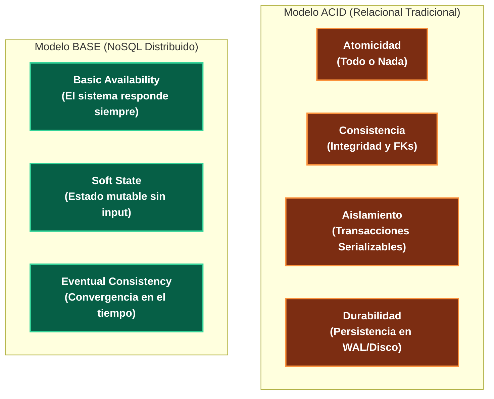
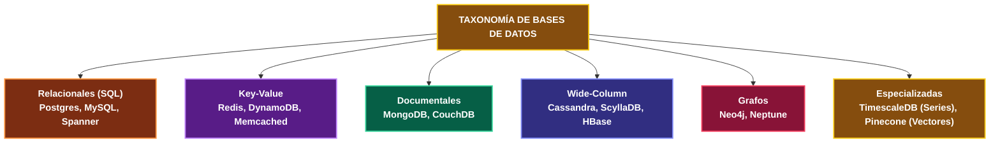
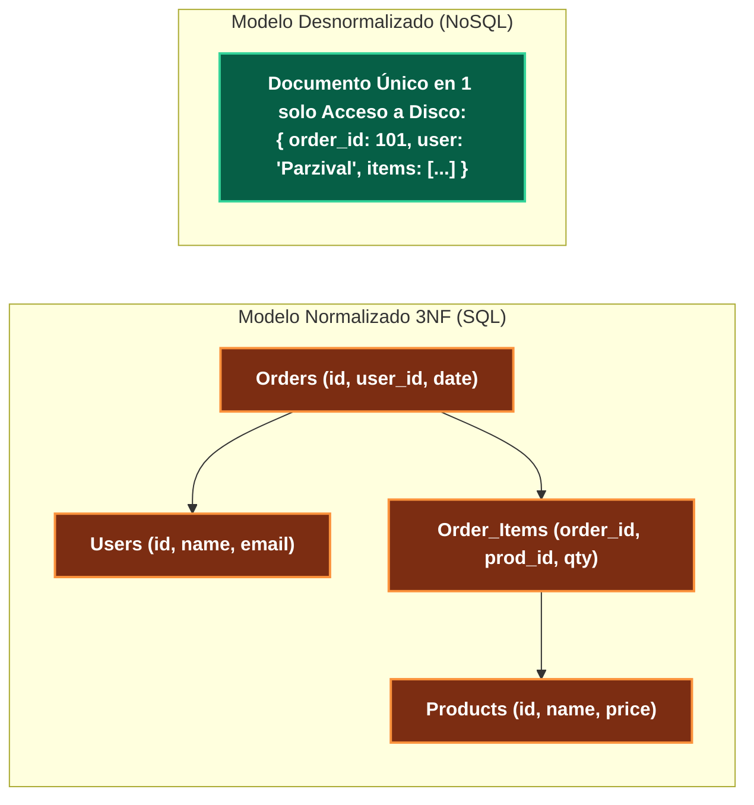

---
tags:
  - system-design
  - database
  - sql
  - nosql
  - storage
  - fase-2
aliases:
  - SQL vs NoSQL
  - Taxonomía de Bases de Datos
modulo: "02"
orden: 0
---

# 02.0 Taxonomía de Bases de Datos: SQL Relacional vs NoSQL y Paradigmas ACID / BASE

> *"No existe una base de datos universalmente superior: la elección entre SQL y NoSQL es un balance entre garantías transaccionales estrictas y flexibilidad de escala horizontal."*

---

## 1. El Dilema Fundamental: ACID vs BASE

Las bases de datos se dividen fundamentalmente según el modelo de garantías que ofrecen a la aplicación:

### Definición Rigurosa de ACID:
* **Atomicidad:** Una transacción se ejecuta completamente o se revierte en su totalidad (*Rollback*). No existen estados intermedios visibles.
* **Consistencia:** Toda transacción lleva a la base de datos de un estado válido a otro, respetando restricciones (*Constraints*, tipos, claves foráneas, triggers).
* **Aislamiento (*Isolation*):** El efecto de transacciones concurrentes es idéntico a si se ejecutaran secuencialmente. Niveles estándar SQL:
  1. *Read Uncommitted* (Permite lecturas sucias / *Dirty Reads*).
  2. *Read Committed* (Evita lecturas sucias; estándar en PostgreSQL).
  3. *Repeatable Read* (Evita lecturas no repetibles; usa MVCC).
  4. *Serializable* (Aislamiento total; previene anomalías de escritura fantasma).
* **Durabilidad:** Una vez confirmada (*Commit*), la transacción sobrevive a caídas de energía o fallos del sistema operativo (garantizado por el *Write-Ahead Log* o WAL).

---

## 2. Taxonomía Completa de Motores de Almacenamiento

---

## 3. Matriz Comparativa y Criterios de Selección

| Dimensión | SQL (Relacional) | NoSQL Documental | NoSQL Key-Value | NoSQL Wide-Column |
| :--- | :--- | :--- | :--- | :--- |
| **Modelo de Datos** | Tablas con filas y columnas fijas. | Documentos jerárquicos (JSON/BSON). | Pares clave-valor simples o estructurados. | Filas con conjuntos dinámicos de columnas por partición. |
| **Esquema (*Schema*)** | Estricto (*Schema-on-Write*). | Dinámico / Flexible (*Schema-on-Read*). | Sin esquema. | Flexible por fila (*Sparse Tables*). |
| **Relaciones y Joins** | Complejas y nativas en motor ($O(M \bowtie N)$). | Desaconsejadas (se resuelven en app o por incrustación). | Inexistentes. | Inexistentes (requiere modelar vistas por query). |
| **Escalabilidad Típica** | Vertical (Scale Up) + Read Replicas. | Horizontal (Sharding nativo por clave). | Horizontal masiva (Hashing consistente). | Horizontal extrema (Cientos de nodos sin master). |
| **Patrón de Acceso Ideal** | Queries analíticas variadas, reportes, datos normalizados. | Entidades ricas y autocontenidas (e-commerce, perfiles). | Caché, sesiones de usuario, contadores en tiempo real. | Series temporales, telemetría IoT, mensajería a gran escala. |

---

## 4. Normalización vs Desnormalización

### Trade-offs:
* **Normalización (3NF):**
  - *Ventaja:* Cero redundancia de datos. Una actualización de precio se hace en un único registro.
  - *Desventaja:* Consultas costosas con múltiples `JOIN` que degradan la CPU a gran volumen.
* **Desnormalización:**
  - *Ventaja:* Lecturas a velocidad ultra-rápida (1 solo acceso a disco lee toda la entidad agregada).
  - *Desventaja:* Duplicación masiva de datos y riesgo de inconsistencia si una actualización no propaga a todas las copias.

---

## Microtareas de Retención Intelectual

> [!QUESTION]- Active Recall: ¿Cuál es la diferencia entre Schema-on-Write y Schema-on-Read?
> **Respuesta:** En **Schema-on-Write** (SQL), el motor de la base de datos valida estrictamente los tipos de datos, nulabilidad y restricciones de integridad en el momento exacto de ejecutar un `INSERT` o `UPDATE`; si falla una regla, la escritura se rechaza. En **Schema-on-Read** (NoSQL), la base de datos almacena texto crudo o bytes sin validar; es la aplicación consumidora la encargada de interpretar y parsear la estructura cuando ejecuta un `SELECT` o `find()`.

---

> [!TIP]- Micro-Cálculo Mental: Impacto de JOINs masivos
> **Reto:** Una consulta SQL realiza un `INNER JOIN` entre una tabla de Usuarios (**1,000,000 filas**) y una tabla de Pedidos (**10,000,000 filas**) sin un índice en la clave foránea `user_id` (Nested Loop Join ingenuo).
> ¿Cuántas comparaciones de registros debe procesar la CPU en el peor caso?
> **Cálculo:**
> - $1,000,000 \times 10,000,000 = \mathbf{10^{13} \text{ comparaciones (10 billones)}}$.
> - Con un índice B-Tree ($O(\log N)$): $1,000,000 \times \log_2(10,000,000) \approx 1,000,000 \times 24 = \mathbf{2.4 \times 10^7 \text{ operaciones}}$ (400,000 veces menos trabajo).

---

> [!WARNING]- Dilema Arquitectónico: Sistema de Facturación vs Catálogo de Productos
> **Escenario:** Estás diseñando el sistema central de una plataforma de comercio electrónico.
> **Pregunta:** ¿Qué motor eliges para el libro contable/pagos y cuál para el catálogo de productos con atributos variables (tallas, colores, voltajes)?
> **Respuesta:**
> - **Libro contable / Pagos:** **SQL Relacional (PostgreSQL / CockroachDB)** con transacciones ACID para evitar cobros dobles o balances inconsistentes.
> - **Catálogo de productos:** **NoSQL Documental (MongoDB / DynamoDB)** o **Motor de Búsqueda (Elasticsearch)** para soportar atributos heterogéneos y filtros dinámicos sin alterar esquemas de tablas en cada nuevo producto.

---

> [!NOTE]- Desafío Feynman: Normalización vs Desnormalización
> - **Normalizado (SQL):** Es como organizar un taller mecánico con cada tornillo en una gaveta numerada; no repites ningún tornillo, pero para armar un auto debes caminar por 20 gavetas distintas.
> - **Desnormalizado (NoSQL):** Es como armar kits completos en cajas selladas con todos los tornillos que necesita cada auto; usas más espacio de almacenamiento y duplicas piezas, pero tomas la caja completa en 1 segundo.

---

## Conceptos Relacionados
- [[02.1_Motores_de_Indices_B-Tree_vs_LSM-Tree|02.1 Motores de Índices B-Tree vs LSM-Tree]]
- [[02.3_Particionamiento_y_Sharding_de_BBDD|02.3 Particionamiento y Sharding de BBDD]]
- [[03.0_Teorema_CAP_Analisis_Riguroso|03.0 Teorema CAP]]
- [[00_MOC_System_Design_Mastery|Volver al Índice Maestro (MOC)]]
