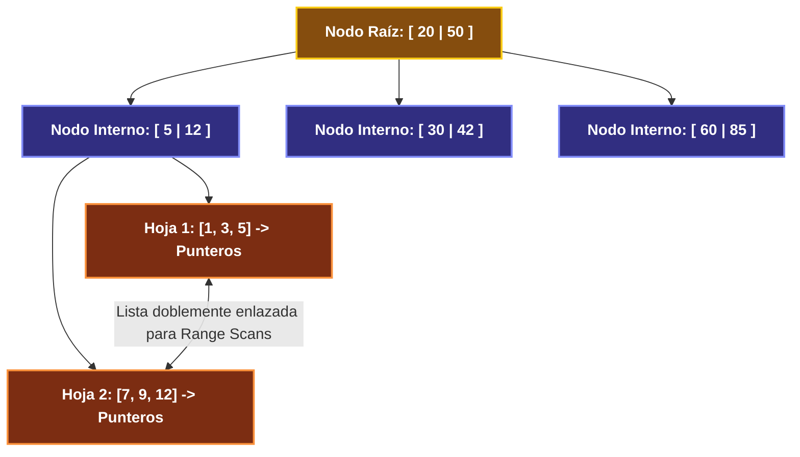
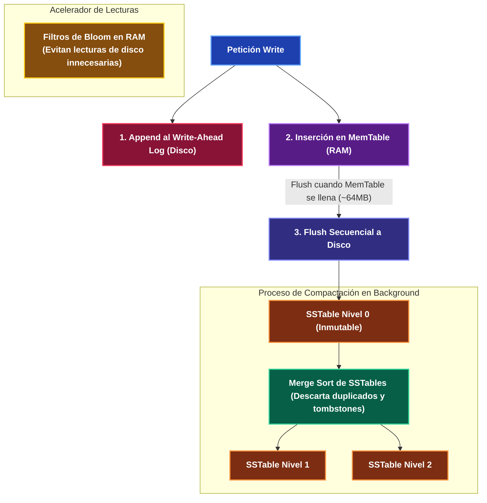

---
tags:
  - system-design
  - database-internals
  - indexing
  - b-tree
  - lsm-tree
  - fase-2
aliases:
  - Motores de Índices B-Tree vs LSM-Tree
  - Estructuras Internas de Almacenamiento
modulo: "02"
orden: 1
---

# 02.1 Motores de Índices: B-Tree / B+Tree vs Log-Structured Merge-Tree (LSM-Tree)

> *"La velocidad de una base de datos no está determinada por el lenguaje en que fue escrita, sino por la estructura de datos que utiliza para escribir y leer bloques en disco físico."*

---

## 1. El Problema de Hardware: Acceso Secuencial vs Acceso Aleatorio

En discos mecánicos (HDD) y unidades de estado sólido (NVMe/SSD):
* **Escritura Secuencial:** Es órdenes de magnitud más rápida que la escritura aleatoria.
* **Escritura Aleatoria:** Requiere reescribir bloques o mover cabezales, provocando degradación de rendimiento y fenómeno de *Write Amplification*.

---

## 2. Mecánica Interna de B-Tree y B+Tree

Utilizado en: **PostgreSQL, MySQL (InnoDB), SQLite, Oracle**.

### Características de B+Tree:
* **Estructura Auto-balanceada:** Todas las hojas están exactamente a la misma profundidad.
* **Nodos Internos:** Solo contienen claves de enrutamiento (alto factor de ramificación / *fan-out* $> 100$).
* **Hojas Vinculadas:** Las páginas de hojas están conectadas como una lista doblemente enlazada, permitiendo escaneos por rango (`WHERE age BETWEEN 20 AND 30`) en tiempo $O(\log N + K)$.
* **Complejidad:** Búsqueda: $O(\log N)$, Inserción: $O(\log N)$, Borrado: $O(\log N)$.

---

## 3. Mecánica Interna de LSM-Tree

Utilizado en: **Apache Cassandra, RocksDB, ScyllaDB, Google Bigtable, LevelDB, InfluxDB**.

### Componentes Críticos de LSM-Tree:
1. **MemTable:** Estructura en memoria RAM (usualmente un *SkipList*) que mantiene los datos siempre ordenados por clave.
2. **Write-Ahead Log (WAL):** Registro append-only en disco que garantiza durabilidad en caso de corte eléctrico.
3. **SSTable (Sorted String Table):** Archivos inmutables en disco donde las claves están estrictamente ordenadas. Una vez escrita, una SSTable **jamás se modifica**.
4. **Tombstones (Lápidas):** Las eliminaciones no borran datos inmediatamente, sino que escriben un registro marcador (*Tombstone*) indicando que la clave fue borrada.
5. **Compaction:** Proceso en segundo plano que fusiona múltiples SSTables mediante *Merge Sort*, descartando versiones viejas de claves y registros marcados con Tombstones.
6. **Bloom Filters (Filtros de Bloom):** Estructura probabilística en memoria RAM que responde si una clave **definitivamente NO está** en una SSTable, evitando lecturas innecesarias a disco en lecturas fallidas.

---

## 4. Comparativa de Rendimiento y Trade-offs

| Métrica / Operación | B-Tree (Postgres/MySQL) | LSM-Tree (Cassandra/RocksDB) |
| :--- | :--- | :--- |
| **Escrituras (Throughput)** | Moderado (Random I/O para actualizar páginas en disco). | **Extremadamente Alto** (Escritura secuencial append-only a RAM y WAL). |
| **Lecturas Puntuales (Point Lookup)**| **Muy Rápido** (Acceso directo por índice en 1-3 saltos de página). | Más lento (debe revisar MemTable y múltiples SSTables si el Bloom Filter da positivo). |
| **Lecturas por Rango (Range Scans)** | **Excelente** (Hojas secuenciales enlazadas). | Moderado (requiere fusionar streams de múltiples SSTables). |
| **Write Amplification (WA)** | Alto (escribir 10 bytes reescribe una página entera de 8KB). | Bajo en la entrada, moderado/alto durante la compactación en background. |
| **Uso de Espacio en Disco** | Menor fragmentación; espacio recuperado de inmediato. | Mayor consumo temporal hasta que ocurre la compactación. |

---

## Microtareas de Retención Intelectual

> [!QUESTION]- Active Recall: ¿Qué es un Filtro de Bloom y cómo acelera las lecturas en LSM-Tree?
> **Respuesta:** Es una estructura de datos probabilística compacta en memoria RAM basada en funciones hash. Puede determinar con 100% de certeza si un elemento **NO existe** en una SSTable de disco (ahorrando un I/O de lectura física), pero tiene una pequeña tasa de falsos positivos (puede decir que quizá existe cuando no está). Nunca tiene falsos negativos.

---

> [!TIP]- Micro-Cálculo Mental: Fan-out y Profundidad de un B+Tree
> **Reto:** Un índice B+Tree tiene páginas de **8 KB**. Cada entrada de clave + puntero mide **32 bytes** (Factor de ramificación o Fan-out $= \frac{8192}{32} = 256$).
> Con un árbol de **altura 3** (Raíz → Nivel 1 → Hojas):
> ¿Cuántos registros puede indexar antes de necesitar un cuarto nivel de profundidad?
> **Cálculo:**
> - Capacidad $= 256^3 = \mathbf{16,777,216 \text{ registros}}$.
> - Con altura 4: $256^4 = \mathbf{4,294,967,296 \text{ registros}}$ (4.2 mil millones).
> - *Lección:* Un B+Tree solo requiere **3 a 4 lecturas de página** para ubicar cualquier registro entre miles de millones.

---

> [!WARNING]- Dilema Arquitectónico: Elección de Motor para Ingesta de Telemetría vs Base Bancaria
> **Escenario:** Estás diseñando el sistema de ingesta de 500,000 eventos/segundo emitidos por vehículos autónomos (99% escrituras continuas, 1% lecturas analíticas).
> **Pregunta:** ¿Utilizas un motor basado en B-Tree (ej. PostgreSQL estándar) o LSM-Tree (ej. ScyllaDB / Cassandra)?
> **Respuesta:** **LSM-Tree (ScyllaDB / Cassandra / ClickHouse).** La tasa de 500k escrituras/segundo colapsaría el subsistema de E/S de disco de un B-Tree por contención de bloqueos y escrituras aleatorias. LSM-Tree absorbe la ráfaga secuencialmente en RAM y WAL a máxima velocidad de hardware.

---

> [!NOTE]- Desafío Feynman: B-Tree vs LSM-Tree
> - **B-Tree:** Es como una enciclopedia impresa con índice alfabético estricto; cada vez que cambias una palabra, debes borrar con corrector y reescribir con cuidado en la página exacta.
> - **LSM-Tree:** Es como un cuaderno de notas rápido donde escribes todo al final de la hoja según va ocurriendo; al final del día, te sientas con calma a pasar en limpio, ordenar y tachar las notas viejas.

---

## Conceptos Relacionados
- [[02.0_SQL_vs_NoSQL_Taxonomia_Completa|02.0 Taxonomía de Bases de Datos]]
- [[02.5_Wide-Column_y_Graph_Databases_Cassandra_Neo4j|02.5 Wide-Column y Cassandra]]
- [[02.6_Optimizacion_SQL_y_Query_Tuning|02.6 Optimización SQL y Query Tuning]]
- [[00_MOC_System_Design_Mastery|Volver al Índice Maestro (MOC)]]
