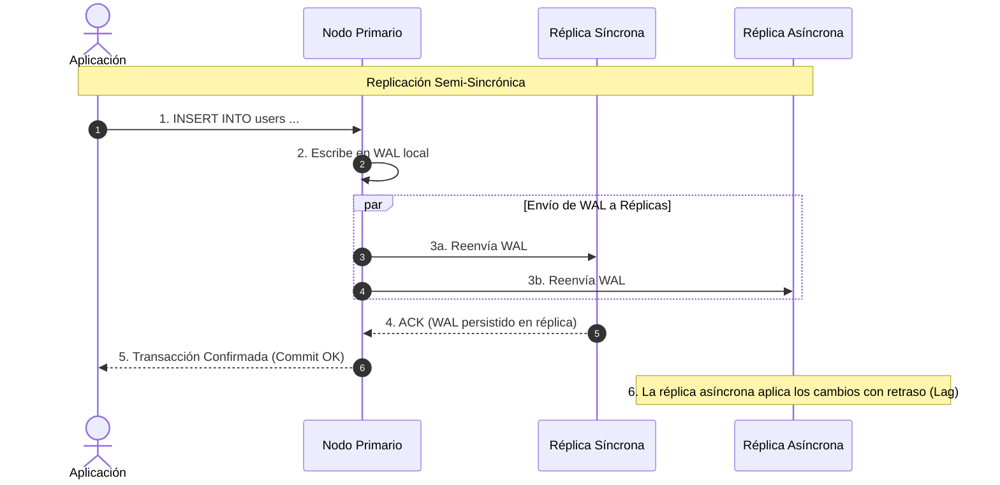

---
tags:
  - system-design
  - database
  - replication
  - high-availability
  - consensus
  - fase-2
aliases:
  - Replicación y Failover
  - Master-Slave vs Multi-Master
modulo: "02"
orden: 2
---

# 02.2 Replicación de Bases de Datos: Leader-Follower, Multi-Leader, Modelos sin Líder y Failover

> *"Replicar datos no solo previene la pérdida de información ante catástrofes de hardware; distribuye la carga de lectura global y define la latencia mínima de escritura de un cluster."*

---

## 1. Topologías de Replicación

```mermaid
graph TD
    subgraph 1. Single-Leader / Master-Slave (Postgres, MySQL)
        ClientW1["Escrituras"]:::client --> Leader1["Líder (Master - Lectura/Escritura)"]:::highlight
        Leader1 -->|"Replicación WAL"| Follower1["Seguidor 1 (Read Only)"]:::service
        Leader1 -->|"Replicación WAL"| Follower2["Seguidor 2 (Read Only)"]:::service
        ClientR1["Lecturas"]:::client --> Follower1
        ClientR1 --> Follower2
    end
    
    subgraph 2. Multi-Leader / Active-Active (Multi-Región)
        DC1["Datacenter US-East (Líder A)"]:::service <-->|"Sincronización Bidireccional Asíncrona (Resolución de Conflictos LWW / CRDTs)"| DC2["Datacenter EU-West (Líder B)"]:::service
    end
    
    subgraph 3. Leaderless / Sin Líder (Cassandra, DynamoDB)
        ClientW3["Cliente"]:::client -->|"Escribe a Nodos en Paralelo (Quorum W=2)"| N1["Nodo 1"]:::service
        ClientW3 --> N2["Nodo 2"]:::service
        ClientW3 --> N3["Nodo 3"]:::service
    end

    classDef client fill:#1e40af,stroke:#60a5fa,stroke-width:2px,color:#ffffff,font-weight:bold;
    classDef proxy fill:#312e81,stroke:#818cf8,stroke-width:2px,color:#ffffff,font-weight:bold;
    classDef service fill:#065f46,stroke:#34d399,stroke-width:2px,color:#ffffff,font-weight:bold;
    classDef database fill:#7c2d12,stroke:#fb923c,stroke-width:2px,color:#ffffff,font-weight:bold;
    classDef cache fill:#581c87,stroke:#c084fc,stroke-width:2px,color:#ffffff,font-weight:bold;
    classDef queue fill:#155e75,stroke:#22d3ee,stroke-width:2px,color:#ffffff,font-weight:bold;
    classDef warning fill:#881337,stroke:#f43f5e,stroke-width:2px,color:#ffffff,font-weight:bold;
    classDef highlight fill:#854d0e,stroke:#facc15,stroke-width:2px,color:#ffffff,font-weight:bold;
```

---

## 2. Métodos de Sincronización: Sincrónica vs Asincrónica vs Semi-Sincrónica



### Comparativa de Métodos:
* **Replicación Sincrónica:**
  - *Garantía:* Cero pérdida de datos (*Zero Data Loss*). Si el Master muere, la réplica tiene el 100% de los datos.
  - *Costo:* Alta latencia de escritura (la transacción espera el viaje de red de ida y vuelta a la réplica). Si la réplica se cae, las escrituras en el Master se bloquean.
* **Replicación Asincrónica:**
  - *Garantía:* Latencia de escritura mínima en el Master (no espera confirmación).
  - *Riesgo:* Si el Master se destruye antes de enviar el WAL, las transacciones no replicadas se pierden (*Data Loss*).
* **Replicación Semi-Sincrónica (Estándar de Producción):**
  - Requiere que al menos **1 réplica síncrona** confirme el commit antes de responder a la app, mientras el resto de réplicas se sincronizan de forma asíncrona.

---

## 3. Quorums en Sistemas Leaderless ($W + R > N$)

En sistemas estilo Dynamo (Cassandra, ScyllaDB):
* $N$ = Factor de replicación total (ej. $N = 3$ copias de cada dato).
* $W$ = Número de nodos que deben confirmar la **escritura**.
* $R$ = Número de nodos que deben consultarse en la **lectura**.

### La Regla de Consistencia Fuerte:
$$\mathbf{W + R > N}$$

```mermaid
flowchart TD
    subgraph Cluster de 3 Nodos (N=3)
        N1["Nodo 1: v2 (Nueva)"]:::service
        N2["Nodo 2: v2 (Nueva)"]:::service
        N3["Nodo 3: v1 (Vieja)"]:::service
    end
    W["Escritura exitosa en W=2 (N1, N2)"]:::service --> Cluster
    R["Lectura consulta R=2 (N2, N3)"]:::service --> Overlap["Solapamiento Garantizado: Al menos 1 nodo tiene v2"]:::service
    Overlap --> Resolution["Compara Timestamps / Vector Clocks y devuelve v2"]:::service

    classDef client fill:#1e40af,stroke:#60a5fa,stroke-width:2px,color:#ffffff,font-weight:bold;
    classDef proxy fill:#312e81,stroke:#818cf8,stroke-width:2px,color:#ffffff,font-weight:bold;
    classDef service fill:#065f46,stroke:#34d399,stroke-width:2px,color:#ffffff,font-weight:bold;
    classDef database fill:#7c2d12,stroke:#fb923c,stroke-width:2px,color:#ffffff,font-weight:bold;
    classDef cache fill:#581c87,stroke:#c084fc,stroke-width:2px,color:#ffffff,font-weight:bold;
    classDef queue fill:#155e75,stroke:#22d3ee,stroke-width:2px,color:#ffffff,font-weight:bold;
    classDef warning fill:#881337,stroke:#f43f5e,stroke-width:2px,color:#ffffff,font-weight:bold;
    classDef highlight fill:#854d0e,stroke:#facc15,stroke-width:2px,color:#ffffff,font-weight:bold;
```

* Si $W=2$ y $R=2$ ($2 + 2 = 4 > 3$), se garantiza que al menos un nodo leído contendrá la última versión escrita.
* **Read Repair:** Cuando el cliente detecta que el Nodo 3 tenía la versión vieja `v1`, le envía la actualización `v2` en segundo plano para sanarlo.

---

## 4. El Problema del Failover y el Síndrome Split-Brain

Cuando el Master no responde a los *Heartbeats*:
1. **Detección de Caída:** Se declara fuera de servicio si no envía latido tras un timeout (ej. 10 segundos).
2. **Elección de Nuevo Líder:** Las réplicas ejecutan un algoritmo de consenso ([[03.0_Teorema_CAP_Analisis_Riguroso|Raft / Paxos]]) para elegir la réplica con el WAL más avanzado.
3. **Peligro de Split-Brain (Cerebro Dividido):** Si una partición de red aísla al Master original pero este sigue vivo, y las réplicas eligen a un nuevo Master:
   - Ambos nodos creerán que son el Master activo y recibirán escrituras contradictorias.
   - **Solución (Fencing Tokens):** Se utiliza un coordinador central (ej. etcd / ZooKeeper) que emite un número de epoch monótonamente creciente (Token 101). Si el nodo viejo intenta escribir con Token 100, el almacenamiento lo rechaza.

---

## Microtareas de Retención Intelectual

> [!QUESTION]- Active Recall: ¿Qué es la inconsistencia Read-Your-Own-Writes y cómo se soluciona?
> **Respuesta:** Ocurre cuando un usuario actualiza su perfil (escritura en el Master) e inmediatamente recarga la página (lectura dirigida a una Réplica de Lectura que tiene *Replication Lag* de 500ms), viendo sus datos viejos y creyendo que el guardado falló.
> **Solución:** Enrutar temporalmente las lecturas del usuario que acaba de escribir hacia el **Master durante los primeros 5-10 segundos** tras una mutación, o validar que la réplica tenga el LSN (Log Sequence Number) igual o superior al de su commit.

---

> [!TIP]- Micro-Cálculo Mental: Quorum de Cassandra
> **Reto:** Tienes un cluster de Cassandra con un factor de replicación de **$N = 5$** réplicas por registro.
> Configuras el nivel de consistencia de escritura en **$W = 3$** (Quorum).
> ¿Cuál es el valor mínimo de **$R$** que debes configurar en las lecturas para garantizar lecturas fuertemente consistentes?
> **Cálculo:**
> - Fórmula: $W + R > N \implies 3 + R > 5 \implies R > 2$.
> - Por tanto, **$R = 3$** (Lectura en Quorum).
> - Si usaras $R = 2$, $3 + 2 = 5$ (no es estrictamente mayor que 5), por lo que existiría la posibilidad de leer los dos nodos que no recibieron la escritura.

---

> [!WARNING]- Dilema Arquitectónico: Multi-Master para Ecommerce Global
> **Escenario:** Tu tienda online opera en Asia y Europa. Implementas Multi-Master activo-activo para que cada región escriba en su datacenter local con latencia de 10ms. Queda 1 unidad del último iPhone en stock.
> Un usuario en Tokio y otro en París presionan "Comprar" en el mismo milisegundo en sus respectivos nodos locales.
> **Pregunta:** ¿Qué sucede si la sincronización intercontinental tarda 150ms?
> **Respuesta:** Se produce un **conflicto de doble venta (Overbooking)**. Los sistemas Multi-Master tradicionales no pueden resolver concurrentemente escrituras sobre recursos únicos compartidos sin bloqueos distribuidos (que destruyen la baja latencia) o CRDTs específicos de reserva. **Solución:** Los datos particionables por usuario (perfiles, carritos) van en Multi-Master; los recursos transaccionales globales con inventario estricto deben tener un único **Master de autoridad global** para el inventario.

---

> [!NOTE]- Desafío Feynman: Replicación Master-Slave
> Es como un profesor que escribe las notas en la pizarra principal (Master) y 3 alumnos ayudantes que copian lo que el profesor escribe en sus propios cuadernos (Réplicas). Si 50 estudiantes quieren consultar las notas, van a leer los cuadernos de los ayudantes para no saturar al profesor; pero si alguien quiere corregir una nota, solo el profesor tiene el marcador para escribir en la pizarra.

---

## Conceptos Relacionados
- [[02.0_SQL_vs_NoSQL_Taxonomia_Completa|02.0 Taxonomía de Bases de Datos]]
- [[03.0_Teorema_CAP_Analisis_Riguroso|03.0 Teorema CAP]]
- [[03.2_Patrones_de_Consistencia_Fuerte_Eventual_y_Linealizable|03.2 Patrones de Consistencia]]
- [[00_MOC_System_Design_Mastery|Volver al Índice Maestro (MOC)]]
