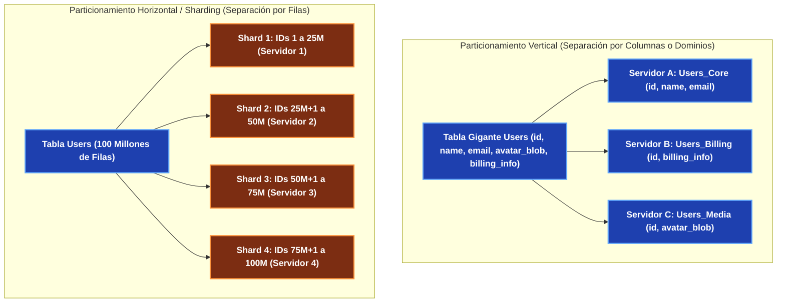
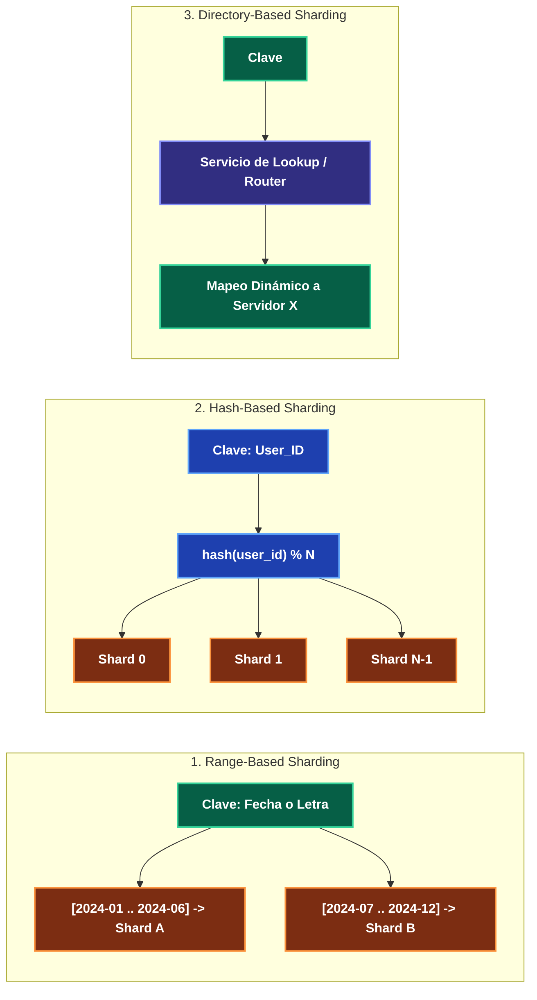
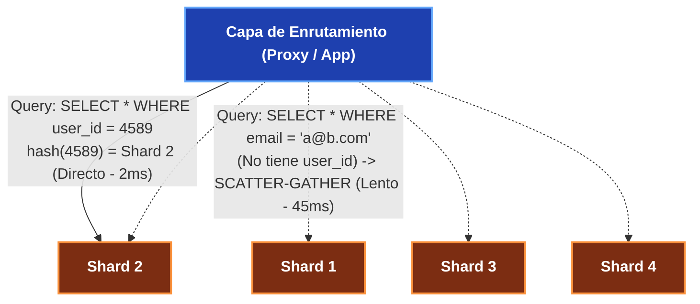

---
tags:
  - system-design
  - database
  - sharding
  - partitioning
  - scalability
  - fase-2
aliases:
  - Particionamiento y Sharding de BBDD
  - Sharding Horizontal y Shard Keys
modulo: "02"
orden: 3
---

# 02.3 Particionamiento y Sharding: Estrategias, Selección de Claves y Desafíos Distribuidos

> *"Cuando una base de datos supera los límites físicos de una sola máquina en almacenamiento o IOPS, el Sharding divide el conjunto de datos en fragmentos independientes alojados en servidores separados."*

---

## 1. Particionamiento Vertical vs Particionamiento Horizontal (Sharding)

---

## 2. Estrategias de Sharding Horizontal

### Comparativa de Estrategias:

| Estrategia | Mecánica | Ventajas | Desventajas |
| :--- | :--- | :--- | :--- |
| **Range-Based (Por Rangos)** | Divide por rangos contiguos (ej. IDs 1-1M, Fechas 2024). | Consultas por rango muy eficientes (`WHERE date >= X AND date <= Y`). | **Crea Hotspots severos** (todas las escrituras de hoy van al mismo Shard nuevo). |
| **Hash-Based (Por Hash)** | Aplica un hash a la clave: `hash(key) % N`. | Distribución uniforme de escrituras y lecturas. | Consultas por rango requieren consultar **todos los shards** (*Scatter-Gather*). |
| **Consistent Hashing** | Mapea claves y nodos en un anillo circular con nodos virtuales. | Añadir o quitar shards solo reubica $\frac{K}{N}$ claves. | Mayor complejidad de enrutamiento y balanceo. |
| **Directory-Based (Directorio)** | Un servicio centralizado mantiene una tabla con la ubicación de cada ID. | Máxima flexibilidad para mover clientes pesados de servidor. | El servicio de lookup se convierte en un SPOF y cuello de botella. |

---

## 3. Criterios de Selección de la Shard Key (Clave de Partición)

La elección de la **Shard Key** es la decisión más crítica e irreversible de la arquitectura:

1. **Alta Cardinalidad:** La clave debe tener millones de valores posibles (un `user_id` o `uuid` tiene alta cardinalidad; un `country_code` o `status` tiene baja cardinalidad y provocará shards gigantescos desbalanceados).
2. **Distribución Uniforme:** La probabilidad de acceso debe ser homogénea para evitar *Hotspots*.
3. **Patrón de Acceso (Alineación de Queries):** La clave debe coincidir con el filtro principal de las consultas más frecuentes para que el router sepa a qué shard exacto enviar la petición sin consultar a los demás.

---

## 4. Desafíos y Complejidades del Sharding

1. **Scatter-Gather Queries:** Si una consulta no incluye la Shard Key, el coordinador debe enviar la petición a **todos los shards del cluster**, esperar las respuestas, ordenarlas en memoria RAM y devolver el resultado.
2. **Cross-Shard Joins:** Es imposible ejecutar un `JOIN` relacional nativo entre dos tablas cuyos datos residen en servidores físicos distintos. Se deben desnormalizar los datos o realizar el join en la capa de aplicación.
3. **Transacciones Distribuidas (Two-Phase Commit - 2PC):** Modificar datos en dos shards distintos en una sola transacción atómica requiere un protocolo 2PC, lo que incrementa la latencia 10x y reduce la disponibilidad si un nodo no responde.
4. **Re-sharding:** Si un shard se llena al 100%, dividirlo y mover la mitad de los terabytes a un nuevo servidor en caliente sin downtime es una operación de altísimo riesgo operacional.

---

## Microtareas de Retención Intelectual

> [!QUESTION]- Active Recall: ¿Qué es el problema del Hotspot (o Celebrity Problem) en Sharding?
> **Respuesta:** Ocurre cuando una entidad específica (ej. la cuenta de Twitter de una celebridad con 100 millones de seguidores o un producto en descuento del Black Friday) recibe millones de peticiones por segundo. Como todos los datos de esa entidad están en el mismo shard según su Shard Key, ese servidor físico colapsa por CPU e IOPS mientras los otros 50 shards del cluster están al 2% de uso.

---

> [!TIP]- Micro-Cálculo Mental: Rebalanceo con Mapeo Modular vs Consistent Hashing
> **Reto:** Tienes **1,000,000 de registros** distribuidos en **4 shards** usando `hash(id) % 4`. Añades un quinto shard ($N = 5$) y cambias la función a `hash(id) % 5`.
> ¿Qué porcentaje aproximado de datos debe moverse de servidor con el enfoque modular vs Consistent Hashing?
> **Cálculo:**
> - Enfoque Modular (`% N`): Cambiar de base 4 a base 5 altera el residuo de casi todas las claves. **Aproximadamente el 80% de los datos (800,000 registros)** debe reubicarse por la red.
> - Con **Consistent Hashing**: Solo se mueve $\frac{1}{N+1} = \frac{1}{5} = \mathbf{20\% \text{ de los datos}}$ (200,000 registros). Los 800,000 restantes permanecen intactos en sus servidores originales.

---

> [!WARNING]- Dilema Arquitectónico: Shard Key por `tenant_id` vs `user_id` en SaaS B2B
> **Escenario:** Estás construyendo un software SaaS multi-tenant para empresas. Tienes 10,000 empresas pequeñas (10 empleados c/u) y 1 cliente gigante (un banco con 200,000 empleados).
> **Pregunta:** ¿Usas `tenant_id` como Shard Key directo?
> **Respuesta:** Usar únicamente `tenant_id` generará un **Hotspot colosal** con el banco, que saturará su shard asignado. **Solución Híbrida:** Clientes pequeños agrupados por `tenant_id` en shards compartidos (*Multi-tenant Shards*), y el cliente gigante particionado internamente por `user_id` o alojado en un *Dedicated Shard* aislado con hardware sobredimensionado.

---

> [!NOTE]- Desafío Feynman: Sharding de Base de Datos
> Imagina una biblioteca con 1 millón de libros en un solo salón pequeño donde la gente hace filas interminables.
> - **Sharding por Rangos:** Abres 26 salas y pones en la Sala A los libros de autores con A, en la Sala B los de autores con B. (Problema: la Sala G de García se llena, y la Sala X de Ximénez está vacía).
> - **Sharding por Hash:** Asignas cada libro a una de las 26 salas mediante una ruleta matemática; todas las salas tienen exactamente la misma cantidad de libros y de gente.

---

## Conceptos Relacionados
- [[02.0_SQL_vs_NoSQL_Taxonomia_Completa|02.0 Taxonomía de Bases de Datos]]
- [[04.2_Consistent_Hashing_con_Nodos_Virtuales|04.2 Consistent Hashing con Nodos Virtuales]]
- [[01.5_Escalado_Vertical_vs_Horizontal|01.5 Escalado Vertical vs Horizontal]]
- [[00_MOC_System_Design_Mastery|Volver al Índice Maestro (MOC)]]
