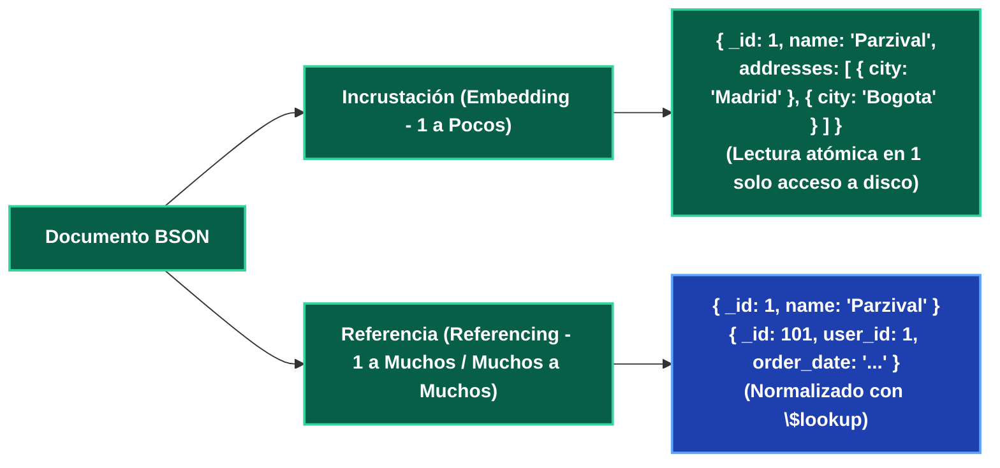
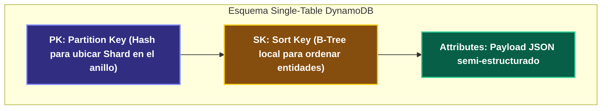

---
tags:
  - system-design
  - database
  - redis
  - mongodb
  - dynamodb
  - nosql
  - fase-2
aliases:
  - Key-Value y Document Stores
  - Redis, DynamoDB y MongoDB
modulo: "02"
orden: 4
---

# 02.4 Motores Key-Value y Documentales: Redis, MongoDB y AWS DynamoDB

> *"Los almacenes Key-Value y Documentales sacrifican la expresividad de los JOINs relacionales para ofrecer accesos a datos con latencias predecibles de milisegundos a escala de petabytes."*

---

## 1. Redis: Motor en Memoria y Estructuras de Datos Avanzadas

Redis (*Remote Dictionary Server*) es un almacén clave-valor en memoria RAM, utilizado como caché, base de datos de baja latencia y broker de mensajes.

```mermaid
graph TD
    subgraph Arquitectura de Redis (Single-Threaded Event Loop)
        IO["I/O Multiplexing (epoll / kqueue)"]:::queue --> Loop["Event Loop Principal (Cero Locks de Mutex / CPU en RAM)"]:::cache
        Loop --> Mem["Estructuras en Memoria RAM"]:::cache
    end
    subgraph Estructuras de Datos Nativas
        Mem --> S["Strings (Texto, JSON, Contadores atómicos INCR)"]:::service
        Mem --> H["Hashes (Objetos estructurados {field: value})"]:::service
        Mem --> L["Lists (Colas FIFO LPUSH/RPOP)"]:::proxy
        Mem --> ST["Sets (Conjuntos únicos SADD/SINTER)"]:::service
        Mem --> ZS["Sorted Sets (Ranking por Score con SkipList)"]:::service
        Mem --> BM["Bitmaps & HyperLogLog (Conteo probabilístico)"]:::service
        Mem --> SM["Streams (Log de eventos estilo Kafka)"]:::queue
    end

    classDef client fill:#1e40af,stroke:#60a5fa,stroke-width:2px,color:#ffffff,font-weight:bold;
    classDef proxy fill:#312e81,stroke:#818cf8,stroke-width:2px,color:#ffffff,font-weight:bold;
    classDef service fill:#065f46,stroke:#34d399,stroke-width:2px,color:#ffffff,font-weight:bold;
    classDef database fill:#7c2d12,stroke:#fb923c,stroke-width:2px,color:#ffffff,font-weight:bold;
    classDef cache fill:#581c87,stroke:#c084fc,stroke-width:2px,color:#ffffff,font-weight:bold;
    classDef queue fill:#155e75,stroke:#22d3ee,stroke-width:2px,color:#ffffff,font-weight:bold;
    classDef warning fill:#881337,stroke:#f43f5e,stroke-width:2px,color:#ffffff,font-weight:bold;
    classDef highlight fill:#854d0e,stroke:#facc15,stroke-width:2px,color:#ffffff,font-weight:bold;
```

### Persistencia en Redis:
1. **RDB (Redis Database Snapshot):** Guarda una foto completa de la RAM en disco cada $N$ minutos mediante `fork()` del proceso.
   - *Ventaja:* Recuperación ultra-rápida tras reinicio; archivo compacto.
   - *Desventaja:* Pérdida de datos entre el último snapshot y la caída.
2. **AOF (Append Only File):** Registra cada comando de escritura en un log append-only.
   - `fsync=always`: Máxima durabilidad, menor throughput.
   - `fsync=everysec`: Estándar de producción (máximo 1 segundo de pérdida en caída).

---

## 2. MongoDB: Almacenamiento Documental y BSON

MongoDB almacena datos en documentos **BSON** (*Binary JSON*), permitiendo anidar estructuras complejas y arrays.



### Motor de Almacenamiento WiredTiger:
* Utiliza **B-Trees** en disco y compresión de bloques (Snappy/zlib).
* Concurrencia a nivel de documento (*Document-level locking* con MVCC).
* **Sharding Nativo:** Distribuye colecciones automáticamente mediante *Config Servers* y *Mongos Routers*.

---

## 3. AWS DynamoDB: Single-Table Design y Escala Masiva

DynamoDB es una base de datos NoSQL totalmente administrada que garantiza **latencias de un solo dígito de milisegundo (1-9ms)** sin importar si la tabla tiene 1 GB o 100 TB.



### El Paradigma Single-Table Design:
En lugar de crear 10 tablas (Users, Orders, Products, Payments), se almacena **toda la aplicación en una única tabla**, utilizando claves sobrecargadas:

| PK (Partition Key) | SK (Sort Key) | Atributos (Data) | Tipo de Entidad |
| :--- | :--- | :--- | :--- |
| `USER#101` | `METADATA#101` | `name: "Parzival", email: "p@dev.com"` | Perfil Usuario |
| `USER#101` | `ORDER#2024#9001` | `total: 150.00, status: "PAID"` | Pedido de Usuario |
| `USER#101` | `ORDER#2024#9002` | `total: 45.00, status: "SHIPPED"` | Pedido de Usuario |
| `PRODUCT#55` | `METADATA#55` | `title: "Laptop", stock: 12` | Producto |

* **Query de todos los pedidos de un usuario en 1 llamada:** `PK = "USER#101" AND SK begins_with("ORDER#")`. Devuelve el usuario y todos sus pedidos en un solo acceso a disco.

---

## Microtareas de Retención Intelectual

> [!QUESTION]- Active Recall: ¿Por qué Redis es mono-hilo (Single-Threaded) en su motor de ejecución principal?
> **Respuesta:** Porque el cuello de botella de las operaciones en memoria RAM no es la CPU, sino el ancho de banda de la memoria y la red. Al ser mono-hilo en la ejecución de comandos, Redis **elimina por completo el costo de context switching, contención de mutex, locks y condiciones de carrera**, ejecutando millones de operaciones atómicas por segundo de forma determinista sobre estructuras simples.

---

> [!TIP]- Micro-Cálculo Mental: Conteo de Usuarios Únicos con HyperLogLog en Redis
> **Reto:** Quieres contar el número de usuarios únicos que visitaron tu web hoy (**50,000,000 de IPs únicas**).
> - Si usas un `Set` tradicional de Redis guardando strings de 32 bytes: $50,000,000 \times 32 \text{ bytes} \approx \mathbf{1.6 \text{ GB de RAM}}$.
> - Si usas la estructura probabilística **HyperLogLog (`PFADD`)**:
> ¿Cuánta memoria fija consume HyperLogLog con un margen de error estándar del 0.81%?
> **Cálculo:**
> - HyperLogLog consume exactamente **12 KB de memoria fija**, sin importar si cuentas 100 usuarios o 1,000 millones de usuarios.
> - *Ahorro de memoria:* Del 99.999% en RAM para analítica de cardinalidad en tiempo real.

---

> [!WARNING]- Dilema Arquitectónico: DynamoDB vs MongoDB para Consultas Analíticas Ad-Hoc
> **Escenario:** Tu equipo de marketing necesita ejecutar consultas ad-hoc variadas todos los días (ej. *"Buscar usuarios registrados en mayo que hayan comprado más de USD 100 pero que no tengan tarjeta de crédito registrada"*).
> **Pregunta:** ¿Es DynamoDB una buena elección para este caso de uso?
> **Respuesta:** **No. Es una pésima elección.** DynamoDB exige conocer **todos los patrones de acceso antes de diseñar la tabla**. Consultas ad-hoc no contempladas en las claves PK/SK o en Global Secondary Indexes (GSIs) forzarán un `Scan` de toda la tabla, el cual es extremadamente lento, consume todas las unidades de lectura provisionadas (RCUs) y eleva la factura a miles de dólares. Para consultas ad-hoc flexibles, se debe usar **MongoDB, PostgreSQL o exportar datos a un Data Lakehouse (ClickHouse/Snowflake/Athena)**.

---

> [!NOTE]- Desafío Feynman: Redis Sorted Sets (ZSET)
> Es como la tabla de puntuaciones de un torneo de videojuegos arcade: cada jugador tiene su nombre (clave única) y su puntaje numérico (score). Redis mantiene la tabla automáticamente ordenada en tiempo real; en cualquier milisegundo puedes preguntarle quién está en el Top 10 o en qué posición exacta del ranking mundial está tu usuario.

---

## Conceptos Relacionados
- [[02.0_SQL_vs_NoSQL_Taxonomia_Completa|02.0 Taxonomía de Bases de Datos]]
- [[04.0_Estrategias_de_Cache_Write-Through_Write-Back_Refresh-Ahead|04.0 Estrategias de Caché]]
- [[04.1_Algoritmos_de_Eviccion_LRU_LFU_FIFO|04.1 Algoritmos de Evicción]]
- [[00_MOC_System_Design_Mastery|Volver al Índice Maestro (MOC)]]
