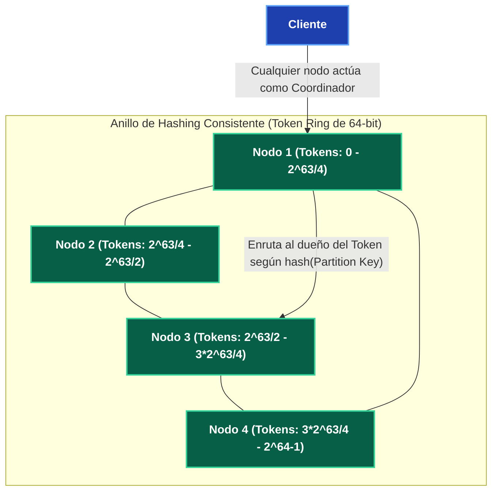
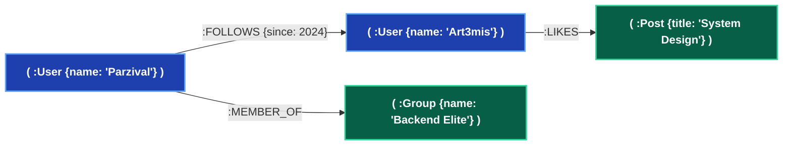

---
tags:
  - system-design
  - database
  - cassandra
  - neo4j
  - graph-database
  - nosql
  - fase-2
aliases:
  - Wide-Column y Graph Databases
  - Cassandra y Neo4j
modulo: "02"
orden: 5
---

# 02.5 Almacenes Especializados: Wide-Column (Cassandra / ScyllaDB) y Bases de Datos de Grafos (Neo4j)

> *"Mientras que las bases de datos Wide-Column están optimizadas para escribir terabytes de series temporales sin un nodo maestro central, las bases de datos de grafos resuelven redes complejas de relaciones en tiempo constante mediante adyacencia libre de índices."*

---

## 1. Apache Cassandra / ScyllaDB: Arquitectura Wide-Column y Anillo Peer-to-Peer

Cassandra utiliza una arquitectura **Peer-to-Peer (P2P)** sin nodo maestro, donde todos los nodos del cluster son completamente idénticos y se coordinan mediante el protocolo **Gossip**.



### El Modelo de Datos en Cassandra (CQL):
* **Partition Key:** Determina en qué nodo físico del anillo se almacena la fila mediante la función hash Murmur3.
* **Clustering Key:** Determina el **orden físico de almacenamiento en disco** dentro de la partición (ordenado por B-Tree/LSM-Tree).

```sql
CREATE TABLE sensor_readings (
    sensor_id uuid,
    recorded_at timestamp,
    temperature double,
    humidity double,
    PRIMARY KEY ((sensor_id), recorded_at) -- PK = (Partition Key), Clustering Key
) WITH CLUSTERING ORDER BY (recorded_at DESC);
```

* **Regla de Oro en Cassandra:** *"Modela tus tablas en función de tus consultas exactas, nunca en función de tus entidades lógicas."* Si necesitas buscar lecturas por fecha y luego por ubicación, creas **dos tablas separadas y duplicas los datos**.

---

## 2. Bases de Datos de Grafos (Neo4j): Index-Free Adjacency

En bases de datos relacionales, navegar relaciones de 3 a 5 niveles de profundidad (ej. *"Amigos de amigos de mis amigos que les guste el rock"*) requiere múltiples `JOIN` sucesivos que degradan exponencialmente el rendimiento ($O(N^K)$).

Neo4j implementa **Index-Free Adjacency (Adyacencia Libre de Índices)**: cada nodo almacena punteros de memoria físicos directos hacia sus nodos vecinos.



### Complejidad de Recorrido:
* **Relacional con JOINs:** $O(N \log M)$ por cada salto, donde $M$ es el tamaño total de la tabla.
* **Grafo con Adyacencia Directa:** **$O(1)$ por cada salto**, sin importar si el grafo tiene 100 nodos o 10,000 millones de nodos.

### Consulta en Lenguaje Cypher:
```cypher
MATCH (u:User {name: 'Parzival'})-[:FOLLOWS]->(friend)-[:LIKES]->(p:Post)
WHERE NOT (u)-[:LIKES]->(p)
RETURN p.title, count(friend) AS recomendaciones
ORDER BY recomendaciones DESC
LIMIT 10;
```

---

## 3. Matriz Comparativa: Cassandra vs Neo4j vs Relacional

| Dimensión | Apache Cassandra / ScyllaDB | Neo4j (Grafos) | PostgreSQL (Relacional) |
| :--- | :--- | :--- | :--- |
| **Topología** | P2P Descentralizado (Cero SPOF). | Líder-Seguidor (Causal Clustering). | Líder-Seguidor (Primario-Réplicas). |
| **Escrituras** | **Ultra-masivas** (LSM-Tree en disco). | Moderadas (Actualización de punteros ACID). | Moderadas (B-Tree y WAL). |
| **Consultas Complejas** | Muy restringidas (Solo queries por Partition Key). | **Extremadamente potentes** para relaciones y caminos (*Shortest Path*). | Muy potentes para agregaciones tabulares y reportes. |
| **JOINs** | Prohibidos / Inexistentes. | Nativos y en tiempo constante por punteros. | Nativos mediante algoritmos Hash/Merge Join. |
| **Casos de Uso** | Telemetría IoT, Logs, Mensajería, Series temporales. | Detección de fraude, Redes sociales, Grafos de conocimiento, Motores de recomendación. | Finanzas, E-commerce, ERPs, Sistemas transaccionales generales. |

---

## Microtareas de Retención Intelectual

> [!QUESTION]- Active Recall: ¿Qué significa que Neo4j tiene Adyacencia Libre de Índices?
> **Respuesta:** Significa que para encontrar los nodos conectados a un nodo $A$, Neo4j no ejecuta una búsqueda en un índice global B-Tree ($O(\log N)$), sino que **desreferencia directamente punteros de memoria física de 8 bytes** almacenados en el propio nodo $A$ ($O(1)$). El tiempo de consulta depende únicamente de la cantidad de relaciones del nodo consultado, no del tamaño de la base de datos completa.

---

> [!TIP]- Micro-Cálculo Mental: Recorrido en Grafo vs Relacional
> **Reto:** Una red social tiene **1,000,000,000 de usuarios** y cada usuario tiene en promedio **100 amigos**. Quieres consultar los amigos de amigos (2 saltos, ~10,000 conexiones).
> - En base de datos relacional: Requiere 2 búsquedas en índice B-Tree sobre una tabla de 100 mil millones de relaciones ($\log_2(10^{11}) \approx 37 \text{ comparaciones por fila}$).
> - En Neo4j: Cada salto es un acceso directo por puntero en memoria (100 ns).
> ¿Cuál es el tiempo aproximado en CPU para recorrer los 10,000 punteros en Neo4j?
> **Cálculo:**
> - $10,000 \times 100 \text{ ns} = 1,000,000 \text{ ns} = \mathbf{1 \text{ milisegundo}}$.
> - *Lección:* Las consultas de grafos en motores dedicados operan en milisegundos donde SQL tardaría minutos.

---

> [!WARNING]- Dilema Arquitectónico: Detección de Fraude en Tarjetas de Crédito
> **Escenario:** Un banco necesita detectar patrones de fraude en tiempo real durante una transacción (ej. *"Esta tarjeta comparte dirección IP con 3 cuentas bloqueadas que usaron la misma cuenta de PayPal en las últimas 2 horas"*).
> **Pregunta:** ¿Qué base de datos utilizas para el motor de fraude en tiempo real?
> **Respuesta:** **Base de Datos de Grafos (Neo4j / Amazon Neptune).** Las redes de fraude financiero operan mediante anillos de identidades sintéticas conectadas por múltiples atributos indirectos (IPs, dispositivos, emails, teléfonos). Detectar estos anillos mediante SQL relacional requiere un join de 6 tablas que provocaría timeouts en la pasarela de pago; en un grafo, el patrón se detecta en $<15 \text{ ms}$ mediante un recorrido de subgrafo.

---

> [!NOTE]- Desafío Feynman: Cassandra vs Neo4j
> - **Cassandra:** Es como una hilera infinita de casilleros postales de alta velocidad: llegas con el número exacto del casillero, metes 10,000 cartas en un segundo y nadie te hace preguntas; pero si preguntas *"¿quién tiene cartas rojas?"*, tendrías que abrir los 10 millones de casilleros uno por uno.
> - **Neo4j:** Es como un mapa con hilos de colores que conectan a personas en una pared de investigación: sigues el hilo de una persona a otra con el dedo en 1 segundo sin importar cuántas personas haya en la ciudad.

---

## Conceptos Relacionados
- [[02.1_Motores_de_Indices_B-Tree_vs_LSM-Tree|02.1 Motores de Índices B-Tree vs LSM-Tree]]
- [[02.3_Particionamiento_y_Sharding_de_BBDD|02.3 Particionamiento y Sharding]]
- [[04.2_Consistent_Hashing_con_Nodos_Virtuales|04.2 Consistent Hashing]]
- [[00_MOC_System_Design_Mastery|Volver al Índice Maestro (MOC)]]
