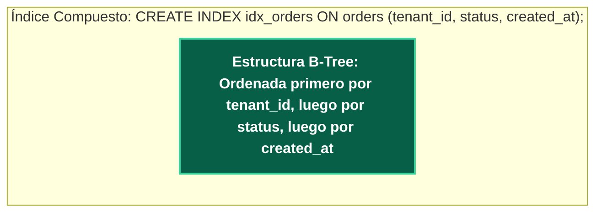

---
tags:
  - system-design
  - database
  - postgresql
  - query-optimization
  - indexing
  - fase-2
aliases:
  - Optimización SQL y Query Tuning
  - Explain Analyze e Índices Compuestos
modulo: "02"
orden: 6
---

# 02.6 Optimización SQL y Query Tuning: Planes de Ejecución, Índices Compuestos y Antipatrones

> *"El 90% de los problemas de escalabilidad en sistemas de producción no se resuelven comprando servidores ni migrando a NoSQL, sino corrigiendo consultas ineficientes y diseñando los índices correctos."*

---

## 1. El Ciclo de Vida de una Consulta SQL


---

## 2. Diagnóstico Profesional con `EXPLAIN (ANALYZE, BUFFERS)`

El comando `EXPLAIN ANALYZE` en PostgreSQL ejecuta la consulta y mide los tiempos reales de CPU y accesos a memoria/disco:

```sql
EXPLAIN (ANALYZE, BUFFERS, COSTS, VERBOSE)
SELECT u.name, o.total_amount
FROM users u
JOIN orders o ON u.id = o.user_id
WHERE u.country_code = 'CL' AND o.created_at >= '2024-01-01';
```

### Métodos de Acceso a Tablas:

| Método de Escaneo | Mecánica | Impacto en Rendimiento |
| :--- | :--- | :--- |
| **Seq Scan (Sequential Scan)** | Lee cada bloque de la tabla completa de principio a fin. | **Pésimo** para tablas grandes ($O(N)$ lecturas de disco). |
| **Index Scan** | Recorre el árbol B-Tree del índice y luego busca la fila en la tabla (*Heap Fetch*). | Rápido para pocas filas ($O(\log N) + \text{Heap I/O}$). |
| **Index Only Scan** | Todas las columnas solicitadas están en el índice; **cero accesos a la tabla en disco**. | **El más rápido posible** ($O(\log N)$ en memoria). |
| **Bitmap Index Scan** | Crea un mapa de bits en memoria con las páginas candidatas y luego lee los bloques ordenados. | Óptimo para filtros con múltiples condiciones independientes. |

---

## 3. Tipos Avanzados de Índices y Regla del Prefijo Izquierdo



### La Regla del Prefijo Izquierdo (*Leftmost Prefix Rule*):
* `WHERE tenant_id = 5 AND status = 'PAID'` → **Usa el índice al 100%**.
* `WHERE tenant_id = 5` → **Usa el índice**.
* `WHERE status = 'PAID'` → **NO USA EL ÍNDICE** (hace Sequential Scan porque el árbol no está ordenado por status en la raíz).

### Estrategias Avanzadas de Indexación:
1. **Covering Indexes (`INCLUDE` en Postgres):**
   ```sql
   CREATE INDEX idx_users_email_covering ON users (email) INCLUDE (name, role);
   -- Permite que SELECT name, role WHERE email = 'x' sea un Index Only Scan directo.
   ```
2. **Partial Indexes (Índices Parciales):**
   ```sql
   CREATE INDEX idx_orders_unprocessed ON orders (created_at) WHERE status = 'PENDING';
   -- Indexa solo el 1% de las filas activas, ahorrando 99% de espacio en RAM.
   ```
3. **Expression / Functional Indexes:**
   ```sql
   CREATE INDEX idx_users_lower_email ON users (LOWER(email));
   -- Necesario para búsquedas case-insensitive sin invalidar el índice.
   ```

---

## 4. Los 4 Antipatrones Más Destructivos en Producción

### Antipatrón 1: El Problema N+1 en ORMs
* El ORM ejecuta 1 consulta para obtener 100 pedidos, y luego ejecuta **100 consultas individuales** para obtener el usuario de cada pedido (101 consultas en total).
* **Solución:** Eager Loading (`JOIN FETCH` o `select_related` / `includes`).

### Antipatrón 2: Búsquedas con Comodín a la Izquierda (`LIKE '%abc'`)
* Un índice B-Tree no puede buscar sufijos; obliga a un Sequential Scan completo.
* **Solución:** Índices Trigram (`pg_trgm` con índice GIN) o motores de búsqueda de texto completo.

### Antipatrón 3: Creación Excesiva de Conexiones (*Connection Churn*)
* Abrir una conexión TCP a PostgreSQL consume ~10 MB de RAM en el servidor y ejecuta procesos `fork()`.
* **Solución:** Colocar un Connection Pooler transaccional intermedio como **PgBouncer** o **AWS RDS Proxy**, reduciendo 5,000 conexiones concurrentes de la app a 50 conexiones persistentes en la base de datos.

---

## Microtareas de Retención Intelectual

> [!QUESTION]- Active Recall: ¿Por qué envolver una columna indexada en una función (ej. `WHERE EXTRACT(YEAR FROM created_at) = 2024`) anula el índice B-Tree?
> **Respuesta:** Porque el índice B-Tree contiene los valores originales crudos de `created_at`. El optimizador no puede adivinar matemáticamente la función inversa, por lo que se ve obligado a evaluar la función fila por fila en toda la tabla mediante un *Sequential Scan*. Para solucionarlo, se debe transformar la consulta a un rango (`WHERE created_at >= '2024-01-01' AND created_at < '2025-01-01'`) o crear un índice funcional sobre la expresión.

---

> [!TIP]- Micro-Cálculo Mental: Ahorro de Memoria con Índices Parciales
> **Reto:** Una tabla de Notificaciones tiene **100,000,000 de filas**. El **99%** ya fueron leídas (`status = 'READ'`) y solo el **1%** están pendientes (`status = 'PENDING'`). Un índice B-Tree completo sobre `(user_id, status)` pesa **4 GB de RAM**.
> Si creas un índice parcial: `CREATE INDEX ... ON notifications (user_id) WHERE status = 'PENDING'`:
> ¿Cuánto pesará el índice en memoria RAM?
> **Cálculo:**
> - $4 \text{ GB} \times 1\% = \mathbf{40 \text{ MB de RAM}}$.
> - *Ahorro:* Recuperas 3.96 GB de memoria RAM para el Buffer Pool del sistema.

---

> [!WARNING]- Dilema Arquitectónico: Paginación por Offset vs Keysat / Cursor Pagination
> **Escenario:** Un usuario navega a la página 5,000 de su feed (`SELECT * FROM posts ORDER BY id LIMIT 20 OFFSET 100000`). La base de datos tarda 3.5 segundos en responder.
> **Pregunta:** ¿Por qué es tan lento `OFFSET` y cómo se optimiza a nivel Staff Engineer?
> **Respuesta:** Con `OFFSET 100000`, la base de datos debe leer, ordenar y descartar 100,000 filas antes de devolver las 20 solicitadas ($O(N)$ en tiempo y CPU). **Solución:** Implementar **Cursor / Keysat Pagination** (`WHERE id < last_seen_id ORDER BY id DESC LIMIT 20`), la cual utiliza el índice B-Tree para saltar directamente al registro exacto en $O(\log N)$, respondiendo en $<2 \text{ ms}$ sin importar el número de página.

---

> [!NOTE]- Desafío Feynman: Índices de Base de Datos
> Es como el índice alfabético al final de un libro de medicina de 2,000 páginas: si buscas "Ibuprofeno", no lees las 2,000 páginas desde la página 1; vas al final, buscas la letra I, ves que dice "Página 450", y abres el libro directamente en esa página.

---

## Conceptos Relacionados
- [[02.0_SQL_vs_NoSQL_Taxonomia_Completa|02.0 Taxonomía de Bases de Datos]]
- [[02.1_Motores_de_Indices_B-Tree_vs_LSM-Tree|02.1 Motores de Índices B-Tree vs LSM-Tree]]
- [[02.2_Replicacion_Master-Slave_vs_Multi-Master_y_Failover|02.2 Replicación de Bases de Datos]]
- [[00_MOC_System_Design_Mastery|Volver al Índice Maestro (MOC)]]
