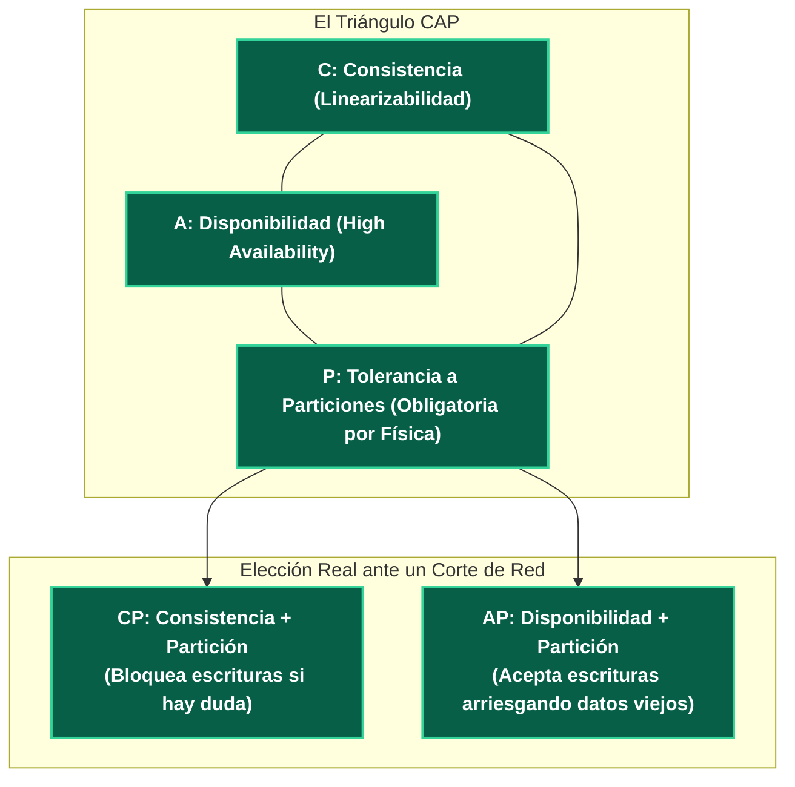
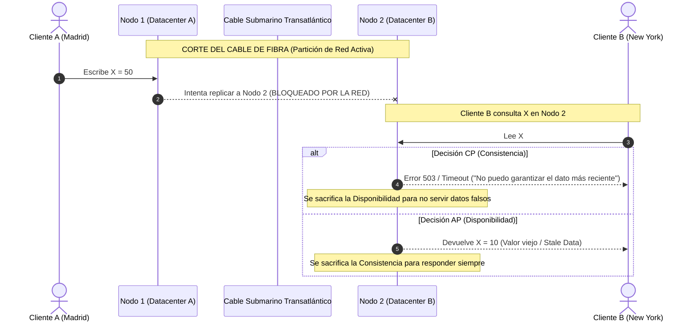

---
tags:
  - system-design
  - distributed-systems
  - cap-theorem
  - consistency
  - availability
  - fase-2
aliases:
  - Teorema CAP
  - Teorema de Brewer
modulo: "03"
orden: 0
---

# 03.0 Teorema CAP: Análisis Riguroso, Particiones de Red y el Mito de los Sistemas CA

> *"En un sistema distribuido que se comunica por redes físicas imperfectas, no puedes elegir 'Consistencia y Disponibilidad': estás obligado a tolerar particiones de red ($P$), y tu única elección real ante un fallo es Consistencia (CP) o Disponibilidad (AP)."*

---

## 1. Definición Formal de las 3 Propiedades

Formulado por Eric Brewer y formalmente demostrado por Seth Gilbert y Nancy Lynch (MIT):

### Definiciones Rigurosas:
1. **Consistency (Consistencia = Linearizabilidad):**
   - Cada operación de lectura debe devolver el valor de la **escritura confirmada más reciente**, o un error explícito.
   - Todos los nodos del cluster se comportan externamente como si existiera **una única copia centralizada de los datos**.
2. **Availability (Disponibilidad):**
   - **Cada nodo no caído** debe devolver una respuesta válida (no error, no timeout) para cada petición recibida.
3. **Partition Tolerance (Tolerancia a Particiones):**
   - El sistema continúa operando a pesar de que un número arbitrario de mensajes de red se pierdan, se retrasen o se corrompan entre los nodos.

---

## 2. Por qué los Sistemas "CA" NO Existen en el Mundo Real

Un error extendido es creer que se puede elegir un sistema "CA" (Consistente y Disponible sin Tolerancia a Particiones):

* **Conclusión Física:** Las redes reales experimentan caídas de switches, cortes de fibra y latencias impredecibles. La **Tolerancia a Particiones ($P$) no es una opción de diseño**: es una ley de la física de redes. La única decisión es: **¿CP o AP cuando ocurre una partición?**

---

## 3. Matriz de Clasificación de Motores Distribuidos

| Tipo | Comportamiento ante Partición | Motores Representativos | Casos de Uso |
| :--- | :--- | :--- | :--- |
| **CP** | Si un nodo queda aislado de la mayoría (Quorum), **rechaza lecturas y escrituras** para evitar inconsistencias. | PostgreSQL (Single-Master), CockroachDB, Google Cloud Spanner, HBase, etcd, ZooKeeper. | Transacciones bancarias, inventario en tiempo real, autenticación, contratos financieros. |
| **AP** | Cada nodo responde con los datos locales que tiene en ese instante, aceptando escrituras que se reconciliarán después. | Apache Cassandra, ScyllaDB, AWS DynamoDB (por defecto), CouchDB. | Feeds de redes sociales, carritos de compra, analítica de métricas, streaming de video. |

---

## Microtareas de Retención Intelectual

> [!QUESTION]- Active Recall: ¿Por qué en un sistema CP el nodo aislado rechaza peticiones en vez de intentar responder lo mejor que puede?
> **Respuesta:** Porque en la definición formal de Consistencia (Linearizabilidad), devolver un dato obsoleto (*Stale Data*) se considera una **violación total del sistema**. El nodo aislado prefiere fallar explícitamente con un error antes de engañar al cliente con un valor que ya fue sobrescrito en el otro lado de la red.

---

> [!TIP]- Micro-Cálculo Mental: Disponibilidad de Quorum en CP
> **Reto:** Un cluster CP coordinado por Raft/Paxos tiene **5 nodos**. Para confirmar cualquier escritura, requiere el voto de la mayoría estricta ($\lfloor N/2 \rfloor + 1 = 3 \text{ nodos}$).
> Una partición de red divide el cluster en dos grupos: **Grupo A (2 nodos)** y **Grupo B (3 nodos)**.
> ¿Qué grupo podrá seguir procesando escrituras y cuál quedará bloqueado?
> **Cálculo:**
> - Grupo A (2 nodos): $2 < 3$ (No tiene Quorum) → **Bloquea el 100% de escrituras**.
> - Grupo B (3 nodos): $3 \ge 3$ (Tiene Quorum mayoritario) → **Procesa escrituras con normalidad**.
> - *Lección:* El sistema CP mantiene la consistencia total garantizando que solo 1 partición mayoritaria esté activa.

---

> [!WARNING]- Dilema Arquitectónico: Sistema de Carrito de Compras de Amazon (El Paper de Dynamo)
> **Escenario:** Estás diseñando el carrito de compras de un e-commerce global durante el Black Friday. Un corte de red aísla temporalmente un datacenter.
> **Pregunta:** ¿Configuras el carrito como CP o como AP?
> **Respuesta:** **AP (Disponibilidad Absoluta).** Como demostró Amazon en su paper original de DynamoDB (2007): *"Un cliente que no puede añadir un producto al carrito porque la base de datos devuelve error 503 abandona la compra y se va a la competencia"*. Es preferible permitir que el cliente agregue productos en un nodo aislado y resolver posibles duplicados después mediante algoritmos de fusión (CRDTs / Sets), que rechazar la venta.

---

> [!NOTE]- Desafío Feynman: Teorema CAP
> Imagina dos recepcionistas de hotel (Ana y Beto) en dos pisos distintos comunicados por un walkie-talkie.
> Un huésped cancela su habitación con Ana. En ese instante, el walkie-talkie se apaga (Partición de Red).
> Llega otro cliente al piso de Beto preguntando si esa misma habitación está libre:
> - **Si Beto es CP:** Dice *"No puedo confirmarle la habitación hasta que hable con Ana, vuelva más tarde"* (Sacrifica disponibilidad por no cometer errores).
> - **Si Beto es AP:** Dice *"¡Sí, tómela!"* (Responde de inmediato, pero arriesga vender una habitación ya ocupada).

---

## Conceptos Relacionados
- [[03.1_Teorema_PACELC_Extension_del_CAP|03.1 Teorema PACELC: Extensión del CAP]]
- [[03.2_Patrones_de_Consistencia_Fuerte_Eventual_y_Linealizable|03.2 Patrones de Consistencia]]
- [[02.2_Replicacion_Master-Slave_vs_Multi-Master_y_Failover|02.2 Replicación y Quorums]]
- [[00_MOC_System_Design_Mastery|Volver al Índice Maestro (MOC)]]
