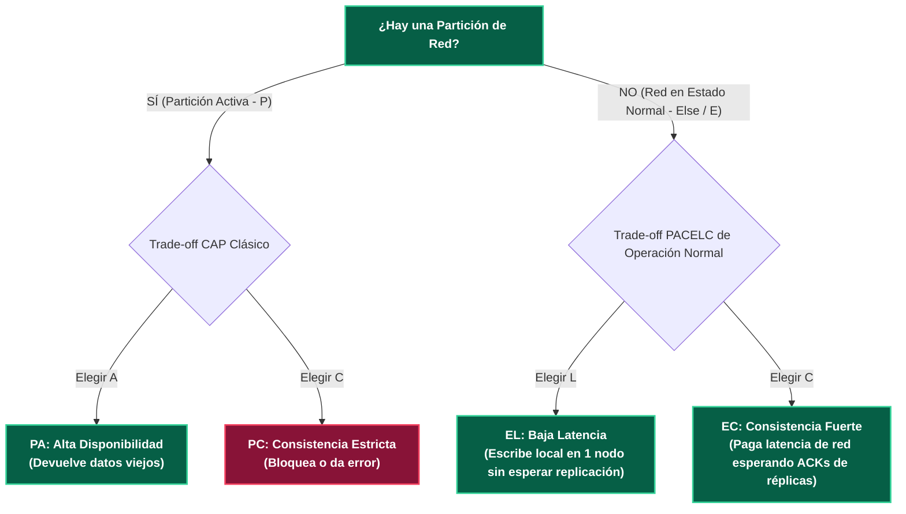

---
tags:
  - system-design
  - distributed-systems
  - pacelc
  - latency
  - consistency
  - fase-2
aliases:
  - Teorema PACELC
  - Extensión de Abadi al CAP
modulo: "03"
orden: 1
---

# 03.1 Teorema PACELC: La Extensión de Daniel Abadi para Sistemas en Estado Normal

> *"El Teorema CAP solo explica cómo se comporta un sistema cuando ocurre un fallo de red ($P$); el Teorema PACELC describe la decisión arquitectónica que tomas el 99.99% del tiempo restante cuando la red funciona a la perfección ($E$)."*

---

## 1. La Estructura del Teorema PACELC

Formulado por el profesor Daniel Abadi (Yale University):

$$\text{Si } \mathbf{P} \text{ (Partición)} \implies \mathbf{A} \lor \mathbf{C} \quad | \quad \text{Else } (\mathbf{E}) \implies \mathbf{L} \lor \mathbf{C}$$

---

## 2. Las 4 Categorías PACELC Fundamentales

| Categoría | Significado Arquitectónico | Motores Representativos | Justificación de Diseño |
| :--- | :--- | :--- | :--- |
| **PC / EC** | *En Partición:* Elige Consistencia (**PC**). *En Normalidad:* Elige Consistencia pagando latencia (**EC**). | **Google Cloud Spanner, CockroachDB, Bigtable, HBase**. | La integridad del dato es innegociable. En estado normal, cada escritura espera consenso sincrónico de red antes de responder al cliente. |
| **PA / EL** | *En Partición:* Elige Disponibilidad (**PA**). *En Normalidad:* Elige Latencia ultra-baja (**EL**). | **Apache Cassandra, ScyllaDB, Amazon DynamoDB, CouchDB**. | Optimizado para velocidad extrema. En estado normal, responde de inmediato tras escribir en 1 nodo local sin esperar la sincronización del cluster. |
| **PA / EC** | *En Partición:* Elige Disponibilidad (**PA**). *En Normalidad:* Elige Consistencia (**EC**). | **MongoDB (Configuración estándar)**. | En operación normal replica consistentemente; ante particiones de red, permite lecturas en secundarios. |
| **PC / EL** | *En Partición:* Elige Consistencia (**PC**). *En Normalidad:* Elige Latencia (**EL**). | **VoltDB, Hazelcast, Redis Cluster (con async replication)**. | Opera en memoria a máxima velocidad en estado normal, pero si hay partición aísla nodos para no divergir. |

---

## 3. El Costo de la Consistencia en Estado Normal (Trade-off Latencia vs Consistencia)

Incluso con $0\%$ de pérdida de paquetes y la red perfecta:
* **Si eliges Consistencia ($EC$):** Una petición de escritura en Frankfurt que debe ser consistente con Singapur debe esperar físicamente el viaje de ida y vuelta de la luz por la fibra óptica ($\sim 160 \text{ ms}$ de latencia base irreductible).
* **Si eliges Latencia ($EL$):** El servidor en Frankfurt responde `200 OK` en $1 \text{ ms}$ y sincroniza Singapur en segundo plano de forma asíncrona.

---

## Microtareas de Retención Intelectual

> [!QUESTION]- Active Recall: ¿Qué significa la sigla PACELC exactamente?
> **Respuesta:**
> - **P / A:** Si hay **P**artición, elegir entre **A**vailability...
> - **/ C:** ... o **C**onsistency.
> - **E / L:** **E**lse (de lo contrario, en red normal), elegir entre **L**atency...
> - **/ C:** ... o **C**onsistency.

---

> [!TIP]- Micro-Cálculo Mental: Latencia EC vs EL en Multi-Región
> **Reto:** Tienes un cluster de base de datos distribuido en **3 regiones**: Virginia (USA), Dublín (Irlanda) y Tokio (Japón). La latencia RTT inter-datacenter mínima por física de red es de **80 ms**.
> - En modo **PC/EC** (Consistencia sincrónica en Quorum de 2 de 3 regiones): Cada commit espera al menos 1 viaje RTT.
> - En modo **PA/EL** (Latencia local asíncrona): El commit responde en **2 ms**.
> ¿Cuántas escrituras por segundo puede procesar un único hilo en EC vs EL?
> **Cálculo:**
> - En EC: $1 \text{ segundo} / 80 \text{ ms} = \mathbf{12.5 \text{ escrituras/segundo por hilo}}$.
> - En EL: $1 \text{ segundo} / 2 \text{ ms} = \mathbf{500 \text{ escrituras/segundo por hilo}}$ (40x más throughput por hilo).

---

> [!WARNING]- Dilema Arquitectónico: Elección PACELC para Sistema de Trading de Criptoactivos
> **Escenario:** Estás seleccionando la base de datos para el libro de órdenes (*Order Book*) de un exchange financiero global.
> **Pregunta:** ¿Qué categoría PACELC es obligatoria y cuál es inaceptable?
> **Respuesta:** Es obligatoria una base de datos **PC/EC** (como CockroachDB o Spanner). Una base de datos **PA/EL** (como Cassandra por defecto) provocaría ejecuciones de órdenes desordenadas en el tiempo, doble gasto de balances y discrepancias de precios catastróficas entre mercados.

---

> [!NOTE]- Desafío Feynman: Teorema PACELC
> - **CAP:** Te dice qué hacer cuando hay un terremoto y se corta el teléfono.
> - **PACELC:** Te dice qué hacer durante el terremoto (CAP) Y ADEMÁS te pregunta: *"Cuando no hay terremoto y todo está en paz, ¿prefieres atender a los clientes en 1 segundo arriesgando un pequeño error en la libreta, o hacerlos esperar 10 segundos en la fila para revisar tres veces cada firma?"*.

---

## Conceptos Relacionados
- [[03.0_Teorema_CAP_Analisis_Riguroso|03.0 Teorema CAP]]
- [[03.2_Patrones_de_Consistencia_Fuerte_Eventual_y_Linealizable|03.2 Patrones de Consistencia]]
- [[02.4_Key-Value_y_Document_Stores_Redis_DynamoDB_MongoDB|02.4 DynamoDB y Redis]]
- [[00_MOC_System_Design_Mastery|Volver al Índice Maestro (MOC)]]
