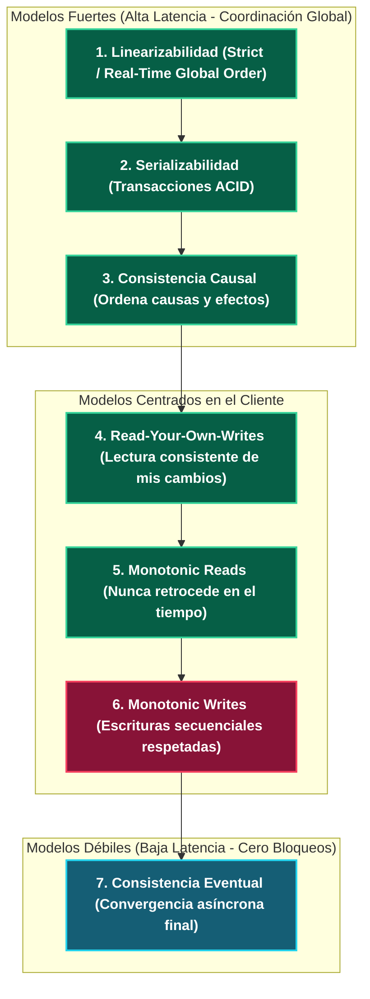
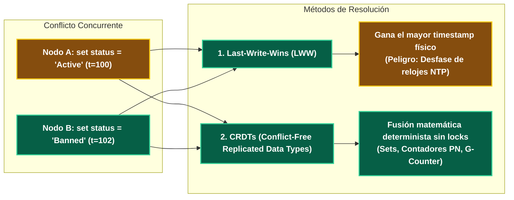

---
tags:
  - system-design
  - distributed-systems
  - consistency-models
  - linearizability
  - crdt
  - fase-2
aliases:
  - Patrones de Consistencia
  - Consistencia Fuerte vs Eventual
modulo: "03"
orden: 2
---

# 03.2 Modelos de Consistencia en Sistemas Distribuidos: De Linearizabilidad a Consistencia Eventual y CRDTs

> *"La consistencia no es un interruptor binario de 'Todo o Nada', sino un espectro formal de garantías matemáticas con trade-offs directos en latencia y complejidad."*

---

## 1. El Espectro Jerárquico de Consistencia

---

## 2. Definición Detallada de los Modelos Clave

### A. Linearizabilidad (*Linearizability / Strong Consistency*)
* **Definición:** Toda lectura devuelve el valor de la escritura más reciente en **tiempo real global**.
* Una vez que un cliente $A$ completa una escritura confirmada, **ningún cliente en ningún lugar del planeta puede volver a leer el valor anterior**.
* Implementación: Requiere algoritmos de consenso con reloj central o sincronización atómica de hardware ([[03.0_Teorema_CAP_Analisis_Riguroso|Raft / Paxos / Google TrueTime con relojes atómicos y GPS]]).

### B. Consistencia Causal (*Causal Consistency*)
* Si el evento $B$ fue provocado por el evento $A$ ($A → B$), todos los nodos deben ver $A$ antes de ver $B$.
* Eventos no relacionados causalmente (concurrentes) pueden procesarse y verse en cualquier orden.
* Ejemplo: En un chat, la respuesta *"¡Genial!"* no puede aparecer antes del mensaje *"¿Nos vemos hoy?"*.

### C. Consistencia Eventual (*Eventual Consistency*)
* Si no se realizan nuevas escrituras sobre una clave, **eventualmente todos los nodos del cluster convergerán al mismo valor idéntico**.
* Durante el periodo de convergencia, distintos clientes pueden leer valores diferentes y desactualizados.

---

## 3. Resolución de Conflictos en Consistencia Eventual

Cuando dos nodos reciben escrituras concurrentes sin coordinación:

### Por qué Last-Write-Wins (LWW) es Peligroso:
* Los relojes de cuarzo de los servidores sufren **Clock Drift** (desviación de milisegundos). Si el Nodo A tiene su reloj 50ms adelantado, sus escrituras sobrescribirán permanentemente escrituras más recientes del Nodo B, destruyendo datos de forma silenciosa.

### CRDTs (Conflict-Free Replicated Data Types):
* Estructuras de datos matemáticas que se pueden replicar y fusionar en cualquier orden ($A \cup B = B \cup A$) garantizando que el resultado final sea siempre idéntico:
  - **PN-Counter:** Contador distribuido que permite incrementos y decrementos independientes en cada nodo sin bloqueo.
  - **ORSet (Observed-Remove Set):** Conjuntos para carritos de compra distribuidos.

---

## Microtareas de Retención Intelectual

> [!QUESTION]- Active Recall: ¿Cuál es la diferencia entre Linearizabilidad y Serializabilidad?
> **Respuesta:**
> - **Linearizabilidad:** Garantía sobre **operaciones individuales sobre un solo objeto** en tiempo real global (evita lecturas de datos viejos en sistemas distribuidos).
> - **Serializabilidad:** Garantía de **transacciones sobre múltiples objetos** en bases de datos ACID (asegura que transacciones concurrentes produzcan el mismo resultado que si se ejecutaran en algún orden secuencial).

---

> [!TIP]- Micro-Cálculo Mental: Concurrencia en PN-Counter (CRDT)
> **Reto:** Tienes un cluster de **3 datacenters** con un contador distribuido de likes usando un CRDT PN-Counter.
> - Datacenter 1 registra: $+100$ likes, $-5$ dislikes.
> - Datacenter 2 registra: $+250$ likes, $-10$ dislikes.
> - Datacenter 3 registra: $+50$ likes, $-0$ dislikes.
> Los 3 datacenters sincronizan sus vectores de estado tras una partición de red.
> ¿Cuál es el valor final exacto sin necesidad de bloqueos ni transacciones?
> **Cálculo:**
> - Likes totales $= 100 + 250 + 50 = 400$.
> - Dislikes totales $= 5 + 10 + 0 = 15$.
> - Total acumulado $= 400 - 15 = \mathbf{385 \text{ likes}}$.

---

> [!WARNING]- Dilema Arquitectónico: Monotonic Reads en Feed de Red Social
> **Escenario:** Un usuario lee un post en Twitter, presiona actualizar (F5) y el post desaparece. Vuelve a presionar F5 y el post reaparece.
> **Pregunta:** ¿Qué modelo de consistencia se violó y cómo se mitiga?
> **Respuesta:** Se violó la garantía de **Monotonic Reads (Lecturas Monótonas)**. La primera petición fue atendida por una réplica que ya tenía el post; la segunda fue atendida por una réplica con retraso de replicación (*Replication Lag*) que aún no lo recibía. **Solución:** Asignar afinidad de sesión por usuario a nivel de proxy inverso (*Session Sticky Routing*) para que las lecturas sucesivas de un mismo usuario vayan a la misma réplica, o propagar un token de versión mínima requerida en la cabecera HTTP.

---

> [!NOTE]- Desafío Feynman: Consistencia Eventual
> Es como el marcador de puntuación en un maratón con 5 puestos de control: los jueces de cada puesto anotan los tiempos en sus libretas locales mientras los corredores pasan; al final de la tarde, todos se reúnen en la meta, juntan las libretas y publican la lista oficial idéntica para todo el mundo.

---

## Conceptos Relacionados
- [[03.0_Teorema_CAP_Analisis_Riguroso|03.0 Teorema CAP]]
- [[03.1_Teorema_PACELC_Extension_del_CAP|03.1 Teorema PACELC]]
- [[02.2_Replicacion_Master-Slave_vs_Multi-Master_y_Failover|02.2 Replicación y Quorums]]
- [[00_MOC_System_Design_Mastery|Volver al Índice Maestro (MOC)]]
