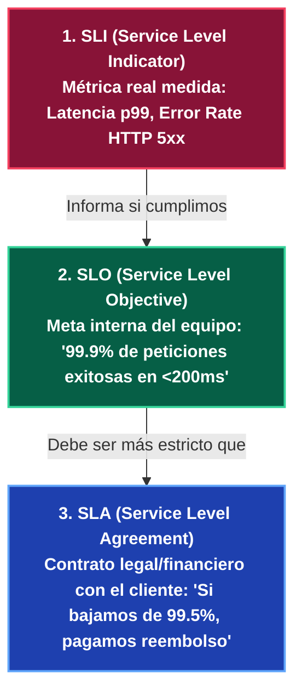
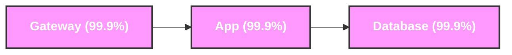
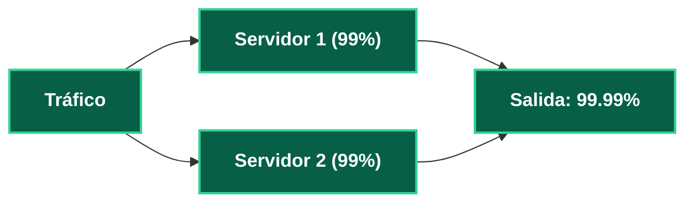

---
tags:
  - system-design
  - reliability
  - sla
  - slo
  - availability
  - math
  - fase-2
aliases:
  - Disponibilidad y SLA
  - Cálculo de los Nueves
modulo: "03"
orden: 3
---

# 03.3 Disponibilidad y Confiabilidad: SLAs, SLOs, SLIs y el Cálculo Matemático de los Nueves

> *"La alta disponibilidad no es un estado binario de 'funciona o no funciona', sino un cálculo probabilístico riguroso de tiempo de inactividad permitido por año."*

---

## 1. La Trinidad de la Confiabilidad: SLA vs SLO vs SLI

---

## 2. La Tabla Matemática de los "Nueves"

Tiempo máximo de caída (*Downtime*) permitido según el porcentaje de disponibilidad:

| Disponibilidad | Caída por Año | Caída por Mes (30 días) | Caída por Semana | Caída por Día |
| :--- | :--- | :--- | :--- | :--- |
| **99% (Dos 9s)** | 3.65 días | 7.20 horas | 1.68 horas | 14.40 minutos |
| **99.9% (Tres 9s)** | 8.76 horas | 43.80 minutos | 10.08 minutos | 1.44 minutos |
| **99.99% (Cuatro 9s)** | **52.56 minutos** | 4.38 minutos | 1.01 minutos | **8.64 segundos** |
| **99.999% (Cinco 9s - High Availability)** | **5.26 minutos** | **25.92 segundos** | 5.96 segundos | **0.86 segundos** |
| **99.9999% (Seis 9s - Telecom)** | 31.54 segundos | 2.59 segundos | 0.60 segundos | 0.086 segundos |

---

## 3. Matemáticas de Disponibilidad: Componentes en Serie vs Paralelo

### A. Componentes en Serie (Cadena de Dependencias)
Si un servicio depende secuencialmente de un API Gateway ($A_1$), un Microservicio ($A_2$) y una Base de Datos ($A_3$), la disponibilidad total es el **producto directo de sus disponibilidades**:

$$A_{\text{total}} = A_1 \times A_2 \times \dots \times A_n$$

* **Consecuencia Crítica:** La disponibilidad global **SIEMPRE es inferior a la del componente más débil**.
* Ejemplo: Si cada uno tiene $99.9\%$ ($0.999$):
  $$A_{\text{total}} = 0.999 \times 0.999 \times 0.999 = 0.997003 \approx \mathbf{99.7\%} \text{ (Perdiste un 9 entero de disponibilidad)}.$$

### B. Componentes en Paralelo (Redundancia / Failover)
Si colocas dos servidores idénticos en paralelo donde solo uno necesita estar vivo:

$$A_{\text{total}} = 1 - (1 - A_1) \times (1 - A_2) \times \dots \times (1 - A_n)$$

* Ejemplo: Dos servidores con disponibilidad mediocre del $99\%$ ($0.99$) en paralelo:
  $$A_{\text{total}} = 1 - (1 - 0.99) \times (1 - 0.99) = 1 - (0.01 \times 0.01) = 1 - 0.0001 = \mathbf{99.99\%} \text{ (Cuatro 9s con hardware estándar)}.$$

---

## 4. MTBF y MTTR

$$\text{Disponibilidad} = \frac{\text{MTBF}}{\text{MTBF} + \text{MTTR}}$$

* **MTBF (*Mean Time Between Failures*):** Tiempo promedio que el sistema opera sin fallos.
* **MTTR (*Mean Time To Recovery*):** Tiempo promedio que tarda el equipo y la automatización en restaurar el servicio tras una caída.
* **Estrategia Staff Engineer:** No intentes hacer el MTBF infinito (los servidores siempre van a fallar). **Invierte en reducir el MTTR a segundos** mediante automatización de failover, Canary Deployments y rollbacks automáticos.

---

## Microtareas de Retención Intelectual

> [!QUESTION]- Active Recall: ¿Cuál es la diferencia entre un SLO y un SLA?
> **Respuesta:**
> - **SLO (Service Level Objective):** Es el objetivo interno estricto del equipo de ingeniería (ej. *"Mantener 99.95% de éxito"*). Si se viola, el equipo detiene lanzamientos de features para enfocarse en estabilidad (*Error Budget agotado*).
> - **SLA (Service Level Agreement):** Es el compromiso contractual legal con penalizaciones financieras (ej. *"Garantizamos 99.0% o devolvemos el 20% de la factura"*). El SLO siempre debe ser más exigente que el SLA para tener margen de maniobra.

---

> [!TIP]- Micro-Cálculo Mental: Disponibilidad de Arquitectura Real
> **Reto:** Tu arquitectura consta de:
> 1. Un Load Balancer redundante en paralelo ($99.99\%$).
> 2. Una capa de 5 Microservicios en serie ($99.9\%$ c/u).
> 3. Una Base de Datos en réplica primaria-secundaria ($99.99\%$).
> ¿Cuál es la disponibilidad total aproximada del sistema?
> **Cálculo:**
> - Capa App: $0.999^5 \approx 0.9950$ ($99.50\%$).
> - $A_{\text{total}} = 0.9999 \times 0.9950 \times 0.9999 \approx \mathbf{99.49\%}$.
> - *Lección:* Aunque tengas base de datos y balanceador con cuatro 9s, encadenar 5 microservicios en serie degradó tu sistema a menos de dos 9s. Para subir disponibilidad, debes desacoplar microservicios mediante colas asíncronas.

---

> [!WARNING]- Dilema Arquitectónico: El Costo de Pasar de 99.9% a 99.999%
> **Escenario:** El CEO pide que la plataforma pase de tres 9s (8.7 horas de caída/año) a cinco 9s (5 minutos de caída/año).
> **Pregunta:** ¿Qué implicaciones de arquitectura y costos tiene este cambio?
> **Respuesta:** **El costo crece de forma exponencial (10x a 50x el presupuesto).** Cinco 9s prohíbe despliegues manuales, prohíbe mantenimiento nocturno con ventanas de parada, exige arquitecturas Multi-Región Activo-Activo, redundancia de proveedores DNS/CDN, pruebas de caos continuas (Chaos Engineering) y failovers automatizados en $<1 \text{ segundo}$. Si el modelo de negocio no pierde millones por cada minuto de caída, tres o cuatro 9s suele ser el equilibrio económico correcto.

---

> [!NOTE]- Desafío Feynman: Disponibilidad en Serie vs Paralelo
> - **En Serie:** Es como una fila de 4 soldados atados por los pies: si uno solo tropieza, los cuatro caen al suelo.
> - **En Paralelo:** Es como un avión bimotor: puede cruzar el océano con un solo motor si el otro se apaga en pleno vuelo.

---

## Conceptos Relacionados
- [[03.0_Teorema_CAP_Analisis_Riguroso|03.0 Teorema CAP]]
- [[01.3_Balanceadores_de_Carga_L4_vs_L7_Active-Active_vs_Active-Passive|01.3 Balanceadores de Carga y HA]]
- [[08.2_Formula_de_Estimacion_QPS_IOPS_Almacenamiento_y_Ancho_de_Banda|06.3 Matemáticas y Estimación]]
- [[00_MOC_System_Design_Mastery|Volver al Índice Maestro (MOC)]]
