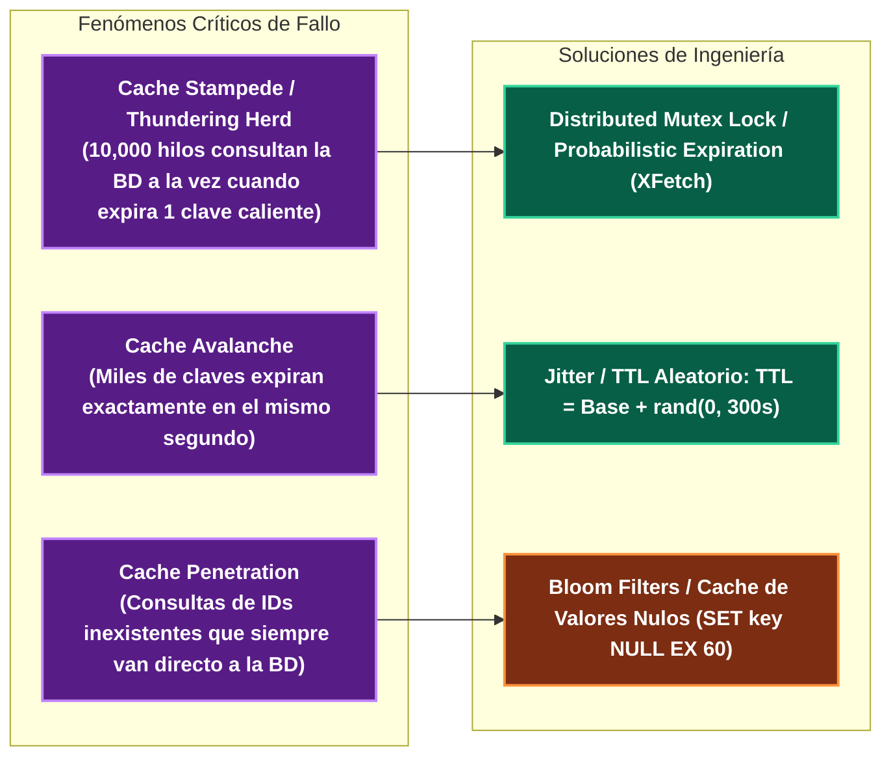

---
tags:
  - system-design
  - caching
  - performance
  - redis
  - fase-3
aliases:
  - Estrategias de Caché
  - Cache-Aside vs Write-Through vs Write-Back
modulo: "04"
orden: 0
---

# 04.0 Estrategias de Caché: Cache-Aside, Write-Through, Write-Back y Refresh-Ahead

> *"El caché es el multiplicador de velocidad más potente de la arquitectura de software: almacena datos computados previamente en memoria RAM para servir lecturas con latencias submilisegundo y proteger a la base de datos de la saturación."*

---

## 1. Los 4 Patrones de Caché Fundamentales

```mermaid
flowchart TD
    subgraph sg_1__Cache_Aside___Lazy_Loading__Lectura_Bajo_Demanda_ ["1. Cache-Aside / Lazy Loading (Lectura Bajo Demanda)"]
        App1["Aplicación"]:::client -->|"1. GET key"| Cache1["Caché (Redis)"]:::cache
        Cache1 -.->|"2. Cache Miss"| App1
        App1 -->|"3. SELECT * FROM db"| DB1["Base de Datos"]:::database
        App1 -->|"4. SET key value (TTL)"| Cache1
    end
    
    subgraph sg_2__Write_Through__Escritura_Sincr_nica_Dual_ ["2. Write-Through (Escritura Sincrónica Dual)"]
        App2["Aplicación"]:::client -->|"1. Escribe dato"| Cache2["Caché"]:::cache
        Cache2 -->|"2. Escribe sincrónicamente"| DB2["Base de Datos"]:::database
    end
    
    subgraph sg_3__Write_Back___Write_Behind__Escritura_As_ncrona_en_Batch_ ["3. Write-Back / Write-Behind (Escritura Asíncrona en Batch)"]
        App3["Aplicación"]:::client -->|"1. Escribe a RAM (ACK inmediato)"| Cache3["Caché"]:::cache
        Cache3 -.->|"2. Flush asíncrono en batch cada N seg"| DB3["Base de Datos"]:::database
    end

    classDef client fill:#1e40af,stroke:#60a5fa,stroke-width:2px,color:#ffffff,font-weight:bold;
    classDef proxy fill:#312e81,stroke:#818cf8,stroke-width:2px,color:#ffffff,font-weight:bold;
    classDef service fill:#065f46,stroke:#34d399,stroke-width:2px,color:#ffffff,font-weight:bold;
    classDef database fill:#7c2d12,stroke:#fb923c,stroke-width:2px,color:#ffffff,font-weight:bold;
    classDef cache fill:#581c87,stroke:#c084fc,stroke-width:2px,color:#ffffff,font-weight:bold;
    classDef queue fill:#155e75,stroke:#22d3ee,stroke-width:2px,color:#ffffff,font-weight:bold;
    classDef warning fill:#881337,stroke:#f43f5e,stroke-width:2px,color:#ffffff,font-weight:bold;
    classDef highlight fill:#854d0e,stroke:#facc15,stroke-width:2px,color:#ffffff,font-weight:bold;
```

---

## 2. Comparativa Técnica Exhaustiva

| Estrategia | Mecánica de Lectura / Escritura | Ventajas | Desventajas / Riesgos | Casos de Uso Ideales |
| :--- | :--- | :--- | :--- | :--- |
| **Cache-Aside (Lazy Loading)** | La app consulta el caché; si falla (*Miss*), lee de la BD y puebla el caché. Las escrituras van directo a la BD y luego invalidan el caché. | Solo se cachean datos solicitados realmente; fallos en el caché no tumban el sistema (degrada a BD). | Triple salto de red en Cache Miss; riesgo de servir datos obsoletos si no se invalida correctamente. | Perfiles de usuario, catálogos de e-commerce, artículos de blog. |
| **Read-Through** | La app habla **únicamente con el caché**. Si hay un Miss, el propio motor de caché consulta a la BD y se actualiza. | Código de aplicación limpio y desacoplado de la lógica de persistencia. | Requiere plugins o infraestructura de caché especializada. | Sistemas con capas de middleware unificadas. |
| **Write-Through** | La app escribe en el caché, y el caché escribe **inmediatamente en la BD de forma sincrónica** antes de confirmar el OK. | Datos en caché 100% frescos y consistentes; lecturas posteriores siempre encuentran el dato (*Hit*). | Alta latencia de escritura (suma el tiempo de escribir en RAM + escribir en disco de BD). | Transacciones financieras, inventarios críticos, balances de cuenta. |
| **Write-Back (Write-Behind)** | La app escribe en el caché en RAM y recibe confirmación instantánea ($<1\text{ms}$). El caché acumula cambios y los escribe en la BD en segundo plano (*Batching*). | **Rendimiento de escritura colosal**; absorbe picos masivos de tráfico; reduce drásticamente escrituras en BD. | **Pérdida de datos** si el nodo de caché se reinicia antes de vaciar su cola de escritura a disco. | Conteo de visualizaciones de video, telemetría IoT, métricas en tiempo real. |
| **Refresh-Ahead** | El caché predice qué claves expirarán pronto y las recarga desde la BD antes de que el usuario las solicite. | Latencia de lectura prácticamente $0\text{ ms}$ constante para datos calientes. | Si la predicción falla, ejecuta consultas innecesarias en la base de datos. | Feeds de noticias principales, rankings globales. |

---

## 3. Mitigación de Catástrofes de Caché en Producción

---

## Microtareas de Retención Intelectual

> [!QUESTION]- Active Recall: ¿Qué es el fenómeno de Cache Stampede (o Thundering Herd) y cómo lo previene un Mutex Distribuido?
> **Respuesta:** Ocurre cuando una clave muy caliente (ej. la página principal de un diario) expira de su TTL. En ese milisegundo exacto, miles de peticiones concurrentes sufren un *Cache Miss* simultáneo y todas ejecutan la misma consulta pesada contra la base de datos relacional, colapsando el servidor de BD.
> **Solución con Mutex:** Solo el primer hilo que detecta el miss adquiere un bloqueo distribuido en Redis (`SET lock:key token NX EX 5`) para consultar la base de datos y repoblar el caché; todos los demás hilos esperan 50ms o sirven temporalmente el valor viejo (*Stale*).

---

> [!TIP]- Micro-Cálculo Mental: Write-Back vs Escritura Directa en Disco
> **Reto:** Una API de analítica recibe **100,000 eventos de métricas por segundo**.
> - Escribir individualmente cada evento en una base de datos relacional en disco tarda **5 ms** (IOPS saturadas).
> - Con **Write-Back en Redis**: Se incrementa un contador en memoria RAM ($0.1\text{ ms}$) y un worker vuelca la suma agregada a la BD cada **10 segundos** (1 sola escritura de batch por clave).
> ¿Cuál es la reducción en el número de operaciones de escritura físicas en disco por cada minuto?
> **Cálculo:**
> - Sin Caché: $100,000 \times 60 = \mathbf{6,000,000 \text{ escrituras/minuto en disco}}$.
> - Con Write-Back: 6 escrituras de batch por minuto.
> - **Reducción:** Del $99.9999\%$ en operaciones de E/S de disco.

---

> [!WARNING]- Dilema Arquitectónico: Invalidar Caché vs Actualizar Caché en una Mutación
> **Escenario:** Un usuario actualiza su nombre de perfil en la base de datos.
> **Pregunta:** ¿Debes ejecutar `redis.set(user_key, new_data)` (actualizar) o `redis.del(user_key)` (invalidar/borrar)?
> **Respuesta:** **Debes INVALIDAR (`redis.del`).** Si dos peticiones concurrentes $A$ y $B$ actualizan el mismo perfil al mismo tiempo, el orden de escritura en la base de datos puede ser $A$ y luego $B$, pero en el caché por retrasos de red puede llegar primero $B$ y luego $A$. Si actualizas el valor directamente, el caché quedará permanentemente desincronizado con el dato viejo de $A$. Al borrar la clave (`DEL`), la siguiente lectura forzará un *Cache Miss* seguro que traerá el dato final consistente de la base de datos.

---

> [!NOTE]- Desafío Feynman: Cache-Aside vs Write-Through
> - **Cache-Aside:** Es como tener un bloc de notas sobre tu escritorio: cuando necesitas un número de teléfono, miras tu bloc; si no está, te levantas a buscar la guía telefónica vieja en el estante, anotas el número en tu bloc y lo usas.
> - **Write-Through:** Es como escribir con papel carbón: cada vez que anotas un dato en tu bloc de notas, se copia instantáneamente en el archivo central sin que tengas que hacer dos viajes.

---

## Conceptos Relacionados
- [[04.1_Algoritmos_de_Eviccion_LRU_LFU_FIFO|04.1 Algoritmos de Evicción LRU/LFU]]
- [[02.4_Key-Value_y_Document_Stores_Redis_DynamoDB_MongoDB|02.4 Redis y Key-Value Stores]]
- [[01.2_CDNs_Push_vs_Pull_y_Edge_Caching|01.2 CDNs y Edge Caching]]
- [[00_MOC_System_Design_Mastery|Volver al Índice Maestro (MOC)]]
