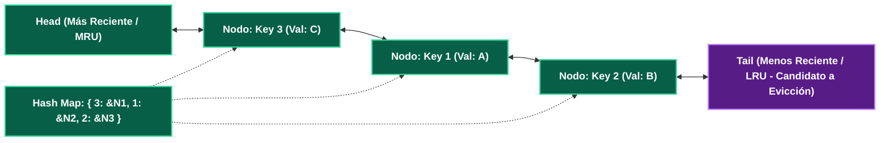

---
tags:
  - system-design
  - caching
  - algorithms
  - lru
  - lfu
  - data-structures
  - fase-3
aliases:
  - Algoritmos de Evicción
  - LRU vs LFU vs FIFO
modulo: "04"
orden: 1
---

# 04.1 Algoritmos de Evicción de Caché: LRU, LFU, FIFO, 2Q y W-TinyLFU

> *"La memoria RAM es finita y costosa: cuando el caché alcanza su capacidad máxima, el algoritmo de evicción decide qué dato tiene menor probabilidad de ser consultado en el futuro para descartarlo."*

---

## 1. Los 3 Algoritmos Clásicos

---

## 2. Implementación Interna de LRU en $O(1)$

Para lograr operaciones de lectura (`get`) e inserción/actualización (`put`) en tiempo constante $O(1)$, LRU combina dos estructuras de datos:
1. **Hash Map:** Mapea `key -> Node Pointer` para acceso directo en $O(1)$.
2. **Lista Doblemente Enlazada (Doubly-Linked List):** Mantiene el orden de recencia. El nodo más recientemente usado (*Head*) se coloca al frente; el más antiguo (*Tail*) al final.

### Operaciones:
* **Lectura (`get(key)`):** Busca el puntero en el Hash Map ($O(1)$), desconecta el nodo de su posición actual y lo mueve a la cabeza (*Head*) ($O(1)$).
* **Inserción (`put(key, val)`):** Si la clave existe, actualiza el valor y lo mueve al Head. Si no existe y el caché está lleno, elimina el nodo de la cola (*Tail*) tanto de la lista como del Hash Map ($O(1)$), e inserta el nuevo nodo en el Head.

---

## 3. Comparativa y Algoritmos Modernos (W-TinyLFU)

| Algoritmo | Complejidad Temporal | Complejidad Espacial | Vulnerabilidad / Debilidad |
| :--- | :--- | :--- | :--- |
| **FIFO** | $O(1)$ | Muy baja | Puede descartar datos extremadamente populares solo porque fueron cargados temprano (*Belady's Anomaly*). |
| **LRU** | $O(1)$ | Baja (2 punteros por nodo) | **Vulnerable a Escaneos Masivos:** Si un proceso hace un escaneo secuencial de 1,000,000 de registros fríos una sola vez, expulsa del caché todos los datos calientes frecuentes. |
| **LFU** | $O(1)$ con listas de frecuencia | Media (contadores de frecuencia) | **Contaminación Histórica:** Un dato que fue hiper-popular en Navidad acumula 1,000,000 de accesos y jamás podrá ser desalojado en agosto aunque nadie lo consulte. |
| **W-TinyLFU (Caffeine / Redis 6+)** | $O(1)$ | Ultra-baja (usa Count-Min Sketch) | Combina una pequeña ventana LRU para novedades con un filtro LFU probabilístico con decaimiento temporal (*Aging*). |

---

## Microtareas de Retención Intelectual

> [!QUESTION]- Active Recall: ¿Por qué una lista simplemente enlazada no sirve para implementar LRU en $O(1)$?
> **Respuesta:** Porque para mover un nodo existente al inicio de la lista cuando es consultado (`get`), necesitas actualizar el puntero `next` del nodo anterior. En una lista simplemente enlazada, encontrar el nodo anterior requiere recorrer la lista desde el principio en $O(N)$. La **lista doblemente enlazada** almacena punteros `prev` y `next` en cada nodo, permitiendo desengancharlo en $O(1)$.

---

> [!TIP]- Micro-Cálculo Mental: Memoria de Overhead de LRU
> **Reto:** Quieres almacenar **10,000,000 de claves** en un caché LRU en C/Rust en arquitectura de 64-bit.
> Cada nodo de la lista doblemente enlazada contiene:
> - Puntero `prev` (8 bytes) + Puntero `next` (8 bytes) + Puntero de clave/valor (16 bytes) = **32 bytes de overhead por nodo** (sin contar el Hash Map).
> ¿Cuánta memoria RAM consume únicamente la estructura de la lista enlazada para 10 millones de elementos?
> **Cálculo:**
> - $10,000,000 \times 32 \text{ bytes} = 320,000,000 \text{ bytes} \approx \mathbf{320 \text{ MB de RAM}}$ solo para mantener el ordenamiento LRU.

---

> [!WARNING]- Dilema Arquitectónico: Elección de Política de Evicción en Redis
> **Escenario:** Tu instancia de Redis se llena al 100% de memoria. El 80% de tus claves son sesiones de usuario con TTL explícito, y el 20% son datos maestros estáticos sin TTL.
> **Pregunta:** ¿Configuras `volatile-lru` o `allkeys-lru` como política `maxmemory-policy`?
> **Respuesta:** **`volatile-lru`.** La política `volatile-lru` solo evalúa y desaloja claves que tienen un tiempo de expiración (**TTL**) configurado, protegiendo tus datos maestros estáticos de ser borrados por accidente. Si configuraras `allkeys-lru`, Redis podría desalojar tablas maestras críticas si sufren un valle temporal de accesos.

---

> [!NOTE]- Desafío Feynman: LRU vs LFU
> - **LRU (Recencia):** Es como la pila de ropa en tu silla: la ropa que usaste ayer queda arriba de todo; la que no has usado en un mes termina en el fondo y la regalas.
> - **LFU (Frecuencia):** Es como tu abrigo favorito de invierno: aunque lleves 3 días sin usarlo, lo conservas porque lo has usado 200 veces este año.

---

## Conceptos Relacionados
- [[04.0_Estrategias_de_Cache_Write-Through_Write-Back_Refresh-Ahead|04.0 Estrategias de Caché]]
- [[04.2_Consistent_Hashing_con_Nodos_Virtuales|04.2 Consistent Hashing]]
- [[02.4_Key-Value_y_Document_Stores_Redis_DynamoDB_MongoDB|02.4 Redis y Motores en Memoria]]
- [[00_MOC_System_Design_Mastery|Volver al Índice Maestro (MOC)]]
