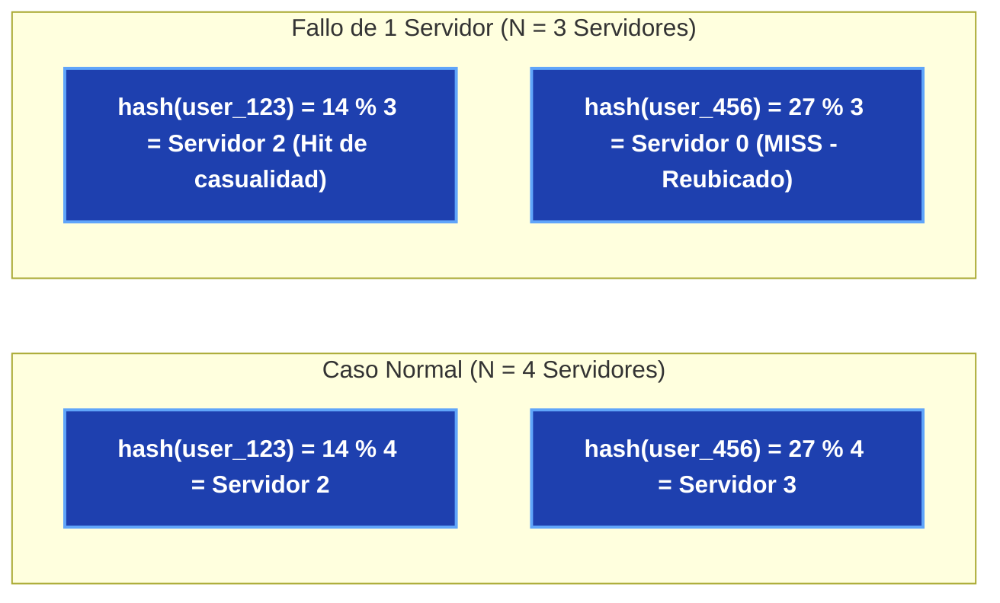
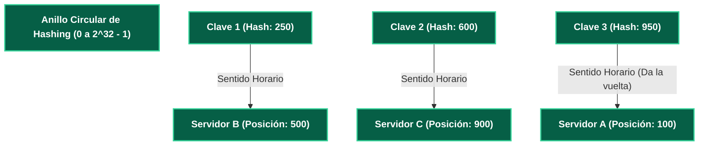
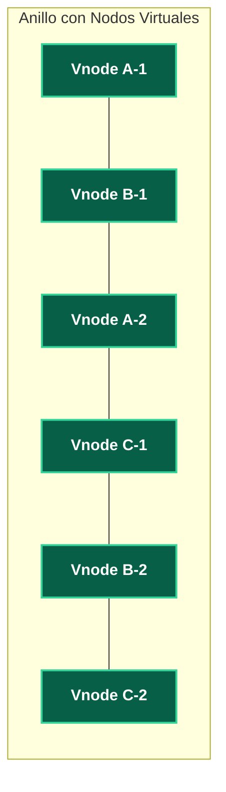

---
tags:
  - system-design
  - algorithms
  - distributed-systems
  - consistent-hashing
  - caching
  - fase-3
aliases:
  - Consistent Hashing con Nodos Virtuales
  - Hashing Consistente y Balanceo
modulo: "04"
orden: 2
---

# 04.2 Consistent Hashing: El Algoritmo del Anillo y Nodos Virtuales (Vnodes)

> *"En un cluster distribuido dinámico donde los servidores se encienden, se apagan o fallan continuamente, el Hashing Consistente garantiza que añadir o eliminar un nodo solo redistribuya una fracción mínima $\frac{K}{N}$ de claves en lugar de invalidar todo el sistema."*

---

## 1. El Problema del Hashing Modular Tradicional ($hash(key) \pmod N$)

Si tienes $N = 4$ servidores de caché y usas la fórmula ingenua:

$$\text{Servidor} = \text{hash}(\text{key}) \pmod 4$$

* **Consecuencia Catastrófica:** Cambiar $N$ altera el módulo de casi todas las claves existentes ($\sim 80-90\%$). Todos los servidores de caché sufren un *Cache Miss* simultáneo y el $100\%$ del tráfico golpea a la base de datos, provocando un colapso en cascada (*Cascading Failure*).

---

## 2. La Mecánica del Anillo de Hashing Consistente

Inventado por David Karger et al. (MIT / Akamai):

1. Se proyecta un espacio de claves circular cerrado de $0$ a $2^{32}-1$ (usando funciones hash como MD5, SHA-1 o MurmurHash).
2. Se calculan las posiciones de los **servidores físicos** en el anillo mediante $hash(\text{Server\_IP})$.
3. Para ubicar una clave, se calcula $hash(\text{Key})$ y se **avanza en sentido horario** hasta encontrar el primer servidor en el camino.

### Qué sucede al añadir el Servidor D en la posición 400:
* Solo las claves ubicadas entre 101 y 400 (que antes iban al Servidor B) se mueven al nuevo Servidor D.
* **El 100% de las demás claves en el resto del anillo no se ven afectadas.**

---

## 3. Nodos Virtuales (Vnodes): Resolviendo el Desbalanceo de Carga

### El Problema de la Distribución No Uniforme:
Con pocos servidores físicos, el espacio del anillo queda dividido de forma desigual (un servidor puede recibir el 70% del tráfico mientras otro recibe el 10%).

### La Solución con Vnodes:
Cada servidor físico se mapea a **múltiples puntos virtuales (ej. 100 a 256 Vnodes)** a lo largo del anillo usando diferentes etiquetas (`ServerA#1`, `ServerA#2`, `ServerA#3`).

### Ventajas de los Nodos Virtuales:
1. **Distribución Estadística Uniforme:** La desviación estándar de carga entre servidores tiende a cero ($<2\%$).
2. **Capacidad Heterogénea:** Un servidor potente con 128GB de RAM puede recibir 200 Vnodes, mientras uno de 32GB recibe 50 Vnodes.
3. **Rebalanceo Suave:** Si un nodo físico muere, sus 100 Vnodes se reparten de forma equitativa entre **todos los demás servidores restantes**, evitando sobrecargar a un solo vecino.

---

## Microtareas de Retención Intelectual

> [!QUESTION]- Active Recall: En un anillo de Hashing Consistente con $N$ nodos y $K$ claves totales, ¿cuántas claves deben reubicarse en promedio al añadir o remover un servidor?
> **Respuesta:** Exactamente **$\frac{K}{N}$ claves** (la fracción mínima matemáticamente posible). En un sistema modular tradicional, se reubicarían $\frac{N-1}{N} \approx 99\%$ de las claves.

---

> [!TIP]- Micro-Cálculo Mental: Búsqueda Binaria en el Anillo de Vnodes
> **Reto:** Tienes un cluster de **50 servidores físicos**, cada uno con **200 nodos virtuales** en el anillo ($M = 50 \times 200 = 10,000 \text{ Vnodes}$). Los Vnodes se almacenan ordenados en un array en memoria.
> Cuando llega una petición con `hash(key)`, el router ejecuta una búsqueda binaria (`std::upper_bound` / `bisect`) para encontrar el primer Vnode horario.
> ¿Cuántas comparaciones de enteros realiza la CPU en el peor caso?
> **Cálculo:**
> - Complejidad: $\lceil \log_2(10,000) \rceil = \mathbf{14 \text{ comparaciones}}$.
> - Tiempo de CPU: $<50 \text{ nanosegundos}$ por enrutamiento.

---

> [!WARNING]- Dilema Arquitectónico: Algoritmo de Hashing para el Anillo (MD5 vs MurmurHash3)
> **Escenario:** Estás implementando un router de consistent hashing en Go/Rust que debe balancear **1,000,000 de peticiones por segundo**.
> **Pregunta:** ¿Utilizas una función criptográfica como SHA-256 / MD5 o una no criptográfica como MurmurHash3 / xxHash?
> **Respuesta:** **MurmurHash3 o xxHash.** En consistent hashing no se requiere seguridad criptográfica contra atacantes, sino una **distribución uniforme de bits y velocidad extrema de CPU**. MurmurHash3 y xxHash son 10x más rápidas que SHA-256 y procesan gigabytes por segundo sin consumir ciclos innecesarios de CPU.

---

> [!NOTE]- Desafío Feynman: Consistent Hashing
> Imagina una mesa redonda de ruleta con números del 1 al 100 y 3 jugadores sentados (A en el 10, B en el 40, C en el 80).
> Cuando la bolita cae en el número 25, la ficha se la lleva el jugador que esté más cerca en sentido de las agujas del reloj (el jugador B en el 40). Si entra un nuevo jugador D al número 30, solo le quita a B las bolitas que caigan entre el 11 y el 30; todos los demás jugadores siguen jugando exactamente igual.

---

## Conceptos Relacionados
- [[02.3_Particionamiento_y_Sharding_de_BBDD|02.3 Sharding de Bases de Datos]]
- [[02.5_Wide-Column_y_Graph_Databases_Cassandra_Neo4j|02.5 Anillo P2P de Cassandra]]
- [[04.0_Estrategias_de_Cache_Write-Through_Write-Back_Refresh-Ahead|04.0 Estrategias de Caché]]
- [[00_MOC_System_Design_Mastery|Volver al Índice Maestro (MOC)]]
