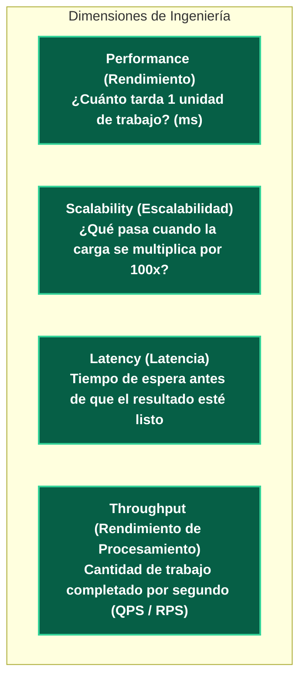
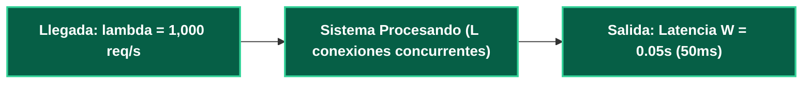
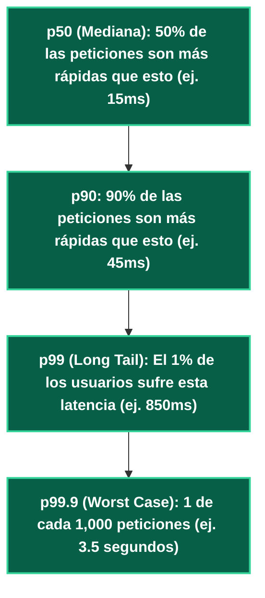

---
tags:
  - system-design
  - performance
  - latency
  - throughput
  - metrics
  - fase-3
aliases:
  - Rendimiento vs Escalabilidad
  - Latencia vs Throughput y Percentiles
modulo: "04"
orden: 4
---

# 04.4 Métricas de Rendimiento: Performance vs Escalabilidad, Latencia vs Throughput y Percentiles

> *"Si un sistema es lento para un solo usuario, tienes un problema de Rendimiento; si un sistema es rápido para un usuario pero se vuelve lento cuando entran 100,000 usuarios, tienes un problema de Escalabilidad."*

---

## 1. Desmitificando los Conceptos

| Métrica | Definición | Analogía de la Carretera |
| :--- | :--- | :--- |
| **Latencia** | El tiempo que tarda un solo vehículo en viajar del punto A al punto B. | 30 minutos de trayecto. |
| **Throughput** | La cantidad total de vehículos que cruzan el peaje por minuto. | 500 autos por minuto. |
| **Ancho de Banda** | El número de carriles disponibles en la autopista. | 8 carriles. |

---

## 2. La Ley de Little ($\mathbf{L = \lambda W}$)

Una ley matemática fundamental de la teoría de colas aplicada a sistemas de software:

$$\mathbf{L = \lambda W}$$

* $L$ = Número promedio de peticiones concurrentes dentro del sistema.
* $\lambda$ (*Throughput*) = Tasa de llegada de peticiones por segundo.
* $W$ (*Latencia*) = Tiempo promedio que tarda una petición en ser procesada.

* **Cálculo de Conexiones Simultáneas:**
  $$L = 1000 \text{ req/s} \times 0.05 \text{ s} = \mathbf{50 \text{ conexiones activas simultáneas}}.$$
* **Alerta de Saturación:** Si la base de datos se degrada y la latencia $W$ sube de $50\text{ms}$ a $2\text{s}$, el número de conexiones en cola $L$ explota a $1000 \times 2 = \mathbf{2,000 \text{ conexiones}}$, agotando el pool de conexiones y tumbando el servidor.

---

## 3. Percentiles de Latencia: Por qué los Promedios son una Ilusión Peligrosa

En sistemas de producción, el **promedio (*Average / Mean*) oculta los fallos más graves**:

### El Impacto del p99 en Microservicios:
Si la página principal de tu frontend hace **100 llamadas internas a microservicios en paralelo** para renderizar la pantalla:

$$\text{Probabilidad de éxito rápido} = 0.99^{100} \approx 0.366 = \mathbf{36.6\%}$$

* **Conclusión Devastadora:** Aunque cada microservicio individual tenga un $p99$ del $99\%$, **el 63.4% de los usuarios finales sufrirá la latencia del peor microservicio lento** en la pantalla principal.

---

## Microtareas de Retención Intelectual

> [!QUESTION]- Active Recall: ¿Por qué la Ley de Little demuestra que reducir la latencia de tu backend incrementa automáticamente la capacidad de usuarios que soporta tu servidor?
> **Respuesta:** De la Ley de Little $L = \lambda W \implies \lambda = \frac{L}{W}$. Dado que la memoria RAM y descriptores de socket limitan el número máximo de conexiones concurrentes $L$ que el hardware puede sostener físicamente, si reduces a la mitad el tiempo de procesamiento $W$ (de 100ms a 50ms), **duplicas al instante el throughput máximo $\lambda$** que el mismo servidor puede procesar sin comprar nuevo hardware.

---

> [!TIP]- Micro-Cálculo Mental: Cálculo de Conexiones con Ley de Little
> **Reto:** Tu API recibe **5,000 peticiones/segundo** ($\lambda = 5000$). Cada petición ejecuta una consulta de base de datos que tarda **200 milisegundos** ($W = 0.2\text{ s}$).
> ¿Cuántas conexiones concurrentes abiertas debe sostener tu Connection Pool hacia la base de datos?
> **Cálculo:**
> - $L = \lambda \times W = 5,000 \times 0.2 = \mathbf{1,000 \text{ conexiones activas concurrentes}}$.
> - *Lección:* Si optimizas la consulta SQL a 20ms ($0.02\text{ s}$), el pool de conexiones necesario baja a solo **100 conexiones**.

---

> [!WARNING]- Dilema Arquitectónico: Optimización para p50 vs p99 en E-Commerce
> **Escenario:** Tu equipo tiene 2 semanas para optimizar el backend:
> - Opción A: Bajar el $p50$ de 20ms a 10ms.
> - Opción B: Bajar el $p99$ de 2.5 segundos a 300ms.
> **Pregunta:** ¿Cuál genera mayor retorno económico para la empresa?
> **Respuesta:** **Opción B (Optimizar el p99).** Los usuarios que caen en el $p99$ (los más lentos) suelen ser los usuarios con carritos de compra más grandes, historiales de pedidos extensos y clientes VIP con mayor volumen de datos. Un retraso de 2.5 segundos en el checkout provoca abandono inmediato de compras de alto valor.

---

> [!NOTE]- Desafío Feynman: Latencia vs Throughput
> Imagina una madre que da a luz a un bebé:
> - La **Latencia** del proceso es de 9 meses (tiempo fijo para 1 bebé).
> - Si quieres aumentar el **Throughput** a 12 bebés por año, no puedes acelerar el embarazo a 1 mes; necesitas 12 madres en paralelo (Escalabilidad Horizontal).

---

## Conceptos Relacionados
- [[01.5_Escalado_Vertical_vs_Horizontal|01.5 Escalado Vertical vs Horizontal]]
- [[08.0_Latencias_que_Todo_Programador_Debe_Saber|08.0 Latencias de Hardware]]
- [[08.2_Formula_de_Estimacion_QPS_IOPS_Almacenamiento_y_Ancho_de_Banda|06.2 Fórmulas de Capacidad]]
- [[00_MOC_System_Design_Mastery|Volver al Índice Maestro (MOC)]]
