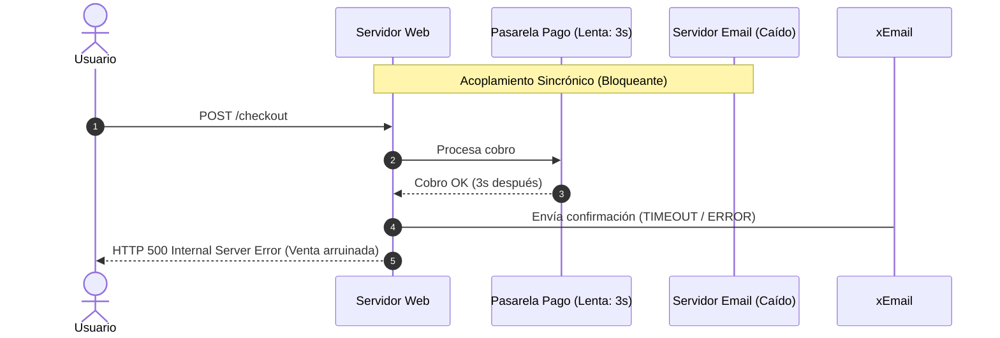
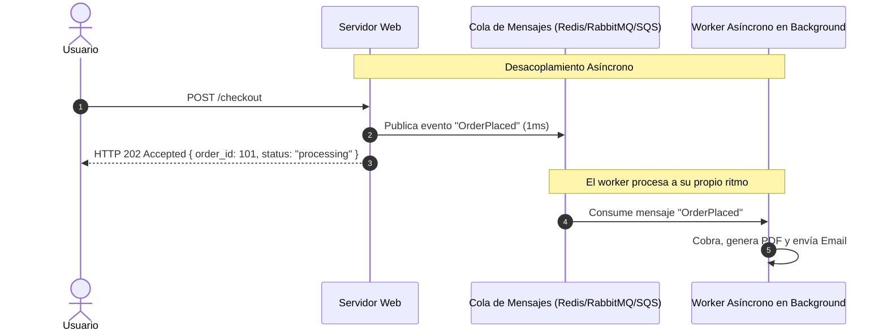
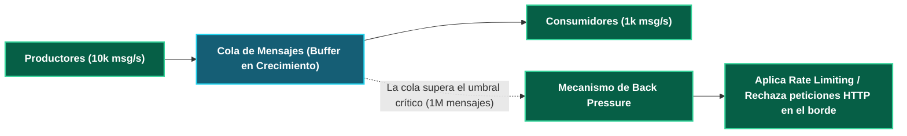
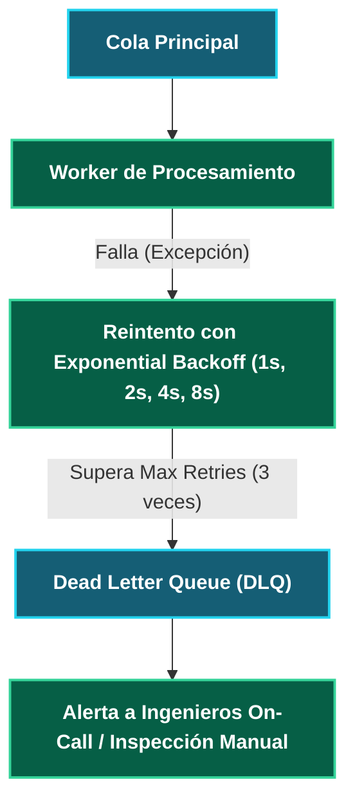

---
tags:
  - system-design
  - async
  - message-queues
  - back-pressure
  - architecture
  - fase-3
aliases:
  - Colas de Mensajes y Back Pressure
  - Message Queues y Desacoplamiento
modulo: "05"
orden: 0
---

# 05.0 Colas de Mensajes: Desacoplamiento Asíncrono, Buffering y Control de Back Pressure

> *"La comunicación sincrónica (HTTP/gRPC) encadena el destino de tus servicios: si el receptor se cae o se ralentiza, el emisor colapsa con él. Las colas de mensajes introducen un amortiguador asíncrono que desacopla el tiempo, el espacio y la velocidad de procesamiento."*

---

## 1. Comunicación Sincrónica vs Asincrónica

---

## 2. El Mecanismo de Back Pressure (Presión de Retorno)

¿Qué sucede cuando los productores generan **10,000 mensajes/segundo** pero los workers solo pueden procesar **1,000 mensajes/segundo**?

### Estrategias de Manejo de Back Pressure:
1. **Pull Model (Tirón del Consumidor):** Los consumidores solicitan activamente mensajes cuando tienen hilos libres (*prefetch count* en RabbitMQ), evitando ser inundados por el broker.
2. **Buffer / Spooling:** La cola absorbe el pico en memoria/disco temporalmente hasta que el tráfico baja.
3. **Drop / Shedding:** Descarta mensajes no críticos (ej. telemetría o logs de depuración) si la cola alcanza el 90% de capacidad.
4. **Auto-scaling de Workers:** Escala horizontalmente la flota de workers basado en la métrica **Queue Lag / Backlog Size**.

---

## 3. Dead Letter Queues (DLQ) y Patrones de Reintento

Si un mensaje contiene un payload corrupto (*Poison Pill*) que hace fallar al worker:

---

## Microtareas de Retención Intelectual

> [!QUESTION]- Active Recall: ¿Qué es una Poison Pill en una cola de mensajes y cómo la neutraliza una Dead Letter Queue (DLQ)?
> **Respuesta:** Una *Poison Pill* es un mensaje con formato inválido o datos corruptos que provoca que el worker lance una excepción no controlada y muera cada vez que intenta procesarlo. Si la cola reencola el mensaje automáticamente de forma infinita, el worker entrará en un bucle de reinicios eterno (*Crash Loop*). La **DLQ** cuenta los reintentos fallidos; tras alcanzar el límite (ej. 3 o 5 fallos), mueve el mensaje a una cola de cuarentena (DLQ) para que la cola principal continúe procesando los mensajes sanos.

---

> [!TIP]- Micro-Cálculo Mental: Tiempo de Drenaje de Cola
> **Reto:** Una ráfaga masiva acumuló **3,600,000 mensajes** en una cola de tareas.
> Tienes un pool de **100 workers concurrentes**, y cada worker procesa **10 mensajes por segundo**.
> ¿Cuánto tiempo tardará el cluster en vaciar la cola por completo?
> **Cálculo:**
> - Capacidad total de procesamiento: $100 \text{ workers} \times 10 \text{ msg/s} = \mathbf{1,000 \text{ msg/s}}$.
> - Tiempo de drenaje: $\frac{3,600,000 \text{ mensajes}}{1,000 \text{ msg/s}} = 3,600 \text{ segundos} = \mathbf{1 \text{ hora}}$.
> - *Lección:* Si necesitas vaciar la cola en 10 minutos, debes escalar a 600 workers.

---

> [!WARNING]- Dilema Arquitectónico: Procesamiento Sincrónico vs Asincrónico de Pagos
> **Escenario:** Un usuario compra un boleto de cine para un asiento específico.
> **Pregunta:** ¿Debes encolar la reserva de forma asíncrona o procesarla sincrónicamente?
> **Respuesta:** **Sincrónicamente para la reserva del asiento (bloqueo transaccional de 5 minutos); Asincrónicamente para el cobro bancario y la emisión del ticket por email.** La validación de que el asiento no ha sido ocupado por otro usuario exige confirmación transaccional inmediata en la base de datos relacional para evitar sobreventas concurrentes.

---

> [!NOTE]- Desafío Feynman: Colas de Mensajes
> Es como el buzón de pedidos en la cocina de un restaurante: el camarero no se queda parado dentro de la cocina esperando 20 minutos a que el chef cocine el plato; clava el papelito con el pedido en una rueda giratoria (cola) y sale inmediatamente a atender a la siguiente mesa. El chef va tomando los papelitos uno por uno a su propio ritmo.

---

## Conceptos Relacionados
- [[05.1_Apache_Kafka_vs_RabbitMQ_vs_AWS_SQS|05.1 Kafka vs RabbitMQ vs SQS]]
- [[05.2_Patrones_Pub-Sub_y_Event-Driven_Architecture|05.2 Patrones Pub-Sub y Event-Driven]]
- [[07.0_Circuit_Breaker_Retry_y_Exponential_Backoff|07.0 Circuit Breaker y Retries]]
- [[00_MOC_System_Design_Mastery|Volver al Índice Maestro (MOC)]]
