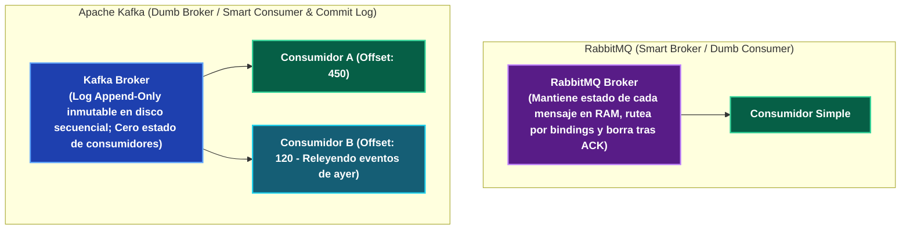
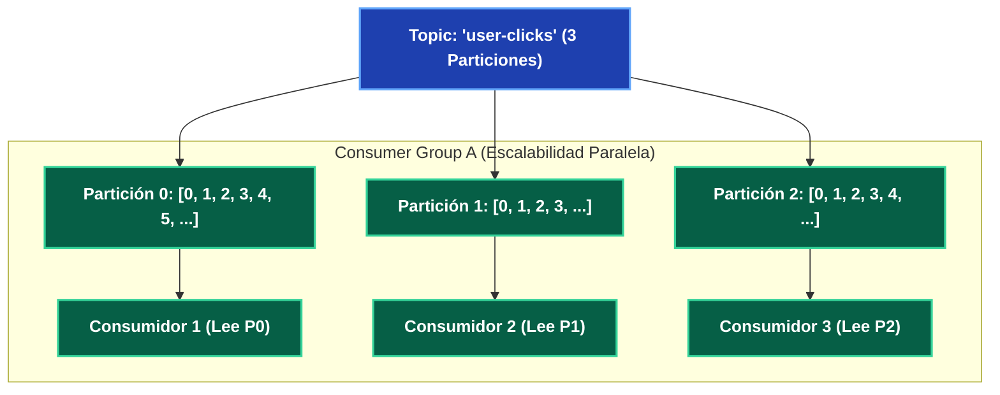

---
tags:
  - system-design
  - messaging
  - kafka
  - rabbitmq
  - sqs
  - streaming
  - fase-3
aliases:
  - Apache Kafka vs RabbitMQ vs AWS SQS
  - Comparativa de Brokers de Mensajería
modulo: "05"
orden: 1
---

# 05.1 Brokers de Mensajería: Apache Kafka vs RabbitMQ vs AWS SQS

> *"RabbitMQ es una oficina postal inteligente que rastrea y destruye cada carta en cuanto es leída; Apache Kafka es un libro contable inmutable de eventos ordenados en disco que permite a múltiples lectores releer la historia desde cualquier punto del tiempo."*

---

## 1. Filosofías Opuestas: Smart Broker / Dumb Consumer vs Dumb Broker / Smart Consumer

---

## 2. Matriz Comparativa Exhaustiva

| Característica | Apache Kafka / Apache Pulsar | RabbitMQ | AWS SQS |
| :--- | :--- | :--- | :--- |
| **Modelo de Arquitectura** | **Distributed Commit Log** (Append-Only por partición). | **Message Broker Tradicional** (Colas basadas en AMQP 0-9-1). | **Cola de Mensajes Cloud Serverless**. |
| **Throughput de Mensajes** | **Millones de msg/seg** (Escritura secuencial en disco y Zero-Copy con sendfile). | Decenas de miles de msg/seg (Limitado por gestión de estado en RAM). | Escalabilidad elástica automática administrada por AWS. |
| **Persistencia y Replay** | **Inmutable por $N$ días**. Los mensajes no se borran al ser leídos; se pueden re-procesar (*Replay*). | Transitorio. El mensaje se **elimina del broker** inmediatamente tras recibir el `ACK`. | Transitorio (Retención máxima de 14 días; se elimina al recibir `DeleteMessage`). |
| **Orden de Mensajes** | **Estrictamente garantizado dentro de la misma Partición**. | Garantizado por cola FIFO simple (se degrada con múltiples consumidores o reintentos). | Solo en colas **SQS FIFO** (hasta 3,000 msg/s con batching); no en SQS Standard. |
| **Enrutamiento Complejo** | Básico (por Topic y Partition Key). | **Extremadamente rico** (Direct, Topic con wildcards, Fanout, Headers Exchange). | Simple (Por Cola). |
| **Modelo de Consumo** | **Pull puro** (El consumidor pide lotes según su capacidad). | **Push** (El broker empuja al consumidor respetando `prefetch_count`). | **Polling** (Short Polling y Long Polling hasta 20s). |

---

## 3. Mecánica Interna de Particiones y Consumer Groups en Kafka

### Reglas de Oro de Kafka:
1. **Regla de Concurrencia:** En un mismo Consumer Group, **una partición solo puede ser leída por un único consumidor a la vez**.
   - Si tienes **3 particiones** y **4 consumidores**, el cuarto consumidor quedará completamente inactivo (*Idle*).
   - Para aumentar el paralelismo, debes aumentar el número de particiones del Topic.
2. **Determinismo por Partition Key:** Todos los mensajes con la misma clave (ej. `user_id = 9812`) van siempre a la **misma partición exacta**, garantizando que las acciones de ese usuario se procesen en orden cronológico estricto.

---

## Microtareas de Retención Intelectual

> [!QUESTION]- Active Recall: ¿Cómo logra Kafka enviar gigabytes de datos por segundo a la red sin saturar la CPU mediante la llamada de sistema Zero-Copy (`sendfile`)?
> **Respuesta:** En brokers tradicionales, el mensaje se lee del disco al búfer del kernel del SO, se copia a la memoria de la aplicación en espacio de usuario, se vuelve a copiar al búfer de sockets del kernel y finalmente se envía a la tarjeta de red (4 copias y múltiples context switches). Kafka utiliza la llamada `sendfile()` del kernel de Linux (**Zero-Copy**), transfiriendo los bytes del archivo de disco **directamente al buffer de la tarjeta de red (NIC)** sin pasar por la memoria de la JVM, eliminando el uso de CPU.

---

> [!TIP]- Micro-Cálculo Mental: Dimensionamiento de Particiones en Kafka
> **Reto:** Tu cluster de Kafka recibe **30,000 eventos/segundo**.
> Cada worker en Python/Node.js puede procesar en promedio **1,500 eventos/segundo**.
> ¿Cuál es el número mínimo de **Particiones** que debe tener el Topic para que el Consumer Group pueda procesar el tráfico en tiempo real sin acumular retraso (*Lag*)?
> **Cálculo:**
> - $\text{Particiones Mínimas} = \frac{30,000 \text{ msg/s}}{1,500 \text{ msg/s por worker}} = \mathbf{20 \text{ Particiones}}$.
> - Se asignan 20 particiones y 20 workers en el Consumer Group.

---

> [!WARNING]- Dilema Arquitectónico: RabbitMQ vs Kafka para Notificaciones Push vs Análisis de Clickstream
> **Escenario:** Estás seleccionando la infraestructura de mensajería para:
> 1. Enviar emails y notificaciones push transaccionales con reintentos complejos por usuario.
> 2. Procesar 500,000 clics de usuario por segundo para alimentar un modelo de Machine Learning y un pipeline de analítica en tiempo real.
> **Pregunta:** ¿Qué tecnología asignas a cada caso?
> **Respuesta:**
> 1. **Notificaciones Push / Emails:** **RabbitMQ / AWS SQS.** Permite enrutamiento flexible por topics, control de reintentos individuales por mensaje con DLQ y confirmaciones atómicas por tarea.
> 2. **Clickstream / Analítica:** **Apache Kafka.** Su modelo de log append-only distribuido permite ingerir medio millón de eventos por segundo, persistirlos en disco y permitir que múltiples equipos (ML, analítica, fraude) lean el mismo stream a ritmos independientes sin duplicar la cola.

---

> [!NOTE]- Desafío Feynman: RabbitMQ vs Kafka
> - **RabbitMQ:** Es como una secretaria que recibe cartas en su escritorio: lee la dirección, te pasa la carta a la mano y en cuanto dices "gracias", la destruye en la trituradora de papel.
> - **Kafka:** Es como una cinta transportadora de video grabada en un cassette infinito: los eventos se van grabando en la cinta; tú puedes ver el video en vivo, pausarlo o rebobinar la cinta 2 días atrás para volver a ver lo que pasó el martes.

---

## Conceptos Relacionados
- [[05.0_Colas_de_Mensajes_Message_Queues_y_Back_Pressure|05.0 Colas de Mensajes]]
- [[05.2_Patrones_Pub-Sub_y_Event-Driven_Architecture|05.2 Arquitecturas Event-Driven]]
- [[05.3_CQRS_y_Event_Sourcing|05.3 Event Sourcing]]
- [[00_MOC_System_Design_Mastery|Volver al Índice Maestro (MOC)]]
