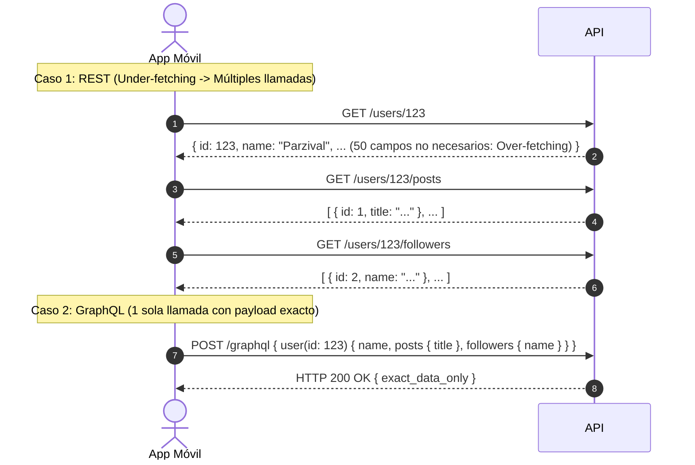

---
tags:
  - system-design
  - networking
  - protocols
  - rest
  - graphql
  - grpc
  - rpc
  - fase-3
aliases:
  - REST vs GraphQL vs gRPC vs RPC
  - Comparativa Total de Protocolos de Comunicación
modulo: "06"
orden: 0
---

# 06.0 Protocolos de Comunicación: REST vs GraphQL vs gRPC vs RPC

> *"No existe un único protocolo universal: mientras REST es el estándar de interoperabilidad para la web pública y GraphQL optimiza la experiencia de clientes frontend heterogéneos, gRPC domina la comunicación interna de microservicios por su extrema velocidad y eficiencia de serialización binaria."*

---

## 1. Matriz Técnica Comparativa

| Dimensión | REST (Representational State Transfer) | GraphQL | gRPC (Google Remote Procedure Call) |
| :--- | :--- | :--- | :--- |
| **Protocolo Base** | HTTP/1.1 o HTTP/2 | HTTP/1.1 o HTTP/2 (sobre POST único) | **HTTP/2 o HTTP/3 estricto** |
| **Formato de Payload** | **JSON** (Texto plano ASCII) | **JSON** (Texto plano ASCII) | **Protocol Buffers (Protobuf)** (Binario compacto) |
| **Contrato / Esquema** | Opcional (OpenAPI / Swagger) | **Estricto** (GraphQL Schema SDL) | **Estricto** (Archivos `.proto` fuertemente tipados) |
| **Eficiencia de Red** | Moderada (Overhead de JSON y headers de texto) | Moderada (Overhead de JSON) | **Máxima** (Payloads 70-80% más pequeños; serialización en C/Rust) |
| **Streaming** | No nativo (requiere SSE/WebSockets) | Subscriptions (sobre WebSockets) | **Nativo y Bidireccional** (Client, Server y Bidirectional Streaming) |
| **Problema de Fetching** | Sufre de **Over-fetching** y **Under-fetching** | **Cero Over/Under fetching** (el cliente pide los campos exactos) | No aplica (diseñado por funciones RPC) |
| **Caché HTTP en Borde** | **Excelente** (Nativo con URLs y headers HTTP `GET`) | Complejo (todas las consultas son `POST /graphql`) | Complejo (requiere proxies especializados) |
| **Uso Principal** | APIs públicas, SaaS externos, CRUDs estándar | Apps móviles, SPAs web complejas, agregación BFF | **Comunicación interna entre microservicios (Backend-to-Backend)** |

---

## 2. Mecánica Interna de Protocol Buffers (gRPC) vs JSON (REST)

```mermaid
flowchart TD
    subgraph REST_con_JSON__Texto_Plano_Ineficiente_ ["REST con JSON (Texto Plano Ineficiente)"]
        J1['{ "user_id": 9812, "is_active": true, "name": "Parzival" }<br/>(62 Bytes de texto transmitidos por la red; CPU parsea strings)']
    end
    
    subgraph gRPC_con_Protocol_Buffers__Binario_Compacto_ ["gRPC con Protocol Buffers (Binario Compacto)"]
        P1["message User {<br/>  int32 user_id = 1;<br/>  bool is_active = 2;<br/>  string name = 3;<br/>}<br/>(Serializado: [08 b4 4c 10 01 1a 08 50 61 72 7a 69 76 61 6c] -> 15 Bytes)"]:::client
    end

    classDef client fill:#1e40af,stroke:#60a5fa,stroke-width:2px,color:#ffffff,font-weight:bold;
    classDef proxy fill:#312e81,stroke:#818cf8,stroke-width:2px,color:#ffffff,font-weight:bold;
    classDef service fill:#065f46,stroke:#34d399,stroke-width:2px,color:#ffffff,font-weight:bold;
    classDef database fill:#7c2d12,stroke:#fb923c,stroke-width:2px,color:#ffffff,font-weight:bold;
    classDef cache fill:#581c87,stroke:#c084fc,stroke-width:2px,color:#ffffff,font-weight:bold;
    classDef queue fill:#155e75,stroke:#22d3ee,stroke-width:2px,color:#ffffff,font-weight:bold;
    classDef warning fill:#881337,stroke:#f43f5e,stroke-width:2px,color:#ffffff,font-weight:bold;
    classDef highlight fill:#854d0e,stroke:#facc15,stroke-width:2px,color:#ffffff,font-weight:bold;
```

### Por qué Protobuf es hasta 10x más rápido que JSON:
1. **Varints y Tag-Length-Value (TLV):** Los nombres de campo (`"user_id"`) **no se envían por la red**. Solo se envía un número entero de 1 byte correspondiente al tag del campo (`1`), ahorrando el 80% del tamaño.
2. **Cero Parseo de Strings:** Los enteros y booleanos se mapean directamente a registros de memoria de la CPU sin conversiones de cadenas de texto.

---

## 3. Comparativa Visual de Fetching: REST vs GraphQL



---

## Microtareas de Retención Intelectual

> [!QUESTION]- Active Recall: ¿Qué es el problema del N+1 en GraphQL y cómo lo resuelve el patrón DataLoader?
> **Respuesta:** En GraphQL, cada campo tiene una función *Resolver* independiente. Si consultas 100 posts y sus respectivos autores, el resolver de usuario se ejecuta 100 veces por separado contra la base de datos (100 queries SQL). **DataLoader** resuelve esto agrupando todas las peticiones de un mismo ciclo de ejecución (*Batching*) y enviando un único `SELECT * WHERE id IN (1, 2, ... 100)`, además de cachear en memoria las claves repetidas en la misma petición.

---

> [!TIP]- Micro-Cálculo Mental: Ahorro de Ancho de Banda con gRPC
> **Reto:** Una red interna de **50 microservicios** procesa **100,000 peticiones RPC por segundo** entre ellos.
> - El payload promedio en REST (JSON) mide **1,200 bytes**.
> - El mismo payload en gRPC (Protobuf) mide **250 bytes**.
> ¿Cuánto ancho de banda por segundo ahorra la infraestructura interna de red?
> **Cálculo:**
> - REST: $100,000 \times 1,200\text{ bytes} = 120,000,000 \text{ B/s} = \mathbf{120 \text{ MB/s}} = 960 \text{ Mbps}$.
> - gRPC: $100,000 \times 250\text{ bytes} = 25,000,000 \text{ B/s} = \mathbf{25 \text{ MB/s}} = 200 \text{ Mbps}$.
> - **Ahorro de red:** $\mathbf{95 \text{ MB/s}}$ (79% de reducción en costo y latencia interna de transferencia).

---

> [!WARNING]- Dilema Arquitectónico: GraphQL para API Pública de Terceros
> **Escenario:** Vas a lanzar una API pública abierta a desarrolladores de todo el mundo. El equipo de frontend pide exponer un endpoint GraphQL para máxima flexibilidad.
> **Pregunta:** ¿Es una buena decisión de seguridad y arquitectura?
> **Respuesta:** **No para una API pública abierta.** En GraphQL, un cliente malicioso puede enviar una consulta recursiva anidada de 50 niveles de profundidad (`user -> friends -> friends -> friends...`) o un ataque DoS de complejidad computacional que tumbe tus bases de datos. Además, la imposibilidad de cachear fácilmente con CDNs estándar eleva los costos. Para APIs públicas se recomienda **REST con OpenAPI y Rate Limiting estricto**; reserva GraphQL para clientes internos y apps móviles propias.

---

> [!NOTE]- Desafío Feynman: REST vs GraphQL vs gRPC
> - **REST:** Es como un menú cerrado de restaurante: pides el "Combo 1" y te traen la hamburguesa, las papas y la gaseosa obligatoriamente, aunque solo querías las papas.
> - **GraphQL:** Es como un buffet libre: tomas un plato vacío y te sirves exactamente 3 papas fritas y 1 tomate; no pagas por nada que no hayas puesto en el plato.
> - **gRPC:** Es como el tubo neumático en un banco que dispara cápsulas a 200 km/h: no hay menús decorados ni texto bonito; solo una cápsula metálica comprimida que viaja directo al destinatario.

---

## Conceptos Relacionados
- [[01.7_HTTP1_HTTP2_HTTP3_y_QUIC|01.7 Evolución HTTP y Multiplexación]]
- [[06.1_WebSockets_SSE_Long_Polling_y_Webhooks|06.1 WebSockets y Streaming]]
- [[06.3_API_Gateway_y_Patron_BFF_Backend-For-Frontend|06.3 API Gateway y Patrón BFF]]
- [[00_MOC_System_Design_Mastery|Volver al Índice Maestro (MOC)]]
