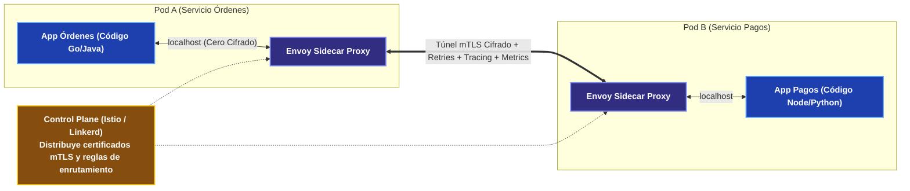

---
tags:
  - system-design
  - microservices
  - service-discovery
  - service-mesh
  - istio
  - envoy
  - fase-3
aliases:
  - Microservicios, Service Discovery y Service Mesh
  - Service Mesh y Patrón Sidecar
modulo: "06"
orden: 2
---

# 06.2 Arquitectura de Microservicios: Service Discovery, Patrón Sidecar y Service Mesh (Istio / Envoy)

> *"Dividir un monolito en microservicios no elimina la complejidad: la traslada de la memoria del compilador a la red física. El Service Mesh y el Service Discovery son la infraestructura necesaria para gestionar esa red sin saturar el código de negocio."*

---

## 1. El Desafío del Service Discovery en Redes Dinámicas

En entornos de contenedores (Kubernetes, ECS), las IPs de los pods son efímeras y cambian continuamente ante reinicios o auto-scaling:

```mermaid
flowchart TD
    subgraph sg_1__Client_Side_Service_Discovery__Eureka___Ribbon_ ["1. Client-Side Service Discovery (Eureka / Ribbon)"]
        Client1["Microservicio A"]:::client -->|"1. Consulta IPs activas"| Registry1["Service Registry (Consul / Eureka)"]:::service
        Registry1 -->>|"2. Retorna lista: [10.0.1.5, 10.0.1.8]"| Client1
        Client1 -->|"3. Balancea localmente y llama a"| S1["Microservicio B (10.0.1.8)"]:::service
    end
    
    subgraph sg_2__Server_Side_Service_Discovery__Kubernetes_DNS___Kube_Proxy_ ["2. Server-Side Service Discovery (Kubernetes DNS + Kube-Proxy)"]
        Client2["Microservicio A"]:::client -->|"1. Llama a nombre DNS lógico: 'http://order-service'"| KubeDNS["K8s Service / CoreDNS"]:::proxy
        KubeDNS --> LB["Load Balancer Interno / IPTables"]:::proxy
        LB -->|"2. Enruta a Pod sano"| S2["Microservicio B Pod"]:::service
    end

    classDef client fill:#1e40af,stroke:#60a5fa,stroke-width:2px,color:#ffffff,font-weight:bold;
    classDef proxy fill:#312e81,stroke:#818cf8,stroke-width:2px,color:#ffffff,font-weight:bold;
    classDef service fill:#065f46,stroke:#34d399,stroke-width:2px,color:#ffffff,font-weight:bold;
    classDef database fill:#7c2d12,stroke:#fb923c,stroke-width:2px,color:#ffffff,font-weight:bold;
    classDef cache fill:#581c87,stroke:#c084fc,stroke-width:2px,color:#ffffff,font-weight:bold;
    classDef queue fill:#155e75,stroke:#22d3ee,stroke-width:2px,color:#ffffff,font-weight:bold;
    classDef warning fill:#881337,stroke:#f43f5e,stroke-width:2px,color:#ffffff,font-weight:bold;
    classDef highlight fill:#854d0e,stroke:#facc15,stroke-width:2px,color:#ffffff,font-weight:bold;
```

---

## 2. El Service Mesh: Desacoplando la Infraestructura de Red con Sidecars

Un **Service Mesh** es una capa de infraestructura dedicada que gestiona la comunicación servicio-a-servicio mediante un **Proxy Sidecar** (típicamente **Envoy**) inyectado junto a cada contenedor:



### Funciones Críticas del Service Mesh:
1. **Zero-Trust Security (mTLS Automático):** Cifra y autentica bidireccionalmente cada conexión interna mediante certificados X.509 rotados automáticamente sin tocar una sola línea de código en la aplicación.
2. **Resiliencia Homogénea:** Aplica timeouts, reintentos y *Circuit Breakers* de forma estandarizada en todos los lenguajes de la empresa.
3. **Observabilidad y Distributed Tracing:** Inyecta cabeceras W3C (`traceparent`) para reconstruir la cascada de llamadas en **Jaeger / Zipkin**.
4. **Traffic Shifting / Canary Releases:** Permite enviar el 5% del tráfico a una versión v2 mediante reglas de enrutamiento del proxy.

---

## 3. Matriz de Trade-offs del Service Mesh

| Ventajas | Desventajas / Complejidad |
| :--- | :--- |
| **Seguridad mTLS Transparente:** Cero-trust en la red interna sin configurar TLS en cada runtime. | **Latencia Adicional:** Añade 2 saltos de red adicionales por localhost ($\sim 1-3\text{ ms}$ de latencia extra por llamada). |
| **Observabilidad Global Inmediata:** Gráficos de tráfico, latencias p99 y tasas de error sin instrumentar librerías. | **Consumo de Memoria:** Cada Sidecar Envoy consume entre 50 MB y 150 MB de RAM. En 1,000 pods = 100 GB de RAM extra. |
| **Gobernanza Centralizada:** Políticas de tráfico gestionadas por DevOps independientemente de los desarrolladores. | Complejidad operacional alta (depurar problemas en Istio requiere ingenieros especializados). |

---

## Microtareas de Retención Intelectual

> [!QUESTION]- Active Recall: ¿Cuál es la diferencia entre el Data Plane y el Control Plane en un Service Mesh?
> **Respuesta:**
> - **Data Plane:** Es el conjunto de todos los **proxies Sidecar (Envoy)** que interceptan y procesan activamente cada byte de tráfico de red en tiempo real (mTLS, balanceo, recolección de métricas).
> - **Control Plane:** Es el cerebro central (**Istio / Pilot**) que no toca los paquetes de red directamente; se encarga de convertir manifiestos de configuración en reglas de bajo nivel y distribuirlas a todos los proxies Envoy, además de emitir y rotar los certificados de seguridad.

---

> [!TIP]- Micro-Cálculo Mental: Overhead de Memoria del Service Mesh
> **Reto:** Tu cluster de Kubernetes ejecuta **800 microservicios** (con un promedio de **3 réplicas por servicio = 2,400 Pods**).
> Inyectas un proxy Sidecar de Envoy en cada Pod. Cada proxy consume **80 MB de RAM**.
> ¿Cuánta memoria RAM consume exclusivamente la infraestructura del Service Mesh en el cluster?
> **Cálculo:**
> - $2,400 \text{ pods} \times 80 \text{ MB} = 192,000 \text{ MB} \approx \mathbf{192 \text{ GB de RAM}}$ de costo fijo en nodos.
> - *Lección:* Para arquitecturas medianas (<50 pods), un Service Mesh completo puede ser sobreingeniería; en clusters masivos, el costo de hardware se justifica por la seguridad mTLS y observabilidad.

---

> [!WARNING]- Dilema Arquitectónico: Monolito Modular vs Microservicios para una Startup en Fase Temprana
> **Escenario:** Una startup con 4 desarrolladores va a construir un producto nuevo cuya tracción de mercado aún no está validada.
> **Pregunta:** ¿Deberían comenzar con una arquitectura de 20 microservicios con Kubernetes y Service Mesh?
> **Respuesta:** **No. Es un error crítico de ingeniería.** Los microservicios introducen fricción de despliegue, latencia de red, consistencia eventual y sobrecarga operacional que ralentizarán la velocidad de iteración del producto. **Deben comenzar con un Monolito Modular bien estructurado** (con límites de dominio claros en código) y extraer servicios independientes únicamente cuando un módulo específico requiera escalar de forma asimétrica o sea gestionado por un equipo de ingeniería independiente.

---

> [!NOTE]- Desafío Feynman: Service Mesh y Sidecars
> Imagina que cada microservicio es un embajador extranjero que no habla el idioma de los demás países. En lugar de obligar a cada embajador a aprender 10 idiomas, le asignas un diplomático traductor personal (Sidecar Envoy) que camina a su lado. Cuando el embajador quiere hablar, le susurra a su traductor en su idioma nativo, y el traductor se encarga de llamar por radio cifrada al traductor del otro país.

---

## Conceptos Relacionados
- [[06.0_REST_vs_GraphQL_vs_gRPC_vs_RPC_Comparativa_Total|06.0 Protocolos de Comunicación]]
- [[06.3_API_Gateway_y_Patron_BFF_Backend-For-Frontend|06.3 API Gateway y BFF]]
- [[07.0_Circuit_Breaker_Retry_y_Exponential_Backoff|07.0 Circuit Breakers]]
- [[00_MOC_System_Design_Mastery|Volver al Índice Maestro (MOC)]]
