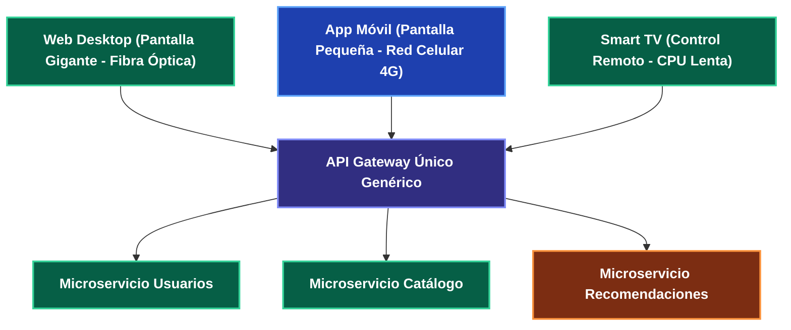
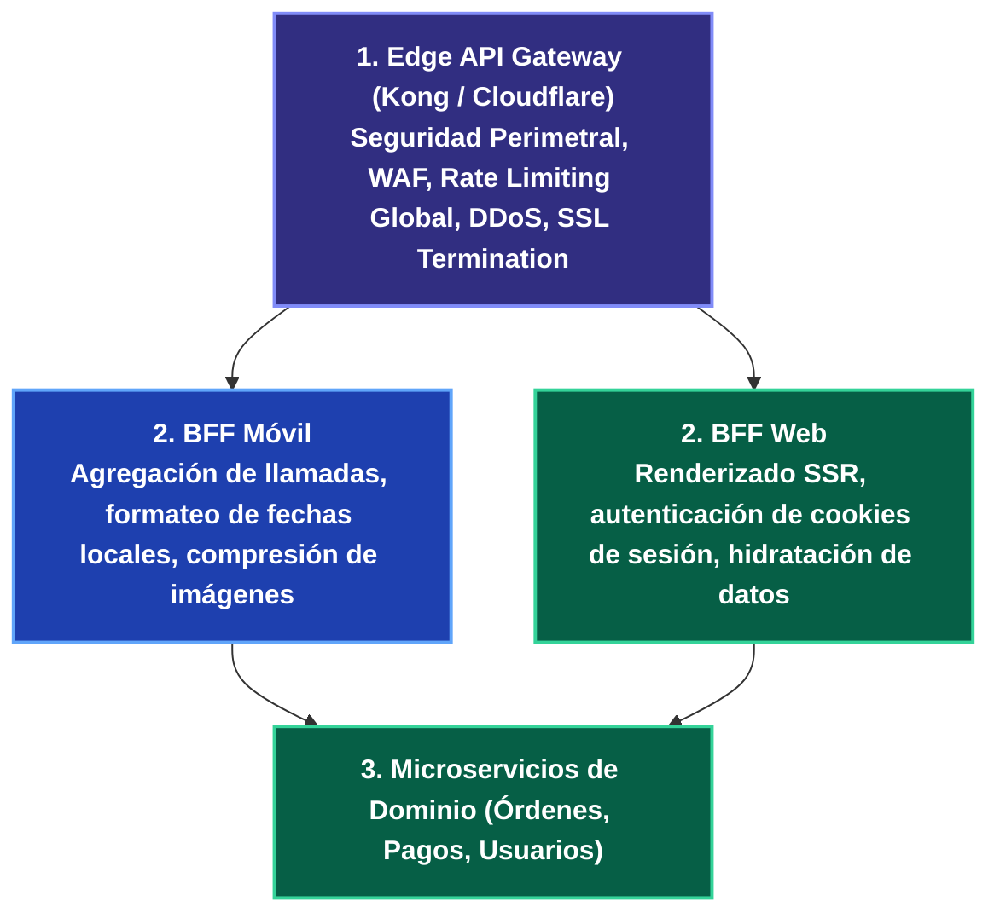

---
tags:
  - system-design
  - api-gateway
  - bff
  - architecture
  - frontend
  - microservices
  - fase-3
aliases:
  - API Gateway y Patrón BFF
  - Backend-For-Frontend
modulo: "06"
orden: 3
---

# 06.3 Patrones de Entrada: API Gateway Centralizado vs Backend-For-Frontend (BFF)

> *"Un API Gateway genérico para todos los clientes se convierte rápidamente en un cuello de botella de desarrollo donde los equipos compiten por contratos de datos incompatibles. El patrón BFF (Backend-For-Frontend) crea capas de agregación dedicadas para cada experiencia de usuario."*

---

## 1. El Problema del API Gateway Genérico Compartido

Cuando una sola API Gateway atiende a la Web (Desktop), Apps Móviles (iOS/Android), Smart TVs y Partners B2B:



### Conflictos de Interés:
* **La Web** necesita payloads grandes y ricos con tablas completas.
* **El Móvil** necesita payloads comprimidos y podados para no agotar la batería ni los datos del usuario.
* **La Smart TV** necesita un esquema de navegación jerárquico adaptado a un control remoto.
* **Resultado:** El equipo del API Gateway se convierte en un cuello de botella bloqueante intentando complacer a todos los clientes.

---

## 2. La Solución Arquitectónica: Patrón Backend-For-Frontend (BFF)

Popularizado por SoundCloud y Sam Newman, el patrón **BFF** asigna **un backend intermedio especializado por cada tipo de cliente frontend**, administrado por el propio equipo de frontend:

```mermaid
flowchart TD
    subgraph Clientes Heterogéneos
        WebClient["Web React SPA"]:::client
        MobileClient["App Móvil Flutter"]:::client
        IoTClient["Smartwatch / IoT"]:::client
    end
    
    subgraph Capa BFF (Orquestación y Agregación Específica)
        WebBFF["BFF Web (Node.js/GraphQL)<br/>Devuelve vistas completas"]:::service
        MobileBFF["BFF Móvil (Go/FastAPI)<br/>Devuelve JSONs podados y compactos"]:::client
        IoTBFF["BFF IoT (gRPC Gateway)<br/>Devuelve payloads binarios ultra-ligeros"]:::proxy
    end
    
    subgraph Microservicios Internos de Dominio
        MS_User["Servicio Usuarios"]:::client
        MS_Catalog["Servicio Catálogo"]:::service
        MS_Order["Servicio Pedidos"]:::service
    end
    
    WebClient --> WebBFF
    MobileClient --> MobileBFF
    IoTClient --> IoTBFF
    
    WebBFF --> MS_User & MS_Catalog & MS_Order
    MobileBFF --> MS_User & MS_Catalog & MS_Order
    IoTBFF --> MS_User & MS_Order

    classDef client fill:#1e40af,stroke:#60a5fa,stroke-width:2px,color:#ffffff,font-weight:bold;
    classDef proxy fill:#312e81,stroke:#818cf8,stroke-width:2px,color:#ffffff,font-weight:bold;
    classDef service fill:#065f46,stroke:#34d399,stroke-width:2px,color:#ffffff,font-weight:bold;
    classDef database fill:#7c2d12,stroke:#fb923c,stroke-width:2px,color:#ffffff,font-weight:bold;
    classDef cache fill:#581c87,stroke:#c084fc,stroke-width:2px,color:#ffffff,font-weight:bold;
    classDef queue fill:#155e75,stroke:#22d3ee,stroke-width:2px,color:#ffffff,font-weight:bold;
    classDef warning fill:#881337,stroke:#f43f5e,stroke-width:2px,color:#ffffff,font-weight:bold;
    classDef highlight fill:#854d0e,stroke:#facc15,stroke-width:2px,color:#ffffff,font-weight:bold;
```

---

## 3. Matriz de Responsabilidades: Edge Gateway vs BFF



| Responsabilidad | Edge Gateway (Infraestructura) | Capa BFF (Aplicación / Frontend) | Microservicios de Dominio |
| :--- | :--- | :--- | :--- |
| **Seguridad de Red** | **Sí** (DDoS, WAF, TLS, Rate Limit por IP). | No (asume red interna segura). | No. |
| **Autenticación** | Valida firma del JWT / API Key. | Mapea roles a vistas de UI. | Valida permisos de negocio de grano fino. |
| **Agregación de Datos** | No (provocaría sobrecarga de CPU). | **Sí** (Ejecuta 4 llamadas en paralelo y unifica JSON). | No (solo su propia entidad). |
| **Propiedad del Código** | Equipo de Infraestructura / DevOps. | **Equipo de Frontend (Mobile / Web devs)**. | Equipos de Backend de Dominio. |

---

## Microtareas de Retención Intelectual

> [!QUESTION]- Active Recall: ¿Por qué colocar lógica de negocio compleja (ej. cálculo de impuestos o reglas de facturación) dentro de un BFF es un antipatrón?
> **Respuesta:** Porque el propósito del BFF es estrictamente la **agregación, traducción y formateo de datos para la interfaz de usuario**. Si introduces lógica de negocio en el BFF Web, tendrás que duplicar exactamente la misma lógica en el BFF Móvil y en el BFF de Partners, provocando divergencias de reglas y pesadillas de mantenimiento. La lógica de negocio debe residir **únicamente en los microservicios de dominio**.

---

> [!TIP]- Micro-Cálculo Mental: Reducción de Latencia Móvil con Agregación BFF
> **Reto:** Una pantalla móvil requiere datos de **4 microservicios distintos**. La latencia RTT de red celular móvil hacia el datacenter es de **120 ms**. La latencia interna entre servidores dentro del datacenter es de **1 ms**.
> - Sin BFF (El móvil hace 4 llamadas secuenciales por red celular): $4 \times 120\text{ ms} = \mathbf{480 \text{ ms}}$.
> - Con BFF (El móvil hace 1 sola llamada al BFF; el BFF consulta los 4 microservicios en paralelo por red interna):
> ¿Cuánto tiempo total tarda la carga de la pantalla?
> **Cálculo:**
> - $1 \text{ RTT Móvil} (120\text{ ms}) + \max(\text{Microservicios Internos}) (1\text{ ms}) = \mathbf{121 \text{ ms}}$.
> - **Mejora:** La pantalla carga **4 veces más rápido** (ahorro de 359 ms en red móvil).

---

> [!WARNING]- Dilema Arquitectónico: GraphQL como BFF Unificado vs Múltiples BFFs en Node.js
> **Escenario:** Tu empresa tiene equipos de iOS, Android y Web React. Tienes 30 microservicios backend.
> **Pregunta:** ¿Es mejor crear un BFF en GraphQL (Federation) o 3 servicios BFF REST separados?
> **Respuesta:** **GraphQL Federation (Apollo Federation / Subgraphs) es la solución moderna superior.** Permite que cada cliente frontend solicite exactamente el grafo de datos que su pantalla necesita sin construir y desplegar 3 servidores BFF independientes en Node.js, centralizando la capa de tipos mientras los microservicios de backend exponen sus propios subgrafos de forma desacoplada.

---

> [!NOTE]- Desafío Feynman: Patrón BFF
> Es como ir a comprar los ingredientes para una cena:
> - **Sin BFF:** Vas tú mismo en bicicleta a la carnicería, luego a la verdulería, luego a la panadería y luego al supermercado (4 viajes largos por la ciudad).
> - **Con BFF:** Contratas a un asistente personal que está dentro del centro comercial: le mandas un solo mensaje con tu lista, él corre en 10 segundos por todas las tiendas del centro comercial, junta todo en una sola bolsa y te la entrega en la puerta de tu casa en un solo viaje.

---

## Conceptos Relacionados
- [[01.4_Reverse_Proxy_vs_Forward_Proxy_vs_API_Gateway|01.4 API Gateway]]
- [[06.0_REST_vs_GraphQL_vs_gRPC_vs_RPC_Comparativa_Total|06.0 Protocolos REST y GraphQL]]
- [[06.2_Microservicios_Service_Discovery_y_Service_Mesh|06.2 Microservicios y Service Mesh]]
- [[00_MOC_System_Design_Mastery|Volver al Índice Maestro (MOC)]]
