---
tags:
  - system-design
  - resilience
  - circuit-breaker
  - retry
  - fault-tolerance
  - fase-4
aliases:
  - Circuit Breaker y Exponential Backoff
  - Patrones de Tolerancia a Fallos
modulo: "07"
orden: 0
---

# 07.0 Tolerancia a Fallos: Circuit Breaker, Exponential Backoff y Jitter

> *"En un sistema distribuido, las caídas de servicios no son anomalías excepcionales: son certezas estadísticas diarias. El Circuit Breaker evita que el fallo de un microservicio secundario consuma todos los hilos del llamador y provoque un colapso en cascada de toda la infraestructura."*

---

## 1. La Máquina de Estados del Circuit Breaker

Inspirado en los disyuntores eléctricos que cortan la corriente ante un cortocircuito para evitar incendios:

```mermaid
stateDiagram-v2
    [*] --> Closed
    
    Closed --> Open: Tasa de fallos supera el umbral (ej. >50% errores en 10s)
    note right of Closed: Estado Normal:\nLas peticiones fluyen al servicio externo.\nSe monitorean éxitos y errores.
    
    Open --> HalfOpen: Expira el temporizador de enfriamiento (ej. 30s)
    note right of Open: Cortocircuito Abierto (Fail Fast):\nLas peticiones se rechazan de inmediato sin tocar la red.\nSe ejecuta Fallback local en 0ms.
    
    HalfOpen --> Closed: Peticiones de prueba tienen éxito
    HalfOpen --> Open: Una sola petición de prueba falla
    note right of HalfOpen: Modo de Prueba:\nDeja pasar un número limitado de peticiones sonda (ej. 3 requests)\npara verificar si el servicio externo revivió.
```

---

## 2. El Peligro de las Tormentas de Reintentos (*Retry Storms*)

Si un servicio se degrada por sobrecarga de CPU y 10,000 clientes reintentan la petición de inmediato cada 100ms:
* El tráfico se multiplica por $10\text{x}$ justo cuando el servidor necesita alivio para recuperarse.
* **Resultado:** El servidor entra en un colapso irreversible (*Cascading Outage*).

### La Solución: Exponential Backoff con Full Jitter

```mermaid
graph TD
    subgraph 1__Reintento_Lineal_Ingenuo__Malo_ ["1. Reintento Lineal Ingenuo (Malo)"]
        R1["Fallo 1 (Espera 1s)"]:::service --> R2["Fallo 2 (Espera 1s)"]:::service --> R3["Fallo 3 (Espera 1s)"]:::service
    end
    subgraph 2__Exponential_Backoff_Puro__A_n_sincronizado_ ["2. Exponential Backoff Puro (Aún sincronizado)"]
        EB1["Fallo 1 (Espera 1s)"]:::service --> EB2["Fallo 2 (Espera 2s)"]:::service --> EB3["Fallo 3 (Espera 4s)"]:::service --> EB4["Fallo 4 (Espera 8s)"]:::service
    end
    subgraph 3__Exponential_Backoff_con_Full_Jitter__Est_ndar_AWS_ ["3. Exponential Backoff con Full Jitter (Estándar AWS)"]
        J1["t = rand(0, base * 2^retries) -> Rompe la sincronización de todos los clientes"]:::client
    end

    classDef client fill:#1e40af,stroke:#60a5fa,stroke-width:2px,color:#ffffff,font-weight:bold;
    classDef proxy fill:#312e81,stroke:#818cf8,stroke-width:2px,color:#ffffff,font-weight:bold;
    classDef service fill:#065f46,stroke:#34d399,stroke-width:2px,color:#ffffff,font-weight:bold;
    classDef database fill:#7c2d12,stroke:#fb923c,stroke-width:2px,color:#ffffff,font-weight:bold;
    classDef cache fill:#581c87,stroke:#c084fc,stroke-width:2px,color:#ffffff,font-weight:bold;
    classDef queue fill:#155e75,stroke:#22d3ee,stroke-width:2px,color:#ffffff,font-weight:bold;
    classDef warning fill:#881337,stroke:#f43f5e,stroke-width:2px,color:#ffffff,font-weight:bold;
    classDef highlight fill:#854d0e,stroke:#facc15,stroke-width:2px,color:#ffffff,font-weight:bold;
```



### La Fórmula de AWS para Full Jitter:

$$t_{\text{sleep}} = \text{random}\left(0, \; \min(t_{\text{max}}, \; t_{\text{base}} \times 2^{\text{reintento}})\right)$$

* Al introducir un componente aleatorio (*Jitter*), los 10,000 clientes reintentan en instantes de tiempo completamente dispersos, eliminando los picos sincronizados de tráfico.

---

## 3. Patrones de Fallback (Degradación Elegante)

Cuando el Circuit Breaker está en estado **OPEN**, el sistema no devuelve un error 500 al usuario, sino una respuesta degradada:


---

## Microtareas de Retención Intelectual

> [!QUESTION]- Active Recall: ¿Por qué un Circuit Breaker protege los hilos de ejecución de tu propio servidor frontend/API?
> **Respuesta:** Si el servicio de pagos externo tarda 30 segundos en responder por timeout y tienes un pool de 200 hilos en tu servidor web, tras 200 peticiones todos tus hilos quedarán **bloqueados esperando la red**, haciendo que tu API no pueda atender ni siquiera la página de inicio o endpoints no relacionados. El Circuit Breaker en estado **OPEN** rechaza la llamada en $0.1\text{ ms}$ (*Fail-Fast*), liberando el hilo de inmediato.

---

> [!TIP]- Micro-Cálculo Mental: Cálculo de Espera con Exponential Backoff
> **Reto:** Una llamada falla con $t_{\text{base}} = 500\text{ ms}$, $t_{\text{max}} = 30\text{ s}$.
> Estás en el **tercer reintento** ($\text{reintento} = 3$).
> ¿Cuál es el rango de tiempo en milisegundos en el que se programará el reintento usando Full Jitter?
> **Cálculo:**
> - $t_{\text{techo}} = \min(30,000, \; 500 \times 2^3) = \min(30,000, \; 500 \times 8) = \mathbf{4,000 \text{ ms}}$.
> - Rango de espera aleatoria: $\mathbf{[0, \; 4000 \text{ ms}]}$.

---

> [!WARNING]- Dilema Arquitectónico: Reintentos en Métodos HTTP POST (No Idempotentes)
> **Escenario:** Un cliente ejecuta `POST /orders/pay` para cobrar USD 100. La petición sufre un timeout de red a los 5 segundos (no se sabe si el cobro se procesó en el banco o si se cortó la respuesta).
> **Pregunta:** ¿Debe el cliente reintentar la petición automáticamente?
> **Respuesta:** **NUNCA sin una Cabecera de Idempotencia (`Idempotency-Key`).** Si reintentas un `POST` a ciegas, corres el riesgo de cobrarle USD 100 dos veces al usuario. Solo se debe reintentar automáticamente si la llamada es estrictamente **Idempotente** (como `GET`, `PUT`, `DELETE`) o si el `POST` incluye un `Idempotency-Key: uuid-v4` que la pasarela de pago registre para rechazar duplicados.

---

> [!NOTE]- Desafío Feynman: Circuit Breaker
> Es como el disyuntor de fusibles de tu casa: si un electrodoméstico entra en cortocircuito y empieza a echar chispas, el fusible salta inmediatamente y corta la luz de esa habitación para que no se queme toda la instalación eléctrica de la casa. Media hora después, vas con cuidado, subes la palanca a la mitad para probar si el problema se arregló sin arriesgar la casa entera.

---

## Conceptos Relacionados
- [[06.2_Microservicios_Service_Discovery_y_Service_Mesh|06.2 Service Mesh y Sidecars]]
- [[07.1_Patron_Saga_Coreografia_vs_Orquestacion|07.1 Patrón Saga]]
- [[07.2_Patrones_de_Aislamiento_Bulkhead_y_Graceful_Degradation|07.2 Patrón Bulkhead]]
- [[00_MOC_System_Design_Mastery|Volver al Índice Maestro (MOC)]]
