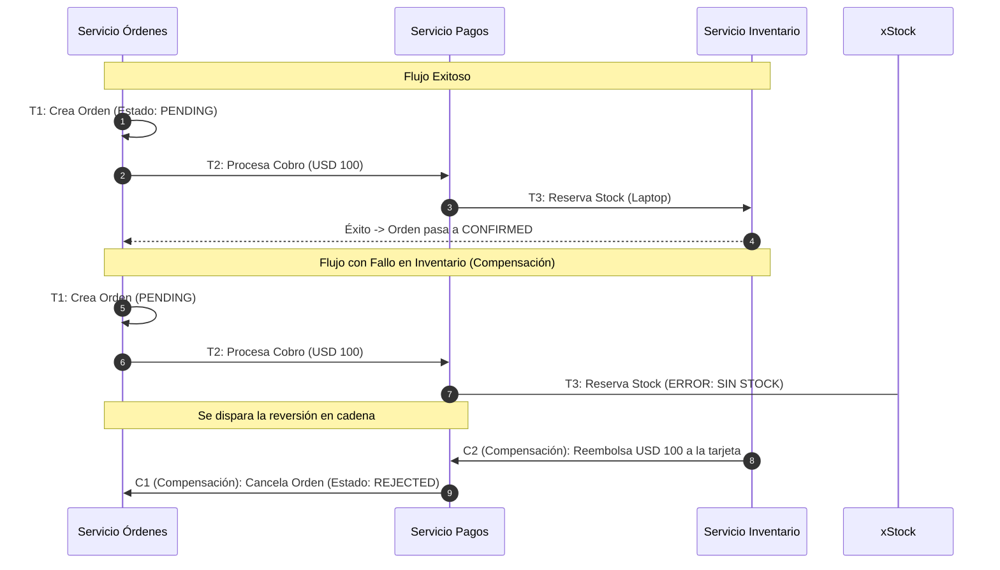

---
tags:
  - system-design
  - saga-pattern
  - distributed-transactions
  - consistency
  - microservices
  - fase-4
aliases:
  - Patrón Saga
  - Transacciones Distribuidas y Compensaciones
modulo: "07"
orden: 1
---

# 07.1 Transacciones Distribuidas: El Patrón Saga (Coreografía vs Orquestación y Transacciones Compensatorias)

> *"En una arquitectura de microservicios donde cada servicio es dueño de su propia base de datos, las transacciones ACID tradicionales son inviables. El Patrón Saga divide una transacción de negocio en una secuencia de transacciones locales coordinadas, donde cada paso tiene una transacción compensatoria de reversión si algo falla."*

---

## 1. El Fracaso del Two-Phase Commit (2PC) en Microservicios

El protocolo clásico **Two-Phase Commit (2PC)** bloquea recursos (*Locks*) en múltiples bases de datos a través de la red durante la fase de votación:
* **Por qué falla a escala:** Si un nodo de red se ralentiza, todas las tablas de todas las bases de datos permanecen bloqueadas, destruyendo la disponibilidad y el rendimiento ($O(N)$ en latencia).

---

## 2. Mecánica del Patrón Saga: Flujo Exitoso vs Flujo de Compensación

Una Saga es una máquina de estados donde cada paso $T_i$ actualiza la base de datos local de un servicio. Si el paso $T_k$ falla, se ejecutan en orden inverso las **Transacciones Compensatorias ($C_{k-1}, \dots, C_1$)**:

---

## 3. Implementación: Coreografía vs Orquestación

```mermaid
flowchart TD
    subgraph sg_1__Saga_Coreografiada__Event_Driven_ ["1. Saga Coreografiada (Event-Driven)"]
        O1["Órdenes (Emite 'OrderCreated')"]:::service --> P1["Pagos (Escucha evento y emite 'PaymentDone')"]:::queue
        P1 --> S1["Inventario (Escucha y emite 'StockFailed')"]:::warning
        S1 --> P_Rollback["Pagos (Escucha 'StockFailed' y ejecuta Reembolso)"]:::proxy
    end
    
    subgraph sg_2__Saga_Orquestada__M_quina_de_Estados_Central_ ["2. Saga Orquestada (Máquina de Estados Central)"]
        Orchestrator["Orquestador Central de Saga<br/>(Temporal.io / AWS Step Functions)"]:::highlight
        Orchestrator -->|"1. Ejecuta T1"| MS_Order["Servicio Órdenes"]:::service
        Orchestrator -->|"2. Ejecuta T2"| MS_Pay["Servicio Pagos"]:::service
        Orchestrator -->|"3. Ejecuta T3"| MS_Stock["Servicio Inventario"]:::service
        Orchestrator -.->|"Si T3 falla, orquesta C2 y C1"| MS_Pay
    end

    classDef client fill:#1e40af,stroke:#60a5fa,stroke-width:2px,color:#ffffff,font-weight:bold;
    classDef proxy fill:#312e81,stroke:#818cf8,stroke-width:2px,color:#ffffff,font-weight:bold;
    classDef service fill:#065f46,stroke:#34d399,stroke-width:2px,color:#ffffff,font-weight:bold;
    classDef database fill:#7c2d12,stroke:#fb923c,stroke-width:2px,color:#ffffff,font-weight:bold;
    classDef cache fill:#581c87,stroke:#c084fc,stroke-width:2px,color:#ffffff,font-weight:bold;
    classDef queue fill:#155e75,stroke:#22d3ee,stroke-width:2px,color:#ffffff,font-weight:bold;
    classDef warning fill:#881337,stroke:#f43f5e,stroke-width:2px,color:#ffffff,font-weight:bold;
    classDef highlight fill:#854d0e,stroke:#facc15,stroke-width:2px,color:#ffffff,font-weight:bold;
```

| Criterio | Saga Coreografiada | Saga Orquestada |
| :--- | :--- | :--- |
| **Coordinación** | Descentralizada (Cada servicio escucha y emite eventos). | Centralizada (Un coordinador ejecuta comandos explícitos). |
| **Complejidad** | Simple para 2-3 pasos; ingobernable para $>4$ pasos. | Requiere un motor de orquestación; flujos complejos 100% controlables. |
| **Acoplamiento Cíclico** | Alto riesgo de dependencias circulares entre eventos. | Bajo (los microservicios no se conocen entre sí; solo responden al orquestador). |
| **Manejo de Errores** | Muy difícil de auditar y probar. | **Trivial** (Visualización del árbol de fallos y reintentos automáticos). |

---

## Microtareas de Retención Intelectual

> [!QUESTION]- Active Recall: ¿Por qué una Transacción Compensatoria en una Saga NO es un "Rollback" tradicional de base de datos?
> **Respuesta:** En un `ROLLBACK` de SQL relacional, los cambios no confirmados se borran de la memoria/WAL como si nunca hubieran existido y los datos intermedios jamás fueron visibles para otros usuarios. En una Saga, cada transacción local **hace un `COMMIT` real e inmediato** (los fondos se descontaron de la cuenta bancaria). La **Transacción Compensatoria** es una **nueva operación de negocio hacia adelante** que neutraliza el efecto anterior (un depósito de reembolso), dejando constancia histórica de ambas operaciones.

---

> [!TIP]- Micro-Cálculo Mental: Latencia de 2PC vs Saga Asíncrona
> **Reto:** Una transacción de compra toca **4 microservicios**. Cada operación local tarda **15 ms**. La latencia de red entre servicios es de **10 ms**.
> - En **Two-Phase Commit (2PC)**: Requiere 2 fases de red sincrónicas (Prepare + Commit) bloqueando los 4 nodos simultáneamente: $2 \times 4 \times 10\text{ms} + 4 \times 15\text{ms} = \mathbf{140 \text{ ms}}$ manteniendo locks de base de datos abiertos.
> - En **Saga Asíncrona Orquestada**: Cada servicio procesa su commit local en **15 ms** y libera sus locks de inmediato.
> ¿Cuál es el tiempo que los registros de base de datos permanecen bloqueados en la Saga vs 2PC?
> **Cálculo:**
> - En 2PC: Bloqueo sostenido durante **140 ms**.
> - En Saga: Bloqueo local durante **15 ms** (Reducción del 89% en contención de base de datos).

---

> [!WARNING]- Dilema Arquitectónico: El Problema de la Lectura Sucia en Sagas (Anomalías Semánticas)
> **Escenario:** El paso 1 de una Saga deposita USD 1,000 en la cuenta de un usuario. Mientras el paso 2 (validación de fraude) se está ejecutando, el usuario retira los USD 1,000 por un cajero automático. El paso 2 falla y la Saga intenta ejecutar la compensación de retiro de USD 1,000, pero la cuenta ya tiene USD 0.
> **Pregunta:** ¿Cómo se previene este problema en arquitecturas Saga?
> **Respuesta:** Mediante el patrón **Semantic Locking / Pending State**. La transacción inicial no añade saldo disponible inmediatamente, sino saldo en estado **PENDING / BLOQUEADO** (`balance_available: 0, balance_pending: 1000`). El saldo solo se libera al completar con éxito la Saga completa; si la Saga falla, el balance pendiente simplemente se anula sin riesgo de sobregiro.

---

> [!NOTE]- Desafío Feynman: Patrón Saga
> Es como organizar un viaje de vacaciones: primero compras el boleto de avión, luego reservas el hotel y luego alquilas el auto. Si al final no encuentras ningún auto disponible, no puedes apretar un botón mágico de "deshacer"; tienes que llamar al hotel a cancelar la reserva (compensación) y luego llamar a la aerolínea a pedir el reembolso del pasaje (compensación).

---

## Conceptos Relacionados
- [[07.0_Circuit_Breaker_Retry_y_Exponential_Backoff|07.0 Circuit Breaker y Retries]]
- [[05.2_Patrones_Pub-Sub_y_Event-Driven_Architecture|05.2 Arquitecturas Guiadas por Eventos]]
- [[03.0_Teorema_CAP_Analisis_Riguroso|03.0 Teorema CAP]]
- [[00_MOC_System_Design_Mastery|Volver al Índice Maestro (MOC)]]
