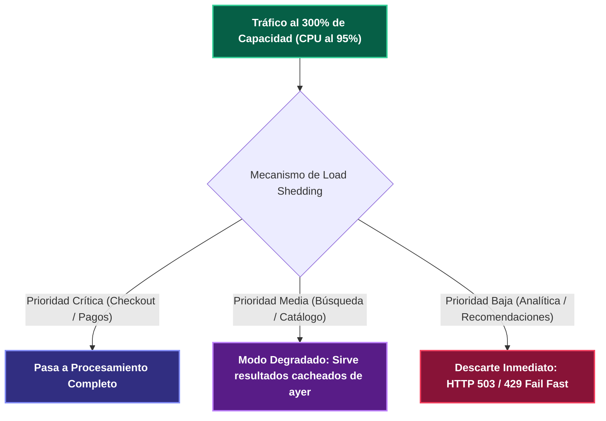

---
tags:
  - system-design
  - resilience
  - bulkhead
  - graceful-degradation
  - architecture
  - fase-4
aliases:
  - Patrones de Aislamiento y Bulkhead
  - Graceful Degradation y Shed Load
modulo: "07"
orden: 2
---

# 07.2 Aislamiento y Resiliencia: Patrón Bulkhead, Graceful Degradation y Load Shedding

> *"Un barco no se hunde cuando una sección de su casco se rompe, porque sus compartimentos estancos (Bulkheads) aíslan el agua en una sola cámara. En arquitectura de software, el patrón Bulkhead aísla pools de recursos para que el fallo de un componente no hunda todo el sistema."*

---

## 1. El Patrón Bulkhead (Compartimentos Estancos)

```mermaid
flowchart TD
    subgraph sg_1__Sin_Bulkhead__Pool__nico_Compartido___Cat_strofe_ ["1. Sin Bulkhead (Pool Único Compartido - Catástrofe)"]
        Users["Peticiones de Usuarios"]:::client --> SinglePool["Pool Único de 100 Hilos"]:::service
        SinglePool --> S_Fast["Servicio Rápido (Login)"]:::service
        SinglePool -->|"Saturado por lentitud"| S_Slow["Servicio Lento (Generador PDFs)"]:::service
        note right of SinglePool: Los 100 hilos se quedan esperando al generador de PDFs.\nNadie puede hacer Login. Sistema muerto.
    end
    
    subgraph sg_2__Con_Bulkhead__Aislamiento_de_Recursos_ ["2. Con Bulkhead (Aislamiento de Recursos)"]
        Users2["Peticiones de Usuarios"]:::client --> Router["Router de Tráfico"]:::proxy
        Router --> PoolLogin["Pool Login (80 Hilos Dedicados)"]:::service --> S_Fast2["Servicio Login (100% Disponible)"]:::service
        Router --> PoolPDF["Pool PDF (20 Hilos Dedicados)"]:::service --> S_Slow2["Servicio PDF (Aislado)"]:::service
        note right of PoolPDF: Si el generador de PDFs colapsa, solo mueren sus 20 hilos.\nEl 80% del sistema sigue operando con normalidad.
    end

    classDef client fill:#1e40af,stroke:#60a5fa,stroke-width:2px,color:#ffffff,font-weight:bold;
    classDef proxy fill:#312e81,stroke:#818cf8,stroke-width:2px,color:#ffffff,font-weight:bold;
    classDef service fill:#065f46,stroke:#34d399,stroke-width:2px,color:#ffffff,font-weight:bold;
    classDef database fill:#7c2d12,stroke:#fb923c,stroke-width:2px,color:#ffffff,font-weight:bold;
    classDef cache fill:#581c87,stroke:#c084fc,stroke-width:2px,color:#ffffff,font-weight:bold;
    classDef queue fill:#155e75,stroke:#22d3ee,stroke-width:2px,color:#ffffff,font-weight:bold;
    classDef warning fill:#881337,stroke:#f43f5e,stroke-width:2px,color:#ffffff,font-weight:bold;
    classDef highlight fill:#854d0e,stroke:#facc15,stroke-width:2px,color:#ffffff,font-weight:bold;
```

---

## 2. Tipos de Aislamiento Bulkhead

1. **Thread Pool Isolation (Aislamiento por Pool de Hilos):** Cada cliente o microservicio dependiente tiene su propio pool de hilos de ejecución con una cola limitada (implementado en *Netflix Hystrix / Resilience4j*).
2. **Semaphore Isolation (Aislamiento por Semáforos):** Limita el número de conexiones concurrentes permitidas a un backend sin crear nuevos hilos (ahorra memoria RAM).
3. **Hardware / Cluster Bulkheads (Aislamiento Físico de Clusters):**
   - Separar tráfico de usuarios gratuitos (*Free Tier*) en un cluster independiente del tráfico de clientes de pago (*Enterprise VIP Tier*).
   - Un ataque DDoS a un usuario gratuito no afecta la latencia de las cuentas empresariales.

---

## 3. Load Shedding y Graceful Degradation

Cuando el tráfico supera en $300\%$ la capacidad máxima del hardware:



### Principios de Degradación Elegante:
* **Feature Flags de Emergencia:** Interruptores globales que apagan funcionalidades pesadas en 1 segundo (ej. deshabilitar el algoritmo de recomendaciones dinámicas en Amazon durante el primer minuto del Prime Day).
* **Load Shedding Basado en CPU / Latencia:** El API Gateway descarta peticiones no esenciales antes de que entren a la cola de la aplicación si el tiempo de respuesta $p99$ supera los $500\text{ms}$.

---

## Microtareas de Retención Intelectual

> [!QUESTION]- Active Recall: ¿Cuál es la diferencia entre Thread Pool Isolation y Semaphore Isolation en el patrón Bulkhead?
> **Respuesta:**
> - **Thread Pool Isolation:** Ejecuta las llamadas en un hilo separado de un pool exclusivo. Permite aplicar **Timeouts estrictos** (matar el hilo si tarda más de 2 segundos), pero tiene sobrecarga de cambio de contexto de CPU (*Context Switching*).
> - **Semaphore Isolation:** Ejecuta la llamada en el mismo hilo de la petición HTTP pero usa un contador atómico (semáforo) para limitar la concurrencia máxima (ej. máx 50 llamadas simultáneas). Es ultra-rápido y consume casi cero memoria, pero no puede abortar llamadas bloqueadas por timeout.

---

> [!TIP]- Micro-Cálculo Mental: Dimensionamiento de un Thread Pool Bulkhead
> **Reto:** Un microservicio llama a un servicio de catálogo externo que tarda en promedio **50 ms** ($0.05\text{ s}$).
> Esperas un tráfico normal de **400 peticiones/segundo**.
> Aplicando la Ley de Little ($L = \lambda W$):
> ¿Cuál es el tamaño mínimo del Thread Pool que debes asignar a este Bulkhead para atender el tráfico base?
> **Cálculo:**
> - $L = 400 \text{ req/s} \times 0.05 \text{ s} = \mathbf{20 \text{ hilos}}$.
> - Se configura un pool de 20 hilos base + 5 hilos de margen de seguridad (Pool Size = 25).

---

> [!WARNING]- Dilema Arquitectónico: Aislamiento Multi-Tenant en Base de Datos
> **Escenario:** Un cliente empresarial ejecuta una consulta masiva de exportación de datos que dura 45 minutos y satura el 100% de los recursos de CPU de la base de datos compartida.
> **Pregunta:** ¿Cómo aplicas el patrón Bulkhead para evitar que este cliente afecte a las otras 5,000 empresas del sistema?
> **Respuesta:** Mediante **Bulkhead de Recursos de Base de Datos**:
> 1. **Réplicas de Lectura Aisladas:** Enrutar consultas analíticas y exportaciones pesadas a una *Read Replica* dedicada analítica, aislada del Master transaccional.
> 2. **Grupos de Recursos de CPU (PostgreSQL / Linux cgroups):** Asignar límites estrictos de CPU por usuario de base de datos (ej. un usuario analítico nunca puede superar el 25% de la CPU global).

---

> [!NOTE]- Desafío Feynman: Patrón Bulkhead
> Es como el diseño de un submarino: el submarino está dividido por paredes de acero blindadas en 10 compartimentos herméticos separados. Si un torpedo impacta en la punta y entra agua en el compartimento 1, se cierran las compuertas de acero; la tripulación pierde esa habitación, pero los otros 9 compartimentos siguen secos y el submarino se mantiene a flote.

---

## Conceptos Relacionados
- [[07.0_Circuit_Breaker_Retry_y_Exponential_Backoff|07.0 Circuit Breaker]]
- [[04.3_Rate_Limiting_Token_Bucket_Leaky_Bucket_Sliding_Window|04.3 Rate Limiting]]
- [[04.4_Rendimiento_vs_Escalabilidad_Latencia_vs_Throughput|04.4 Ley de Little]]
- [[00_MOC_System_Design_Mastery|Volver al Índice Maestro (MOC)]]
