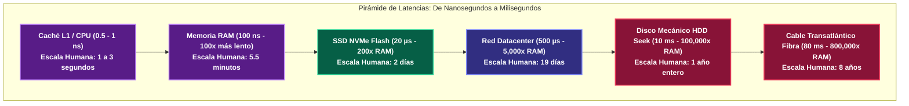

---
tags:
  - system-design
  - math
  - latency
  - hardware
  - numbers-every-engineer-should-know
  - fase-4
aliases:
  - Latencias de Hardware de Jeff Dean
  - Números que Todo Ingeniero Debe Saber
modulo: "08"
orden: 0
---

# 08.0 Números de Latencia que Todo Ingeniero Debe Conocer (Tabla de Jeff Dean y Escala Humana)

> *"No puedes diseñar un sistema a gran escala si no sabes en tus huesos la diferencia de órdenes de magnitud entre leer de la memoria RAM, leer de un disco NVMe y cruzar un océano por un cable de fibra óptica."*

---

## 1. La Tabla Maestra de Latencias de Hardware (Jeff Dean / Peter Norvig)

| Operación de Hardware | Tiempo Real (Nanosegundos / Milisegundos) | Escala Humana Normalizada (1 Ciclo CPU = 1 Segundo) |
| :--- | :--- | :--- |
| **1 Ciclo de CPU L1 (3 GHz)** | **0.3 ns** | **1 segundo** (Un parpadeo) |
| **Acceso a Caché L1** | **0.5 - 1 ns** | **2 - 3 segundos** |
| **Predicción de Salto Errónea (Branch Mispredict)** | **3 - 5 ns** | **15 segundos** |
| **Acceso a Caché L2** | **3 - 7 ns** | **20 segundos** |
| **Acceso a Caché L3** | **15 - 40 ns** | **1.5 minutos** |
| **Bloqueo / Desbloqueo de Mutex** | **17 - 25 ns** | **1 minuto** |
| **Acceso a Memoria Principal (RAM)** | **100 ns** | **5.5 minutos** |
| **Comprimir 1 KB con Zstandard/Snappy** | **2,000 ns (2 µs)** | **1.8 horas** |
| **Lectura Secuencial de 1 MB de RAM** | **3,000 ns (3 µs)** | **2.8 horas** |
| **Lectura Aleatoria de SSD NVMe (Flash)** | **10,000 - 50,000 ns (10 - 50 µs)** | **9 a 46 horas (1 - 2 días)** |
| **Lectura Secuencial de 1 MB de SSD NVMe** | **200,000 ns (200 µs / 0.2 ms)** | **7.7 días (1 semana)** |
| **Viaje de Red dentro del mismo Datacenter** | **500,000 ns (500 µs / 0.5 ms)** | **19 días** |
| **Búsqueda Aleatoria en Disco Mecánico (HDD Seek)**| **10,000,000 ns (10 ms)** | **1 año entero** |
| **Lectura Secuencial de 1 MB de HDD** | **20,000,000 ns (20 ms)** | **2 años** |
| **Viaje RTT Costa a Costa (San Francisco a NY)** | **40,000,000 ns (40 ms)** | **4 años** |
| **Viaje Transatlántico RTT (NY a Londres en Fibra)** | **80,000,000 ns (80 ms)** | **8 años** |
| **Reinicio Completo de Sistema Operativo / VM** | **10,000,000,000 ns (10 s)** | **1,000 años (Un milenio)** |

---

## 2. Visualización Gráfica de la Brecha de Latencia

---

## 3. Las 4 Conclusiones Arquitectónicas de la Tabla

1. **La memoria RAM es $200\text{x}$ más rápida que un SSD y $100,000\text{x}$ más rápida que un HDD mecánico.** Diseña capas de caché en memoria ([[04.0_Estrategias_de_Cache_Write-Through_Write-Back_Refresh-Ahead|Redis]]) para absorber el 80% de lecturas.
2. **Las lecturas secuenciales son $50\text{x}$ a $100\text{x}$ más rápidas que las lecturas aleatorias.** Por eso los motores LSM-Tree y Kafka escriben secuencialmente en disco a velocidad de vértigo.
3. **Cruzar el cable transatlántico cuesta 80ms de física de la luz irreductible.** Utiliza CDNs ([[01.2_CDNs_Push_vs_Pull_y_Edge_Caching|Edge Caching]]) para responder cerca del usuario.
4. **Comprimir datos en CPU (Snappy/Gzip) es $100\text{x}$ más rápido que enviarlos sin comprimir por la red.** Siempre comprime payloads antes de enviarlos por Internet.

---

## Microtareas de Retención Intelectual

> [!QUESTION]- Active Recall: Si un acceso a RAM equivale a 5.5 minutos en la escala humana, ¿a cuánto equivale aproximadamente un acceso aleatorio a un disco mecánico tradicional (HDD Seek de 10ms)?
> **Respuesta:** Equivale aproximadamente a **1 año entero**. Esperar a que el cabezal mecánico del disco gire y se posicione físicamente sobre el plato magnético es, para la CPU, como si le pidieras esperar 12 meses antes de recibir el dato.

---

> [!TIP]- Micro-Cálculo Mental: Latencia de 10 Consultas SQL Secuenciales
> **Reto:** Un microservicio ejecuta **10 consultas SQL secuenciales** (una tras otra) para renderizar una página. Cada consulta tarda **1 ms** de procesamiento interno en Postgres, pero la latencia de red entre el microservicio y la base de datos es de **2 ms** de ida y vuelta (RTT).
> ¿Cuánto tiempo total tarda el endpoint antes de devolver la respuesta?
> **Cálculo:**
> - Tiempo por consulta $= 1\text{ ms (BD)} + 2\text{ ms (Red RTT)} = \mathbf{3 \text{ ms}}$.
> - 10 consultas secuenciales $= 10 \times 3\text{ ms} = \mathbf{30 \text{ ms}}$ (¡El 66% del tiempo fue solo esperar los paquetes de red!).
> - *Solución:* Agrupar en una sola consulta con `JOIN` o ejecutar en paralelo.

---

> [!WARNING]- Dilema Arquitectónico: Compresión en CPU vs Ancho de Banda de Red
> **Escenario:** Tienes un archivo JSON de **1 MB** que debes enviar desde tu servidor en Frankfurt a un cliente en Tokio por una conexión celular con ancho de banda limitado de **2 MB/s** (tarda $500\text{ms}$ en transferirse).
> **Pregunta:** ¿Vale la pena gastar $5\text{ms}$ de CPU en el servidor para comprimir el JSON con Gzip reduciéndolo a **200 KB**?
> **Respuesta:** **Absolutamente SÍ.**
> - Tiempo sin compresión: $500\text{ ms}$.
> - Tiempo con compresión: $5\text{ ms (Compresión)} + 100\text{ ms (Transferir 200KB)} + 2\text{ ms (Descompresión cliente)} = \mathbf{107 \text{ ms}}$.
> - **Ahorro total:** $393\text{ ms}$ de latencia y un $80\%$ de ahorro en factura de red de salida (*Egress*).

---

> [!NOTE]- Desafío Feynman: La velocidad de la CPU y el disco
> Si la CPU fuera un cirujano operando en un quirófano:
> - **Caché L1:** Es el bisturí que ya tiene en su mano derecha (1 segundo).
> - **Memoria RAM:** Es la enfermera parada al lado que le pasa una gasa de la bandeja (5 minutos).
> - **Disco SSD:** Es tener que salir del hospital a comprar vendas a la farmacia de la esquina (2 días).
> - **Disco HDD:** Es tener que viajar en barco a otro continente a fabricar el medicamento desde cero (1 año).

---

## Conceptos Relacionados
- [[08.1_Potencias_de_2_y_Escalas_de_Datos|08.1 Potencias de 2 y Escalas de Datos]]
- [[08.2_Formula_de_Estimacion_QPS_IOPS_Almacenamiento_y_Ancho_de_Banda|08.2 Fórmulas de Estimación]]
- [[01.0_El_Viaje_Completo_de_una_Peticion_HTTP|01.0 El Viaje de una Petición]]
- [[00_MOC_System_Design_Mastery|Volver al Índice Maestro (MOC)]]
