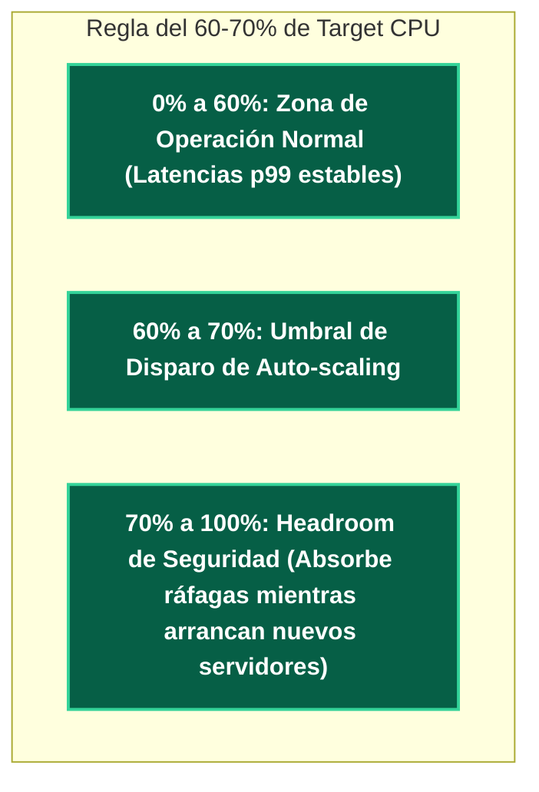

---
tags:
  - system-design
  - cloud
  - finops
  - cost-estimation
  - capacity-planning
  - fase-4
aliases:
  - Cálculo de Costos en la Nube y Dimensionamiento
  - FinOps y Reglas de Infraestructura
modulo: "08"
orden: 3
---

# 08.3 Ingeniería de Costos (FinOps): Dimensionamiento Cloud, Ancho de Banda (Egress) y Reglas de Utilización de CPU

> *"Cualquiera puede diseñar un sistema escalable si el presupuesto es infinito. El verdadero arte de la ingeniería de software consiste en diseñar una arquitectura resiliente y de alta escala que minimice el costo computacional y evite las trampas de facturación oculta en la nube."*

---

## 1. La Trampa Oculta del Ancho de Banda de Salida (Data Egress)

En la mayoría de proveedores de nube (AWS, GCP, Azure):
* **Ingress (Entrada de datos):** **USD 0.00 / GB (Gratis)**.
* **Egress (Salida a Internet):** **USD 0.05 a USD 0.09 por GB**.
* **Cross-AZ (Tráfico entre Zonas de Disponibilidad en la misma región):** **USD 0.01 por GB en cada dirección (USD 0.02 total)**.

```mermaid
flowchart LR
    Internet["Internet"]:::service -->|"Ingress: GRATIS (USD 0.00)"| LB["Load Balancer"]:::proxy
    LB -->|"Cross-AZ Egress: USD 0.02/GB"| AZ1["Instancia en AZ-1a"]:::service
    AZ1 -->|"Cross-AZ Egress: USD 0.02/GB"| DB["Base de Datos en AZ-1b"]:::database
    AZ1 -->|"Data Egress a Internet: USD 0.09/GB (¡La mayor parte de la factura!)"| Internet

    classDef client fill:#1e40af,stroke:#60a5fa,stroke-width:2px,color:#ffffff,font-weight:bold;
    classDef proxy fill:#312e81,stroke:#818cf8,stroke-width:2px,color:#ffffff,font-weight:bold;
    classDef service fill:#065f46,stroke:#34d399,stroke-width:2px,color:#ffffff,font-weight:bold;
    classDef database fill:#7c2d12,stroke:#fb923c,stroke-width:2px,color:#ffffff,font-weight:bold;
    classDef cache fill:#581c87,stroke:#c084fc,stroke-width:2px,color:#ffffff,font-weight:bold;
    classDef queue fill:#155e75,stroke:#22d3ee,stroke-width:2px,color:#ffffff,font-weight:bold;
    classDef warning fill:#881337,stroke:#f43f5e,stroke-width:2px,color:#ffffff,font-weight:bold;
    classDef highlight fill:#854d0e,stroke:#facc15,stroke-width:2px,color:#ffffff,font-weight:bold;
```

---

## 2. Reglas de Utilización de CPU y Headroom de Seguridad

### Por qué nunca debes operar al 90% de CPU:
1. **La Ley de Colas:** Cuando la utilización de un servidor supera el $70-80\%$, **el tiempo de espera en cola de las peticiones crece de forma hiperbólica hacia el infinito** ($W \propto \frac{U}{1-U}$).
2. **Tiempo de Arranque (*Cold Start*):** Levantar una nueva instancia EC2 o un contenedor Kubernetes tarda entre **30 segundos y 3 minutos**. Si tu cluster ya estaba al 95% de CPU cuando llega el pico, colapsará antes de que los nuevos servidores estén listos para recibir tráfico.

---

## 3. Matriz de Almacenamiento en la Nube: Rendimiento vs Costo

| Tipo de Almacenamiento | Tecnología | Throughput / IOPS | Latencia | Costo Aprox. / GB / Mes | Uso Ideal |
| :--- | :--- | :--- | :--- | :--- | :--- |
| **Object Storage (S3 / GCS)** | Distribuido en disco | Ilimitado agregado | $50 - 100\text{ ms}$ | **USD 0.023** | Archivos estáticos, imágenes, backups, data lakes. |
| **Block Storage Estándar (EBS gp3)** | SSD en red | $3,000\text{ IOPS base} / 125\text{ MB/s}$ | $1 - 3\text{ ms}$ | **USD 0.08** | Bases de datos relacionales estándar, discos de SO. |
| **Block Storage Provisioned (EBS io2)**| SSD en red redundante | Hasta $64,000\text{ IOPS}$ | $<1\text{ ms}$ | **$0.125 + \$0.065/\text{IOPS}$** | Bases de datos transaccionales de misión crítica. |
| **Local Instance Storage (NVMe efímero)**| SSD físico acoplado al bus PCIe | **$500,000+\text{ IOPS}$** | **$<50\text{ µs}$** | **Incluido en la instancia** | Nodos de Cassandra, Elasticsearch, RocksDB, réplicas de lectura. |

---

## Microtareas de Retención Intelectual

> [!QUESTION]- Active Recall: ¿Por qué transferir datos entre dos microservicios en diferentes Zonas de Disponibilidad (AZs) de la misma región de AWS genera costos inesperados?
> **Respuesta:** Porque los proveedores cloud cobran **USD 0.01 por GB enviado + USD 0.01 por GB recibido** por cruzar el enlace de red entre Zonas de Disponibilidad distintas (*Cross-AZ Data Transfer*). Si un microservicio en `us-east-1a` transfiere terabytes de eventos a un broker de Kafka en `us-east-1b`, la empresa pagará miles de dólares al mes solo por mover bytes entre edificios dentro de la misma ciudad.
> **Solución:** Configurar afinidad de zona (*Availability Zone Affinity / Topology-Aware Routing*) para que los servicios hablen preferentemente con instancias en su misma AZ.

---

> [!TIP]- Micro-Cálculo Mental: Costo de Egress de Video
> **Reto:** Una plataforma de cursos sirve **50 Terabytes de video al mes** directamente desde sus servidores en AWS a usuarios en Internet.
> El costo de salida de datos (*Internet Data Egress*) en AWS es de **USD 0.09 por GB**.
> Si implementas una CDN (Cloudflare) con costo de **USD 0.02 por GB** y una tasa de Cache Hit del **85%**:
> ¿Cuánto dinero ahorras al mes en la factura de la nube?
> **Cálculo:**
> - $50 \text{ TB} = 50,000 \text{ GB}$.
> - Costo original sin CDN: $50,000 \times \$0.09 = \mathbf{\$4,500 \text{ USD/mes}}$.
> - Con CDN (85% Hit):
>   - Salida CDN: $50,000 \times \$0.02 = \$1,000$.
>   - Salida de Origen (15% Miss): $7,500 \text{ GB} \times \$0.09 = \$675$.
>   - Costo total con CDN: $\$1,675 \text{ USD/mes}$.
> - **Ahorro mensual:** $\$4,500 - \$1,675 = \mathbf{\$2,825 \text{ USD/mes}}$ (Ahorro del 63%).

---

> [!WARNING]- Dilema Arquitectónico: Instancias Reservadas vs Spot vs On-Demand
> **Escenario:** Tu arquitectura requiere 100 servidores en total: 60 servidores son la carga base constante que nunca baja; 40 servidores son necesarios solo durante 4 horas al día para procesar tareas por lotes de analítica no urgentes.
> **Pregunta:** ¿Qué modelo de contratación de instancias de AWS utilizas para minimizar costos?
> **Respuesta:**
> - **60 servidores de carga base:** **Savings Plans / Reserved Instances (1 o 3 años)** (Ahorro del $40\%$ al $60\%$ respecto a On-Demand).
> - **40 servidores de tareas por lotes:** **Spot Instances (Instancias de subasta efímeras)** (Ahorro del $70\%$ al $90\%$). Si AWS revoca una instancia Spot con 2 minutos de aviso, la cola de tareas simplemente reasigna el trabajo a otro worker sin afectar a usuarios en vivo.

---

> [!NOTE]- Desafío Feynman: Costos de Ingress vs Egress
> Es como un parque de diversiones donde la entrada es totalmente gratis (Ingress), puedes meter todas las maletas que quieras sin pagar un centavo; pero en la puerta de salida hay un guardia que te cobra USD 10 dólares por cada bolsa que intentes sacar del parque (Egress).

---

## Conceptos Relacionados
- [[08.0_Latencias_que_Todo_Programador_Debe_Saber|08.0 Latencias de Hardware]]
- [[08.2_Formula_de_Estimacion_QPS_IOPS_Almacenamiento_y_Ancho_de_Banda|08.2 Fórmulas de Capacidad]]
- [[01.2_CDNs_Push_vs_Pull_y_Edge_Caching|01.2 CDNs y Ahorro de Egress]]
- [[00_MOC_System_Design_Mastery|Volver al Índice Maestro (MOC)]]
