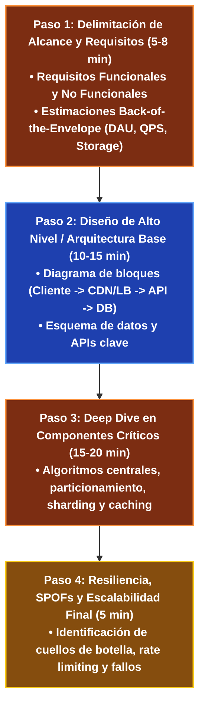

---
tags:
  - system-design
  - interview-framework
  - methodology
  - architecture
  - fase-5
aliases:
  - Metodología de Entrevistas de System Design
  - Framework de 4 Pasos
modulo: "09"
orden: 0
---

# 09.0 El Framework Universal de 4 Pasos para Diseño de Sistemas

> *"Una entrevista o diseño de arquitectura no es un examen de respuestas correctas prefabricadas: es una conversación abierta de ingeniería para evaluar cómo delimitas el alcance, justifiques trade-offs y resuelvas cuellos de botella bajo restricciones reales."*

---

## 1. La Estructura de 4 Pasos (45 Minutos)

---

## 2. Matriz de Equilibrio: Lo que SÍ hacer vs Lo que NO hacer

| Dimensión | Lo que SÍ hacer (Best Practices) | Lo que NO hacer (Anti-patrones / Errores Fatales) |
| :--- | :--- | :--- |
| **Paso 1: Requisitos** | Hacer preguntas aclaratorias sobre usuarios activos (DAU), relación lectura/escritura (R/W ratio) y consistencia. | **NO asumir requisitos en silencio.** Empezar a dibujar servidores sin saber si el sistema tiene 1,000 o 500,000,000 de usuarios. |
| **Paso 1: Estimaciones** | Redondear números con seguridad (86,400s $\approx 10^5$) para obtener órdenes de magnitud rápidos. | Perder 10 minutos calculando decimales exactos en una calculadora. |
| **Paso 2: Arquitectura** | Comenzar simple (Monolito/API + DB) y justificar la necesidad de cada componente antes de añadirlo. | **NO vomitar herramientas de moda.** Poner Kafka, Redis, Elasticsearch y Cassandra en el minuto 2 sin haber explicado el flujo de datos. |
| **Paso 3: Deep Dive** | Identificar el cuello de botella central del problema (ej. el algoritmo de Fanout en Twitter o el ID generator en TinyURL). | Quedarse en la superficie dibujando cajas genéricas de "Backend" sin detallar qué ocurre adentro. |
| **Paso 4: Trade-offs** | Explicar honestamente las debilidades de tu diseño y qué compromisos aceptaste (ej. consistencia eventual a cambio de latencia). | Defender tu diseño como "perfecto e infalible" sin reconocer ningún trade-off. |

---

## Microtareas de Retención Intelectual

> [!QUESTION]- Active Recall: ¿Por qué en el Paso 1 debes separar estrictamente los Requisitos Funcionales de los No Funcionales?
> **Respuesta:**
> - **Requisitos Funcionales:** Definen **QUÉ hace el sistema** desde la perspectiva del usuario (ej. *"El usuario puede acortar una URL y ser redirigido"*).
> - **Requisitos No Funcionales:** Definen **CÓMO de rápido y confiable opera el sistema** (ej. *"Latencia de redirección <20ms, disponibilidad 99.99%, tolerancia a particiones"*).
> Sin los requisitos no funcionales, es imposible decidir si necesitas una base de datos relacional simple en una sola máquina o un cluster distribuido particionado con CDN.

---

> [!TIP]- Micro-Cálculo Mental: Relación Lectura/Escritura (Read/Write Ratio)
> **Reto:** Un sistema tiene **1,000 Write QPS** y una relación Lectura/Escritura de **100:1** (Read-Heavy).
> ¿Cuál es el Read QPS y qué decisión arquitectónica inmediata debes tomar?
> **Cálculo:**
> - $\text{Read QPS} = 1,000 \times 100 = \mathbf{100,000 \text{ Read QPS}}$.
> - **Decisión:** El sistema es $99\%$ lecturas. Es obligatorio introducir una capa masiva de **Caché en memoria (Redis)** y **Réplicas de Lectura de Base de Datos**, ya que la base de datos transaccional colapsará si atiende 100k QPS directamente.

---

> [!WARNING]- Dilema Arquitectónico: Elección de Nombres de Tecnologías en Entrevistas
> **Escenario:** El entrevistador te pide diseñar el almacenamiento. Dices: *"Usaré MongoDB porque es muy rápido"*.
> **Pregunta:** ¿Por qué esta respuesta es deficiente para un nivel Senior/Staff?
> **Respuesta:** Porque un ingeniero Staff no elige marcas comerciales a ciegas; elige **paradigmas de almacenamiento y modelos de consistencia**. La respuesta correcta es: *"Dado que nuestros datos son documentos semi-estructurados con esquemas dinámicos y requerimos escalabilidad horizontal por Shard Key sin transacciones multi-tabla complejas, un Almacén Documental (como MongoDB o DynamoDB) es óptimo frente a un motor relacional"*.

---

> [!NOTE]- Desafío Feynman: El Framework de 4 Pasos
> Es como el trabajo de un arquitecto civil construyendo un puente:
> 1. Primero pregunta cuántos autos van a cruzar al día y qué peso deben soportar (Requisitos).
> 2. Luego dibuja el plano general del puente y los pilares en el río (Diseño de Alto Nivel).
> 3. Luego calcula el grosor exacto de los cables de acero y la mezcla de hormigón (Deep Dive).
> 4. Finalmente analiza qué pasa si hay un terremoto o vientos de 150 km/h (Resiliencia).

---

## Conceptos Relacionados
- [[08.2_Formula_de_Estimacion_QPS_IOPS_Almacenamiento_y_Ancho_de_Banda|08.2 Fórmulas de Estimación]]
- [[09.1_Diseno_de_TinyURL_Acortador_de_URLs|09.1 Diseño de TinyURL]]
- [[09.2_Diseno_de_Twitter_Timeline_y_Fanout|09.2 Diseño de Twitter Timeline]]
- [[00_MOC_System_Design_Mastery|Volver al Índice Maestro (MOC)]]
