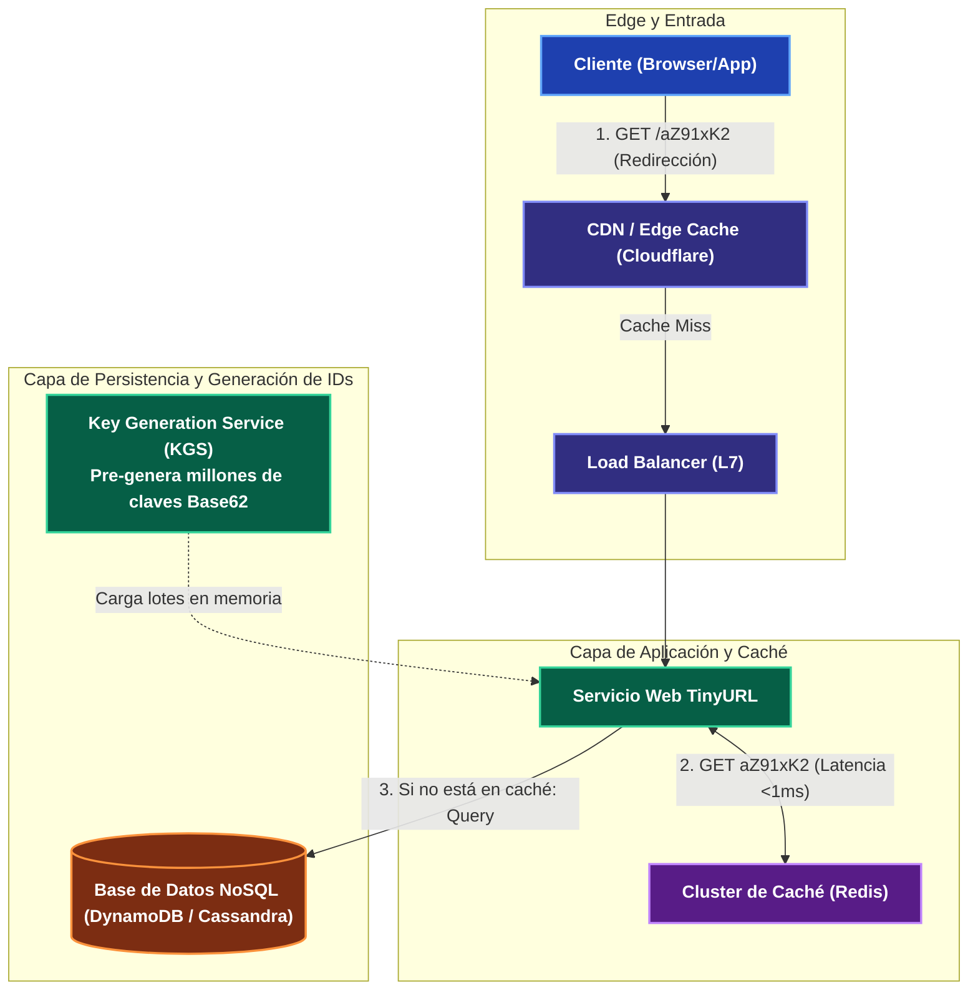

---
tags:
  - system-design
  - case-study
  - tinyurl
  - base62
  - kgs
  - fase-5
aliases:
  - Diseño de TinyURL / Pastebin
  - Acortador de URLs a Gran Escala
modulo: "09"
orden: 1
---

# 09.1 Caso de Estudio: Diseño de un Acortador de URLs a Gran Escala (TinyURL / Bitly)

> *"Diseñar TinyURL parece un ejercicio trivial de guardar un string en una base de datos; a escala de miles de millones de URLs, se convierte en un desafío de generación de IDs distribuidos sin colisiones, compresión Base62 y optimización de lecturas ultra-rápidas."*

---

## 1. Requisitos y Estimación de Capacidad

### Requisitos Funcionales:
1. Dado un enlace largo (`https://...`), generar un alias corto único de 7 caracteres (ej. `https://ti.ny/aZ91xK2`).
2. Al acceder al enlace corto, redirigir al usuario al enlace original en $<20\text{ ms}$ con código `HTTP 301` o `HTTP 302`.
3. Los enlaces pueden tener una fecha de expiración opcional.

### Estimación Back-of-the-Envelope:
* **Tráfico:** 500 Millones de URLs nuevas por mes $\approx \frac{500,000,000}{30 \times 100,000} \approx \mathbf{170 \text{ Write QPS}}$.
* **Ratio Lectura/Escritura (100:1):** $\text{Read QPS} = 170 \times 100 = \mathbf{17,000 \text{ Read QPS}}$ ($\text{Peak} = 34,000\text{ QPS}$).
* **Almacenamiento a 5 Años:** 500M URLs/mes $\times 60 \text{ meses} = 30 \text{ Mil Millones de registros}$. Cada registro pesa $500\text{ bytes} \implies 30 \times 10^9 \times 500\text{ B} = \mathbf{15 \text{ TB}}$.
* **Memoria de Caché (Regla 80/20):** $17,000 \text{ QPS} \times 86,400 \times 500\text{ B} \approx 734 \text{ GB/día} \implies 20\% = \mathbf{147 \text{ GB de RAM en Redis}}$.

---

## 2. Arquitectura del Sistema

---

## 3. Mecánica Interna: Algoritmo de Generación de Claves (KGS vs Hashing)

### Enfoque 1: Hash MD5/SHA-256 (Problemático)
* Calcular $hash(\text{URL larga})$ y tomar los primeros 7 caracteres.
* **El Problema:** Dos usuarios diferentes acortando la misma URL colisionan, y calcular hashes sobre cadenas largas en caliente es costoso.

### Enfoque 2: Key Generation Service (KGS) con Base62 (Óptimo)
1. Un servicio independiente (**KGS**) genera cadenas únicas de 7 caracteres en Base62 (`62^7 = 3.5 \text{ Trillones}`) y las almacena en una tabla de claves disponibles en base de datos.
2. El KGS carga bloques de **10,000 claves pre-generadas en la memoria RAM** de cada servidor de aplicación.
3. Cuando un usuario pide acortar una URL, el servidor de aplicación toma la siguiente clave de su memoria RAM en $0.001\text{ ms}$, eliminando por completo cualquier riesgo de colisión o contención de bloqueos.

---

## 4. Matriz de Equilibrio: Lo que SÍ hacer vs Lo que NO hacer

| Dimensión | Lo que SÍ hacer (Best Practices) | Lo que NO hacer (Anti-patrones / Errores Fatales) |
| :--- | :--- | :--- |
| **Código HTTP de Redirección** | Usar **HTTP 302 Found** (Redirección temporal) si necesitas medir analítica y clics en tu servidor; usar **HTTP 301 Moved Permanently** si quieres que el navegador cachee la redirección localmente para ahorrar costos de servidor. | Usar `HTTP 200` con un redirect en JavaScript en el frontend (añade 500ms de latencia innecesaria). |
| **Generación de IDs** | Usar un generador determinista distribuido (*KGS* o *Snowflake ID* de 64 bits convertido a Base62). | Usar `AUTO_INCREMENT` de MySQL centralizado (crea un SPOF y cuello de botella insalvable al escalar a múltiples datacenters). |
| **Base de Datos** | Elegir un almacén **Key-Value o NoSQL** (DynamoDB / Cassandra) con clave primaria `short_key` para búsquedas en $O(1)$. | Usar una base de datos relacional con múltiples tablas y `JOINs` complejos cuando la entidad solo tiene 3 campos (`short_key`, `original_url`, `created_at`). |
| **Limpieza de Expiraciones** | Implementar un proceso de borrado perezoso (*Lazy Expiration* al consultar) combinado con un worker nocturno de baja prioridad. | Ejecutar un escaneo completo de toda la base de datos cada 5 minutos (`DELETE WHERE expires_at < NOW()`), lo que saturará las IOPS de disco. |

---

## Microtareas de Retención Intelectual

> [!QUESTION]- Active Recall: ¿Por qué Base62 utiliza exactamente los caracteres `[a-z, A-Z, 0-9]` y excluye caracteres como `+` o `/` que sí están en Base64?
> **Respuesta:** Porque en **Base64**, los caracteres `+`, `/` y `=` tienen significados reservados especiales en las URLs de Internet (el `/` divide rutas, `+` representa espacios y `=` asigna parámetros de query). Usar **Base62** garantiza que la cadena corta sea **URL-Safe**, pudiendo incluirse directamente en cualquier navegador o mensaje sin necesidad de encoding porcentual (`%2F`, `%2B`).

---

> [!TIP]- Micro-Cálculo Mental: Ahorro de Servidores con HTTP 301 vs 302
> **Reto:** Tu acortador recibe **50,000 Read QPS**.
> - Con **HTTP 302**: Cada clic debe llegar obligatoriamente a tus servidores backend para registrar la redirección (50,000 QPS procesados en backend).
> - Con **HTTP 301**: El navegador cachea la redirección; el **80% de los clics repetidos** se resuelven localmente en el cliente sin enviar paquetes a tu red.
> ¿Cuántas peticiones reales llegan a tu backend con HTTP 301?
> **Cálculo:**
> - Peticiones al backend: $50,000 \times (1 - 0.80) = \mathbf{10,000 \text{ QPS}}$ (Reducción del 80% en carga y costo de servidores).

---

> [!WARNING]- Dilema Arquitectónico: Fallo de un Servidor con Claves KGS en Memoria
> **Escenario:** Un servidor de aplicación que tenía 10,000 claves Base62 reservadas en su memoria RAM sufre un corte de energía y se reinicia.
> **Pregunta:** ¿Debes intentar recuperar las 10,000 claves no usadas o descartarlas?
> **Respuesta:** **DESCARTARLAS.** Dado que el espacio total de claves de 7 caracteres en Base62 es de **3.5 Trillones de combinaciones**, perder 10,000 claves (el $0.0000002\%$ del total) es completamente irrelevante. Intentar sincronizar qué claves se usaron y cuáles no requeriría transacciones distribuidas complejas que destruirían la velocidad del sistema.

---

> [!NOTE]- Desafío Feynman: El Key Generation Service (KGS)
> Es como el dispensador de números de papel en la sala de espera de un banco: no se inventa tu número en el momento en que entras por la puerta; los rollos con números del 1 al 10,000 ya fueron impresos la noche anterior en la imprenta. Tú solo tiras del papelito y te llevas el siguiente número en 0.1 segundos.

---

## Conceptos Relacionados
- [[08.1_Potencias_de_2_y_Escalas_de_Datos|08.1 Potencias de 2 y Base62]]
- [[04.0_Estrategias_de_Cache_Write-Through_Write-Back_Refresh-Ahead|04.0 Estrategias de Caché]]
- [[02.4_Key-Value_y_Document_Stores_Redis_DynamoDB_MongoDB|02.4 DynamoDB y Redis]]
- [[00_MOC_System_Design_Mastery|Volver al Índice Maestro (MOC)]]
