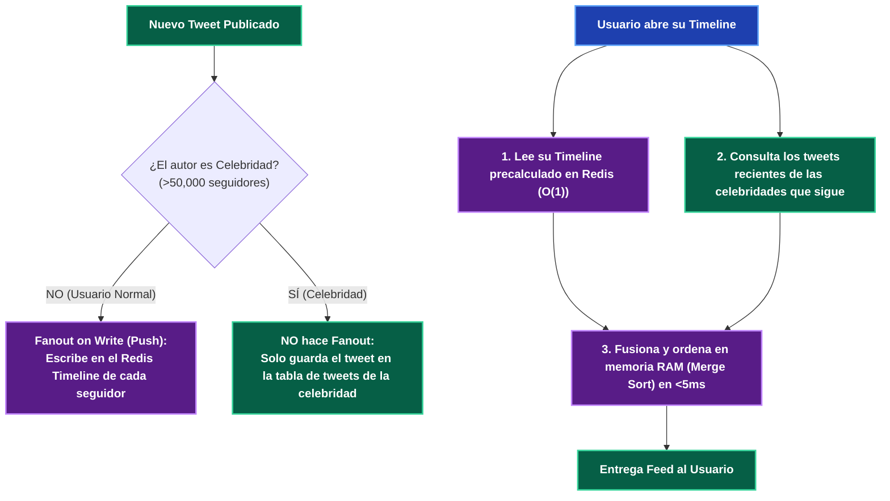

---
tags:
  - system-design
  - case-study
  - twitter
  - fanout
  - feed-architecture
  - fase-5
aliases:
  - Diseño de Twitter Timeline y Feed
  - Fanout on Write vs Fanout on Read
modulo: "09"
orden: 2
---

# 09.2 Caso de Estudio: Diseño del Timeline de Twitter (Fanout on Write vs Fanout on Read)

> *"El problema fundamental de las redes sociales no es guardar tweets, sino ensamblar y entregar el feed de noticias personalizado de 300 millones de usuarios en menos de 100 milisegundos cuando conviven usuarios ordinarios con celebridades de 100 millones de seguidores."*

---

## 1. Los Dos Modelos de Generación de Feed

```mermaid
flowchart TD
    subgraph sg_1__Fanout_on_Read___Pull_Model__Bajo_Costo_de_Escritura___Lento_en_Lectura_ ["1. Fanout on Read / Pull Model (Bajo Costo de Escritura - Lento en Lectura)"]
        Tweet1["Usuario A publica Tweet"]:::service --> DB1[("Guarda Tweet en BD (1 sola escritura)")]:::database
        UserRead1["Seguidor B abre su App"]:::client --> Merge1["Ejecuta Query SQL: SELECT * FROM tweets WHERE user_id IN (mis_seguidos) ORDER BY time DESC"]:::client
        Merge1 --> DB1
        note right of Merge1: Si el seguidor sigue a 1,000 personas,\nel JOIN de 1,000 IDs colapsa la CPU en cada F5.
    end
    
    subgraph sg_2__Fanout_on_Write___Push_Model__Lectura_Instant_nea_O_1____Pesado_en_Escritura_ ["2. Fanout on Write / Push Model (Lectura Instantánea O(1) - Pesado en Escritura)"]
        Tweet2["Usuario A publica Tweet"]:::service --> Worker["Fanout Worker"]:::service
        Worker -->|"Inserta el TweetID en las bandejas Redis de sus 500 seguidores"| C1["Timeline Cache Usuario 1"]:::cache
        Worker --> C2["Timeline Cache Usuario 2"]:::cache
        Worker --> C3["Timeline Cache Usuario 500"]:::cache
        UserRead2["Seguidor abre su App"]:::client -->|"GET timeline:user_id (O(1) en RAM)"| C1
    end

    classDef client fill:#1e40af,stroke:#60a5fa,stroke-width:2px,color:#ffffff,font-weight:bold;
    classDef proxy fill:#312e81,stroke:#818cf8,stroke-width:2px,color:#ffffff,font-weight:bold;
    classDef service fill:#065f46,stroke:#34d399,stroke-width:2px,color:#ffffff,font-weight:bold;
    classDef database fill:#7c2d12,stroke:#fb923c,stroke-width:2px,color:#ffffff,font-weight:bold;
    classDef cache fill:#581c87,stroke:#c084fc,stroke-width:2px,color:#ffffff,font-weight:bold;
    classDef queue fill:#155e75,stroke:#22d3ee,stroke-width:2px,color:#ffffff,font-weight:bold;
    classDef warning fill:#881337,stroke:#f43f5e,stroke-width:2px,color:#ffffff,font-weight:bold;
    classDef highlight fill:#854d0e,stroke:#facc15,stroke-width:2px,color:#ffffff,font-weight:bold;
```

---

## 2. El Problema de las Celebridades (*The Celebrity Problem / Hotspot*)

* Si un usuario ordinario con **200 seguidores** tuitea: El worker de Fanout on Write realiza **200 inserciones en Redis** en $5\text{ms}$ (Excelente).
* Si una celebridad (ej. Elon Musk o Taylor Swift con **100 Millones de seguidores**) tuitea:
  - El worker debe escribir en **100,000,000 de bandejas de entrada de Redis simultáneamente**.
  - Si cada escritura tarda $0.1\text{ms}$, el proceso tarda **10,000 segundos ($\sim 2.7\text{ horas}$)** en completarse. Durante esas 2 horas, los usuarios no ven el tweet nuevo, y las colas de mensajes colapsan.

---

## 3. La Solución Híbrida de Twitter en Producción



---

## 4. Matriz de Equilibrio: Lo que SÍ hacer vs Lo que NO hacer

| Dimensión | Lo que SÍ hacer (Best Practices) | Lo que NO hacer (Anti-patrones / Errores Fatales) |
| :--- | :--- | :--- |
| **Almacenamiento de Timelines** | Almacenar únicamente **IDs de Tweets (`int64`)** en una lista en memoria (**Redis List o Sorted Set `ZREVRANGE`**) limitada a los últimos 800 tweets por usuario. | Guardar el objeto JSON completo del tweet con texto, imágenes y metadatos en el timeline de cada seguidor (multiplica por 1,000x el consumo de RAM). |
| **Gestión de Usuarios Inactivos** | Suspender el Fanout on Write para usuarios que no han abierto la app en los últimos 30 días (*Cold Users*). Solo regenerar su feed cuando inicien sesión. | Mantener actualizados en memoria RAM los timelines de 500 millones de cuentas inactivas y bots abandonados. |
| **Hidratación de Datos** | Traer la lista de IDs de Redis (`[id_1, id_2, id_3]`) y hacer un único `MGET` masivo a un caché de tweets para obtener el contenido visual (*Hydration*). | Hacer 20 consultas individuales por separado a la base de datos para recuperar el autor de cada tweet del feed. |
| **Paginación** | Usar **Cursor Pagination** (`WHERE tweet_id < last_seen_id LIMIT 20`). | Usar `OFFSET 1000` en la consulta del feed. |

---

## Microtareas de Retención Intelectual

> [!QUESTION]- Active Recall: ¿Por qué Twitter limita el Timeline en Redis a exactamente los últimos 800 tweets por usuario?
> **Respuesta:** Porque los estudios de comportamiento de usuarios demuestran que el **$99.5\%$ de las personas nunca hace scroll más allá de los primeros 200 a 400 tweets** en su feed. Guardar millones de tweets antiguos en la memoria RAM de Redis es un desperdicio masivo de presupuesto; si un usuario atípico hace scroll profundo hasta el tweet 801, el sistema degrada elegantemente consultando el histórico en disco (*Cold Storage*).

---

> [!TIP]- Micro-Cálculo Mental: Memoria RAM del Cluster de Timelines de Twitter
> **Reto:** Twitter tiene **300 Millones de usuarios activos**. Cada usuario guarda una lista de **800 IDs de tweets** en su timeline de Redis. Cada ID es un entero `int64` (**8 bytes**).
> ¿Cuánta memoria RAM neta se necesita para almacenar los feeds de toda la plataforma?
> **Cálculo:**
> - Memoria por usuario: $800 \text{ IDs} \times 8 \text{ bytes} = 6,400 \text{ bytes} \approx \mathbf{6.4 \text{ KB por usuario}}$.
> - Total para 300M usuarios: $300,000,000 \times 6.4 \text{ KB} = 1,920,000,000 \text{ KB} \approx \mathbf{1.92 \text{ Terabytes de RAM}}$.
> - Con overhead de Redis ($2\times$): $\approx \mathbf{3.8 \text{ TB de RAM}}$ (Fácilmente almacenable en un cluster de 15 a 20 máquinas Redis estándar).

---

> [!WARNING]- Dilema Arquitectónico: Borrado de Tweets de Celebridades
> **Escenario:** Una celebridad con 80 millones de seguidores publica un tweet por error y lo borra 10 segundos después.
> **Pregunta:** Si hubieras usado Fanout on Write puro, ¿cuál sería el impacto de borrar el tweet?
> **Respuesta:** **Un desastre de rendimiento.** El sistema tendría que emitir 80 millones de operaciones de borrado (`ZREM`) en las 80 millones de listas de Redis de los seguidores. **Con el modelo híbrido:** Como el tweet de la celebridad nunca se inyectó en las bandejas de los seguidores, borrarlo solo requiere **1 sola eliminación en la tabla principal de la celebridad**, desapareciendo instantáneamente de todas las pantallas en la siguiente consulta.

---

> [!NOTE]- Desafío Feynman: Fanout on Write vs Fanout on Read
> - **Fanout on Read:** Es como si el cartero te pidiera que salgas a caminar por las casas de tus 100 amigos a revisar sus buzones cada vez que quieras leer cartas.
> - **Fanout on Write:** Es como si tus amigos te enviaran una copia de su carta a tu buzón; tú solo abres tu puerta y lees lo que ya está ahí.
> - **Híbrido:** Tus amigos normales echan cartas en tu buzón, pero si el Presidente da un discurso, no te manda una carta; tú enciendes la televisión y miras el canal central.

---

## Conceptos Relacionados
- [[04.0_Estrategias_de_Cache_Write-Through_Write-Back_Refresh-Ahead|04.0 Estrategias de Caché]]
- [[05.0_Colas_de_Mensajes_Message_Queues_y_Back_Pressure|05.0 Colas de Mensajes y Workers]]
- [[04.2_Consistent_Hashing_con_Nodos_Virtuales|04.2 Consistent Hashing]]
- [[00_MOC_System_Design_Mastery|Volver al Índice Maestro (MOC)]]
