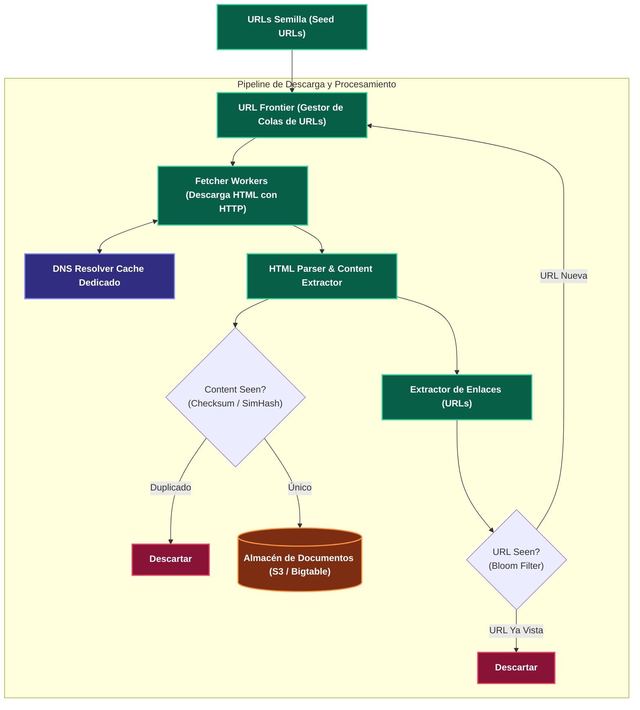

---
tags:
  - system-design
  - case-study
  - web-crawler
  - distributed-systems
  - bloom-filter
  - fase-5
aliases:
  - Diseño de un Web Crawler Distribuido
  - Rastreador Web a Escala de Internet
modulo: "09"
orden: 3
---

# 09.3 Caso de Estudio: Diseño de un Web Crawler Distribuido a Escala de Internet (Googlebot)

> *"Rastrear miles de millones de páginas web en Internet requiere dominar la cortesía de red (Politeness), desduplicación masiva con Filtros de Bloom, trampas de araña (Spider Traps) y arquitecturas de colas distribuidas por dominio."*

---

## 1. Arquitectura de Alto Nivel

---

## 2. Componentes Críticos de Ingeniería

### A. La URL Frontier: Cortesía (*Politeness*) y Prioridad
Un crawler no puede enviar 1,000 peticiones por segundo a un único sitio web pequeño (lo tumbaría con un ataque DoS accidental):
* **Colas por Host (*Politeness Queues*):** Mantiene una cola FIFO independiente por cada nombre de dominio (`cnn.com`, `wikipedia.org`).
* **Retardo de Cortesía:** Un worker que descarga una página de `cnn.com` debe esperar al menos $500\text{ms}$ a $1\text{s}$ antes de descargar la siguiente página del mismo dominio.
* **Colas de Prioridad:** Asigna mayor frecuencia de refresco a sitios de noticias o páginas con alto *PageRank* respecto a blogs estáticos.

### B. Desduplicación con Filtros de Bloom y SimHash
* **Desduplicación de URLs (Filtro de Bloom):** Un filtro de Bloom en memoria RAM de 1 GB puede verificar si una URL entre 10,000 millones ya fue visitada con $<1\%$ de falsos positivos.
* **Desduplicación de Contenido (SimHash):** Sitios espejo o páginas con solo la fecha cambiada se detectan mediante algoritmos de hash sensible a localidad (*Locality-Sensitive Hashing - SimHash*).

---

## 3. Matriz de Equilibrio: Lo que SÍ hacer vs Lo que NO hacer

| Dimensión | Lo que SÍ hacer (Best Practices) | Lo que NO hacer (Anti-patrones / Errores Fatales) |
| :--- | :--- | :--- |
| **Cortesía de Rastreo** | Respetar estrictamente el archivo `robots.txt` y cachear las reglas de `robots.txt` en memoria para no descargarlo en cada página. | Ignorar `robots.txt` o inundar un servidor con 100 hilos concurrentes, provocando bloqueos de IP y demandas legales. |
| **Resolución DNS** | Mantener un **DNS Resolver Cache propio en memoria** con prefetching de IPs. La resolución DNS estándar de Linux/ISP se convierte en el 80% del tiempo de rastreo. | Depender del resolver DNS del sistema operativo (`gethostbyname`) síncrono y bloqueante. |
| **Trampas de Araña (*Spider Traps*)** | Establecer un límite máximo de profundidad de URL (ej. max 20 niveles) y longitud de cadena para neutralizar calendarios infinitos (`site.com/cal?year=2024&month=01...`). | Seguir enlaces infinitos a ciegas hasta agotar el almacenamiento del cluster. |
| **Almacenamiento** | Guardar contenido comprimido en formato columnar / objetos grandes (S3/WARC files). | Crear un archivo individual de 10 KB por cada página en un sistema de archivos ext4 tradicional (agota los inodos del sistema operativo). |

---

## Microtareas de Retención Intelectual

> [!QUESTION]- Active Recall: ¿Qué es una Spider Trap (Trampa de Araña) y cómo puede colapsar un crawler?
> **Respuesta:** Es una estructura de páginas web (creada intencionalmente por atacantes o accidentalmente por scripts dinámicos como calendarios o directorios recursivos) que genera un número **infinito de URLs dinámicas** (ej. `/catalogo/categoria/sub/sub/sub...` o `/calendario?next_day=1...`). Si el crawler no tiene límites de profundidad, detección de ciclos o límites de páginas por dominio, quedará atrapado descargando páginas infinitas del mismo sitio hasta agotar disco y memoria.

---

> [!TIP]- Micro-Cálculo Mental: Ancho de Banda de Rastreo
> **Reto:** Tu crawler debe descargar **1,000,000,000 de páginas web por mes** (1 Mil Millones).
> El tamaño promedio de una página HTML es de **100 KB**.
> ¿Qué ancho de banda constante de red (Mbps) debe sostener tu cluster?
> **Cálculo:**
> - Volumen total al mes: $10^9 \times 100\text{ KB} = 100 \text{ Terabytes/mes}$.
> - Páginas por segundo: $\frac{1,000,000,000}{30 \times 100,000\text{ s}} \approx \mathbf{333 \text{ páginas/segundo}}$.
> - Ancho de banda: $333 \times 100\text{ KB/s} = 33.3 \text{ MB/s} \times 8 = \mathbf{266.4 \text{ Mbps}}$ constantes de descarga.

---

> [!WARNING]- Dilema Arquitectónico: Crawling en Javascript (SPAs de React/Vue)
> **Escenario:** El 40% de las páginas web modernas no tienen contenido en el HTML crudo; requieren ejecutar un motor de JavaScript (Headless Chrome / Puppeteer) para renderizar el DOM.
> **Pregunta:** ¿Debes renderizar JavaScript en todas las páginas descargadas?
> **Respuesta:** **No para todas las páginas.** Levantar instancias de Chromium consume $100\text{x}$ más CPU y memoria RAM que un parser HTML en C/Rust (Cheerio/Gumbo). **Solución:** Estrategia en dos fases: un pipeline ultra-rápido de HTML crudo para el 90% de los sitios, y una cola especializada con workers de Headless Browser reservada únicamente para sitios identificados como SPAs críticas.

---

> [!NOTE]- Desafío Feynman: URL Frontier
> Es como el buzón de correo de un cartero extremadamente educado: tiene 100 casilleros, uno para cada casa del barrio. El cartero saca una carta para la Casa 1, camina a entregarla y, para no molestar a esa familia, no vuelve a tocar su puerta hasta que haya visitado las otras 99 casas del vecindario.

---

## Conceptos Relacionados
- [[08.0_Latencias_que_Todo_Programador_Debe_Saber|08.0 Latencias de Hardware]]
- [[02.1_Motores_de_Indices_B-Tree_vs_LSM-Tree|02.1 Filtros de Bloom]]
- [[05.0_Colas_de_Mensajes_Message_Queues_y_Back_Pressure|05.0 Colas de Mensajes]]
- [[00_MOC_System_Design_Mastery|Volver al Índice Maestro (MOC)]]
