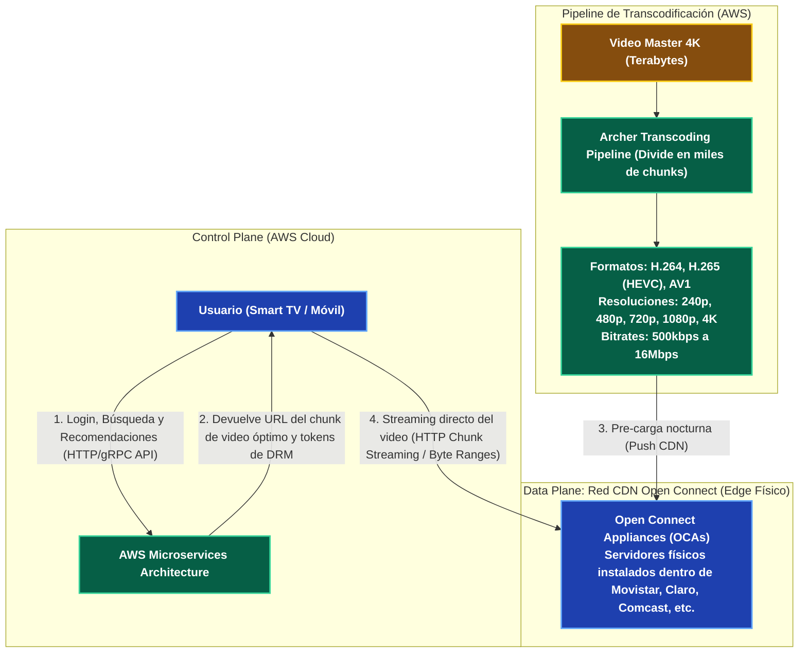

---
tags:
  - system-design
  - case-study
  - netflix
  - streaming
  - cdn
  - open-connect
  - fase-5
aliases:
  - Diseño de Netflix Streaming
  - CDN Open Connect y Transcodificación
modulo: "09"
orden: 4
---

# 09.4 Caso de Estudio: Arquitectura de Streaming de Video a Gran Escala (Netflix y Open Connect)

> *"Netflix divide su arquitectura en dos mundos completamente disjuntos: el plano de control en la nube pública (AWS) para navegación, facturación y recomendaciones; y su propia red física de CDN privada (Open Connect) instalada directamente dentro de los racks de los ISPs de todo el mundo para servir terabits de video."*

---

## 1. La Separación Arquitectónica: Control Plane vs Data Plane

---

## 2. Adaptive Bitrate Streaming (ABR)

El video no se descarga como un único archivo `.mp4` de 2 GB. Se divide en **fragmentos de 2 a 6 segundos** mediante protocolos como **HLS (HTTP Live Streaming)** o **DASH**:
* El reproductor del cliente mide continuamente el ancho de banda y la CPU disponible.
* Si el Wi-Fi se degrada, solicita el siguiente fragmento en **720p (1.5 Mbps)**; si la red mejora, salta en el siguiente fragmento a **4K (15 Mbps)** de forma completamente transparente.

---

## 3. Matriz de Equilibrio: Lo que SÍ hacer vs Lo que NO hacer

| Dimensión | Lo que SÍ hacer (Best Practices) | Lo que NO hacer (Anti-patrones / Errores Fatales) |
| :--- | :--- | :--- |
| **Distribución de Video** | Instalar servidores de caché (*Open Connect Appliances*) **dentro de los centros de conmutación de los ISPs** para que el tráfico de video viaje $0\text{ km}$ por el Internet público. | Servir terabits de video en vivo directamente desde el almacenamiento de objetos de la nube (S3/GCS), lo que costaría cientos de millones de dólares en *Egress*. |
| **Pre-populación de Caché** | Utilizar **Push Caching nocturno**: predecir qué películas se verán mañana en Madrid y precargar los servidores locales a las 04:00 AM cuando la red está inactiva. | Esperar a que los usuarios soliciten la película para descargarla en caliente (*Pull Miss*), saturando los enlaces durante la hora pico de las 20:00. |
| **Transcodificación** | Paralelizar la transcodificación dividiendo el video en cientos de trozos de 10 segundos (*Chunk-based Encoding*) procesados por miles de workers serverless. | Transcodificar una película de 2 horas en un solo servidor secuencial (tardaría 8 horas en procesarse). |
| **Conexiones de Streaming** | Utilizar peticiones HTTP estándar con cabeceras `Range: bytes=0-1048575` sobre HTTP/2 o HTTP/3. | Usar WebSockets para transmitir video (no se beneficia de las optimizaciones de caché de las CDNs estándar). |

---

## Microtareas de Retención Intelectual

> [!QUESTION]- Active Recall: ¿Por qué Netflix precarga su catálogo de video en las CDNs durante la madrugada (Push CDN) en lugar de usar un Origin Pull tradicional?
> **Respuesta:** Porque en la hora pico (20:00 a 23:00), millones de usuarios intentan ver el mismo estreno simultáneamente. Si se usara *Origin Pull*, los primeros cientos de miles de peticiones viajarían saturando los enlaces troncales transcontinentales. Al hacer un **Push nocturno a las 04:00 AM**, Netflix aprovecha el ancho de banda ocioso y garantiza un **Cache Hit Ratio del 98%** en el momento de mayor consumo.

---

> [!TIP]- Micro-Cálculo Mental: Ahorro de Ancho de Banda con Open Connect
> **Reto:** Una filial de un ISP tiene **100,000 usuarios** viendo series de Netflix en simultáneo en hora pico a un bitrate promedio de **5 Mbps**.
> - Sin Open Connect: El tráfico cruza el enlace de tránsito internacional del ISP.
> - Con Open Connect Appliance (OCA) instalado localmente en el rack del ISP: El video se sirve dentro de la red metropolitana local.
> ¿Cuánto tráfico de tránsito internacional ahorra el servidor Open Connect?
> **Cálculo:**
> - $100,000 \text{ streams} \times 5 \text{ Mbps} = \mathbf{500,000 \text{ Mbps}} = \mathbf{500 \text{ Gbps}}$.
> - *Lección:* El servidor local evita saturar la infraestructura troncal del país.

---

> [!WARNING]- Dilema Arquitectónico: ¿Dónde almacenar las miniaturas de video (*Thumbnails*)?
> **Escenario:** Cada título de Netflix tiene 50 miniaturas dinámicas personalizadas según el historial del usuario (ej. mostrar una foto de comedia a un usuario y una de acción al otro para la misma película).
> **Pregunta:** ¿Se guardan en el servidor de video Open Connect o en la CDN de imágenes de la nube?
> **Respuesta:** **En la CDN de imágenes/assets de la nube.** Los servidores Open Connect están optimizados exclusivamente para transferencias masivas de archivos gigantescos de video secuencial con discos de alta densidad y llamadas FreeBSD Zero-Copy; almacenar millones de imágenes pequeñas de 20 KB en ellos fragmentaría los bloques de disco y destruiría el rendimiento de lectura del video.

---

> [!NOTE]- Desafío Feynman: Adaptive Bitrate Streaming (ABR)
> Es como el grifo de agua de una ducha inteligente: si la presión de agua de la ciudad baja de golpe, la ducha no se corta dejándote con jabón en los ojos; reduce automáticamente el chorro a un flujo más fino para que puedas seguir bañándote sin interrupciones. Cuando la presión vuelve, el chorro vuelve a ser abundante.

---

## Conceptos Relacionados
- [[01.2_CDNs_Push_vs_Pull_y_Edge_Caching|01.2 CDNs y Edge Caching]]
- [[08.3_Calculo_de_Costos_en_la_Nube_y_Dimensionamiento|08.3 Costos de Egress en la Nube]]
- [[01.7_HTTP1_HTTP2_HTTP3_y_QUIC|01.7 HTTP/2 y Streaming]]
- [[00_MOC_System_Design_Mastery|Volver al Índice Maestro (MOC)]]
