---
tags:
  - system-design
  - case-study
  - postgresql
  - figma
  - database-scaling
  - sharding
  - fase-5
aliases:
  - Caso de Estudio Figma Postgres 100x
  - Cómo Figma Escaló PostgreSQL
modulo: "09"
orden: 5
---

# 09.5 Caso de Estudio: Cómo Figma Escaló su Base de Datos PostgreSQL 100x sin Migrar a NoSQL

> *"Muchas empresas cometen el error de reescribir toda su arquitectura a NoSQL ante el primer síntoma de saturación; el equipo de ingeniería de Figma demostró cómo escalar PostgreSQL vertical y horizontalmente mediante particionamiento por dominio, réplicas y sharding manteniendo la robustez relacional."*

---

## 1. Las 5 Fases de Escalabilidad de Figma

```mermaid
flowchart LR
    E1["Etapa 1: Base Única<br/>Escalado Vertical Hardware"]:::fase1 --> E2["Etapa 2: Réplicas<br/>1 Master + Read Replicas"]:::fase2 --> E3["Etapa 3: Pooling<br/>PgBouncer Transaccional"]:::fase3 --> E4["Etapa 4: Vertical Splitting<br/>Separación por Dominios"]:::fase4 --> E5["Etapa 5: Sharding<br/>Cluster Horizontal por Org"]:::fase5

    classDef fase1 fill:#1e3a8a,stroke:#60a5fa,stroke-width:2px,color:#ffffff,font-weight:bold;
    classDef fase2 fill:#312e81,stroke:#818cf8,stroke-width:2px,color:#ffffff,font-weight:bold;
    classDef fase3 fill:#065f46,stroke:#34d399,stroke-width:2px,color:#ffffff,font-weight:bold;
    classDef fase4 fill:#7c2d12,stroke:#fb923c,stroke-width:2px,color:#ffffff,font-weight:bold;
    classDef fase5 fill:#581c87,stroke:#c084fc,stroke-width:2px,color:#ffffff,font-weight:bold;
```

---

## 2. La Técnica de Particionamiento por Dominio y Sharding de Figma

Cuando el nodo primario de PostgreSQL alcanzó el límite físico de CPU en AWS:
1. **Vertical Splitting (Separación por Tablas de Dominio):**
   - Identificaron tablas no acopladas transaccionalmente y las movieron a bases de datos PostgreSQL físicas separadas (ej. la tabla de `comments` se movió a su propio cluster).
2. **Horizontal Sharding con Enrutamiento en Aplicación:**
   - Crearon un cluster de múltiples shards de Postgres.
   - Definieron como **Shard Key** el `organization_id` o `file_key`. Todos los objetos relacionados con un mismo archivo de diseño residen en el **mismo shard físico**, permitiendo mantener transacciones ACID y consultas relacionales rápidas dentro de cada archivo.

---

## 3. Matriz de Equilibrio: Lo que SÍ hacer vs Lo que NO hacer

| Dimensión | Lo que SÍ hacer (Best Practices) | Lo que NO hacer (Anti-patrones / Errores Fatales) |
| :--- | :--- | :--- |
| **Escalado de BBDD** | Exprimir al máximo PostgreSQL mediante **Query Tuning, Índices Parciales, Read Replicas y PgBouncer** antes de plantear Sharding. | Reemplazar PostgreSQL por una base de datos NoSQL compleja solo porque la CPU llegó al 70%, perdiendo integridad transaccional. |
| **Separación de Tráfico** | Enrutar automáticamente consultas de solo lectura (`SELECT`) a **Read Replicas** en el framework/ORM y dejar el Master exclusivamente para escrituras. | Enviar todas las lecturas de la aplicación al nodo Master primario. |
| **Gestión de Conexiones** | Usar un Connection Pooler transaccional (**PgBouncer / RDS Proxy**) para mantener miles de clientes conectados con solo 50 conexiones activas a Postgres. | Dejar que cada hilo de la aplicación abra y cierre conexiones TCP directas a PostgreSQL (*Connection Churn*). |
| **Transacciones Distribuidas** | Elegir una Shard Key que agrupe entidades que se modifican juntas (ej. todo el documento de diseño en 1 shard) para evitar transacciones cross-shard. | Particionar aleatoriamente por `hash(uuid)`, forzando *Two-Phase Commits* en cada guardado. |

---

## Microtareas de Retención Intelectual

> [!QUESTION]- Active Recall: ¿Por qué PgBouncer es indispensable para escalar PostgreSQL a miles de clientes concurrentes?
> **Respuesta:** Porque PostgreSQL utiliza un modelo de concurrencia basado en **procesos separados (`fork()`)** para cada conexión cliente, consumiendo entre 5 y 10 MB de memoria RAM por conexión y provocando saturación de cambio de contexto de CPU si tienes más de 300-500 conexiones directas. **PgBouncer** opera como un proxy ligero en C que multiplexa miles de conexiones de clientes hacia un pool pequeño de conexiones reutilizables hacia Postgres.

---

> [!TIP]- Micro-Cálculo Mental: Capacidad de Conexiones con PgBouncer
> **Reto:** Tu cluster de Kubernetes tiene **200 pods** de backend. Cada pod levanta un pool de **20 conexiones** a la base de datos ($200 \times 20 = 4,000 \text{ conexiones TCP directas}$ a Postgres, lo que provocaría un colapso del servidor).
> Colocas **PgBouncer** en modo de transacción (`pool_mode = transaction`).
> Si el tiempo promedio de una transacción SQL es de **2 ms** y el throughput es de **5,000 transacciones/segundo**:
> ¿Cuántas conexiones físicas reales a Postgres necesita PgBouncer según la Ley de Little ($L = \lambda W$)?
> **Cálculo:**
> - $L = 5,000 \text{ txn/s} \times 0.002 \text{ s} = \mathbf{10 \text{ conexiones físicas a Postgres}}$.
> - *Lección:* PgBouncer reduce 4,000 conexiones clientes a solo **10 conexiones de base de datos**.

---

> [!WARNING]- Dilema Arquitectónico: Modos de PgBouncer (Session vs Transaction Pooling)
> **Escenario:** Quieres maximizar el ahorro de conexiones en PgBouncer y configuras `pool_mode = transaction`.
> **Pregunta:** ¿Qué funcionalidad nativa de PostgreSQL queda prohibida en tu código de aplicación?
> **Respuesta:** Quedan prohibidas las **variables de sesión, tablas temporales y `SET LOCAL timezone`**, así como sentencias `PREPARE` tradicionales a nivel de sesión, ya que cada consulta sucesiva de un mismo cliente puede ser ejecutada en un proceso de servidor de Postgres diferente. El código de la aplicación debe diseñarse para ser completamente *stateless* a nivel de sesión de base de datos.

---

> [!NOTE]- Desafío Feynman: El Connection Pooling
> Es como los taxis en un aeropuerto con 5,000 pasajeros: no necesitas 5,000 taxis estacionados esperando a que cada persona salga del avión; con una flota rotativa de 50 taxis que llevan a un pasajero, regresan en 5 minutos y recogen al siguiente, puedes mover a toda la multitud de forma continua.

---

## Conceptos Relacionados
- [[02.0_SQL_vs_NoSQL_Taxonomia_Completa|02.0 Taxonomía de Bases de Datos]]
- [[02.3_Particionamiento_y_Sharding_de_BBDD|02.3 Sharding de Bases de Datos]]
- [[02.6_Optimizacion_SQL_y_Query_Tuning|02.6 Optimización SQL]]
- [[00_MOC_System_Design_Mastery|Volver al Índice Maestro (MOC)]]
