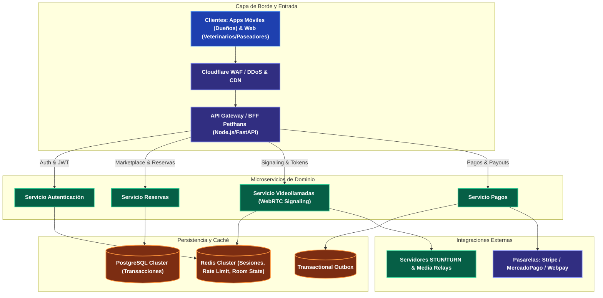

---
tags:
  - system-design
  - case-study
  - petfhans
  - applied-architecture
  - marketplace
  - bff
  - webrtc
  - fase-5
aliases:
  - Arquitectura Aplicada: Proyecto Petfhans
  - Plataforma de Servicios y Videollamadas Petfhans
modulo: "09"
orden: 6
---

# 09.6 Caso de Estudio Aplicado: Arquitectura de Alta Disponibilidad de Petfhans (Marketplace, Pasarelas de Pago y Videollamadas)

> *"Análisis y diseño de ingeniería aplicado a la plataforma Petfhans: orquestación de pasarelas de pago resilientes, ciclo de vida de videollamadas WebRTC mediante patrón BFF y sistemas de prevención de abusos en tiempo real."*

---

## 1. Topología Arquitectónica de Petfhans

---

## 2. Puntos Críticos de Diseño en Petfhans

### A. Ciclo de Vida de Videollamadas Seguras y Anti-Abusos
* **Problema:** Evitar que usuarios inicien videollamadas no pagadas o mantengan salas abiertas indefinidamente consumiendo ancho de banda de servidores TURN.
* **Solución:**
  1. El BFF valida el estado de la reserva (`status = 'CONFIRMED'`) y la ventana horaria activa ($t_{\text{inicio}} - 5\text{min} \le \text{ahora} \le t_{\text{fin}}$).
  2. Emite un **Token JWT efímero firmado de corta duración (TTL = 15 minutos)** para el servidor de señalización WebRTC.
  3. Un worker de Redis verifica la presencia de ambos participantes; si uno abandona, finaliza la sesión y libera los recursos en el media relay.

### B. Orquestación Resiliente de Pagos
* **Problema:** Fallos en pasarelas locales (Webpay/MercadoPago) durante reservas críticas.
* **Solución:**
  - **Patrón Outbox Transaccional** para asegurar que el cambio de estado de la reserva y el registro del pago se ejecuten atómicamente.
  - Implementación de **Idempotency Keys** en cada transacción para permitir reintentos seguros sin cobros duplicados.

---

## 3. Matriz de Equilibrio: Lo que SÍ hacer vs Lo que NO hacer en Petfhans

| Dimensión | Lo que SÍ hacer (Best Practices) | Lo que NO hacer (Anti-patrones / Errores Fatales) |
| :--- | :--- | :--- |
| **Señalización WebRTC** | Usar **WebSockets o SSE** únicamente para el intercambio de metadatos SDP (*Offer/Answer*) y candidatos ICE, dejando que el flujo de video/audio viaje P2P o por servidores SFU/TURN dedicados. | Intentar transmitir el flujo de audio/video crudo a través de la API Gateway o servidor de base de datos. |
| **Pasarelas de Pago** | Diseñar un **Driver/Adapter Pattern agnóstico** para pasarelas (Stripe, MercadoPago, etc.) con fallback automático si una pasarela responde con error 500. | Acoplar el código de reservas directamente a los endpoints específicos de una única pasarela de pago. |
| **Control de Acceso a Servicios** | Validar la autorización en el **API Gateway / BFF** y propagar el contexto autenticado (`X-User-Id`, `X-User-Role: vet`) a los microservicios internos. | Permitir que el frontend envíe el `veterinary_id` en el body sin verificar que el token pertenezca al usuario real. |
| **Notificaciones en Vivo** | Encolar notificaciones (recordatorios de paseos, citas médicas) en una cola asíncrona (**RabbitMQ / Redis Streams**) con reintentos exponenciales. | Enviar emails y notificaciones push de forma sincrónica dentro del endpoint de creación de reserva. |

---

## Microtareas de Retención Intelectual

> [!QUESTION]- Active Recall: ¿Por qué en Petfhans es crítico utilizar servidores TURN cuando dos usuarios intentan hacer una videollamada y ambos están detrás de routers NAT simétricos corporativos?
> **Respuesta:** Porque los routers con **NAT Simétrico** asignan puertos externos aleatorios diferentes para cada destino, impidiendo que el protocolo STUN establezca una conexión P2P directa entre los dos dispositivos (*STUN Hole Punching falla*). El servidor **TURN (Traversal Using Relays around NAT)** actúa como un servidor intermediario que retransmite los paquetes de video y audio cifrados entre ambos extremos, asegurando que la videollamada se conecte el 100% de las veces.

---

> [!TIP]- Micro-Cálculo Mental: Concurrencia en Signaling de Petfhans
> **Reto:** Durante un fin de semana pico, Petfhans tiene **2,000 videollamadas simultáneas activas**.
> Durante la llamada, cada cliente envía un paquete de *Heartbeat / Ping* cada **5 segundos** por WebSocket para confirmar presencia.
> ¿Cuántos mensajes de señalización por segundo debe procesar el servidor de WebSocket?
> **Cálculo:**
> - Usuarios en llamada: $2,000 \times 2 = 4,000 \text{ clientes conectados}$.
> - Mensajes por segundo: $\frac{4,000}{5 \text{ segundos}} = \mathbf{800 \text{ msg/s}}$.
> - *Lección:* Una única instancia pequeña de Node.js o Go maneja 800 msg/s en RAM sin problemas.

---

> [!WARNING]- Dilema Arquitectónico: Doble Reserva de un Mismo Horario de Veterinario
> **Escenario:** Dos dueños de mascotas intentan reservar el único turno disponible de un veterinario a las 15:00 en el mismo segundo.
> **Pregunta:** ¿Cómo evitas la doble reserva a nivel de base de datos?
> **Respuesta:** Mediante una **Restricción de Exclusión Única en PostgreSQL** (`UNIQUE (vet_id, date_slot)`) o una transacción con **Optimistic Locking** (`UPDATE slots SET status = 'BOOKED', version = version + 1 WHERE id = 10 AND version = 3`). La primera transacción confirmará con éxito; la segunda fallará con violación de restricción en $<1\text{ms}$, notificando al segundo usuario que el horario acaba de ser tomado.

---

> [!NOTE]- Desafío Feynman: El Servidor STUN vs TURN
> - **STUN:** Es como un espejo en la calle donde te miras y dices: *"Ah, desde afuera me veo con la IP pública 200.1.2.3"*, y le dices a tu amigo dónde encontrarte para hablar directo.
> - **TURN:** Es como un cartero en una esquina que toma tu carta y se la entrega a tu amigo porque los dos viven en edificios cerrados con guardias que no dejan entrar a extraños.

---

## Conceptos Relacionados
- [[06.1_WebSockets_SSE_Long_Polling_y_Webhooks|06.1 WebSockets y Streaming]]
- [[06.3_API_Gateway_y_Patron_BFF_Backend-For-Frontend|06.3 Patrón BFF]]
- [[07.0_Circuit_Breaker_Retry_y_Exponential_Backoff|07.0 Circuit Breaker y Pasarelas]]
- [[00_MOC_System_Design_Mastery|Volver al Índice Maestro (MOC)]]
