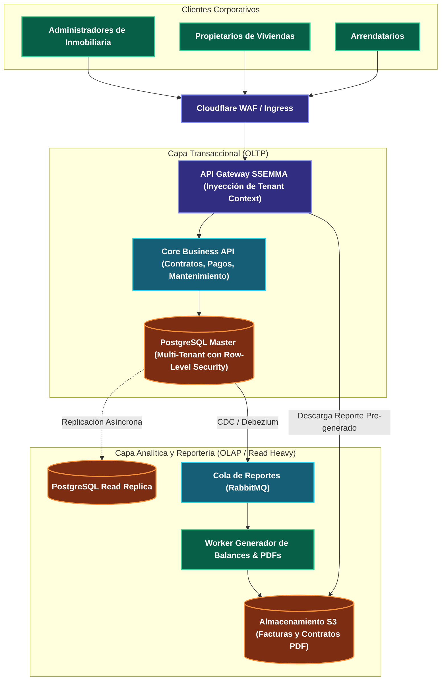

---
tags:
  - system-design
  - case-study
  - ssemma
  - real-estate
  - multi-tenant
  - transactional
  - reporting
  - fase-5
aliases:
  - Arquitectura Aplicada: Proyecto SSEMMA
  - Sistema de Gestión de Viviendas y Multi-Tenancy SSEMMA
modulo: "09"
orden: 7
---

# 09.7 Caso de Estudio Aplicado: Arquitectura Empresarial de SSEMMA (Gestión de Viviendas, Multi-Tenancy y Reportería)

> *"Análisis y diseño de ingeniería aplicado al sistema SSEMMA: aislamiento estricto de datos multi-tenant para empresas inmobiliarias, consistencia transaccional en contratos y balances de arriendos, y desacoplamiento de reportes analíticos pesados."*

---

## 1. Topología Arquitectónica de SSEMMA



---

## 2. Desafíos Centrales de Arquitectura en SSEMMA

### A. Aislamiento Multi-Tenant (Seguridad de Datos entre Inmobiliarias)
* **El Peligro:** Que un error en una consulta SQL (`WHERE property_id = 5`) exponga los contratos financieros de una inmobiliaria a otra empresa competidora.
* **Solución de Nivel Staff:** Implementar **Row-Level Security (RLS) nativo en PostgreSQL**:
  ```sql
  ALTER TABLE contracts ENABLE ROW LEVEL SECURITY;
  CREATE POLICY tenant_isolation_policy ON contracts
      USING (tenant_id = CURRENT_SETTING('app.current_tenant_id')::UUID);
  ```
  La aplicación inyecta el `tenant_id` en la conexión al iniciar cada transacción; el motor de PostgreSQL filtra automáticamente todas las filas en disco, haciendo matemáticamente imposible la fuga de datos cross-tenant.

### B. Reportería Financiera sin Afectar la Operación Diaria
* **El Peligro:** A fin de mes, 50 administradores generan el balance anual de 10,000 propiedades al mismo tiempo. Las consultas analíticas con múltiples agrupaciones (`GROUP BY`, `SUM`) saturan la CPU al 100%, bloqueando a los arrendatarios que intentan registrar pagos en la app.
* **Solución:**
  - **Desacoplamiento a Read Replica:** Toda consulta analítica de reportería se enruta exclusivamente a una **Réplica de Lectura dedicada**.
  - **Generación Asíncrona de Reportes:** La solicitud del usuario responde con `HTTP 202 Accepted`; un worker en segundo plano genera el archivo en PDF/Excel, lo sube a almacenamiento de objetos (S3) y envía un correo con el enlace de descarga firmado.

---

## 3. Matriz de Equilibrio: Lo que SÍ hacer vs Lo que NO hacer en SSEMMA

| Dimensión | Lo que SÍ hacer (Best Practices) | Lo que NO hacer (Anti-patrones / Errores Fatales) |
| :--- | :--- | :--- |
| **Aislamiento Multi-Tenant** | Usar **Base de Datos Compartida con Row-Level Security (RLS)** o Esquema por Tenant (`search_path`). | Confiar únicamente en que los desarrolladores recuerden escribir `WHERE tenant_id = X` manualmente en cada consulta del ORM. |
| **Cálculo de Saldos y Pagos** | Utilizar el modelo de **Libro Mayor Contable (*Double-Entry Ledger*)**: cada movimiento es un registro inmutable con debe y haber. El saldo se calcula sumando entradas históricas. | Actualizar el saldo directamente con `UPDATE accounts SET balance = balance + 100` sin dejar registro auditable de cada transacción. |
| **Gestión de Archivos (Contratos/Planos)** | Almacenar contratos, imágenes de propiedades y PDFs en **Object Storage (S3 / MinIO)** y guardar únicamente la URL/Hash en la base de datos. | Almacenar archivos PDF e imágenes en columnas de tipo `BLOB / BYTEA` dentro de PostgreSQL, inflando el tamaño de los backups y la memoria RAM. |
| **Generación de Reportes** | Ejecutar exportaciones pesadas de forma **asíncrona con workers y colas**, notificando al usuario por webhook/email cuando el PDF esté listo. | Generar PDFs de 500 páginas de forma sincrónica dentro del hilo de la petición HTTP del navegador (provoca timeout HTTP 504). |

---

## Microtareas de Retención Intelectual

> [!QUESTION]- Active Recall: ¿Por qué el patrón de Contabilidad de Partida Doble (Double-Entry Ledger) es superior a un simple campo `balance` en la tabla de propiedades de SSEMMA?
> **Respuesta:** Porque un campo `balance` mutable puede corromperse ante condiciones de carrera, errores de software o fallos de red sin dejar rastro de qué provocó la discrepancia. En un **Double-Entry Ledger**, los registros son **estrictamente inmutables (Append-Only)**: cada cobro, multa, pago de arriendo o comisión es una fila explícita. El saldo actual es la suma matemática de todas las filas; si existe una discrepancia, la auditoría contable permite rastrear el origen exacto del céntimo en disputa.

---

> [!TIP]- Micro-Cálculo Mental: Almacenamiento de Contratos y Documentos en SSEMMA
> **Reto:** SSEMMA administra **50,000 contratos de vivienda activos**.
> - Cada contrato incluye documentos adjuntos (PDFs de identidad, títulos de propiedad, fotos de inventario de entrega) con un peso promedio de **15 Megabytes por propiedad**.
> ¿Cuánto almacenamiento de objetos consume la plataforma?
> **Cálculo:**
> - $50,000 \times 15 \text{ MB} = 750,000 \text{ MB} = \mathbf{750 \text{ Gigabytes}}$.
> - En almacenamiento S3 ($0.023\text{ USD/GB/mes}$): $750 \times 0.023 = \mathbf{\$17.25 \text{ USD/mes}}$ de costo total.
> - *Lección:* El almacenamiento en S3 es insignificante; guardarlo dentro de la base de datos Postgres costaría 10x más en disco EBS provisionado.

---

> [!WARNING]- Dilema Arquitectónico: Base de Datos Separada por Tenant vs Base de Datos Compartida
> **Escenario:** SSEMMA tiene 200 inmobiliarias medianas (100 propiedades c/u) y 1 gran corporación gubernamental de vivienda (20,000 propiedades con requisitos militares de cumplimiento legal).
> **Pregunta:** ¿Creas 201 bases de datos separadas o una sola base compartida?
> **Respuesta:** **Arquitectura Híbrida (Pool + Silo Model).** Las 200 inmobiliarias medianas comparten un único cluster PostgreSQL con **Row-Level Security** (*Pool Model*), optimizando costos y mantenimiento de migraciones. La corporación gubernamental se aísla en una **Base de Datos Dedicada y VPC aislada** (*Silo Model*), cumpliendo sus requisitos de auditoría y evitando que su volumen masivo afecte a las inmobiliarias pequeñas.

---

> [!NOTE]- Desafío Feynman: Row-Level Security (RLS)
> Es como un edificio de casilleros de seguridad en un banco con llave maestra biométrica: todos los casilleros están en la misma habitación física, pero cuando tú pones tu huella digital, el sistema solo enciende la luz de tu gaveta específica y bloquea físicamente la vista de las gavetas de los demás clientes.

---

## Conceptos Relacionados
- [[02.0_SQL_vs_NoSQL_Taxonomia_Completa|02.0 Modelo ACID y SQL]]
- [[05.3_CQRS_y_Event_Sourcing|05.3 CQRS y Event Sourcing]]
- [[08.3_Calculo_de_Costos_en_la_Nube_y_Dimensionamiento|08.3 FinOps y Costos]]
- [[00_MOC_System_Design_Mastery|Volver al Índice Maestro (MOC)]]
